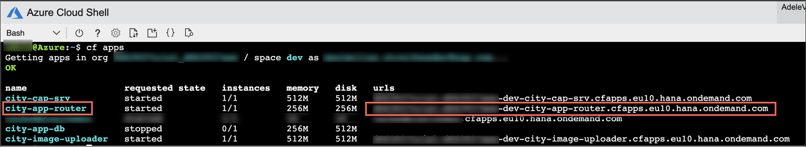
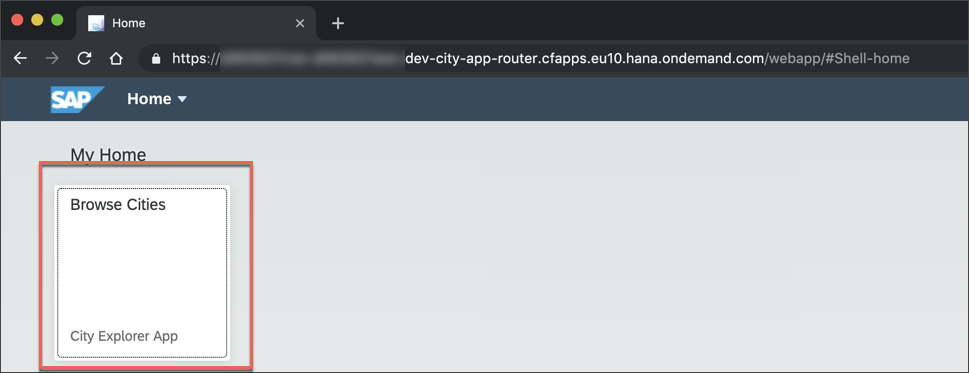
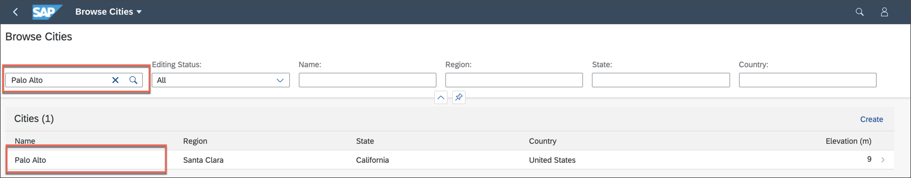
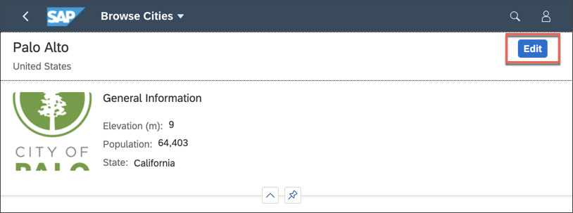
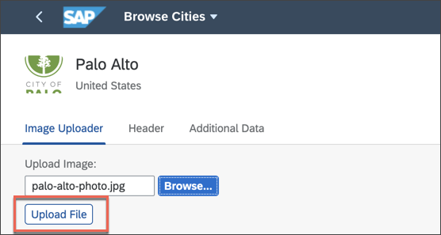
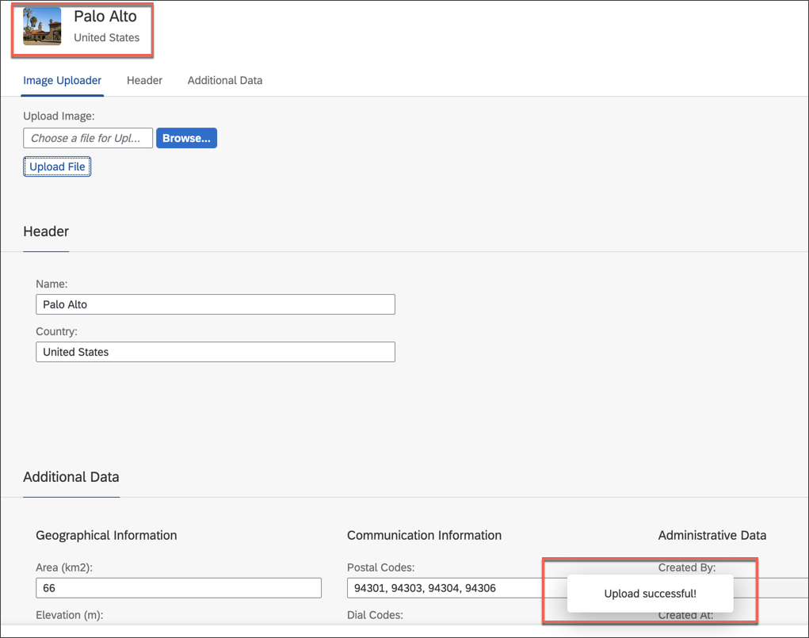
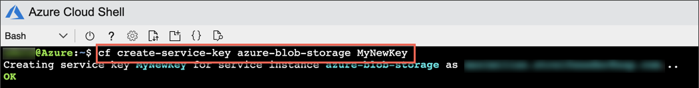
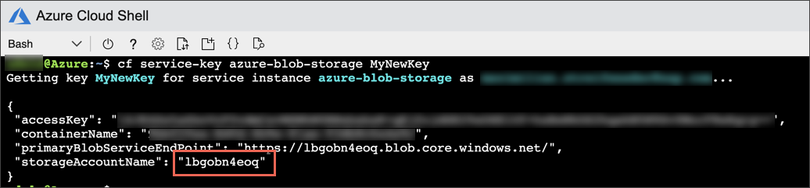
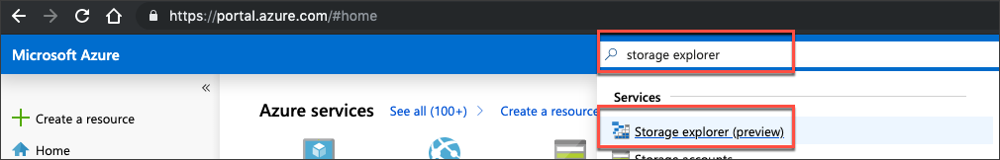
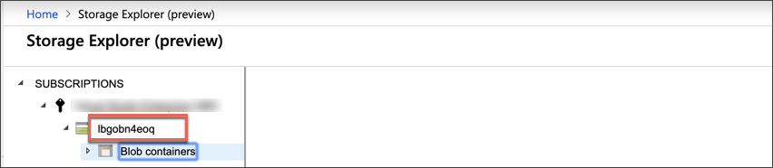

## Details
### You will learn
  - How to explore data stored in a Azure Blob Store

---

[ACCORDION-BEGIN [Step 1: ](Open the application)]

1. Get the application URL by running the following in Azure Cloud Shell:

    ```Bash
    cf apps
    ```

    !

2. Copy the URL of your application and paste it into a new browser tab. This lets you make sure that the application is working properly.

3. Click the **Browse Cities** tile to access the actual application and list of cities stored in the SAP HANA bound to your application.

    

**TROUBLESHOOTING:** If one of the applications starting with `city-` is not in state **started**, have a look at the logs. **city-app-db-deployer** should be in status **stopped** since it's a Cloud Foundry task and supposed to be stopped after its initial run.

You can access the logs by executing the following command in the Azure Cloud Shell:

```Bash
cf logs <appname> --recent
```

[VALIDATE_1]
[ACCORDION-END]

[ACCORDION-BEGIN [Step 2: ](Upload a photo to an existing city entry)]

Upload a photo for one of the cities to the Azure Blob Store via the application itself. All data except the photos is stored in SAP HANA on SAP Cloud Platform.

1. Filter for **`Palo Alto`**, and click **Enter**.

    

2. Click on the list item to open the **Detail** view for Palo Alto.

3. Click **Edit** to change the data for this city.

    

4. Click **Browse** to select a photo (preferably `.jpeg`, `.png` files) from your machine.

    > If you don't have a photo available, you can download a photo of Palo Alto from [here]( https://www.google.com/search?q=palo+alto&source=lnms&tbm=isch&sa=X&ved=0ahUKEwj9guie0-7jAhVBLlAKHf4-AJgQ_AUIEigC&biw=1680&bih=899&dpr=2 ) and upload it to the application.

5. Upload the file by clicking **Upload File**.

    

The photo was uploaded successfully and should now be shown next to the city name.  



[DONE]
[ACCORDION-END]

[ACCORDION-BEGIN [Step 3: ](Create service key to find storage account in Azure)]

To have a closer look at how the files are stored in the Azure Storage Explorer, an additional step has to be performed. Since the automatic creation of the Azure Blob Store via the MTA archive assigns a generated ID as the associated Azure storage account name, there can be no unambiguous identification of the linked application for multiple Azure Blob Stores at first glance - caused by a potentially high number of cryptic storage account names.

Therefore, create a so-called **Cloud Foundry service key** via the following command in the Azure Cloud Shell:

```Bash
cf create-service-key azure-blob-storage MyNewKey
```



> See the official documentation for [Cloud Foundry service keys](https://docs.cloudfoundry.org/devguide/services/service-keys.html).

To get the credentials for this service key, execute this command in the Azure Cloud Shell:

```Bash
cf service-key azure-blob-storage MyNewKey
```



Bear in mind the value of `storageAccountName` as it's needed in the next steps.

[DONE]
[ACCORDION-END]

[ACCORDION-BEGIN [Step 4: ](Open Azure Storage Explorer for Azure Blob Store)]

Go to the [Azure Portal](https://portal.azure.com) and search for **Storage Explorer** and click **Storage Explorer (preview)**.




[DONE]
[ACCORDION-END]


[ACCORDION-BEGIN [Step 5: ](Browse Azure Blob Store)]

1. Navigate to the Blob containers of your storage account, created through the uploaded MTA archive. The name of the storage account is the value of `storageAccountName` from **Step 3**.

    

    > This is how you have identified the `storageAccountName`:

    > 

2. Expand the tree below `Blob containers` and click the **`city_images`** to open it.

    If you **double-click** on the entry in the list on the right, you can download the photo that was uploaded to the `Browse Cities` application.

    

[DONE]
[ACCORDION-END]

You have successfully deployed an application (supported by the **SAP Cloud Application Programming Model**) to SAP Cloud Platform Cloud Foundry.

The application stores its data in different ways:

  - The uploaded photos are stored in an Azure Blob Store, which is managed via the Azure service broker (create, bind, unbind, delete).

  - All other data is stored in SAP HANA on the SAP Cloud Platform.

---
