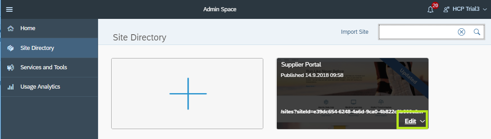
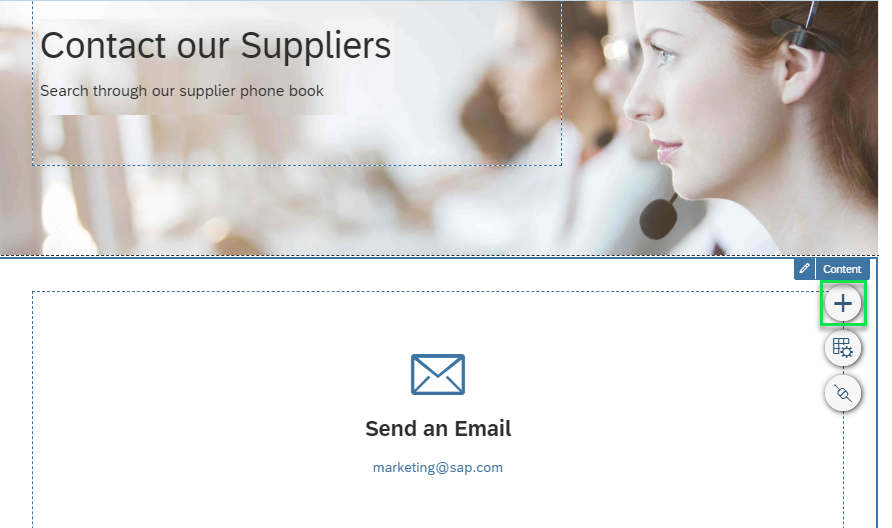
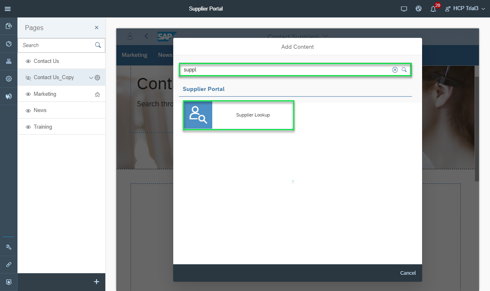
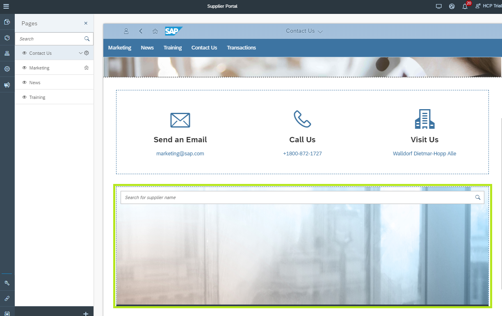
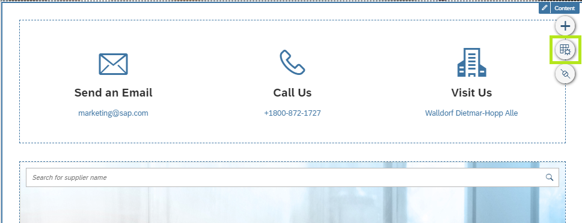
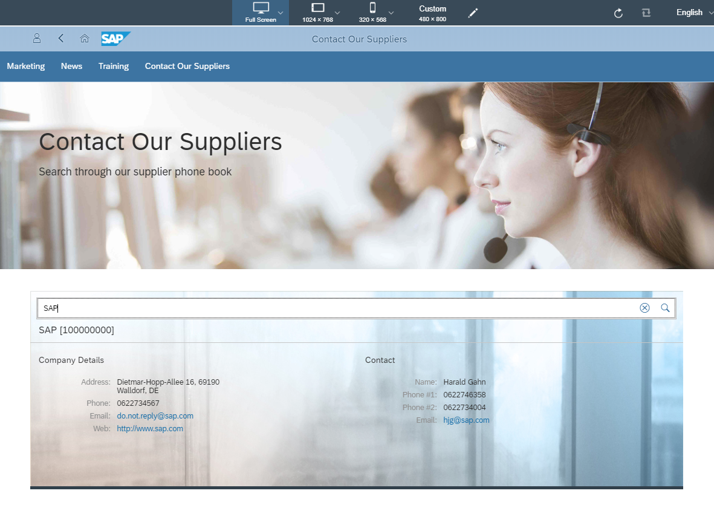
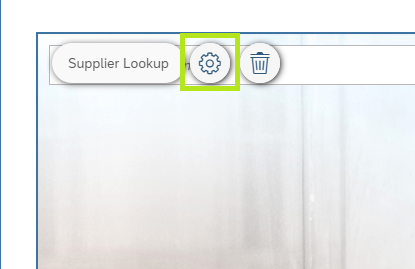
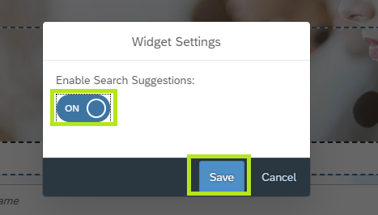
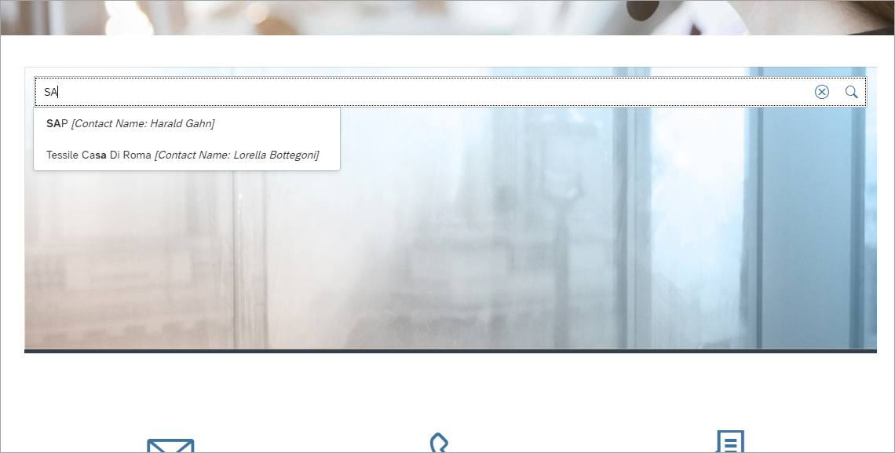

## Prerequisites  
  - You have created a destination to the gateway service. For more information, see [Create an SAP Cloud Platform destination pointing to an SAP Gateway](https://www.sap.com/developer/tutorials/teched-2016-3.html#_blank)

## Details
### You will learn  
  - How to add SAPUI5 applications as embedded widgets into Portal pages
  - How to configure widget settings

In addition to launching applications in full page mode, the ability to embed an application in the site page, offers portal admins more flexibility when designing their portal sites.

In this tutorial, we will add a Portal widget to one of the Supplier Portal pages. The widget allows end users to search the ES5 gateway system for a supplier's contact details.

---

[ACCORDION-BEGIN [Step 1: ](Add supplier lookup widget to Portal page)]
1. From the Portal Admin space, hover over the new **Supplier Portal** tile and click **Edit** to open it for edit in the site designer.
  
2. From the list of pages at the left-side panel, select the **Contact Us** page to edit it's content.
3. Click the bottom white section to expose the section action menu.
4. Select the **+** icon item to open the **Content Gallery** and add widgets to this section
  
5. In the Content Gallery search bar type *Supplier Lookup* to find the widget you deployed earlier.
6. Select the widget tile to add it to the section.
  
7. The `Supplier Lookup` widget is added to the bottom of the section
  

[DONE]
[ACCORDION-END]

[ACCORDION-BEGIN [Step 2: ](Change section layout)]
1. In the **Contact Us** page, click the bottom white section to expose the section action items.
2. Click the section **Settings icon** (2nd from the top).
  
3. In the Layout settings under the list of widgets in this section, drag the **Supplier Lookup** widget entry and drop it above the **Large Icon Links Card** widgets entry to rearrange their order on the page.
  
4. Click **Save**.

The Supplier Lookup widget is now placed as the first widget in the section.

[DONE]
[ACCORDION-END]

[ACCORDION-BEGIN [Step 3: ](Preview your changes in Supplier Portal)]
1. In the Supplier Portal site designer top level menu, click the **Preview Icon**.
  
> The Supplier Portal runtime is opened in the preview environment in a new browser tab.

2. Click **Contact Our Suppliers** in the Supplier Portal site navigation menu to open the page.
> Notice that the new Supplier Lookup widget is rendered in the page.

3. In the **Supplier Lookup** widget search bar, enter the search term `SAP` and click the magnifying glass icon to search for the supplier details.
  
> The search action performs an OData call on ES5 to search for a supplier contact named `SAP`

[DONE]
[ACCORDION-END]

[ACCORDION-BEGIN [Step 4: ](Configure widget settings)]
1. Go back to the **Contact Us** page in the Site Designer.
2. Click the **Supplier Lookup** widget to expose it's action items.
3. Click the widget settings menu icon.
  
4. In the widget settings dialog, switch to Enable Search Suggestions for the Supplier Lookup widget.
5. Click **Save**.
  
6. Click the **Preview icon** again to preview the latest changes.
7. In the site preview, navigate to the **Contact Our Suppliers** page.
8. In the Supplier Lookup widget search bar, start typing *SAP*. Notice that the changes in the widget settings have been applied, and the search bar now suggests a list of relevant suppliers retrieved from the ES5 back-end system.
  

[VALIDATE_1]
[ACCORDION-END]
