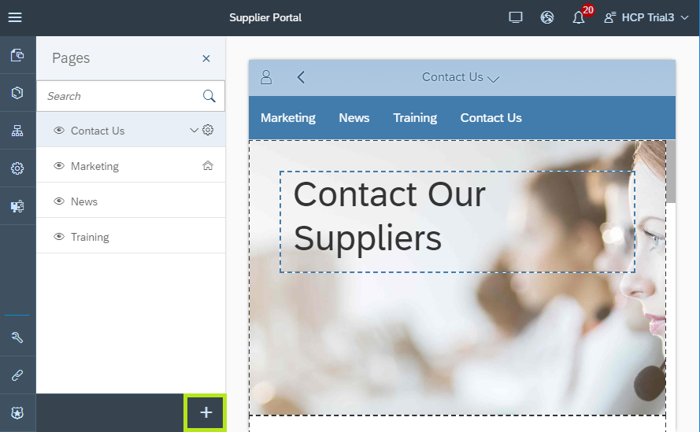
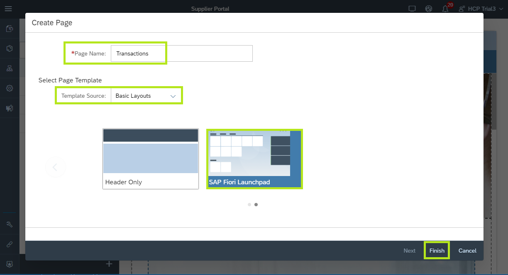
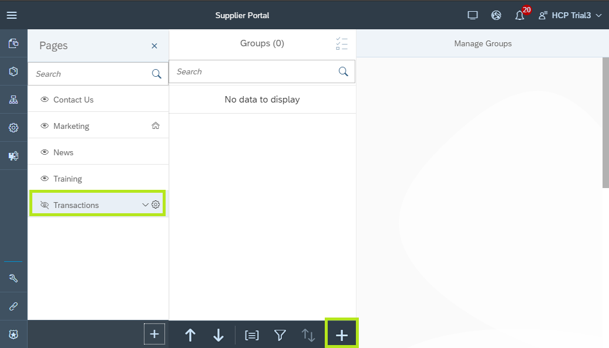
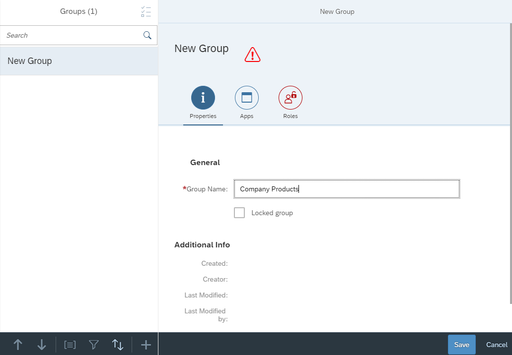
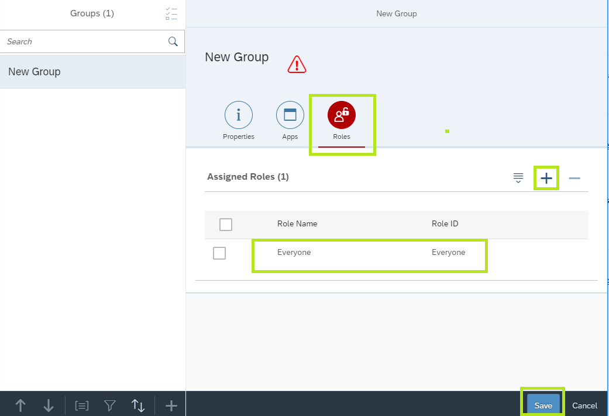
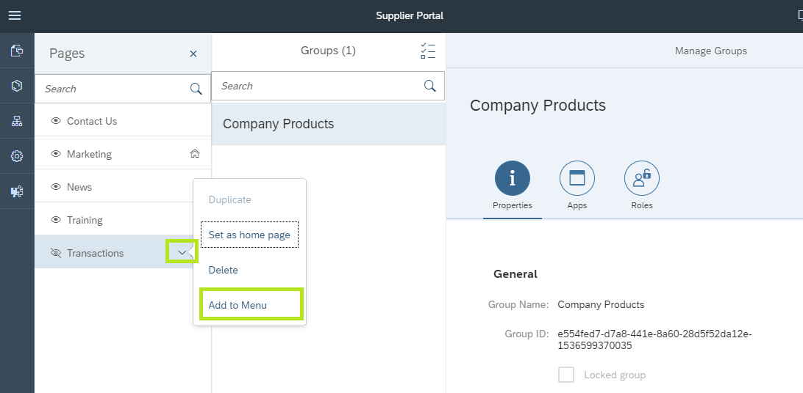
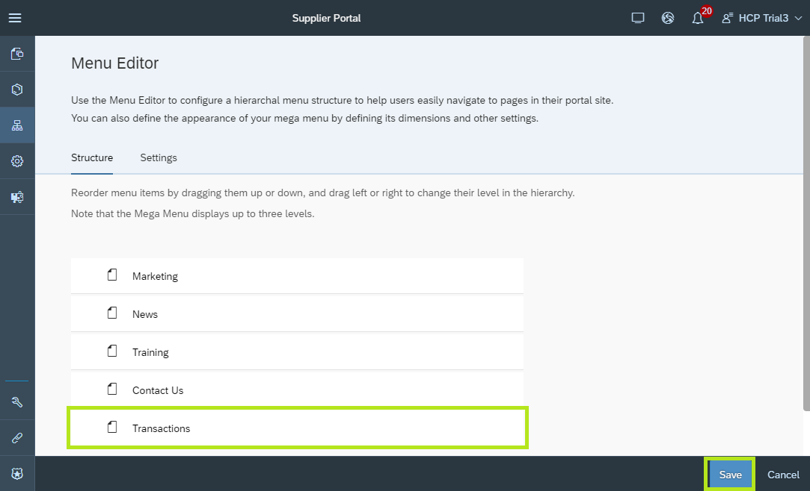

## Details
### You will learn  
  - How to create a new page in Portal sites.
  - How to combine SAP Fiori launchpad pages with freestyle pages.

In this tutorial, we will add a new SAP Fiori launchpad page to the Supplier Portal. The page will host new applications that will be added in the next tutorials.

---

[ACCORDION-BEGIN [Step 1: ](Create new SAP Fiori launchpad page)]
1. From the Portal Admin Space, open the **Supplier Portal** for edit in the Site Designer.

    

2. From the page list footer, click the **+** icon to create a new page.

    

3. In the **Create Page** wizard

    * Enter the **Page Name**: `Transactions`
    * In the **Template Source** drop down list, select `Basic Layouts`
    * From the list of page templates, select `SAP Fiori Launchpad`

    

4. Click **Finish**

The new SAP Fiori launchpad page is created and opened on the `Manage Groups` editor.

[DONE]
[ACCORDION-END]

[ACCORDION-BEGIN [Step 2: ](Create new group for launchpad tiles)]

In this step you will create a new tile Group.

Tile groups logically aggregate tiles in the SAP Fiori launchpad page.

1. From the list of pages in the left side panel, select the new **Transactions** page to open the **Manage Groups** editor.
2. Click the **+** icon at the footer of the (empty) list of Groups.

    

3. In the **New Group** wizard enter the **Group Name**: `Company Products`.

    

4. In the New Group wizard click the **Roles** tab to assign roles to the tile group.
5. Click the **+** icon in the empty **Assigned Roles** table.
6. In the dialog box, select the **Everyone** role and click **OK**.

    

7. Click **Save**

> The new group is created.

[DONE]
[ACCORDION-END]

[ACCORDION-BEGIN [Step 3: ](Add page to Portal site menu)]

In this step you will add the SAP Fiori launchpad page (named **Transactions**) to the Portal's navigation menu.

1. From the list of pages in the left side panel, select the  **Transactions** page.
2. Click the bottom-facing-arrow icon to open the page action menu.
3. Click **Add to Menu**.

    

    > The Menu Editor is opened with a new menu entry named **Transactions** added at the bottom of the menu list. The new entry points to the newly created page.

4. Click **Save** to save the latest changes.

    

[VALIDATE_1]
[ACCORDION-END]

---
