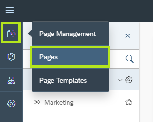
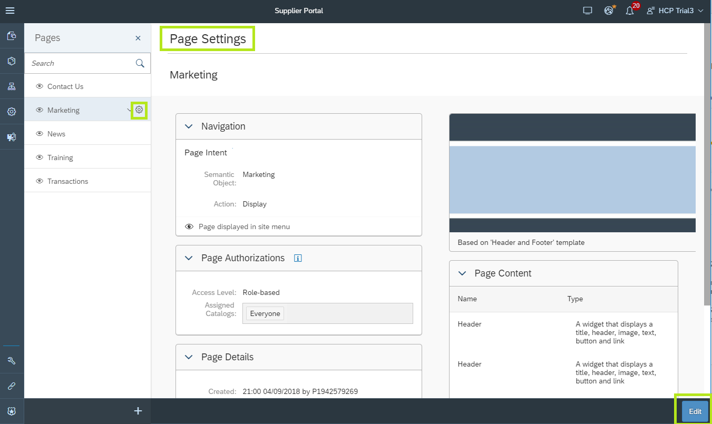
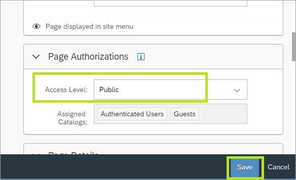
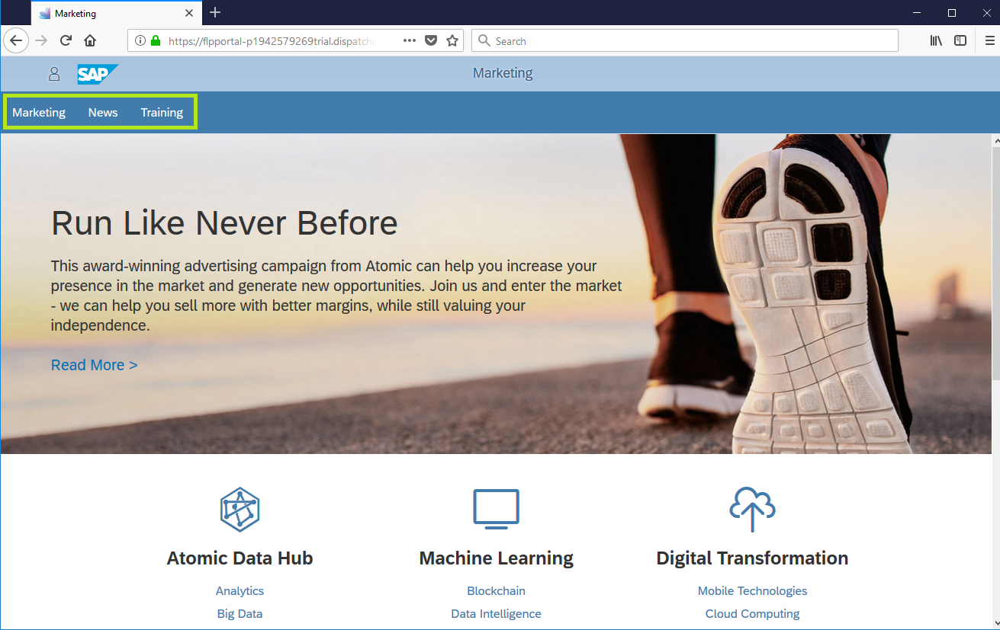
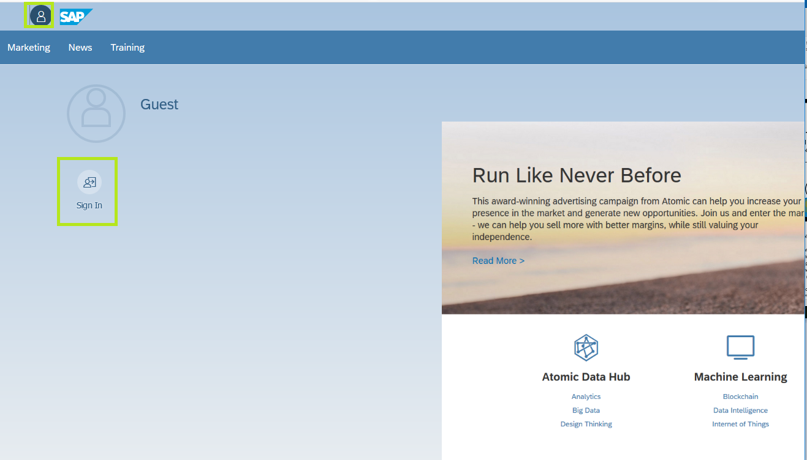
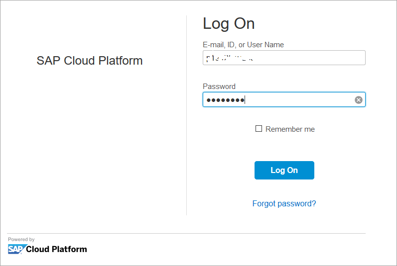

## Prerequisites  

## Details
### You will learn  
  - How to set public and restricted access to your Portal pages
  - How to publish the site and your latest changes to your end users.

Now that we have all the content and applications configured in our Supplier Portal, we would like to enable public access to some of the portal pages and restrict and require a login to access the sensitive pages that contain business data and transaction.

---

[ACCORDION-BEGIN [Step 1: ](Set public access permissions)]
By default all portal pages are created with restricted access permissions. We will change the access level for the **Marketing**, **News**, and **Training** pages to make them publically available.

1. In the **Site Designer** of your **Supplier Portal** select **Pages** under the **Page Management** tab.

    

2. From the list of pages select the **Marketing** page item and click on the **Cog Icon** to open the **Page Settings** editor.

3. Click on **Edit** to edit the settings.

    

4. Under **Page Authorization** change the **Access Level** to `Public`.

5. Click **Save**.

    

6. Repeat steps 2 to 5 for the pages **News** and **Training**.

[DONE]
[ACCORDION-END]

[ACCORDION-BEGIN [Step 2: ](Publish the Supplier Portal)]
1. In the Site Designer top level menu, click on the **Publish** icon to publish the latest changes to the end users.

    

2. In the dialog box click on **Publish and Open**

    

The Supplier Portal runtime is opened in a new browser tab.

[DONE]
[ACCORDION-END]

[ACCORDION-BEGIN [Step 3 ](View the public pages)]
In this step we will see how the permission settings are applied in the site runtime.

1. Copy the URL from the Supplier Portal runtime browser tab.

    

2. Run the URL in a new browser that doesn't have your current user session. This can be achieved in two ways:

    - Open a new **Incognito** (or **Private**) instance of the browser you're currently using.
    - Open a different browser than the one you are currently using (for instance, if you're using **Chrome** open **Firefox**).

3. Paste the URL and click Enter to load the Supplier Portal runtime.

    

    > Notice that as a **non-logged-in user** you can only access the public pages of the Supplier Portal.

[DONE]
[ACCORDION-END]

[ACCORDION-BEGIN [Step 4: ](View restricted pages)]
1. In the same browser you used in the previous step, click on the **Person** icon on the top-left to open the **Me Area**.

2. Click on **Sign In** to log-in to the Supplier Portal.

    

3. In the SAP Cloud Platform **Log On** screen, enter your user credentials (same one's you've been using up until now).

4. Click **Log On**

    

5. Notice that now that you're logged in, you can access the restricted pages **Contact Our Suppliers** and **Transactions**.

    

[VALIDATE_1]
[ACCORDION-END]

---
