## Prerequisites  
- You have created an SAP Cloud Platform trial account, as described in [Get a Free Trial Account on SAP Cloud Platform](https://www.sap.com/developer/tutorials/hcp-create-trial-account.html).
- You have created an account on the SAP Gateway demo system (ES5). For more information, see [Create an Account on the Gateway Demo System](https://www.sap.com/developer/tutorials/gateway-demo-signup.html).

## Details
### You will learn  
- How to create a connectivity **destination** to the **SAP Gateway backend demo system (ES5)** to securely connect your SAP Cloud Platform account with the demo system
- How to configure the destination to consume **SAP backend applications (Web Dynpro ABAP)**
- How to enable the **SAP Cloud Platform Portal**, **SAP Web IDE Full-Stack**, and **SAP Translation Hub** on your SAP Cloud Platform account
- How to import the SAPUI5 resources from the SAP Cloud Platform Portal tutorial GitHub repository to your SAP Web IDE Full-Stack and make them available for Portal administrators

---

[ACCORDION-BEGIN [Step 1: ](Open your SAP Cloud Platform rial account cockpit)]

1. Go to SAP Cloud Platform by going to <https://account.hanatrial.ondemand.com/>.
  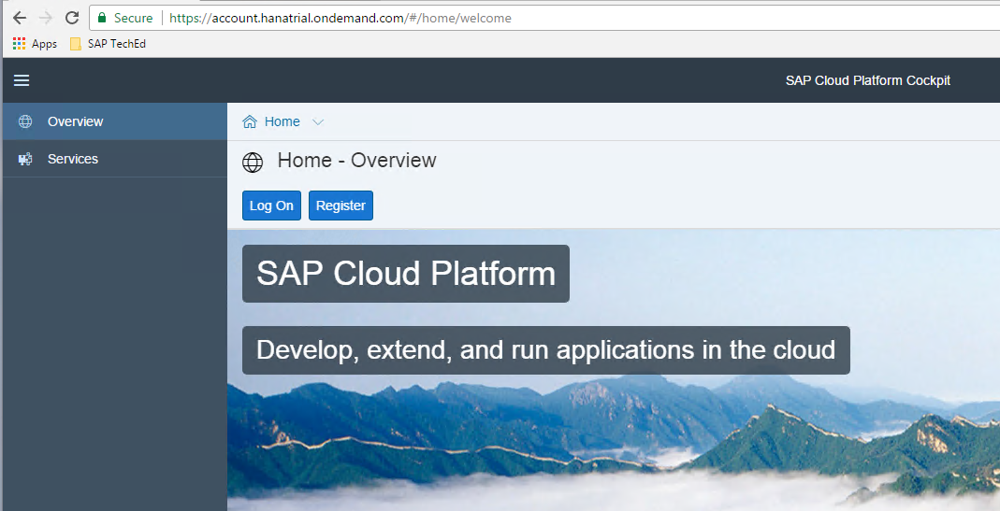
2. Enter your user name and password that you provided when you created your trial account, and click **Log On**.
  
3. Select **Neo Trial**.
  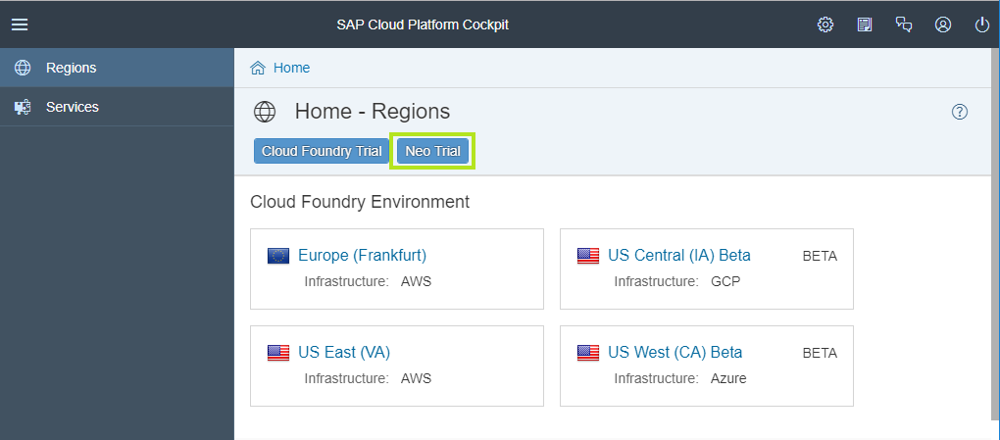
4. Click your trial account.
  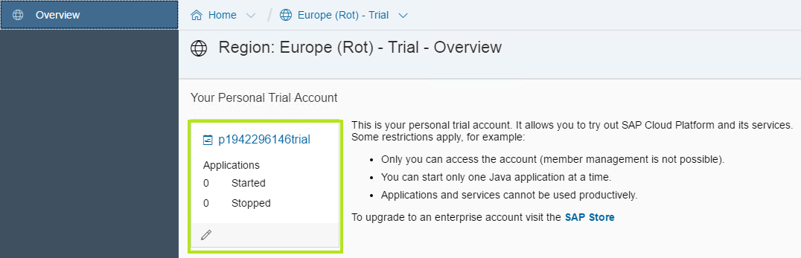

[DONE]

[ACCORDION-END]

[ACCORDION-BEGIN [Step 2: ](Create connectivity destination)]
Set up a destination and its parameters for making a connection to the SAP Gateway demo system OData service from your SAP Cloud Platform trial account.

  1. From your SAP Cloud Platform Cockpit, click **Connectivity** > **Destinations** and click **New Destination**.
    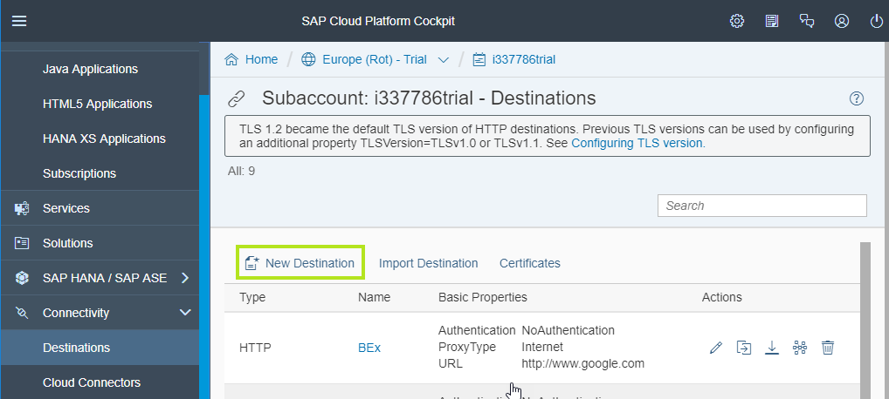
  2. Define the following properties:

    | Field | Value  
    | :-----| :--------|
    | `Name` | **`ES5`**   
    | `Type` | **`HTTP`**
    | `URL`  | **`https://sapes5.sapdevcenter.com`**
    | `Proxy Type`  | **`Internet`**
    | `Authentication` | **`BasicAuthentication`**
    | `User`  | **`Your ES5 user name`**
    | `Password` | **`Your ES5 password`**  
    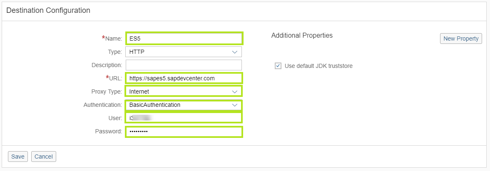

3. Click **New Property** and define the following properties:

    | Field | Value      |
    |-------|--------|
    | `sap-client`  | **`002`**   |
    | `Usage` | **`Backend`**
    | `WebIDEEnabled`  | **`True`**
    | `WebIDESystem`   | **`ES5`**
    | `WebIDEUsage` | **`odata_gen, odata_abap, bsp_execute_abap`**
    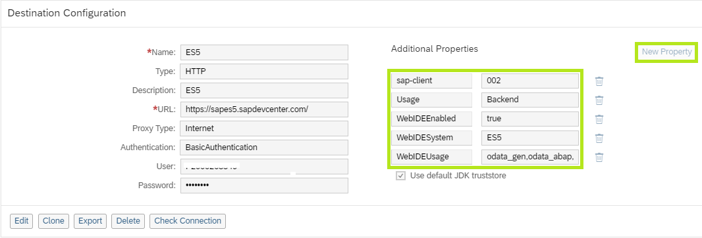  

    > Note: The **Usage** property with value **Backend** is required for consuming SAP Backend applications (SAP GUI for HTML and Web Dynpro ABAP) in SAP Cloud Platform Portal sites.

4. Save your settings.
5. Click **Check Connection**.
   Verify that you get the following message:
  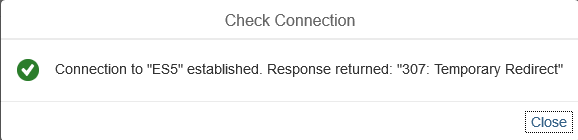  

  [DONE]

[ACCORDION-END]

[ACCORDION-BEGIN [Step 3: ](Enable SAP Cloud Platform services)]
In this step you will enable the **SAP Cloud Platform Portal**, **SAP Web IDE Full-Stack**, and **SAP Translation Hub** on your SAP Cloud Platform account.

>Platform services are enabled once, therefore if you enabled any one of these services in the past, there is no need to do it again.

  1. In the SAP Cloud Platform cockpit, click **Services** in the left panel to open the list of services available in your subaccount.
  2. Enable the **Portal** Service
    - Select the **User Experience** category from the **Categories** dropdown list.
    - Click the **Portal** tile to open the service overview page.
      
    - From the **Portal – Overview** page, click **Enable** to enable the service.
      
  3. Enable the **SAP Web IDE Full-Stack** Service
    - Navigate back to the **Services** page.
    - Select the **Developer Experience** category from the **Categories** dropdown list.
    - Click the **SAP Web IDE Full-Stack** tile to open the service overview page.
      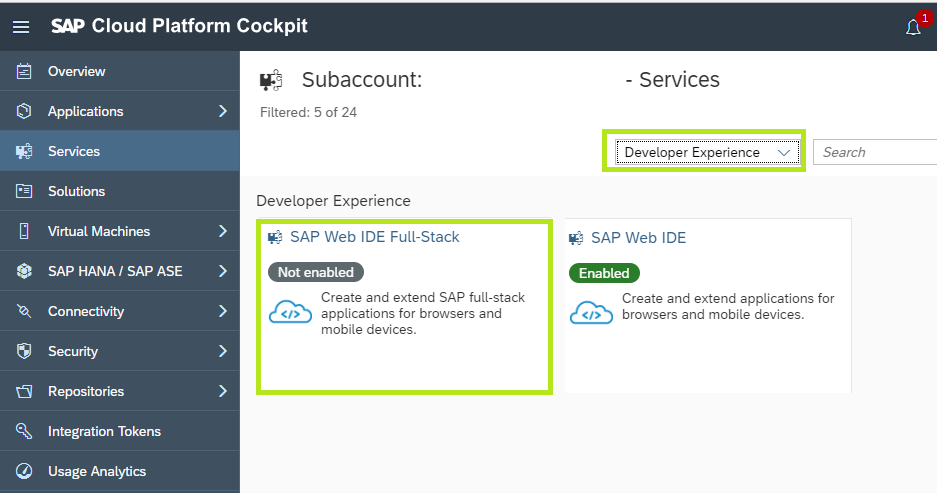
    - From the **SAP Web IDE Full-Stack - Overview** page, click **Enable** to enable the service.
      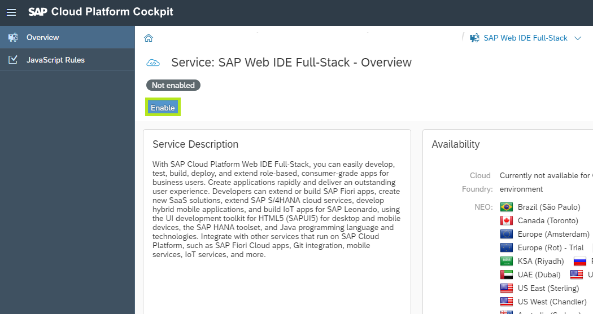
  4. Enable the **SAP Translation Hub** Service
    - Navigate back to the **Services** page.
    - Select the **Globalization** category from the **Categories** dropdown list.
    - Click the **SAP Translation Hub** tile to open the service overview page.
      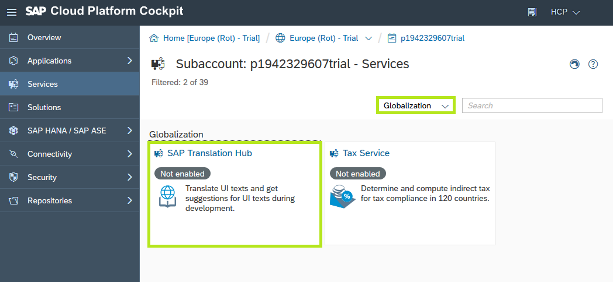
    - From the **SAP Translation Hub - Overview** page, click **Enable** to enable the service.
      

      [DONE]

[ACCORDION-END]

[ACCORDION-BEGIN [Step 4: ](Clone Portal tutorials repository)]
The SAP Cloud Platform Portal tutorial GitHub repository contains various SAPUI5 applications, Portal widgets, and Shell plugins used in Portal tutorials. Once deployed to your SAP Cloud Platform account, they are available for Portal administrators to add to their Portal sites.

  1. Go to [SAP Cloud Platform Portal Tutorial Samples](https://github.com/SAP/cloud-portal-tutorial-samples).
  2. Click the  **Clone or download** button and select **Download ZIP**.
      
    > A cloud-portal-tutorial-samples-master.zip file is downloaded to your desktop
  3. Right-click the **cloud-portal-tutorial-samples-master.zip** and select **Extract Here** to extract the repository ZIP file into a folder.
      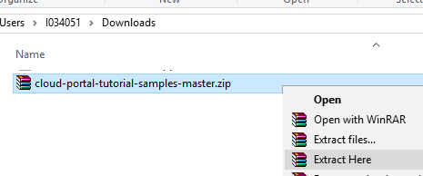
    > A new cloud-portal-tutorial-samples-master folder is created

  4. Open the `cloud-portal-tutorial-samples-master\TECHED2018` folder

    For this tutorial we will be using 3 applications from the Portal samples repository:
    - `cloud-portal-tutorial-samples-master\TECHED2018\productslist`
    - `cloud-portal-tutorial-samples-master\TECHED2018\supplierlookup`
    - `cloud-portal-tutorial-samples-master\TECHED2018\langselectorplugin`

>**IMPORTANT:** The following steps refer to `productslist` and should be repeated for all 3 application.

[DONE]

[ACCORDION-END]

[ACCORDION-BEGIN [Step 5: ](Create ZIP files from  applications)]
  1. Open the `cloud-portal-tutorial-samples-master\TECHED2018\productslist\` folder
  2. Create a ZIP file from **all** of the underlying files:
	   * Select all of the included files (Ctrl^A)
	   * Right-click and select **Add to** `productlist.zip`.
        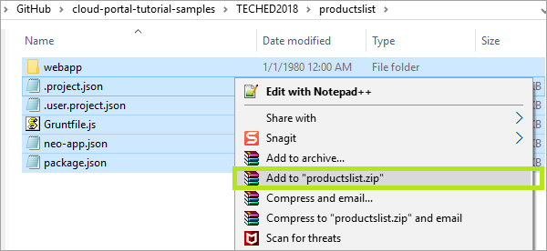.
  3. A new ZIP file named `productlist.zip` is created inside the folder.
      .

>**IMPORTANT:** Repeat these step for `supplierlookup` **and** `langselectorplugin`

[DONE]

[ACCORDION-END]

[ACCORDION-BEGIN [Step 6: ](Open SAP Web IDE Full-Stack)]
  1. In the SAP Cloud Platform cockpit, click **Services** in the left panel and open the **SAP Web IDE Full-Stack** tile.
  2. From the **SAP Web IDE Full-Stack- Overview** page, click **Go to Service** to open the development environment.
  3. Click the **Development** perspective:
    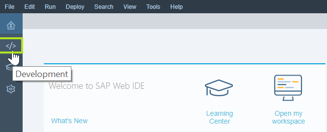

>You've opened your development environment, now let's import our SAPUI5 app into it.

[DONE]

[ACCORDION-END]

[ACCORDION-BEGIN [Step 7: ](Import application ZIP files)]
Import the applications used in this tutorial to add to your SAP Web IDE and deploy them to your SAP Cloud Platform account.

  1. In the development workspace, select the `Workspace` root folder.
  2. Right-click and select **Import** > **File or Project**.
      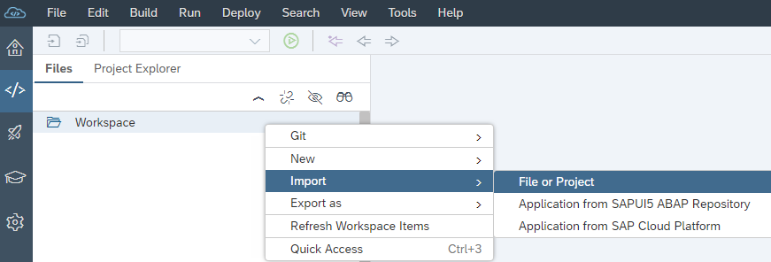
  3. From the **Import** dialog box, select the `productslist.zip` file located in the sample repository unzipped folder:  `cloud-portal-tutorial-samples-master\TECHED2018\productslist`.
  4. Check **Extract Archive** and make sure that **Import to** is `/productslist`.
      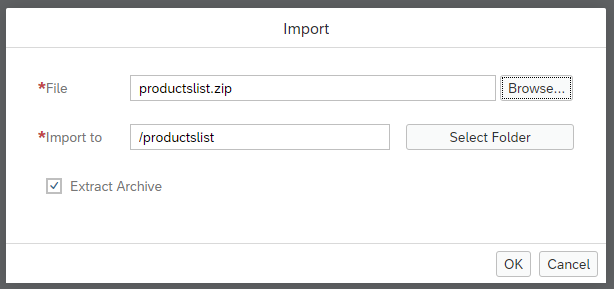
  5. Click **OK** to start the import.

    > A new project named `productlist` is created in your SAP Web IDE development workspace

      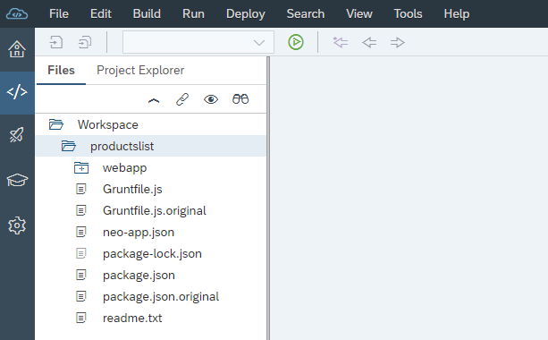

>**IMPORTANT:** Repeat 1 to 5 to import** `supplierlookup` **and** `langselectorplugin`

After importing all of the apps, your workspace should look like this:
      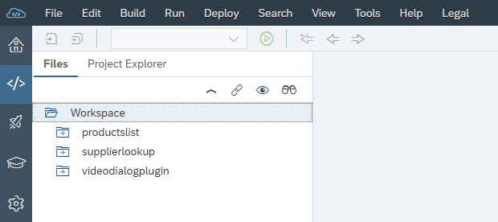

      [DONE]

[ACCORDION-END]

[ACCORDION-BEGIN [Step 8: ](Deploy applications to SAP Cloud Platform)]
  1. In SAP Web IDE, right-click the `productsList` folder and select **Deploy** > **Deploy to SAP Cloud Platform**.
    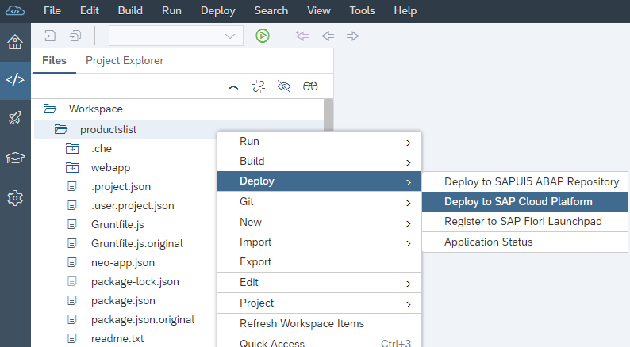
  2. Enter your SAP Cloud Platform subaccount credentials and click **Login**.
  3. On the screen that opens, click **Deploy**.

>**IMPORTANT:** Repeat this step for** `supplierlookup` **and** `langselectorplugin`.

Now that the apps exists in your SAP Cloud Platform subaccount, you will be able to add it to your Portal freestyle site.

[DONE]

[ACCORDION-END]
