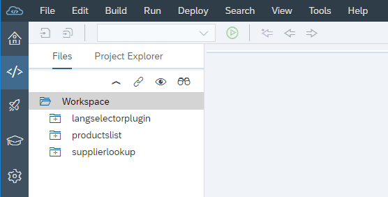
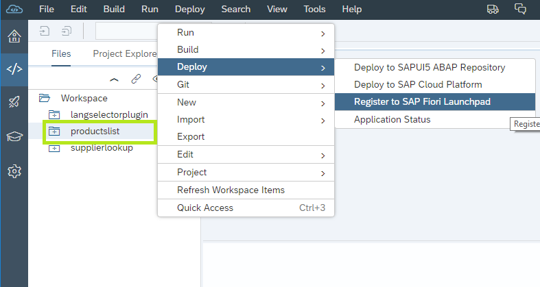
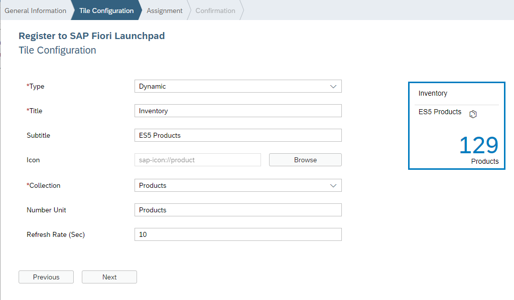
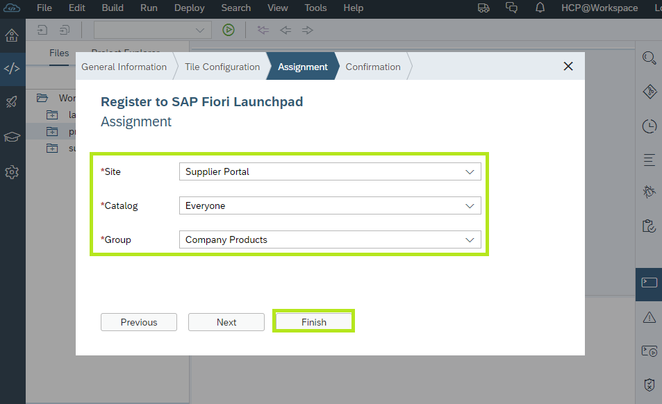
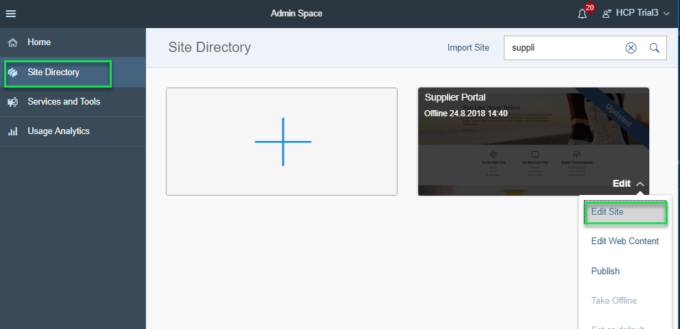
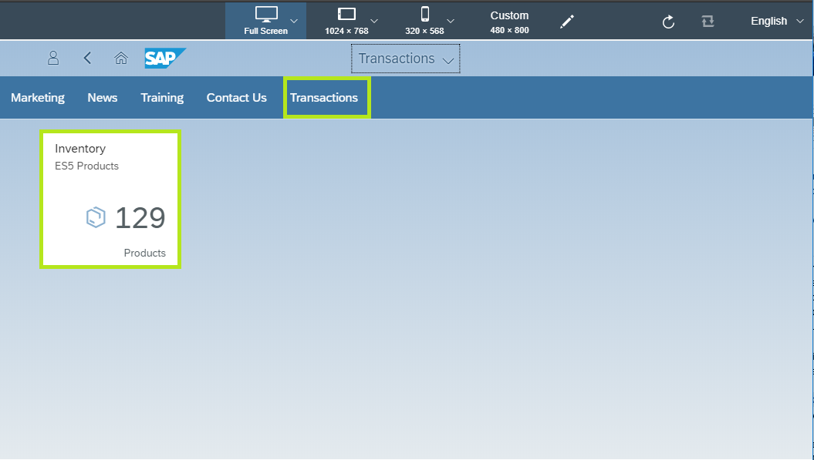
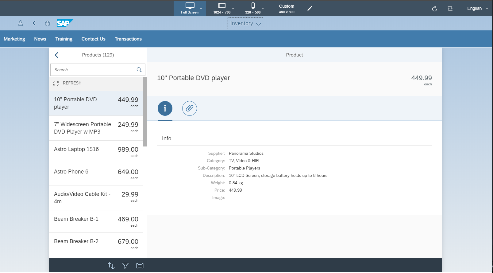

## Prerequisites  

## Details
### You will learn  
  - How to add an application from the SAP Web IDE Full-Stack development environment to your Portal Fiori Launchpad pages
  - How to configure a dynamic tile to launch your application in a Fiori Launchpad
  - How dynamic tiles display live indicators retrieved from a back-end system through OData endpoints

---

[ACCORDION-BEGIN [Step 1: ](Open SAP Web IDE Full-Stack)]
  1. In the SAP Cloud Platform cockpit, click **Services** in the left panel and open the SAP Web IDE Full-Stack tile.
  2. From the **SAP Web IDE Full-Stack- Overview** page, click **Go to Service**.
  3. Click the **Development** perspective:
    
>You've opened your development environment, notice that the 3 applications you imported earlier (`langselectorplugin`, `productlist`, `supplierlookup`) are available in your workspace.

[DONE]
[ACCORDION-END]

[ACCORDION-BEGIN [Step 2: ](Register Product List app to launchpad)]
  1. Select the `productlist` app folder from the SAP web IDE Full-Stack Development workspace.
  2. Right click and select **Deploy > Register to SAP Fiori Launchpad**
      

    > The **Register to SAP Fiori Launchpad** wizard dialog is opened.

  3. In the **General Information** tab enter the application description: `List of products from ES5 Gateway` and click **Next**
  4. In the **Tile Configuration** tab enter:
    * **Type** = `Dynamic`
    * **Title** = `Inventory`
    * **Subtitle** = `ES5 products`
    * **Icon** = Select any icon
    * **Collection** = Select the `Products` OData Collection
    * **Number Unit** = `Products`
      
  5. Click **Next**
  6. In the **Assignment** tab - assign the tile/app to
    * **Site** = `Supplier Portal`
    * **Catalog** = `Everyone`
    * **Group** = `Company Products` (this is the Group you created in the previous tutorial)
  7. Click **Finish**
    
    > The app and tile configuration are registered in the Supplier Portal Fiori Launchpad page. Once registration is complete a **Successfully Registered** dialog is opened.

  8. Click on **OK** to close the **Successfully Registered** dialog.

[DONE]
[ACCORDION-END]

[ACCORDION-BEGIN [Step 3: ](Preview changes in Portal Site Designer)]
Switch back to the **SAP Cloud Platform Portal Admin Space** in your browser tab.

  1. From the Portal Admin Space, open the **Supplier Portal** for edit in the Site Designer.
    
    > If the Site Designer is already opened in your browser, **refresh** it to apply the latest changes you performed in the SAP Web IDE.

  2. From the top-level menu click on the **Preview** icon to preview the latest changes.
    
    > The Supplier Portal site is opened in the Portal preview environment in a new browser tab.

  3. In the Preview Environment click on the **Transactions** menu item from the Supplier Portal menu bar to navigate to the new Fiori Launchpad page.
    
    > Notice that the Fiori Launchpad contains the new **Inventory** dynamic tile you configured in the SAP Web IDE and that the number of products value is retrieved from the ES5 Gateway system.

  4. Click on the **Inventory** tile to open the `productlist` application.
    

[VALIDATE_1]
[ACCORDION-END]

---
