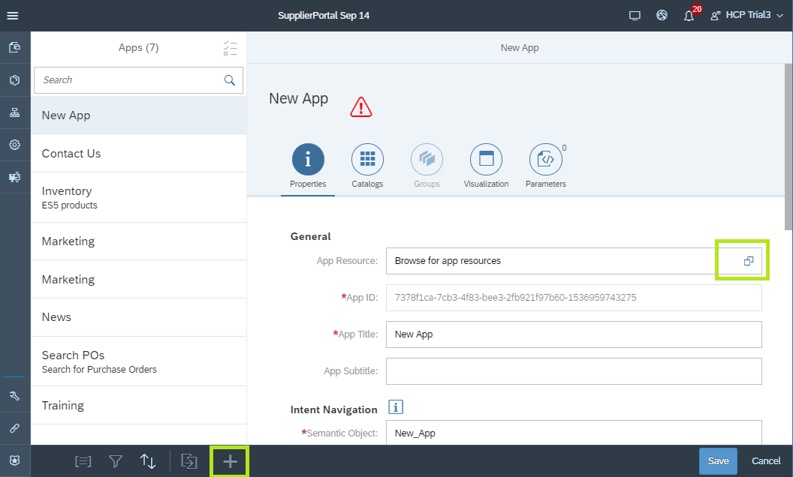
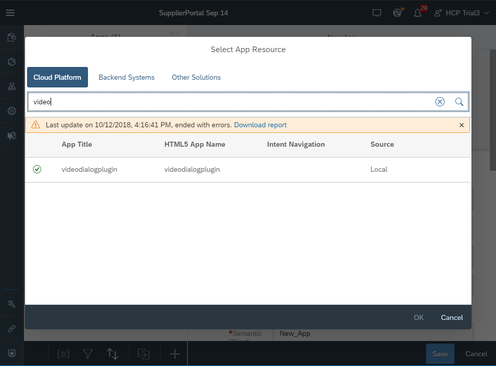
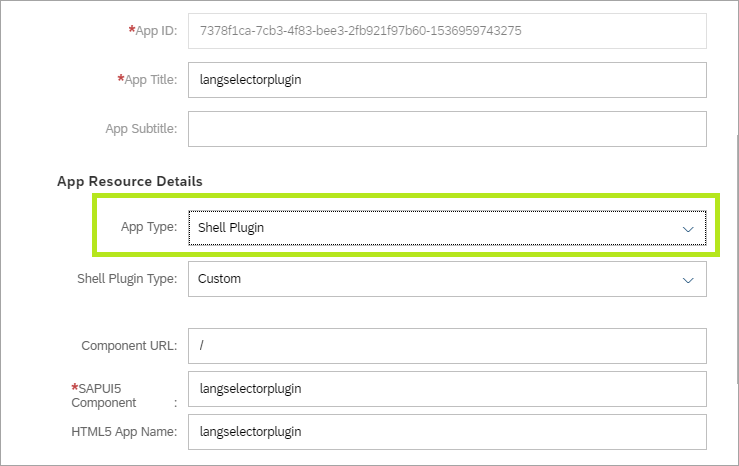
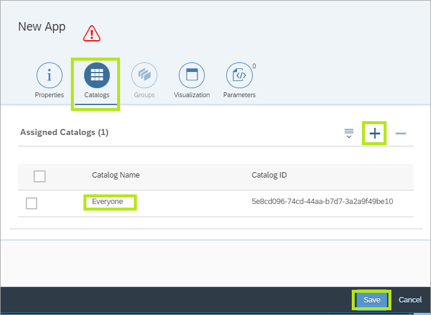
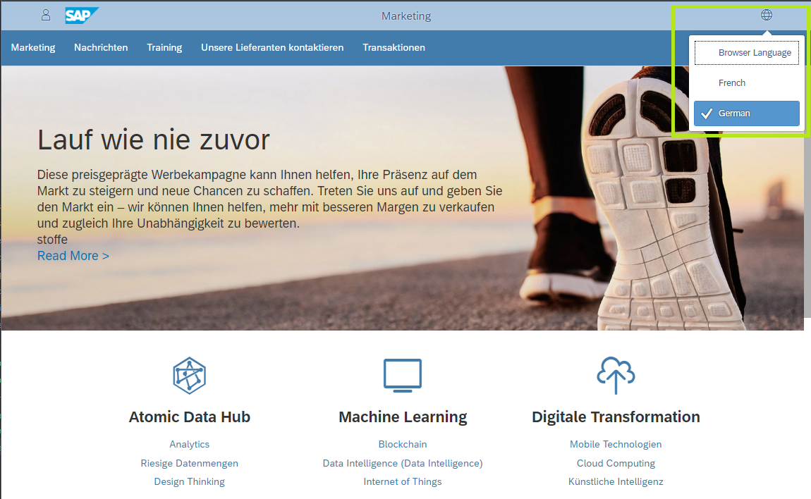

## Details
### You will learn  
  - How to add Shell Plugins to your SAP Cloud Platform Portal sites
  - How to extend the SAP Cloud Platform Portal User Interface with plugins

Shell plugins are SAPUI5 component apps that are initiated when the Portal site is loaded. They enable portal developers and admins to extend the Portal UI through predefined UI hooks (Shell header, footer etc.). In addition, plugins are also used for running background tasks, for example, registering to a Web Analytics provider.

---

[ACCORDION-BEGIN [Step 1: ](Add Shell Plugin to your site)]
1. Open the Supplier Portal for edit in the Site Designer.

2. Click on the **Content Management** icon from the left side bar and select **Apps**

    

    > The **Manage App Configuration** editor is opened.

3. Click on the **+** icon at the bottom menu to create a new app configuration.

    

4. In the New App **Properties** tab under **General** click on the **App Resource** selection input to select an app.

5. In the **Select App Resource** dialog search for the `langselectorplugin`, select it, and click **OK**.

    

    > Notice that the properties in the New App configuration have been populated.

6. Under **App Resource Details** change the **App Type** value to `Shell Plugin`

    

7. In the New App top filter tabs select Catalogs to assign the Shell Plugin to specific user roles.

8. Click on the **+ Icon** and add the `Everyone` catalog.

9. Click **Save**.

    

[DONE]
[ACCORDION-END]

[ACCORDION-BEGIN [Step 2: ](Publish and preview your changes)]
1. In the Site Designer top level menu, click on the **Publish** icon to publish the latest changes to the end users.
2. In the dialog box click on **Publish and Open**

    > The Supplier Portal runtime is opened in a new browser tab.

3. Notice the new **Globe** icon at the top-right of the site header.
4. Click on the **Globe** icon and select a language from the list.
5. Notice that the browser is reloaded and the Supplier Portal appears in the selected  language.

    

[VALIDATE_1]
[ACCORDION-END]

---
