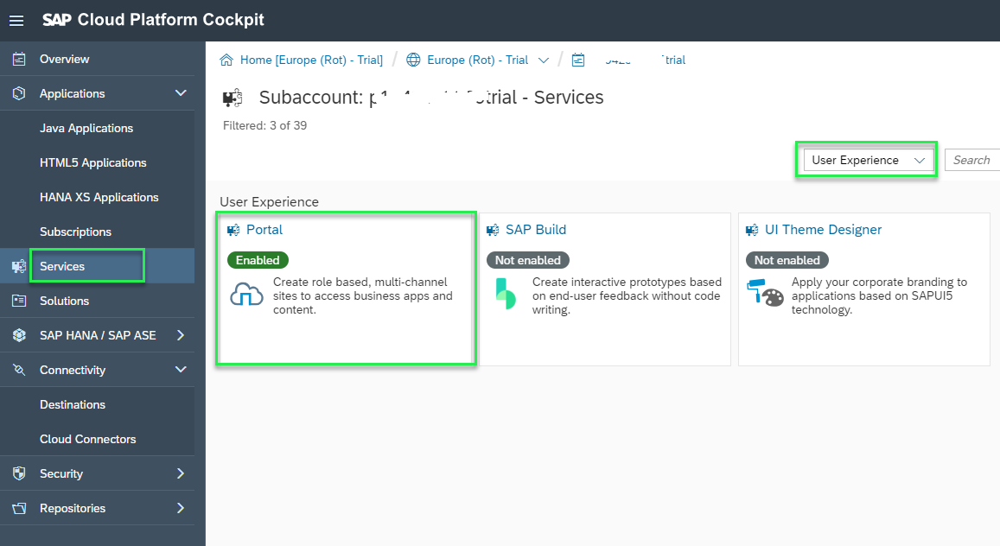
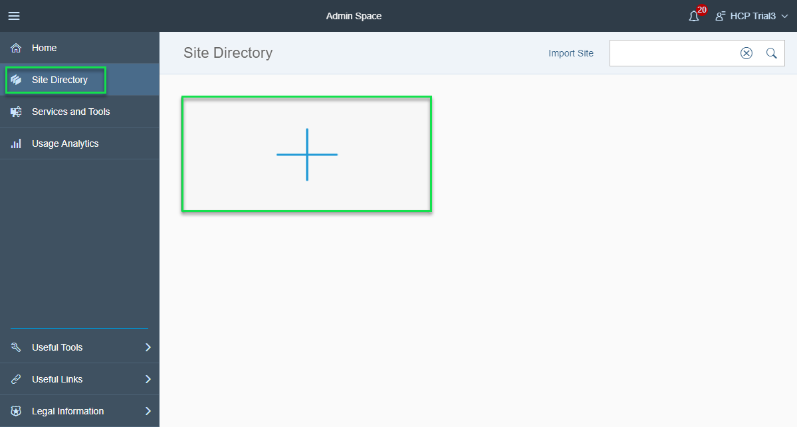
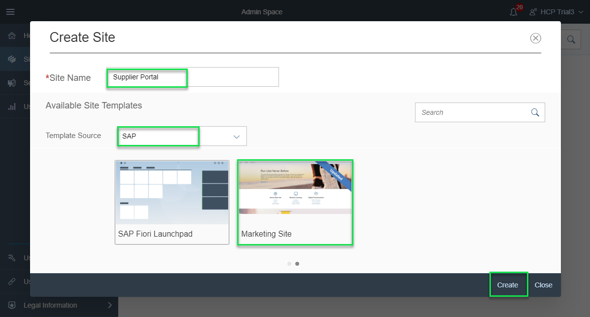
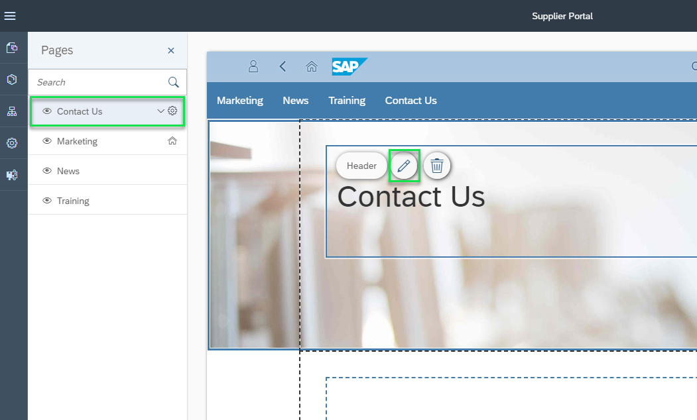
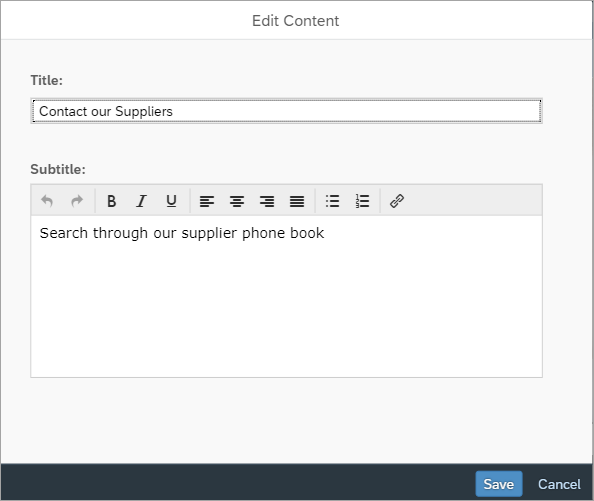
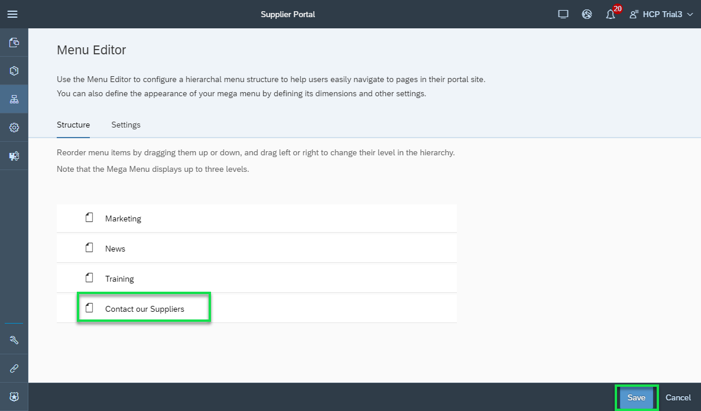

## Details
### You will learn  
  - How to access the SAP Cloud Platform Portal Admin Space
  - How to start building a new Portal site using an existing site template
  - How to perform basic content modifications

To build the Supplier Portal, we will create a new site from a content-rich site template. We will add our own content and applications to this site to customize it fit our needs.

---

[ACCORDION-BEGIN [Step 1: ](Access the Portal admin space)]
1. Login to your SAP Cloud Platform Trial account
2. Click **Services** from the left panel to open the services available for your subaccount.
3. From the **Categories** dropdown list, select **User Experience** to see UX-related services.
4. Click the **Portal** tile to open the service overview page.

    

5. In the **Portal – Overview** page, click **Go to Service** to open the Portal.

The **Portal Admin Space** opens in a new browser tab and you can start creating your portal solution.

[DONE]
[ACCORDION-END]

[ACCORDION-BEGIN [Step 2: ](Create a new portal site)]
1. From the Portal Admin Space, select **Site Directory** from the left side panel.
2. Click on the **+** tile to open the **Create Site** wizard.

    

3. Name the site **`Supplier Portal`**
4. In the **Template Source** list select **SAP**.

    The site templates provided by SAP are displayed in a gallery of tiles.

5. Click on the right side arrow to navigate to the end of the site template list in the gallery.
6. Select the **Marketing Site** as your site template, and click on the **Create** button.

    

The new site instance is created and opened in the Site Designer in a new browser tab.

[VALIDATE_1]
[ACCORDION-END]

[ACCORDION-BEGIN [Step 3: ](Edit page content)]
1. From the list of pages available in the site, click on the  **Contact Us** page to edit its content.
2. The **Contact Us** header is displayed using a Web Content widget. Click on the widget to expose its menu action items.
3. Click on the `Pencil` action item to edit the widget content.

    

4. In the **Edit Content** dialog enter the new title `Contact our Suppliers` and enter a subtitle.
5. Finally click **Save**

    

> The content of the Web Content header widget is modified

[DONE]
[ACCORDION-END]

[ACCORDION-BEGIN [Step 4: ](Modify site menu)]
1. From the left side panel click on the menu icon to open the site menu editor

    

2. Double click on the last entry named **Contact Us** from the list of menu items, to open the text for edit.
3. Enter the new value **Contact Our Suppliers**.

    

4. Click **Save**

[DONE]
[ACCORDION-END]
