## Details
### You will learn  
  - How to manage translations of your SAP Cloud Platform Portal site texts
  - How to use SAP Translation Hub to translate the SAP Cloud Platform Portal site texts

This allows SAP Cloud Platform Portal site admins to create multilingual sites, translate their site resources, and allows end users to choose their desired language.

In this tutorial, you will download the Supplier Portal site's translatable resources in their master locale (English). You will use the SAP Translation Hub to automatically translate the resources into several target languages and upload the translated resources back to your portal site.

The SAP Translation Hub automatically translates the uploaded text resources into the target languages. Users can than validate the translations and manually modify them.

> For the sake of simplicity, in this tutorial we will assume that the translations suggested by the automatic translation process are accurate.

---

[ACCORDION-BEGIN [Step 1: ](Download master language resources)]
  1. From the left side panel in the Supplier Portal Site Designer, click on the **Service and Tools** icon.
  2. From the list of Services and Tools click on the **Translation Manager** tile.
    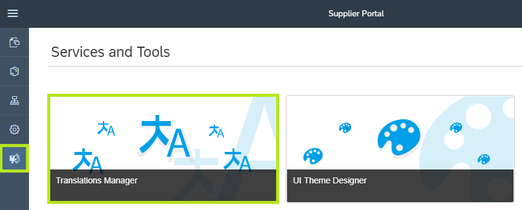
    > The **Translation Manager** is opened.

  3. Under **Translation Files** click on the **Download** button to download the site's text resources in the master language (English).
    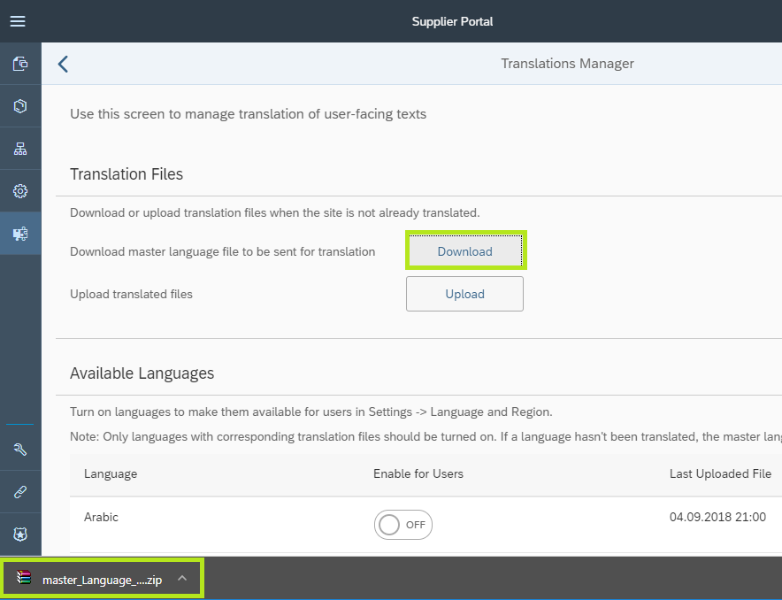
    > Notice that the file `master_language_<date>.zip` is downloaded to your desktop.

  4. Select the `master_language_<date>.zip`, right click and select **Extract to master_language_<date>** to unzip the file on your desktop.
    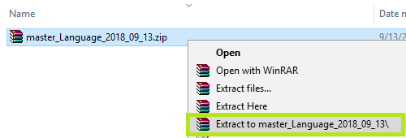
    > A new folder named `master_language_<date>` is created.

  5. Open the new folder `master_language_<date>` to see it's content.
    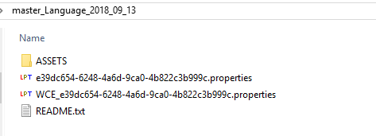
    > Notice that the folder contains the following translation resources:
    > - `<SITE_ID>.properties`: contains the texts for the menu items, and Fiori Launchpad tiles and tile groups
    > - `WCE_<SITE_ID>.properties`: contains the texts included in the portal site's web content widgets.

[VALIDATE_1]
[ACCORDION-END]

[ACCORDION-BEGIN [Step 2: ](Open SAP Translation Hub)]
  1. In the SAP Cloud Platform cockpit, click **Services** in the left panel and open the **SAP Translation Hub** tile under the category **Globalization**.
  2. From the **SAP Translation Hub- Overview** page, click **Go to UI for Translation Workflow**.
  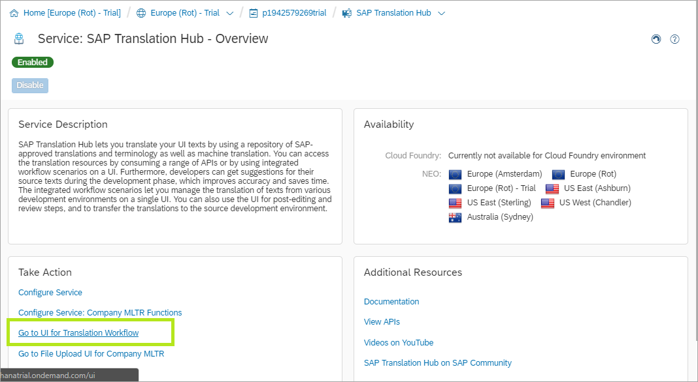

The SAP Translation Hub user interface is opened in a new browser tab.

>Initial load might take 1 minute.

[DONE]
[ACCORDION-END]

[ACCORDION-BEGIN [Step 3: ](Create translation projects)]
  1. Create a new **Translation Project** by click on the **+ Icon** at the footer of the empty list of projects.
  2. From the **Project Type** popover, select `File Upload`.
    
  3. In the **File Upload Project Details** enter the following values:
    - **Project Name** = `Supplier Portal Site Texts`
    - **File Type** = `Java Properties File`
    - **Source Language** = `English`
    - **Target Languages** = select `German` and `French`
    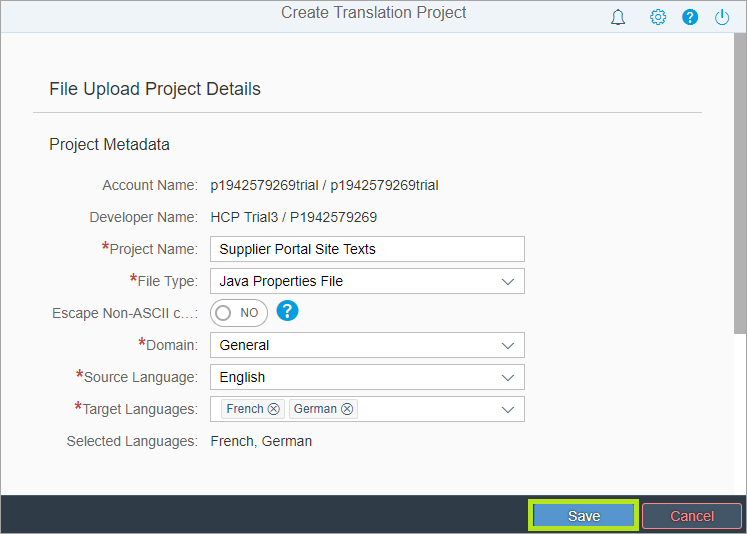
  4. Click **Save**
    > The new Translation Project is created.

  5. Click on the **Upload File** button on the right side of the footer.
  6. In the **File Upload** dialog click on **Browse**.
  7. Navigate to the `master_language_<date>` folder and select the `<SITE_ID>.properties` file.
  8. Click on **Upload and Translate**.
  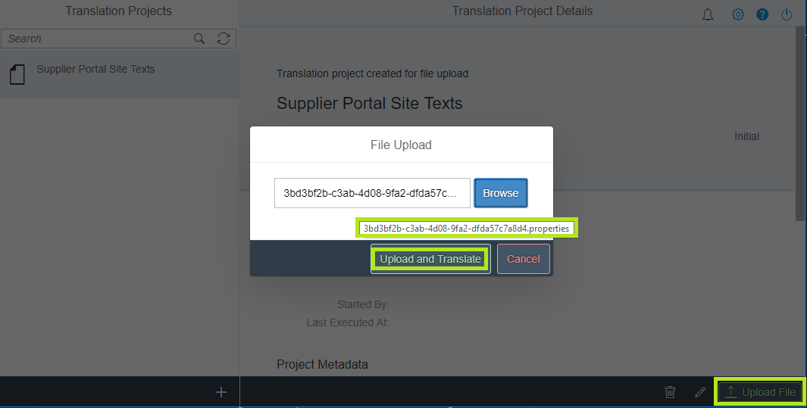

    > Notice that the translation process begins.

  9. Once the translation process is complete, click on the **Translations** tab.
  10. Click on **Download Translations** from the right side button in the footer.
    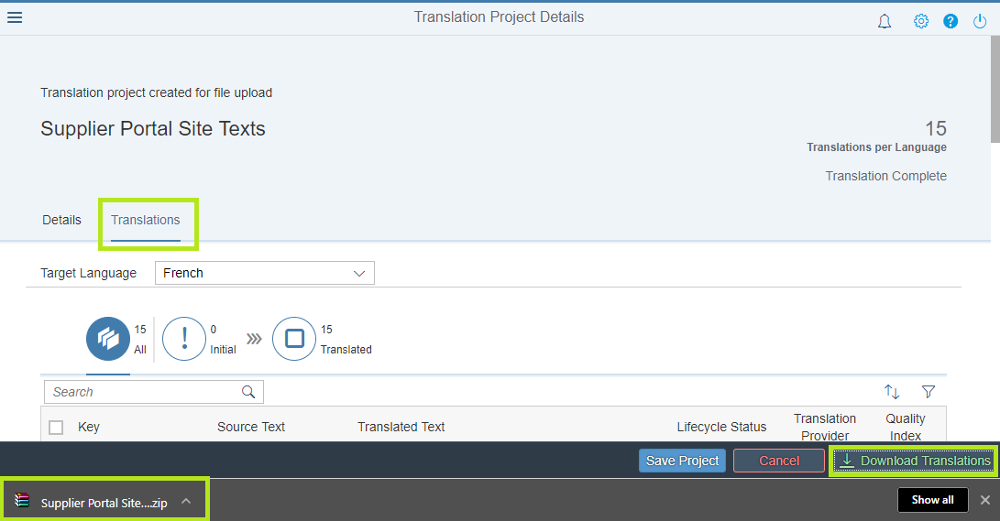

    > Notice that the `Supplier Portal Site Texts.zip` file is downloaded to your desktop.

  11. Save the `Supplier Portal Site Texts.zip` file - you will need it for the next step.
  12. Repeat steps 1 to 11 to translate the `WCE_<SITE_ID>.properties` file.
    - Name the project `Supplier Portal WCM Texts`.
    - Select the same target languages.
    - Upload the `WCE_<SITE_ID>.properties` file.
    - Save the `Supplier Portal Site WCM Texts.zip` translations file together with the `Supplier Portal Site Texts.zip` file for the next step.
    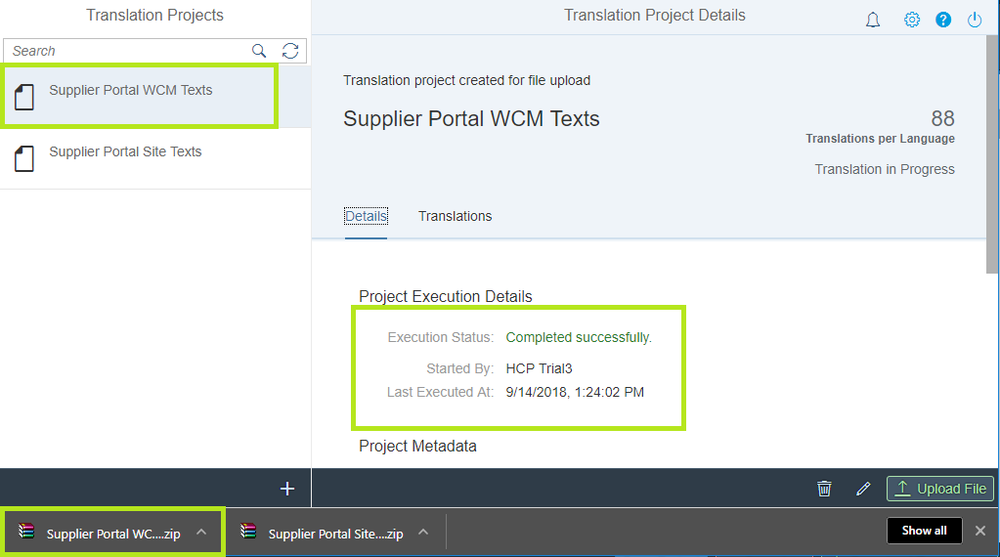

[DONE]
[ACCORDION-END]

[ACCORDION-BEGIN [Step 4: ](Upload translated resources)]
  1. Go back to the Site Designer and open the **Translation Manager**.
  2. Under **Translation Files** click on **Upload**.
  3. Select the new `Supplier Portal Site Texts.zip` file you downloaded in the previous step.
  4. Verify that the upload finished successfully.  
    

  5. Click on **Upload** again to upload the `Supplier Portal Site WCM Texts.zip` file.
  6. In the **Translation Manager** scroll down to the **Available Languages** section.
  7. Switch the `French` and `German` languages **ON** to enable them for the site's end users.
  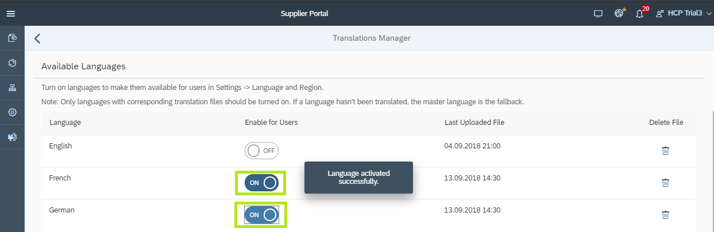

[DONE]
[ACCORDION-END]

[ACCORDION-BEGIN [Step 5: ](Run Supplier Portal in desired language)]
  1. From the site designer top-level menu, click on the **Publish Icon** to publish the latest changes.
  2. In the dialog box click **Publish and Open** to open the site runtime in the master language (English) in a new browser tab.
  3. In the Supplier Portal runtime site, click on the **Me Icon** on the left side of the top-level menu.
  4. Click on **Settings**.
  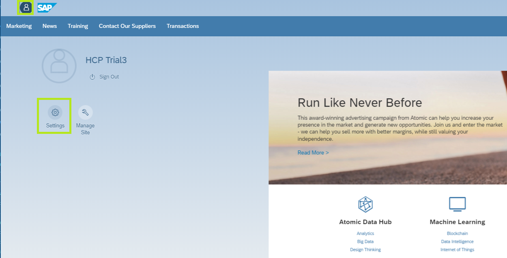
  5. In the Settings dialog, select **Language & Region**.
  6. Select a language from the list and click **Save**
  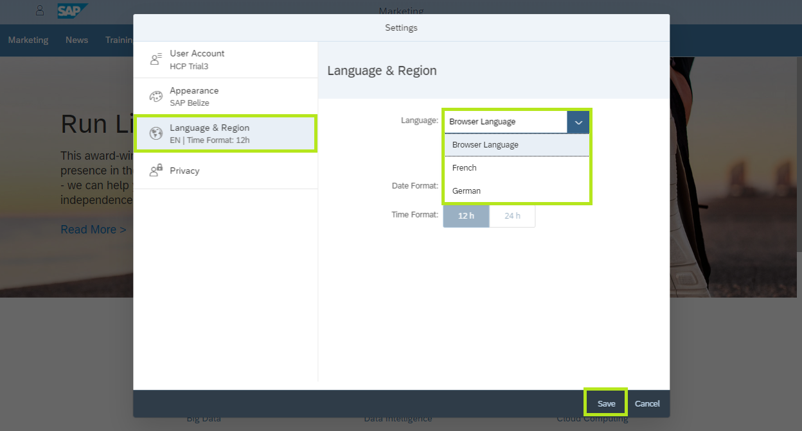

    > Notice that the browser is reloaded and the site is displayed in the selected language.

    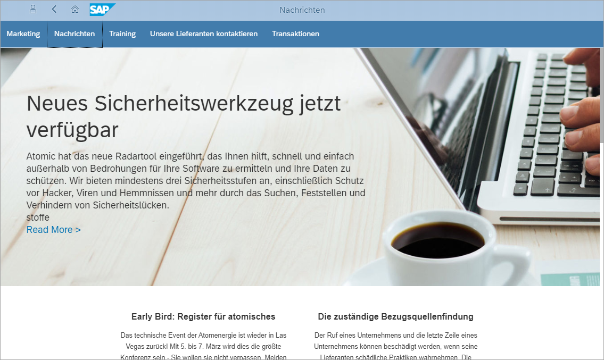

  7. When done, set the language back to **English** as the language settings are applied to your User and will be applied throughout your SAP Cloud Platform account.

[DONE]
[ACCORDION-END]

---
