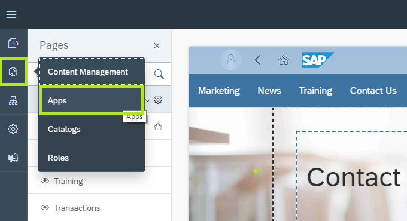
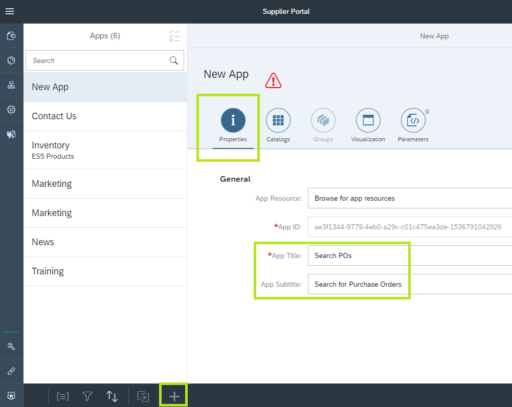
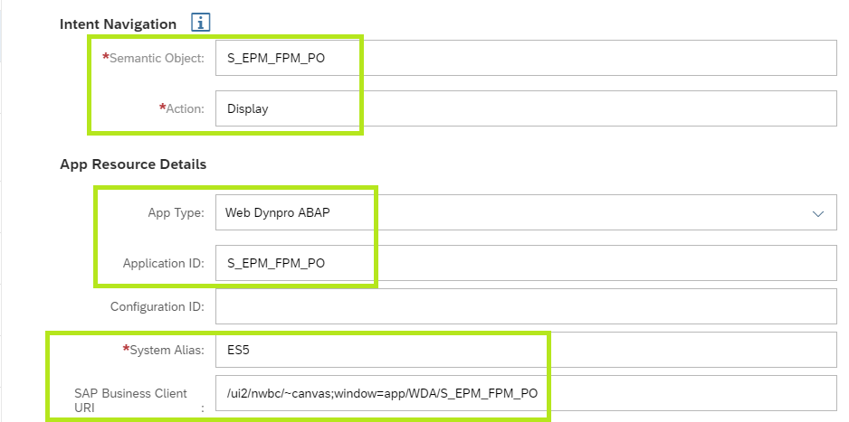
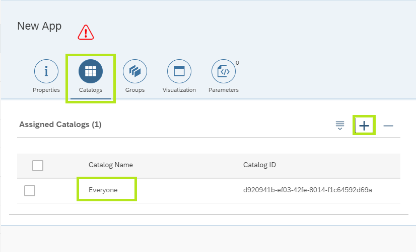
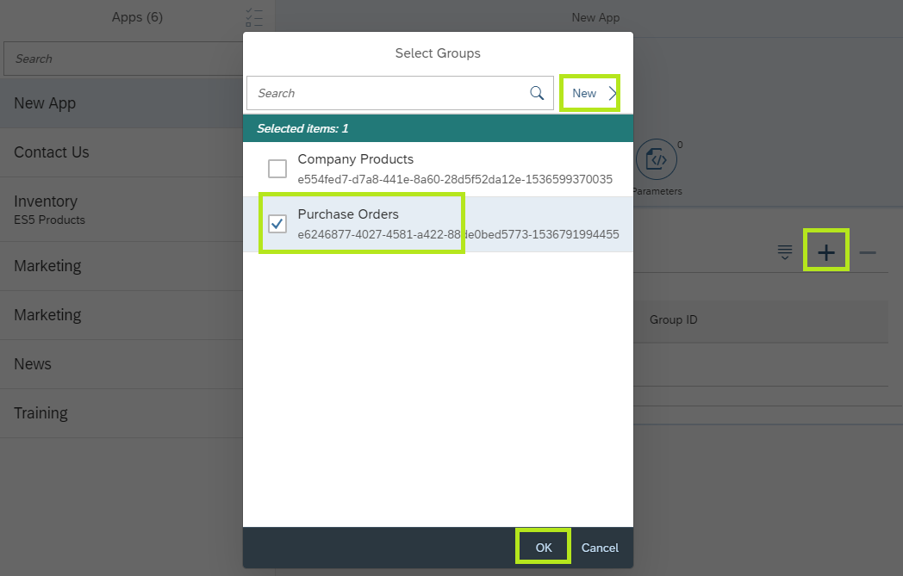
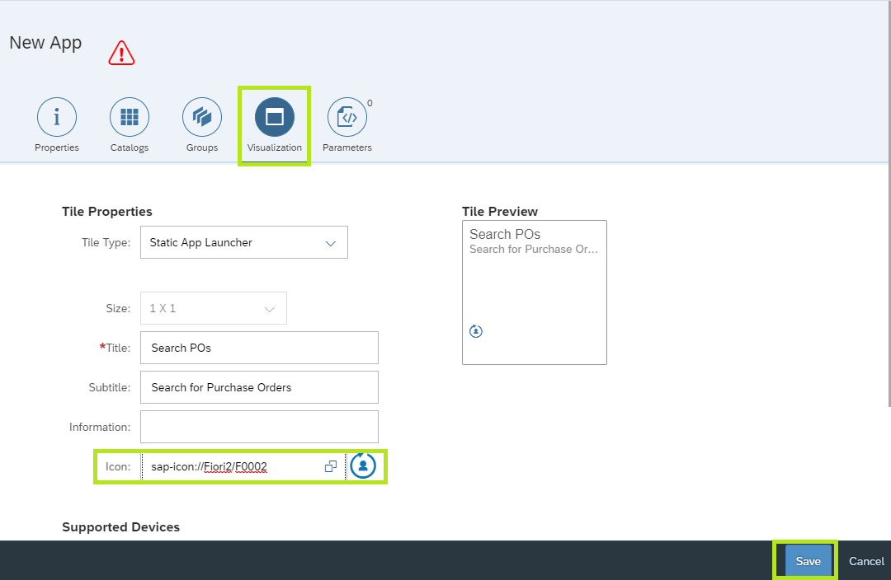
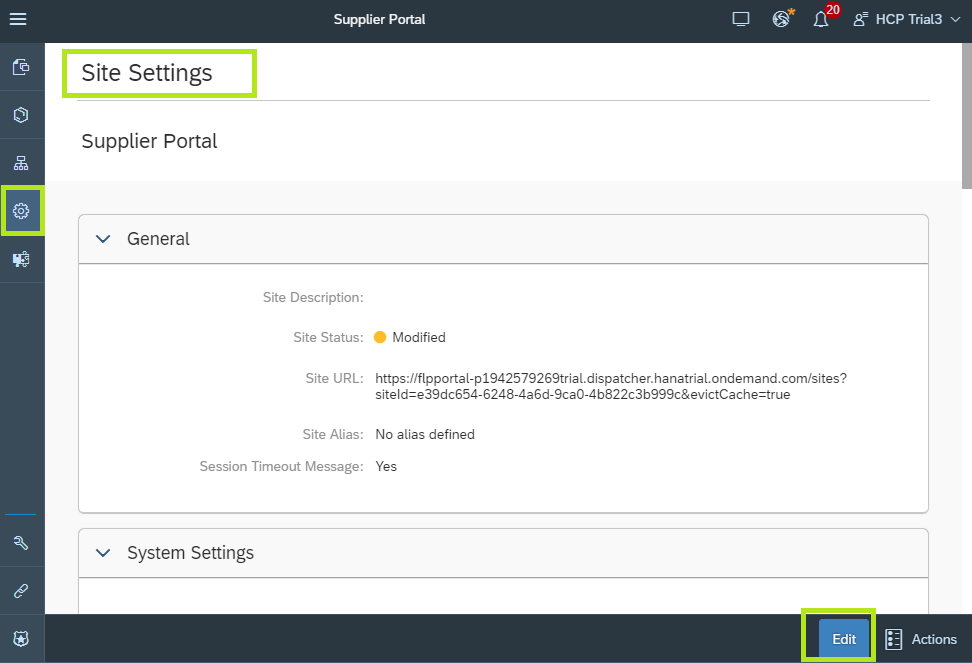
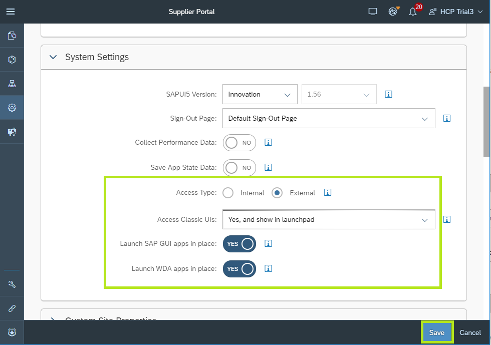
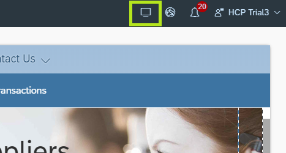
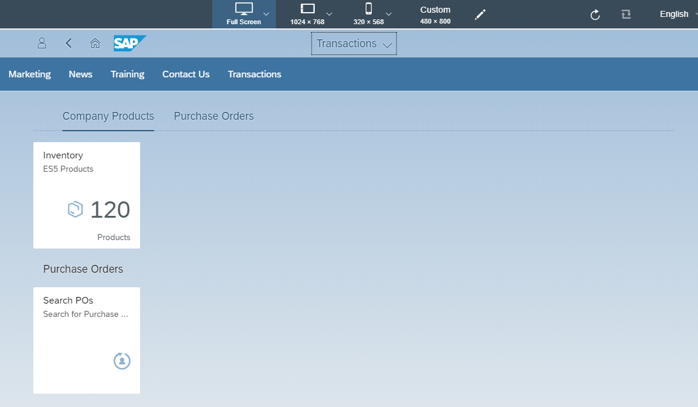

## Prerequisites  
 - Verify that the ES5 destination you created in your account contains the property **Usage** = `Backend`. If not, add it.

## Details
### You will learn  
  - How to expose a Web Dynpro ABAP backend application to your SAP Cloud Platform Portal site
  - How to set up an external access point landscape allowing your end users to consume SAP backend apps (Web Dynpro ABAP and SAP GUI for HTML) outside of the corporate network

SAP customers who run classic SAP UI applications on their data center backend can transition to the SAP Cloud Platform and continue using these applications.

---

[ACCORDION-BEGIN [Step 1: ](Configure a Web Dynpro app in your site)]
  1. Open the Supplier Portal for edit in the Site Designer and click the **Content Management** icon from the left side bar and select **Apps**
    
    > The **Manage App Configuration** editor is opened.

  2. Click the **+** icon at the bottom menu to create a new app configuration.
  3. In the **New App** screen click the  **Properties** tab.
  4. Under **General** enter the following values:
    * **App Title** = `Search POs`
    * **App Subtitle** = `Search for Purchase Orders`
      
  5. Under **App Resources Details** enter the following values:
    * **App Type** = `Web Dynpro ABAP`
    * **Application ID** = `S_EPM_FPM_PO`
      (The transaction ID associated with the application we wish to add)
    * **System Alias** = `ES5`
      (The name of the destination connecting to the SAP Backend)
    * **SAP Business Client URI**	= `/ui2/nwbc/~canvas;window=app/WDA/S_EPM_FPM_PO`
      (Path to the SAP NetWeaver Business Client used to run the app together with transaction ID)
  6. Above that, under **Intent Navigation** enter the following values:  
    * **Semantic Object** = `S_EPM_FPM_PO`
    * **Action** = `Display`
      
  7. In the New App configuration top level tab select **Catalogs** and click the **+** to add the **Everyone** Catalog
    
  8. In the New App configuration top level tab select **Groups** and click the **+** to add the new app to a tile group on the Fiori Launchpad page
  9. In the **Select Groups** dialog click **New** to create a new tile group. Name the group **Purchase Orders** and click **OK** to close the New Group dialog.
  10. In the Select Groups dialog, select the new **Purchase Orders** group and click **OK**
    
  11. In the New App configuration top level tab select **Visualization**. Keep the Static Tile type value and the existing configuration. Select an icon and click **Save**.
    

[DONE]
[ACCORDION-END]

[ACCORDION-BEGIN [Step 2: ](Set up an external access portal landscape)]
  1. From the site designer left side panel, click the cog icon to open the **Site Settings** editor.
  2. Click **Edit**
    
  3. In the Site Settings under **System Settings** enter the following values:
    * **Access Type** = `External`
    * **Access Classic UIs** = `Yes, and show in Launchpad`
      (Allows users accessing the site from outside of the corporate network to launch the Web Dynpro app)
    * **Launch SAP GUI apps in place** = `Yes`
    * **Launch WDA apps in place** = `Yes`
  4. Click **Save**
    

[DONE]
[ACCORDION-END]

[ACCORDION-BEGIN [Step 3: ](Preview the latest changes)]
  1. In the Supplier Portal site designer top level menu, click the **Preview** icon.
    
    > The Supplier Portal runtime is opened in the preview environment in a new browser tab.

  2. In the site's navigation menu click **Transactions** to navigate to the Fiori Launchpad page.
    
    > The Fiori Launchpad page is displayed with the new Tile group **Purchase Orders** and a new tile (**Search POs**) under it.

  3. Click the **Search POs** tile to launch the Web Dynpro ABAP app embedded in the portal page.
  4. In the app, click **Go** to retrieve the list of Purchase Orders.
    

[VALIDATE_1]
[ACCORDION-END]

---
