## Prerequisites
The `JobCore` Portal site is open in the Pages editor displaying the `JobCore` and `Launchpad` pages.

## Details
### You will learn
  - How to add web content to a page in your Portal site
  - How to design the layout of your page and its content

By now, you should have created the `JobCore Portal` site with a `Home` page and a `Launchpad` page that are both part of the site menu.

In this tutorial, we will add web content to a Portal page and design its layout and appearance according to a predefined, appealing design.  We are building a Portal site for a recruiting company, so our content will be applicable to this scenario.

Let's add meaningful content to your `Home` page.

> NOTE: if your time is limited, you need only do Steps 2 and 6. The other steps show you additional capabilities but take longer.

[ACCORDION-BEGIN [Step 1: ](Download resources)]

Before you start, first download the following images that you will add to your page. To download them, right-click the links and choose **Save link as** and save them on your computer.

  - [`JobCoreLogo.png`](Resources/JobCoreLogo.png)

  -	[`Header_01.jpg`](Resources/Header_01.jpg)

  -	[`Header_02.jpg`](Resources/Header_02.jpg)

  - [`We're_Local.png`](Resources/We're_Local.png)

  - [`We're_experienced.png`](Resources/We're_experienced.png)

  - [`We're_innovative.png`](Resources/We're_innovative.png)

  - [`Explore_JobCore_Services.jpg`](Resources/Explore_JobCore_Services.jpg)

  - [`View_Available_Jobs.jpg`](Resources/View_Available_Jobs.jpg)

  - [`Staying_Connected.jpg`](Resources/Staying_Connected.jpg)

[DONE]
[ACCORDION-END]

[ACCORDION-BEGIN [Step 2: ](Add widgets to the page)]

1. Click the `JobCore` page from the **Pages** panel in the Pages editor.

2. Click the **Header** section of the page -- this is the section with `Menu Item 1, 2, 3`.

    As you click in the page section, editing icons become visible. Since the page template that you selected to create this page contains a menu widget that you don't need for this specific site design, you are going to delete it by simply clicking the **Delete** icon.

    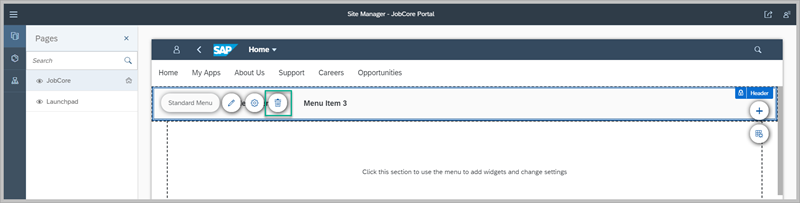

3. Click **Delete** on the confirmation dialog.

4. Click the **Header** section again and then click the **+** icon on the right to open the widget gallery.

    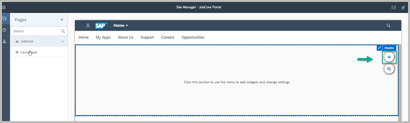

5. Click the **Headline Carousel** widget from the **Web Content Widgets: Carousel** category.

    >You can also locate this widget in the **Add Widgets** dialog box, by typing the name of the widget (in this case `Headline Carousel`), in the search box and clicking the search icon.

      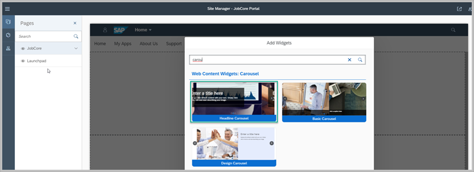

6. **Section 1** is the second section in this page that has no widgets in it. Click in this section as seen in the image.

     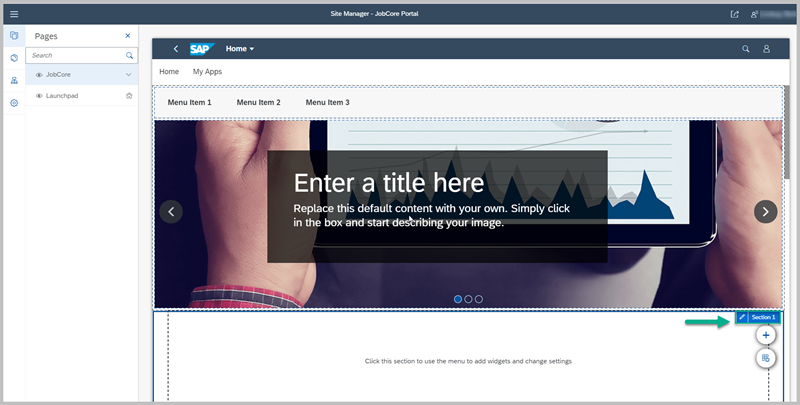

7. Add the following widgets.

    >Note: A section can contain multiple widgets. When you click on a widget, the widget editing icons appear at the top left of the widget, and the section editing icons appear at the top right of the section.

    >Don't worry about the content yet. You'll edit this later. Just keep clicking the **+** icon to add the widgets. You can also use the **Search** feature to find the widgets that you want.

    -	**Header with Titles** from the **Web Content Widgets: Basic** category.

    -	**Aligned Story Card** from the **Web Content Widgets: Cards** category.

8. Scroll down and click in **Section 2** of the page and add these widgets:

    -	**Header with Titles** from the **Web Content Widgets: Basic** category.

    - **Centered Story Card** from the **Web Content Widgets: Cards** category.

9. Click in **Section 3** of the page and add these widgets:

    -	**Image** from the **Web Content Widgets: Basic** category.

    -	**Small Icon Links Card** from the **Web Content Widgets: Cards** category.

You have a page full of widgets that still have their default content. So now let's replace the default content with more meaningful content.

[DONE]
[ACCORDION-END]

[ACCORDION-BEGIN [Step 3: ](Add your own content to the site)]

1. Click the `Headline Carousel` widget from the **Header** section to expose the widget and section editing icons.

2.	Click **Edit content** (the pencil icon in the top left) to edit the content of this widget.

    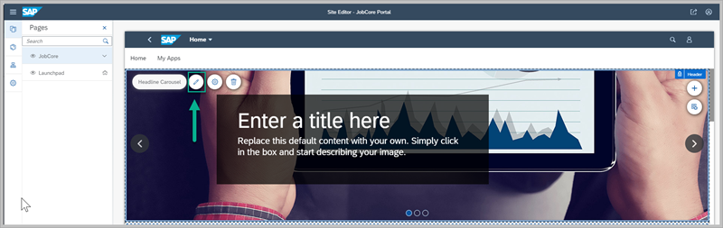

3. In the left panel, you can see that this widget includes 3 content items (each of which you can edit). Since this is a carousel widget, each content item is a slide in the carousel and each slide includes an image, a title, and a subtitle as content.

    >Note: we will click **Save** at the end of the editing.

4. Click the first content item and edit it as follows:

    |  Field     | Value
    |  :------------- | :-------------
    |  Image           | Replace with: `Header_01.jpg` (one of the resource files you downloaded in step 1 above)
    |  Title           | Welcome to JobCore
    |  Content    | Number one global recruiting and staffing company

    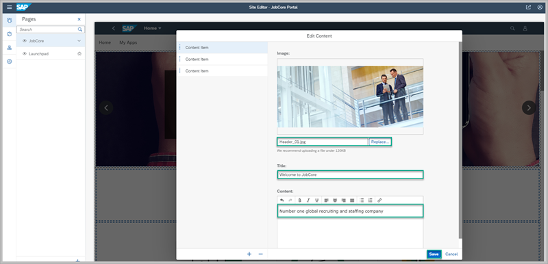

5. Click the second content item and edit as follows:

    |  Field      | Value
    |  :------------- | :-------------
    | Image           | `Header_02.jpg`
    |  Title           | Let us help YOU!
    |  Content    | We are focused on helping you find the right candidates faster. We guarantee higher response rates with long term employer-employee relationships. Let us help you find your next successful employee.

6. The carousel that we want for our site only has 2 slides, so you can delete the third content item. Click the third content item and then click the minus sign at the bottom of the screen to delete it.

    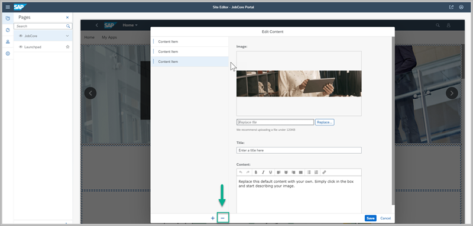

7. Click **Save**.

8. You're now going to edit the content in the next section of the page. In **Section 1** click in the **Header with Titles** widget to expose the editing icons.

9. Click **Edit content** (pencil icon) and edit the widget as follows:

    |  Field     | Value
    |  :------------- | :-------------
    |  Title           | Why `JobCore`?
    |  Subtitle           | We connect people with what they do best

    Click **Save**.

10. Still in **Section 1**,  click the **Aligned Story Card** widget and edit as follows:

    **Content Item 1**

    |  Field     | Value
    |  :------------- | :-------------
    |  Title           | We're Local
    |  Text           | Our locally experienced team are on hand 24/7 to engage with candidates wherever and whenever using various channels. We will reach out to candidates, filter them, and move the top candidates along the hiring process in real time.
    |  Image    | `We're Local.png`
    |  Display&nbsp;Text          | Read More

    **Content Item 2**:

    |  Field     | Value
    |  :------------- | :-------------
    |  Title           | We're Experienced
    |  Text           | Our staff are well trained to collect the right information and enter it into our rich database of top-quality candidates. We are experts in screening and will send you the most talented people according to their interests, background, and skills.
    |  Image    | `We're experienced.png`
    |  Display&nbsp;Text          | Read More

    **Content Item 3**:

    |  Field     | Value
    |  :------------- | :-------------
    |  Title           | We're Innovative
    |  Text           | We use an innovative tracking system that automatically tracks interested candidates. In this way we can substantially save your HR department hundreds of hours by sending you the most relative candidates for the job.
    |  Image    | `We're innovative.png`
    |  Display&nbsp;Text          | Read More

11. Click **Save**.  

    **Section 1** should look like this:

    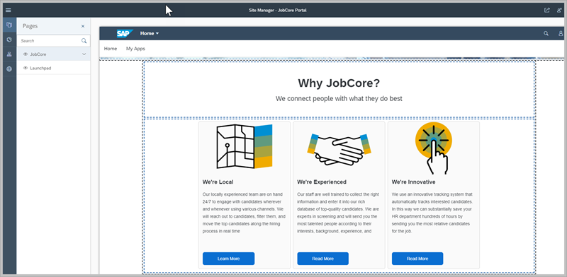

12. Click in **Section 2** and edit the widgets as follows:

    **Header with Titles**:

    |  Field      | Value
    |  :------------- | :-------------
    | Title           | How can we help you?
    |  Subtitle        |   Leave this blank. Remove the default content.

    Click **Save**.

    **Centered Story Card**:

    There are only 2 content items in this widget by default. Click the **+** icon at the bottom of the screen to add another content item.  

      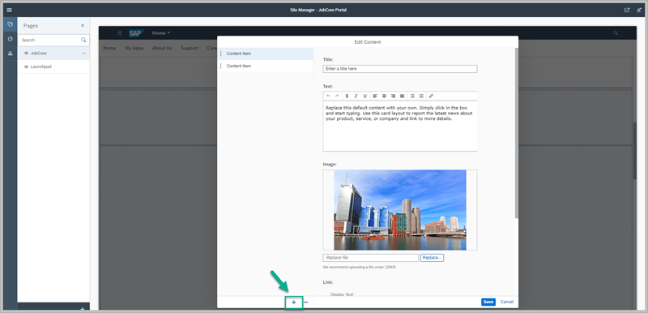

      You'll see that you now have 3 content items.

    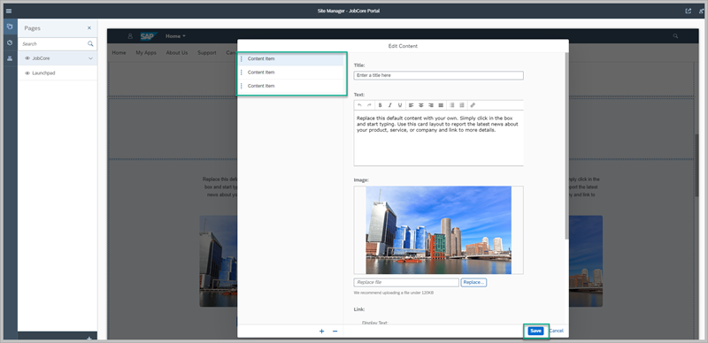

13. Edit each content item as follows:

    **Content Item 1**

    |  Field      | Value
    |  :------------- | :-------------
    |  Title           | Explore `JobCore` Services
    |  Text           | Training is just one of many of `JobCore` services. Our experts are here to guide your HR team and to make sure that they're successful when going through the hiring process. We can provide you with cost-effective and top quality services.
    |  Image    | Explore `JobCore` Services.jpg
    |  Link: Display&nbsp;Text          | View Services

    **Content Item 2**:

    |  Field     | Value
    |  :------------- | :-------------
    |  Title           | View Available Jobs
    |  Text           | With thousands of jobs filled, `JobCore` is a leader in the recruiting industry used by millions of professionals who are ready for their next career move. We offer numerous new jobs daily and are connected to thousands of headhunters.
    |  Image    | View Available Jobs.jpg
    |  Link: Display&nbsp;Text          | View Positions

    **Content Item 3**

    |  Field      | Value
    |  :------------- | :-------------
    |  Title           | Stay Connected
    |  Text           | Whether you're a potential `JobCore` customer, HR executive, or an interested recruiter, we'd love to hear from you.
    |  Image    | Staying Connected.jpg
    |  Link: Display&nbsp;Text          | Contact Us

14. Click **Save**. Section 2 should look like this:

    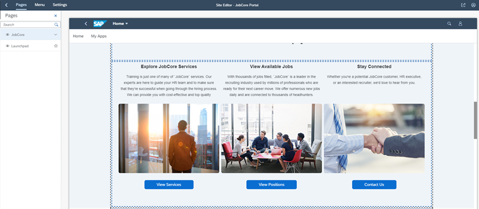

15. Click in **Section 3** and edit the widgets as follows:

    **Image** widget: Replace the image with the logo: `JobCoreLogo.png` and click **Save**.

    **Small Icon Links Card**:

    >Note that when you add icons, simply copy and paste their code provided in the tables below. You don't have to search for them in this tutorial.

      **Content Item 1**

    |  Field      | Value
    |  :------------- | :-------------
    |  Title           | Keep in touch
    |  Icon           | `sap-icon://decision`
    |  Link 1: Display&nbsp;Text     | Facebook
    |  Link 2: Display&nbsp;Text          | Twitter
    |  Link 3: Display&nbsp;Text    | LinkedIn

      **Content Item 2**

    |  Field        | Value
    |  :------------- | :-------------
    |  Title           | Company
    |  Icon           | `sap-icon://Fiori2/F0396`
    |  Link 1: Display&nbsp;Text     | Locations
    |  Link 2: Display&nbsp;Text           | News & Events
    |  Link 3: Display&nbsp;Text    | Contractor Resources

    **Content Item 3**

    |  Field      | Value
    |  :------------- | :-------------
    |  Title           | Website
    |  Icon           | `sap-icon://internet-browser`
    |  Link 1: Display&nbsp;Text     | Code of Conduct
    |  Link 2: Display&nbsp;Text           | Terms and Conditions
    |  Link 3: Display&nbsp;Text    | Notifications

16. Click **Save**.

    **Section 3** should look like this:

    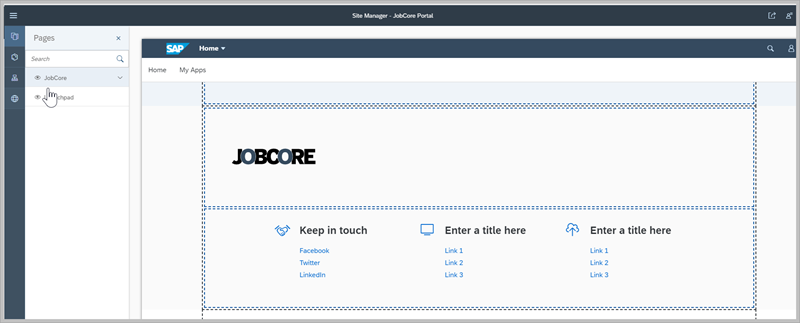

You've replaced all the default content in the widgets with your own. Let's arrange the widgets on the page.

[DONE]
[ACCORDION-END]

[ACCORDION-BEGIN [Step 4: ](Design the sections of your page)]

In this step, you'll arrange the widgets in the different sections of the page and configure the visual settings of the sections (like minimum height).

1. Click in **Section 1** or on any widget in this section, to expose the editing icons for this section.

2. Click the **Edit section settings** icon on the right.

    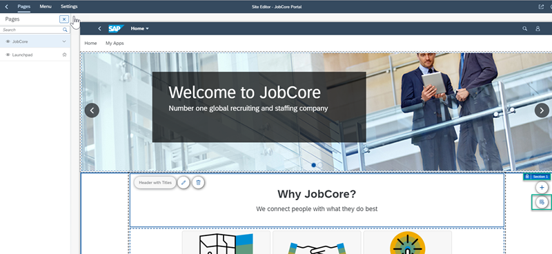

3. Edit the settings for **Section 1** as follows:

    - Check that the order of the widgets are according to how you want them to appear on your page. If they're not, simply hover over the grip control next to the widget name and drag it to the right place.

        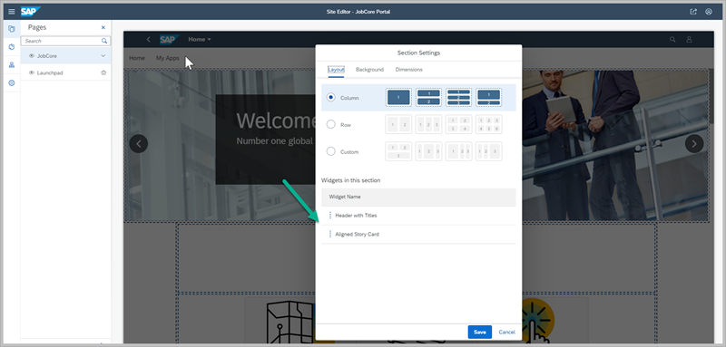

      - In the **Layout** tab, select the **Column** layout. We are choosing this layout option because we want our widgets to be arranged one under the other and we want each widget to take up the whole width of the screen.  

        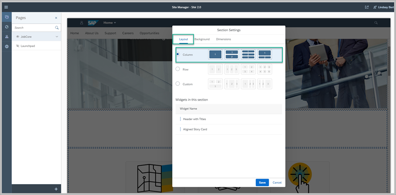

      - In the **Dimensions** tab, edit the settings as follows:

        |  Dimensions    | Value
        |  :------------- | :-------------
        |  Margins           | 5 `px`
        |  Content Width           | Full
        |  Minimum Height    | Default

        Click **Save**.

        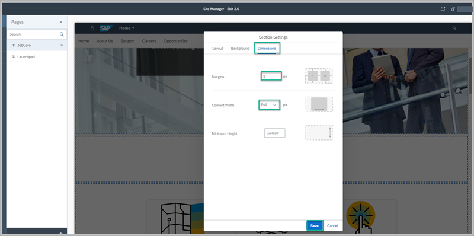

4. Click in page **Section 2** to highlight the **Edit sections** icon on the right and edit the settings as follows:

    -	Check that the order of the widgets are according to how you want them to appear on your page.

    -	In the **Layout** tab, select the **Column** layout.

    -	In the **Dimensions** tab, edit the settings as follows:

    |  Dimentions     | Value
    |  :------------- | :-------------
    |  Margins           | 5 `px`
    |  Content Width           | Full
    |  Minimum Height    | Default

      Click **Save**.

5. Click in page **Section 3** to highlight the **Edit sections** icon on the right and edit the settings as follows:

    -	Check that the order of the widgets are according to how you want them to appear on your page.

    -	In the **Layouts** tab, select **Custom**. We are choosing this layout option so that we can determine how much of the screen each widget will take up. For our site we want to arrange the widgets as follows:

        Under the desktop icon, enter ¼ for the **Image** widget and ¾ for the **Small Icon Links Card**.  This means that the **Image** widget will take up one quarter of the width of the screen and the **Small Icon Links Card** widget will take up the rest.

        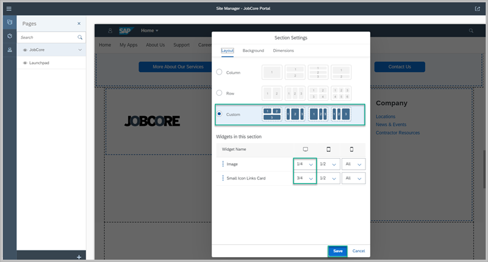

    -	In the **Dimensions** tab, change the settings as follows:

    |  Dimensions     | Value
    |  :------------- | :-------------
    |  Margins           | 100 `px`
    |  Content Width           | 1366 `px`
    |  Minimum Height    | Default

  Click **Save**.

You've now designed your Portal page by arranging the widgets in their page sections. In the next step you'll change the dimensions of the actual widget so that they are visually aligned and displayed effectively on your page.

[DONE]
[ACCORDION-END]

[ACCORDION-BEGIN [Step 5: ](Configure the layout of the widgets)]

In this step, you are going to change the widget settings of the following widgets:

>Note that you can also change how you want your widget displayed -- as a card, list, grid, or carousel.

 1. Click the **Aligned Story Card** widget in **Section 1**.

 2. Click **Settings** (cog icon) at the top of the section.

    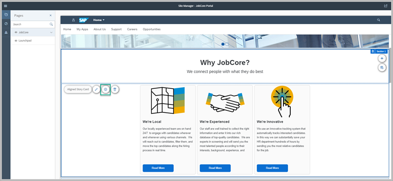

3. Change the dimensions as follows and then click **Save**.

    |  Dimension     | Value
    |  :------------- | :-------------
    |  Item Height           | 27 rem
    |  Item Width           | 18 rem
    |  Margins    | 4 rem
    |  Alignment          | Center

    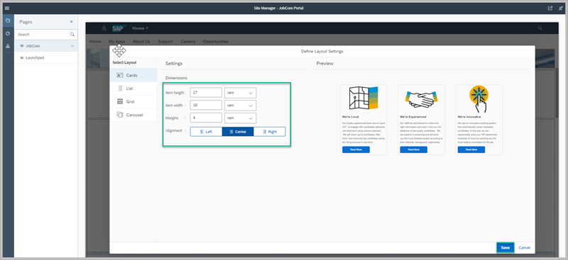

4. Click the **Centered Story Card** widget in **Section 2** and then click **Settings** (cog icon). Change the dimensions as follows and then click **Save**.

    |  Field Name     | Value
    |  :------------- | :-------------
    |  Item Height           | 30 rem
    |  Item Width           | 20 rem
    |  Margins    | 4 rem
    |  Alignment          | Center

5. Click the **Small Icons Link Card** in **Section 3** and then click **Settings** (cog icon). Change the dimensions as follows and then click **Save**.

    | Dimension     | Value
    |  :------------- | :-------------
    |  Item Height           | 20 rem
    |  Item Width           | 275 `px`
    |  Margins              | 0 rem
    |  Alignment          | Center

[DONE]
[ACCORDION-END]

[ACCORDION-BEGIN [Step 6: ](Review your site)]

Now that your page is ready, you may want to take a look at how your users will see the site so far. Click the **Go to site** icon at the top right of the screen.

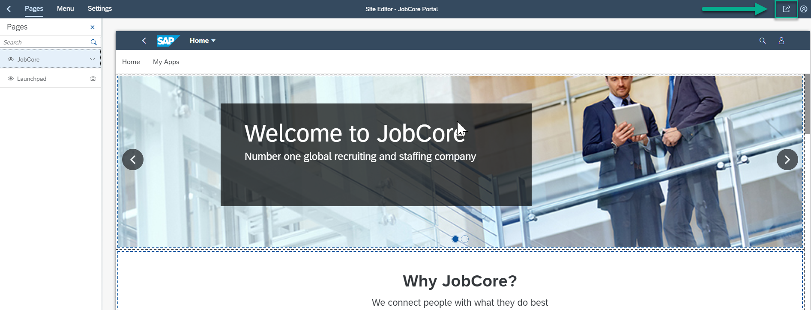

And this is what you'll see:

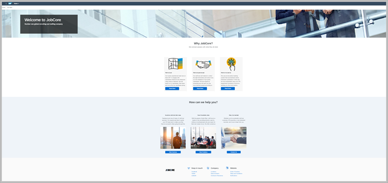

Congratulations!  You've created a very attractive `Home` page. In our next tutorial, we're going to add a URL app to our `Launchpad` page.   

[VALIDATE_7]

[ACCORDION-END]

---
