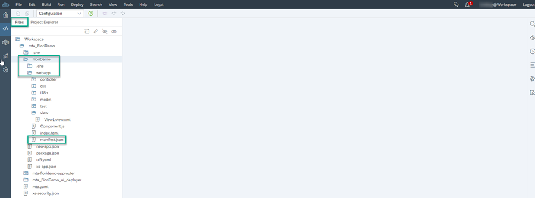
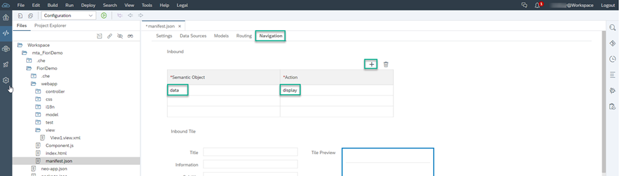
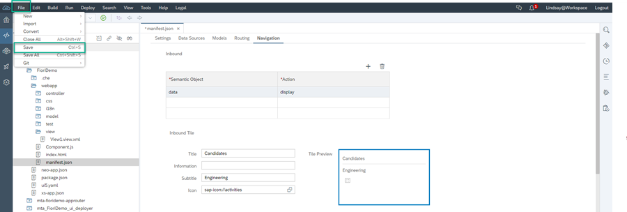

## Prerequisites
 If you are using your own account and not a trial account, then do the following:
    - Set up your Cloud Foundry environment for development by following the instructions in the tutorial: [Prepare the SAP Cloud Platform Cloud Foundry Environment for Developement (non-trial account)](https://developers.sap.com/tutorials/cp-portal-cloud-foundry-prepare-dev.html)
    - Since we'll be using SAP Web IDE for development in your production account, you should access SAP Web IDE on SAP Cloud Platform on the Neo environment.

## Details
### You will learn
  - How to create an SAPUI5 app module in SAP Web IDE
  - How to configure the navigation properties of this app so that it can be launched from the launchpad module that you will create later.

When developing apps in the Cloud Foundry environment, you create a Multi-Target Application (MTA) file in SAP Web IDE. Each SAP Fiori app is developed as an SAPUI5 module of the MTA.

In this tutorial, you will create an MTA with one SAPUI5 module as well as a launchpad module.

[ACCORDION-BEGIN [Step 1: ](Launch SAP Web IDE)]

Select SAP Web IDE from your trial environment.

[DONE]
[ACCORDION-END]

[ACCORDION-BEGIN [Step 2: ](Create an MTA project with an SAPUI5 module)]

To do this step, follow this [tutorial](cp-cf-fioriapps-create). You need to ONLY do steps 1-5 (inclusive).

[DONE]
[ACCORDION-END]

[ACCORDION-BEGIN [Step 3: ](Configure navigation for the UI module)]

You've created your MTA project with an SAPUI5 app module called `FioriDemo` in step 1 and now you'll configure its navigation target. These navigation settings will enable your `FioriDemo` app to be launched from the launchpad module that you'll create in the next tutorial.

Configure the navigation settings as follows:

1. In the **Development** area of SAP Web IDE, in the `Files` panel, expand the `FioriDemo` folder. Under the `webapp` folder, click the  `manifest.json` file and open it.

    

2. Switch to **Descriptor Editor** view and leave all the default values in the **Settings** tab as is.

    

3.  Click the **Navigation** tab to configure the target navigation settings.

4. Create the navigation intent by clicking **+**.  Then enter the following intent values:  

    -	**Semantic Object**: data

    -	**Action**: display

      

4. Click the intent and then enter the information for the **Inbound Tile** (that will be displayed on the launchpad module) as follows:

    -	**Title**: Candidates

    -	**Subtitle**: Engineering

    -	**Icon**: `sap-icon://activities`

      

5. Click **File > Save**.

    

Now you can add your app to a launchpad module. We will do this in the next tutorial.

[VALIDATE_6]
[ACCORDION-END]
