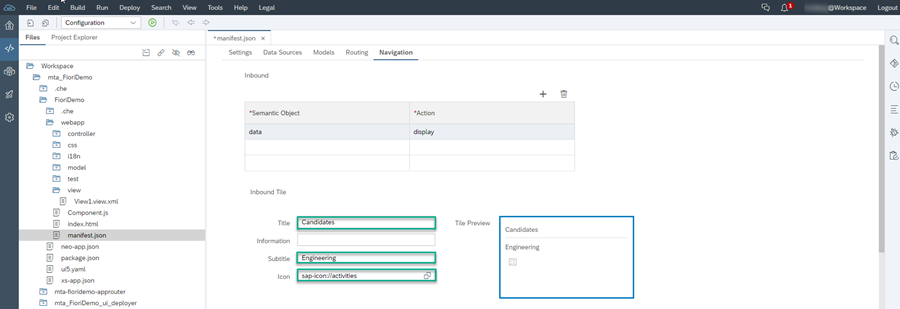

## Prerequisites
 - You have a development space set up in the Cloud Foundry environment so that you can make use of the services you need to develop your app module.

## Details
### You will learn
  - How to create an SAP HTML5 app module in SAP Web IDE
  - How to configure the navigation properties of this app so that it can be launched from the launchpad module that you will create later.

When developing apps in the Cloud Foundry environment, you create a Multi-Target Application (MTA) file in SAP Web IDE. Each SAP Fiori app is developed as an SAP HTML5 module of the MTA.

In this tutorial, you will create an MTA with one HTML5 module as well as a launchpad module.

>**IMPORTANT:**  To develop your own assets on SAP Cloud Platform on the Cloud Foundry environment, you must first configure it.

>   - A trial account is configured by default for development.

>   - If you are working on a non-trial account, and have not set up your Cloud Foundry environment for development, follow the instructions in the tutorial [Prepare the SAP Cloud Platform Cloud Foundry Environment for Development (non-trial account)](cp-portal-cloud-foundry-prepare-dev).

> In addition, we will be using SAP Web IDE for development. As the SAP Web IDE service is available on SAP Cloud Platform on the Neo environment, you should have an SAP Cloud Platform Neo subaccount with the SAP Web IDE service enabled. If you do not have such an environment, follow the tutorial [Get Started with the SAP Web IDE Full-Stack Version (Trial)](webide-innovation-beta).

[ACCORDION-BEGIN [Step 1: ](Create an MTA project with an SAP HTML5 module)]

To do this step, follow this [tutorial](cp-cf-fioriapps-create).

[DONE]
[ACCORDION-END]

[ACCORDION-BEGIN [Step 2: ](Configure navigation for the UI module)]

You've created your MTA project with an SAP HTML5 app module called `FioriDemo` in step 1 and now you'll configure its navigation target. These navigation settings will enable your `FioriDemo` app to be launched from the launchpad module that you'll create in the next tutorial.

Configure the navigation settings as follows:

1. In the **Development** area of SAP Web IDE, in the `Files` panel, expand the `FioriDemo` folder. Under the `webapp` folder, click the  `manifest.json` file and open it.

    

2. Leave all the default values in the **Settings** tab as is, and click the **Navigation** tab to configure the target navigation settings.

3. Create the navigation intent by clicking **+**.  Then enter the following intent values:  

    -	**Semantic Object**: data

    -	**Object**: display

      

4. Click the intent and then enter the information for the **Inbound Tile** (that will be displayed on the launchpad module) as follows:

    -	**Title**: Candidates

    -	**Subtitle**: Engineering

    -	**Icon**: sap-icon://activities

      

5. Click **File** -> **Save**.

    

Now you can add your app to a launchpad module. We will do this in the next tutorial.

[VALIDATE_6]
[ACCORDION-END]
