# Get Started with Creating a Custom Domain in SAP Build Work Zone, advanced edition
<!-- description --> Using the SAP Custom Domain service, administrators of SAP Build Work Zone, advanced edition can configure a custom domain for exposing a site instead of using the default domain. 

## You will learn
    - How to create and manage custom domains for SAP Build Work Zone, advanced edition
    - How to configure custom domains using SAP Cloud Identity Services - Identity Authentication
    - Where to find documentation in order to complete the configuration

## Overview
Instead of using the default domain that's assigned to your subaccount, you can purchase a custom domain with a unique name that's easily recognizable by your users, making them more secure about accessing your site. For example, if your default domain is `subaccount.workzone.cfapps.eu10.hana.ondemand.com`, you can purchase the domain `mycompany.com`, create a custom domain `prod.mycompany.com`, and securely expose your site under this custom domain. Using the same domain for a site as well as for all the embedded content including Identity Authentication, enables broader integration scenarios, by avoiding third-party cookies with the respective security drawbacks. Note, if you decide to use a custom domain, make sure that you update links and inform end users to update their bookmarks. If users want to still use the default `ondemand.com` domain, this is possible. 

## Illustration of the custom domain configuration process
To make sure that your domain is trusted by way of activated server certificates and that all application data is protected, you must set up secure TLS/SSL communication. Then make your application reachable via your custom domain and route traffic to it.

<!-- border -->

## Prerequisites
 - You've entitled the Custom Domain Manager to your subaccount. For more information, see [Manage Entitlements Using the Cockpit](https://developers.sap.com/tutorials/btp-cockpit-entitlements.html).
 - You have entitled the SAP Custom Domain service (plan: custom_domains) to your subaccount. Every server certificate requires 1 unit of quota.
 - You have subscribed to the Custom Domain Manager in the SAP BTP cockpit. For more information, see [Initial Setup](https://help.sap.com/docs/custom-domain/custom-domain-manager/initial-setup?version=Cloud).
 - You have acquired the domain names to be used by your applications. Have a look at the [Prerequisites](https://help.sap.com/docs/custom-domain/custom-domain-manager/prerequisites?version=Cloud). 
 - You have entitled the SAP Build Work Zone, advanced edition application to your subaccount. 
 - You have subscribed to the SAP Build Work Zone, advanced edition application by using the SAP BTP cockpit. 
 - You have a tenant of SAP Cloud Identity Services.
 - You have access to the Domain Name System (DNS) management dashboard.
 - If you're using tunnelled access to access on-premise apps, you have to configure clickjacking protection as follows:
        - SAP S/4HANA Cloud - [Protect Against Clickjacking](https://help.sap.com/docs/SAP_S4HANA_CLOUD/4fc8d03390c342da8a60f8ee387bca1a/3d1ea8b1a0e145bb851d36d0da376e17.html?version=2502.VAL).
        - SAP S/4HANA - [Using an Allowlist for Clickjacking Framing Protection](https://help.sap.com/docs/SAP_NETWEAVER_AS_ABAP_751_IP/864321b9b3dd487d94c70f6a007b0397/966b6233e5404ebe80513ae082131132.html?version=7.51.17).
        - SAP IBP - [Protect Against Clickjacking](https://help.sap.com/docs/SAP_INTEGRATED_BUSINESS_PLANNING/0292066056f642f1a0f6d9135e39abaf/3d1ea8b1a0e145bb851d36d0da376e17.html?version=2502).
        - SAP BTP ABAP environment - [Protect Against Clickjacking](https://help.sap.com/docs/btp/user-interface-configurations/protect-against-clickjacking?version=Cloud).

### Manage reserved and custom domains

> To make your applications reachable and secure under your own domain, use the **Custom Domain Manager** to create and manage your reserved and custom domains. The reserved domain should be your parent domain (for example, `prod.mycompany.com`). The custom domain is created based on your reserved domain (for example, `workzone.prod.mycompany.com`).
The best practice is to use 3 different subaccounts for **Dev**, **QA** and, **Prod**, so we recommend creating 3 reserved domains accordingly. Example: **dev.mycompany.com**, **qa.mycompany.com**, **prod.mycompany.com**.
Then perform the custom domain configuration steps such as creating custom domains, server certificate etc, for all 3 subaccounts.

1. Open the SAP BTP cockpit, and log on to the **Custom Domain Manager**.

2. Choose the **Domains** tile.

      <!-- border -->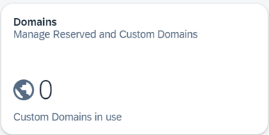

3. Click **Add**  to add a domain name that you want to reserve for this landscape and associated extension landscapes. For example: `mycompany.com`.

    <!-- border -->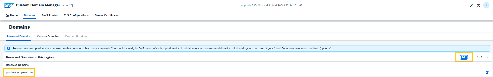

    Note that the domain name is now displayed in the list of **Reserved Domains**.

4. Switch to the **Custom Domains** tab and click **Create**, and select **for your Subaccount's SaaS Subscriptions**. 

    <!-- border -->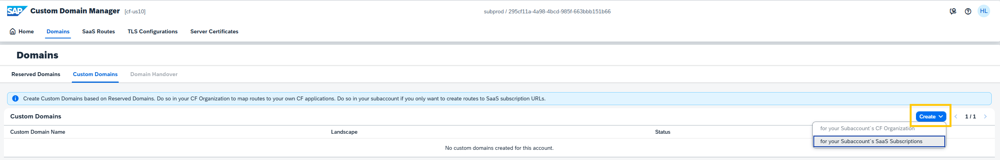 

5. A wizard opens displaying your subscribed applications, in their corresponding landscapes. Now do the following:

    - From the **Select Subscribed Application Name** step,  select `SAP Build Work Zone, advanced edition` as the SaaS application and click **Next Step**.

    <!-- border -->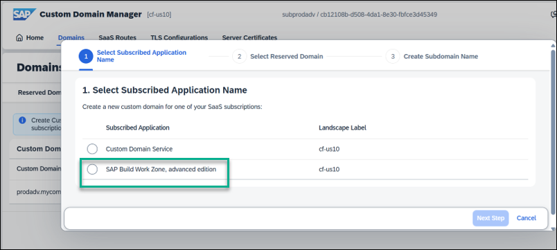 

    - From the **Select Reserved Domain** step, select the desired domain from the list of **Reserved Domains** which in our case is `prod.mycompany.com`. Now click **Next Step**.

    <!-- border -->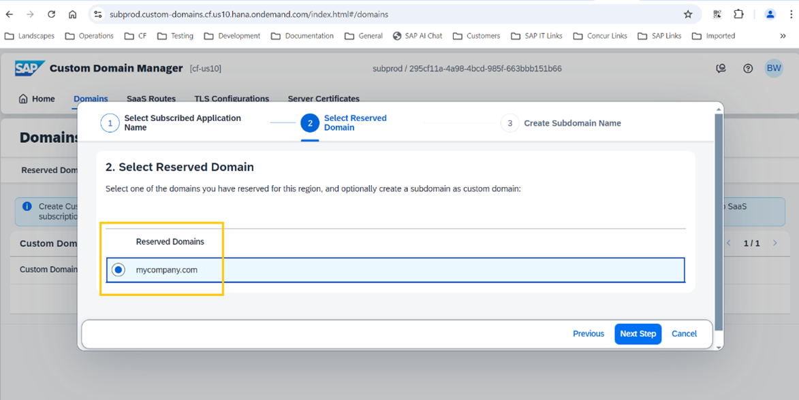  

    - From the **Create Subdomain Name** step, enter a single subdomain name, for example `prod` and click **Finish**. The result is a new custom domain. For example, `workzone.prod.mycompany.com`

    <!-- border --> 

6. Create a custom domain for every runtime destination. For example: `xyz200.prod.mycompany.com` (xyz200 in this example is the on-premise backend). The custom domain for the runtime destination must be part of this hierarchy, meaning it should be a **single** subdomain under the reserved domain, otherwise an error will occur. This is because SAP Build Work Zone code suppresses the subdomain (for example, `workzone.prod.mycompany.com`) used for the SAP Build Work Zone site when performing requests to on-premise backend applications.

    <!-- border -->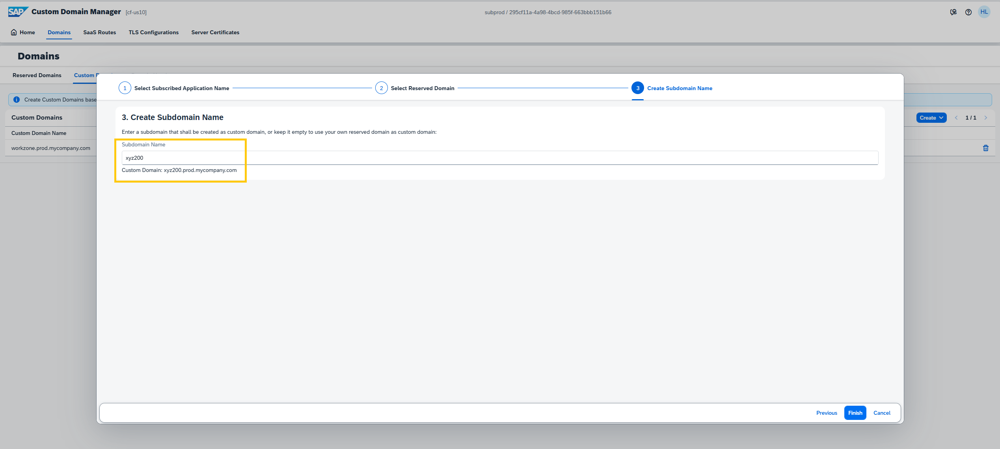 

    If you have content providers in multiple subaccounts (for example, dev/test/prod), make sure that every subaccount has its own custom domain for the SAP Build Work Zone subscription and destination. The destination content could be similar, but the destination’s name should be different.
    
    Here's an example:

    | :------------- | :------------- | :------------- | :-------------
    | **Runtime Destination Domain**     | **DNS CNAME** | **SaaS Route**        | **SAP Build Work Zone Domain**
    | xyz200.prod.mycompany.com       | CNAME api.cf.eu10.hana.ondemand.com. | portal-prod-sapdelim-xyz200.workzone.cfapps.eu10.hana.ondemand.com | workzone.prod.mycompany.com
    | xyz300.qa.mycompany.com    |  CNAME api.cf.eu10.hana.ondemand.com. | portal-qa-sapdelim-xyz300.workzone.cfapps.eu10.hana.ondemand.com  | workzone.qa.mycompany.com.
    | xyz400.dev.mycompany.com     |  CNAME api.cf.eu10.hana.ondemand.com. | portal-dev-sapdelim-xyz400.workzone.cfapps.eu10.hana.ondemand.com  | workzone.dev.mycompany.com.

7. From the Cloud Identity Services dashboard go to the **Applications & Resources** tab, and create a custom domain for your SAP Cloud Identity Services tenant. For example, `ias.prod.mycompany.com`.

The custom domains are created and displayed in a list, along with their corresponding landscape and status.

### Use custom domain in Identity Authentication

The purpose of this step is to configure a custom domain for your Cloud Identity Service tenant. Use the custom domain that you've created in step 1 above.  
 You will use it later when establishing trust to your SAP BTP subaccount and in the Domain Name System (DNS) setup. 

For more information, see [Use Custom Domain in Identity Authentication](https://help.sap.com/docs/cloud-identity-services/cloud-identity-services/use-custom-domain-in-identity-authentication)

### Establish trust between your SAP BTP subaccount and SAP Cloud Identity Services

In this step you'll create a trust between your SAP BTP subaccount and your Cloud Identity Services tenant. This trust is required for user authentication. After completion, your SAP BTP subaccount will appear as an application in the administration console of Cloud Identity Services.

For more information, see [Establish Trust and Federation Between SAP Authorization and Trust Management Service and SAP Cloud Identity Services](https://help.sap.com/docs/btp/sap-business-technology-platform/establish-trust-and-federation-between-uaa-and-identity-authentication)

### Manage Transport Layer Security (TLS) configurations

This step is done in the Custom Domain Manager. You'll create new TLS configurations that can be used for one or mulitple server certificate activations.

1. Choose the **TLS Configurations** tile.

    <!-- border -->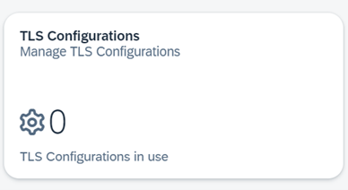

2. Click **Create** to open a wizard to create each required configuration.

    <!-- border -->

3. Enter a configuration name, for example `myTLS` and click **Next Step**.

    <!-- border -->

4. From the **Client Authentication (mLTS)** step, you'll see that the client authentication is displayed as disabled by default. Therefore a user name and password are required for authentication. Click **Next Step**.

    <!-- border -->

5. The **Summary** information displays the entered configuration name and the status of the mTLS mode again. Click **Finish** to exit the wizard and manage the created configuration.

    <!-- border -->

For more information, see the **Custom Domain Manager** documentation: [Manage TLS Configurations](https://help.sap.com/docs/custom-domain/custom-domain-manager/manage-tls-configurations).

### Manage server certificates

This step is done in the Custom Domain Manager. You'll create a new server certificate for custom domains associated with the SAP Build Work Zone, advanced edition application and runtime destinations. You will also create a certificate for your custom domains from a trusted certificate authority (CA).

1. Choose the **Server Certificates** tile.

     <!-- border -->

2. Choose **Create** and select **for your (wildcard) Custom Domains**.

    <!-- border -->

    > A wildcard certificate secures multiple applications of a domain. So a domain called `prod.mycompany.com` covers any application under the domain `prod.mycompany.com`, for example `workzone.prod.mycompany.com`, but not the domain `prod.mycompany.com` itself. 
     This also works with subdomains, so the subdomain `*workzone.prod.mycompany.com` covers any application under the subdomain `workzone.prod.mycompany.com`, for example, `myapp.workzone.prod.mycompany.com`, but not the subdomain `workzone.prod.mycompany.com` itself.

3. The wizard opens with the **General Information** step in focus. Now do the following:

    - Enter the desired alias, keep the key size with the default value, and then click **Next Step**.

        <!-- border -->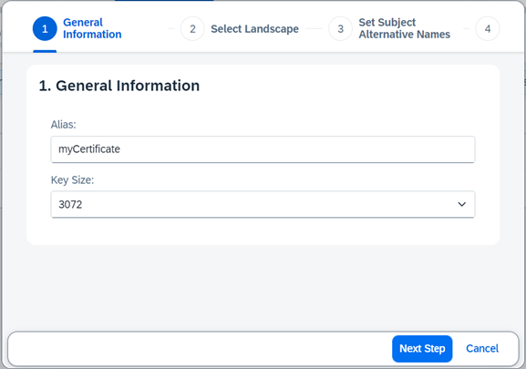

    - In the **Select Landscape** step, keep the landscape with the default value, which should be the main landscape (e.g. `cf-eu10`). Then click **Next Step**.

        <!-- border -->

    - In the **Set Subject Alternative Names** step, select the domains which you want to assign to the server certificate.

        <!-- border -->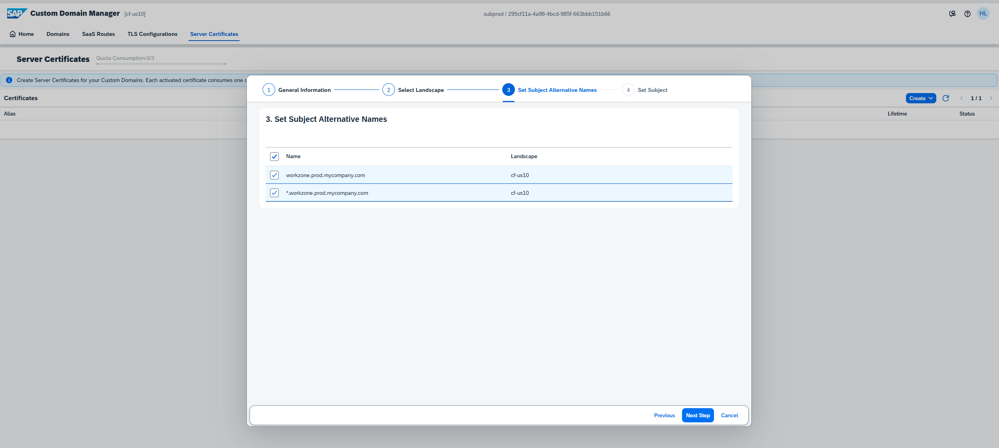

    - In the **Set Subject** step, keep the **CommonName (CN)** parameter with the default value, then click **Finish**. 

        > Note that the `CommonName` can't be longer than 64 characters.

        <!-- border -->

4. Select the server certificate that you created to expand the details section. To order and install your new server certificate, you must first create the certificate signing request and then send this file to a trusted certificate authority of your choice to get it signed.

    <!-- border -->

5. Click **Get Certificate Signing Request** to copy the content and create the `.pem` file. You can also paste the content into a web page of your CA, if available.

6. On receiving the new server certificate and full certificate chain (including the root CA), choose **Upload Full Certificate Chain** to upload them.

    - In the **Add Certificate** section, insert the certificate chain into the text field and click **Next Step**.
    - Check the certificate and choose **Next Step**.
    - Confirm that the certificate is correct and click **Finish**.

7. In this final step, you must activate your new server certificate. 

    > This activation has to be done for one or more of the certificate’s SANs and the TLS configuration of your choice that you configured in the **Manage TLS configurations** section. The activation can be modified or removed at any time and will take a few minutes until it's effective in the landscape load balancer.

    - In the **Details** pane, click **Activate**.
    - Select the SANs you want to activate, and click **Next**.
    - Confirm the TLS configuration and click **Next**.
    - Review the summary and choose **Finish**.

The list of server certificates created are displayed and as long as they are active, they can't be deleted. Inactive certificates can be deleted by using the **Delete** button.

### Manage SaaS routes

This step is also done in the Custom Domain Manager. You'll select your existing SaaS subscriptions and create custom routes for them - in addition to their standard routes.

Before you do this step, make sure that you've written down the default URL of the SAP Build Work Zone, advanced edition application and make sure that you've already set up the TLS server authentication. 

Now you can map the application to your custom domain as follows:

1. Choose the **SaaS Routes** tile.

     <!-- border -->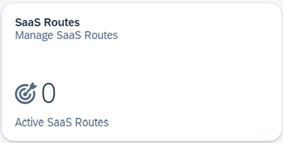

2. Click **Create** to open a wizard where you will map a route to your application.

    <!-- border -->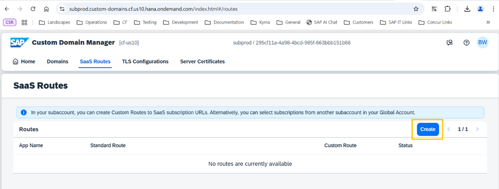

3. In the **Select Tenant** step, leave as is and click **Next Step**.

    <!-- border -->

4. In the **Select Saas Subscription** step, select the **SAP Build Work Zone, advanced edition** subscription and click **Next Step**.

    <!-- border -->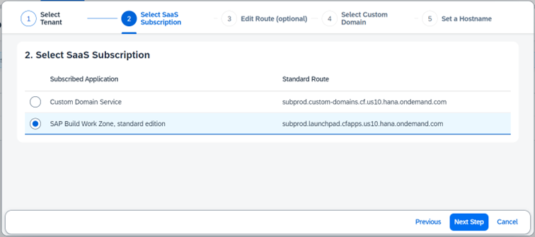

5. In the **Edit Route** step, don't change the standard route and click **Next Step**.

    > Note: even if your subaccount is in an extension landscape, such as `EU10-004`, you should use the main landscape URL, which is part of the subscription to SAP Build Work Zone, advanced edition.

    <!-- border -->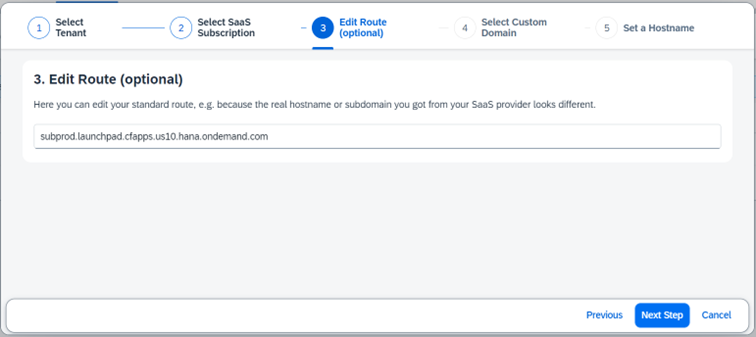

6. In the **Select Custom Domain** step, select the desired custom domain from the list and click **Next Step**. In this example, select `prod.mycompany.com`.

    <!-- border -->

7. In the **Select a Hostname** step, click **Finish**. There's no need to add a hostname.

    The route mapping is created and is displayed as a list.

    If you're using tunnelled access to access on-premise apps, repeat the above steps for every runtime destination, but in the **Edit Route** step of the Manage SaaS Route procedure (step # 5), use the following format:

    - For the `ondemand.com` domain: `[subdomain of the subaccount]-sapdelim-[Runtime destination name].[service name (workzone or workzonehr)].cfapps.[data center].hana.ondemand.com`

    - For the `workzone.cloud.sap` domain - this is not supported yet but is part of our roadmap: `[subdomain of the subaccount]-sapdelim-[Runtime destination name].[data center].workzone.cloud.sap`
    

Example of a runtime destination mapping:

| :------------- | :-------------
| App Name            | `SAP Build Work Zone, advanced edition`
| Custom route        | `xyz200.prod.mycompany.com`
| Standard route      | `subprod-sapdelim-xyz200.workzone.cfapps.us10.hana.ondemand.com` 

### Create a CNAME record

In this step, you'll create a `CNAME` record in the Domain Name Service (DNS) so that the custom domain points to the SAP BTP data center.

Example: 

:------------- | :-------------
| name        | `workzone.prod.mycompany.com`
| type        | `CNAME`
| data        | `api.cf.eu10.hana.ondemand.com`
| TTL          | `14400`

You must also configure the Domain Name System (DNS) in order to route traffic to an application on your custom domain. For each custom domain that you use, you must create a CNAME mapping from the custom domain to its Cloud Foundry domain. For example, you must create a separate `CNAME` mapping for your runtime destination custom domain in case you're using tunnelled access to access your on-premise apps.

Example:

:------------- | :-------------
| name        | `<runtime destination>.prod.mycompany.com `
| type        | `CNAME`
| data        | `api.cf.eu10.hana.ondemand.com`
| TTL          | `14400`

For more information, see [Configure the DNS for a Custom Domain](https://help.sap.com/docs/custom-domain/custom-domain-manager/configure-dns-for-custom-domain).

> If your Cloud Foundry environment, API endpoint is on an extension landscape such as `eu10-004`, you need to map your DNS to the main landscape (e.g. `eu10`). This is because the SAP BTP service that your subaccount is subscribed to, is located in the main landscape. For more information, see [Custom Domains in Extension Landscapes](https://help.sap.com/docs/custom-domain/custom-domain-manager/custom-domains-in-extension-landscapes).

### Configure the redirect URL

In this step, (which is only relevant for subscriptions that were created prior to Sep 4th 2025), you'll configure an OpenID Connect application in the administration console of SAP Cloud Identity Services for the authorization code flow.

1. Sign in to the administration console for SAP Cloud Identity Services.

2. From the **Applications and Resources** tab, choose the **Applications** tile.

    <!-- border -->

3. Choose the SAP Build Work Zone, advanced edition <`your subaccount name`> application.

    > Note: Type the subaccount GUID in the search field to filter the list items. One of the applications, named `SAP BTP Subaccount <your subaccount name>` will refer to the trust between your SAP BTP subaccount and the SAP Cloud Identity Service tenant. The redirect URI for this trust, which is created automatically, will be for example: https://mysubaccount.authentication.eu10.hana.ondemand.com/login/callback/sap.custom.
      The second application, named `SAP Build Work Zone, advanced edition <your subaccount name>`, will refer to the trust between your Cloud Identity Service tenant and the SAP Build Work Zone, advanced edition subscription. You need to add your custom domain to the redirect URI of this trust.

4. Click the **Trust** tab.

5. Under **Single Sign-On**, choose **OpenID Connect Configuration**.

6. Manually enter the communication settings negotiated between Identity Authentication and the client as follows:

    - Name (mandatory)              Provide a name of your choice.
    - Redirect URIs (mandatory)     The redirection URIs to which the response can be sent. You can add up to 20 redirect URIs. Example: `https://workzone.prod.mycompany.com/**` or `https://*prod.mycompany.com/**` 
        

    The above URI covers both login and logout flows, so there's no need to add also a URI to the Front-Channel Logout URIs.

    <!-- border -->

7. **Save** your selection. Once the application has been changed, the system displays a message that the application <name of application> is updated.

### Select the domain for your subaccount

In this step, you'll select the custom domain for your subaccount in order to support SAP Mobile Start application navigation. 

1. Go to your subaccount in the SAP BTP cockpit.

2. Click on the **SAP Build Work Zone, advanced edition** link.

3. Access the **Subaccount Settings** from the side navigation panel and open the **Custom Domain** tab.

4. Select the preferred custom domain for your subaccount from the list of available domains configured in the Custom Domain Service.

For more information, see [Subaccount settings](https://help.sap.com/docs/build-work-zone-advanced-edition/sap-build-work-zone-advanced-edition/subaccount-settings).

### Create a custom domain for Digital Workplace Service (DWS)

When you create a custom domain in SAP Build Work Zone, advanced edition, you need to create two custom domains - one for SAP Build Work Zone, advanced edition which you created in Step 1 and another one for the Digital Workplace Service (DWS) component. This custom domain must use the same top-level domain as the custom URL used for SAP Build Work Zone, advanced edition.  Example of these two custom domains: 

 - Custom URL for SAP Build Work Zone, advanced edition: `https://prod.mycompany.com`

 - Custom URL for Digital Workplace Service (DWS): `https://prod.dws.mycompany.com`
 
 This second domain should not be created using the SAP Custom Domain Manager, but externally using a domain provider. In addition, you'll need an SSL certificate and private key for this domain.

 **For Existing Customers**:

After obtaining the custom domain, you must re-run the onboarding Configurator and use your custom domain instead of the default domain. Using a non-custom domain such as `ondemand.com` is not supported once you've already configured a custom domain.

1. Before running the Configurator, make sure you have the OAuth client details ready. You will have to enter them in the Configurator. In the **Administration Console**, go to **External Integrations** -->  **OAuth Clients**, and copy the details of the OAuth client that was created when you ran the Configurator for the first time. 

    <!-- border -->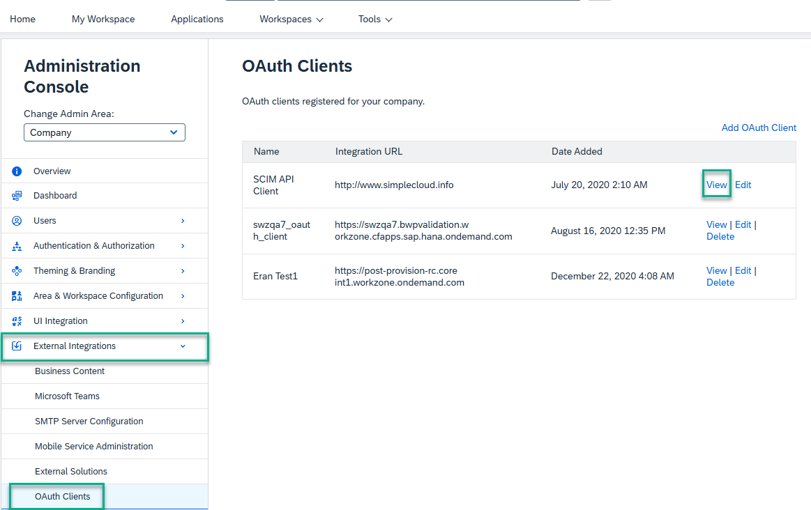

    > If your tenant was upgraded from SAP Jam, use the OAuth Client that was created in SAP Jam.
  For new tenants, use the OAuth Client that was created for SAP Build Work Zone, advanced edition once you've run the Configurator. 
  Don't use the OAuth Client that was created for SCIM API provisioning - Workzone API Client.

2. Reset the Configurator to make sure that all previously entered data has been removed. To do this, follow these steps:

    - Access the Site Manager by either using this URL: `<design time URL of default domain>/sites#Workzone-Config` or go to the **Administration Console** --> **External Integrations** --> **Businesss Content**. Click the **Content Manager** button and then click the **Configurator** icon in the left navigation panel.

    - You are now in the Configurator wizard. The screen you need is not within the Configurator wizard. So you need to exit the wizard by using the back icon (<).

        <!-- border -->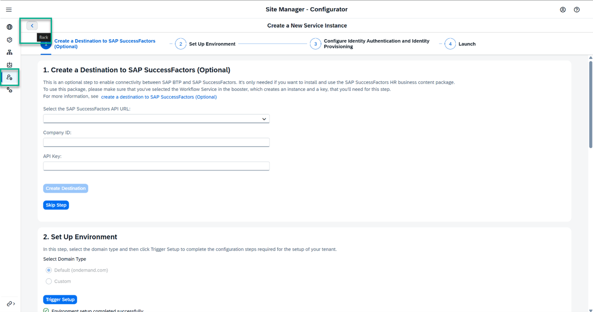 

    - Go back until you get to the screen where you can select the configuration option.  

        <!-- border -->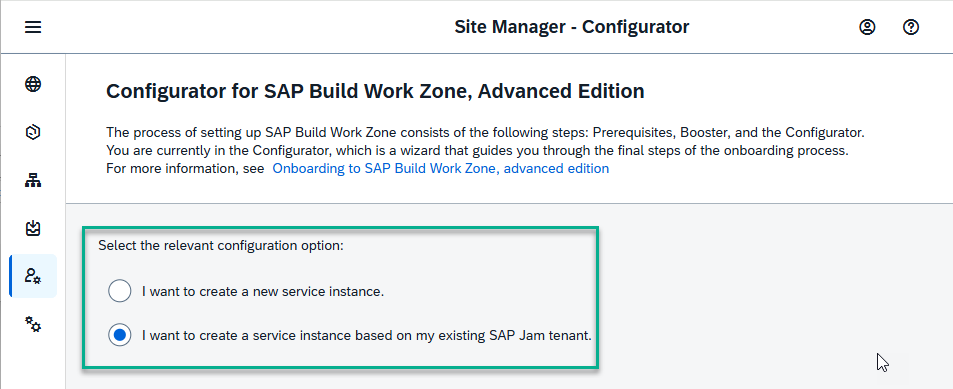 

    - Select the respective other option from what you selected in the first run of the Configurator. If you previously selected a new service instance, you should now select a service instance based on an SAP Jam tenant, and vice versa.

    - Click **Next**. In the warning message that appears, confirm the loss of input data. This step takes you to step 1 in the Configurator.

        <!-- border -->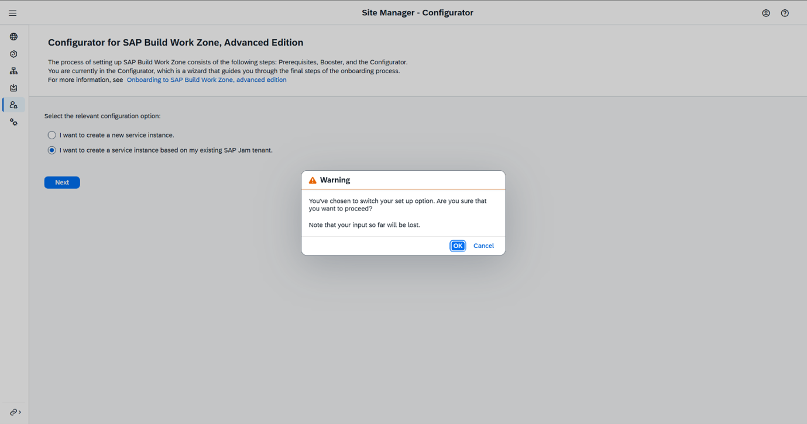

    - Navigate back again to the screen with the options and this time, select the previous option that you originally selected. 

        <!-- border -->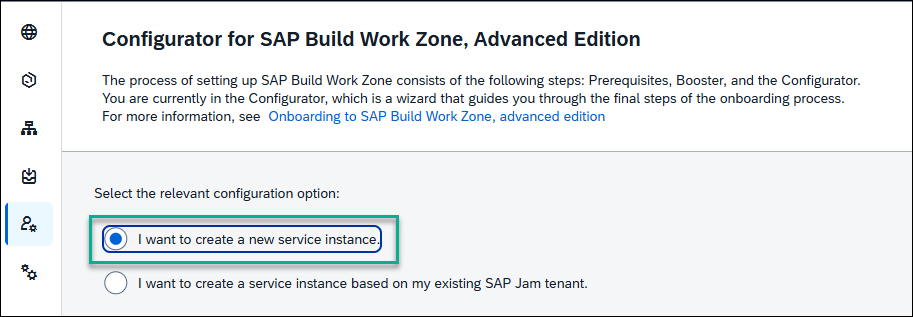

    - Confirm loss of data again and re-run the Configurator with the new input.

**For New Customers**

1. Get a Key and a Certificate request by running this command using OpenSSL: `openssl req -new -newkey rsa:2048 -nodes -out CertRequest.csr -keyout CertKey.key -subj "/C=DE/L=Walldorf /O=SAP/OU=BTP/CN= prod-dws.mycompany.com.sap"`

2.	Send the `CertRequest.csr` to a trusted certificate authority of your choice to get it signed.

3. Once the certificate is signed by a CA, make sure you have a `.crt` file that includes these 3 certificates in the following order: 
    - Certificate
    - Intermediate certificate
    - Root certificate

4. Configure a CNAME record in the DNS system for the DWS custom domain. 
The custom domain must resolve to `custom` followed by the generic data center domain for the underlying DWS server. Meaning, if the DWS URL is `wzprod.eu10-1.dws.workzone.ondemand.com`, and the desired custom domain is `prod-dws.mycompany.com`, then `prod-dws.mycompany.com` must have a CNAME record (otherwise known as a DNS alias) referring to `custom-eu10-1.dws.workzone.ondemand.com`. 

5. Open the SAP Build Work Zone, advanced edition Configurator. In the "Create a Destination to SAP SuccessFactors (Optional)" step that opens, click **Skip Step**, unless you are using SAP SuccessFactors. 

     <!-- border -->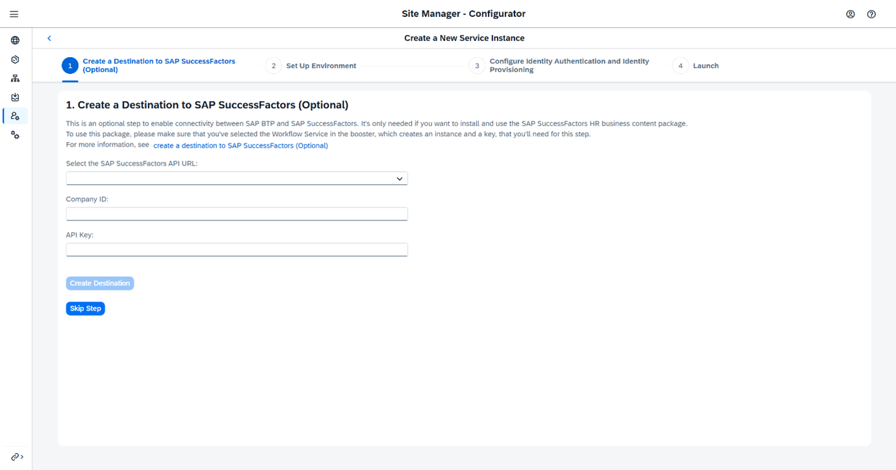

6. In the **Set Up Environment** step, select `Custom`.

7. In the **DWS Custom Domain** field insert your domain, for example `prod-dws.mycompany.com`. 

8. In the **Certificate** field, upload the signed certificate file from step 3 above.
    
9. In the **Private Key** field, upload the key from step 3 above.   

    <!-- border -->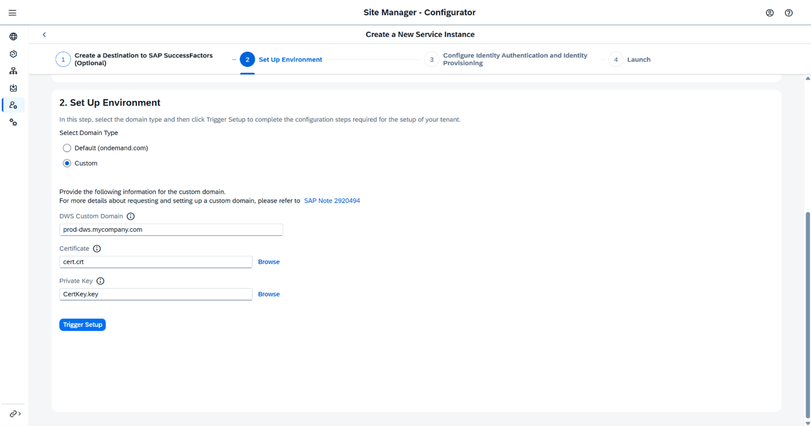

10. Click the **Trigger Setup** button.

And you're done! 
    
   
 