## Details
### You will learn
  - How to enable the SAP Fiori Launchpad Site extension, allowing you to add a launchpad module to your MTA project
  - How to add the launchpad module to your MTA project
  - How to configure the launchpad module
  - How to add your SAP Fiori app to the launchpad and make it available to add to a Portal site

In this tutorial, you're going to configure a launchpad module and add it to your MTA project. You will then build and deploy your project, which now includes the launchpad module together with your SAP HTML5 module, into your Cloud Foundry space.

---

[ACCORDION-BEGIN [Step 1: ](Add the launchpad module to your multi-target application project)]

1. Navigate to the **Development** area in SAP Web IDE and right-click your `mta_FioriDemo` project to add a new **SAP Fiori Launchpad Site Module**.

    > Note that you can only add this launchpad module to `MTA` projects.

      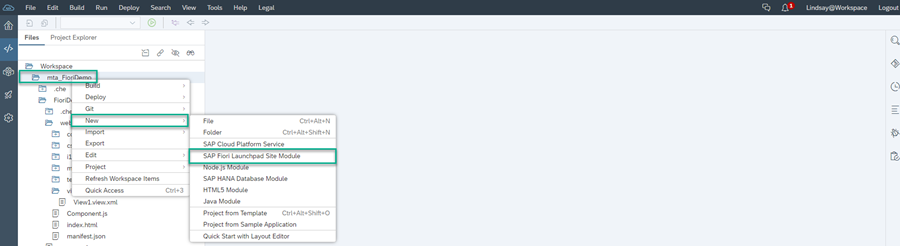

2. Name the module `Launchpad` and click **Finish**.

      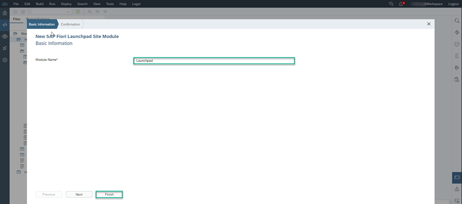

You can see that the `Launchpad` module is now part of your `MTA` project:

  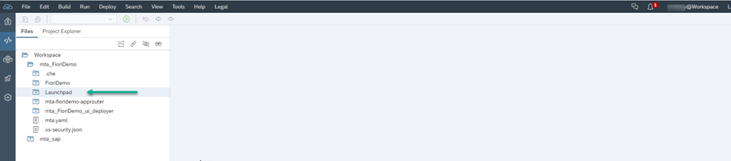

[DONE]
[ACCORDION-END]

[ACCORDION-BEGIN [Step 2: ](Configure the launchpad content)]

Any app that you want to expose to the Portal service, should be added to the launchpad module. To add apps to the launchpad module, you should edit its `CommonDataModel.json` file.

In this step you are going to do just that.

>In this tutorial, we will use the default group name. You can use the **Add Group** button to add new groups to your launchpad.

1. Expand the launchpad module folder and select the `CommonDataModel.json` file.

    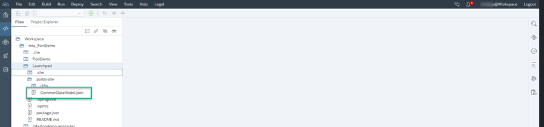

2. Make sure you're in **Launchpad Editor** view and then rename the default group tile to `People` by clicking on the **Edit title** icon next to it.

    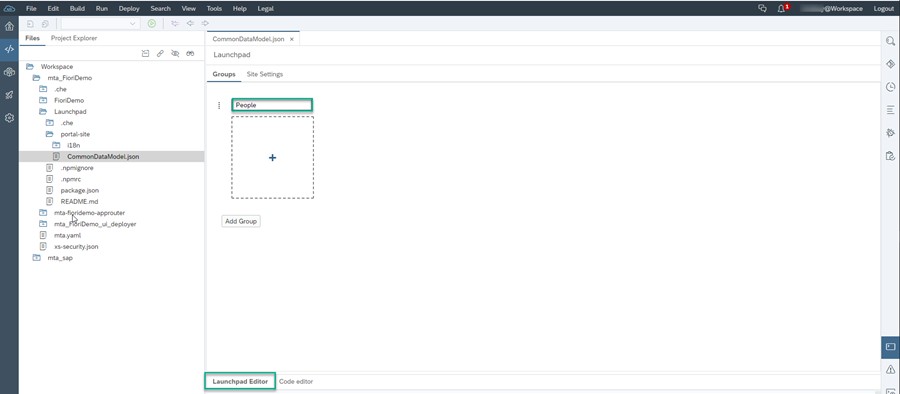

3. Now assign your SAP HTML5 module to the group. Click the **+** inside the `People` group.

    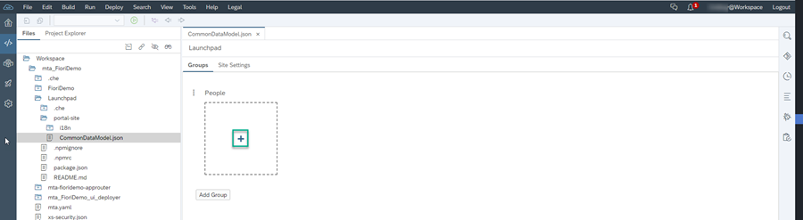

4. In the **Select Project Apps** screen, check the **App Title** called `Candidates` and click **Select**. You have now assigned the `Candidates` app to the `People` group.

    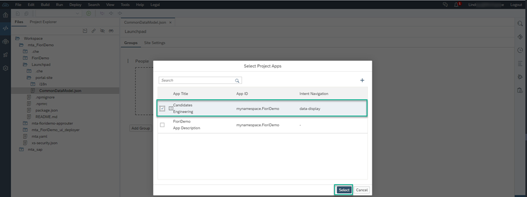

5. Click **File > Save**.

    This is what you'll see in the **Launchpad Editor**:

    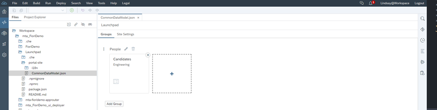

[VALIDATE_7]

[ACCORDION-END]

[ACCORDION-BEGIN [Step 3: ](Build and deploy your project)]

Build and deploy the `MTA` project with these modules thus exposing your app to the Portal service.

1. Right click on your `mta_FioriDemo` project and click **Build** and then **Build with Cloud MTA Build Tool**.

    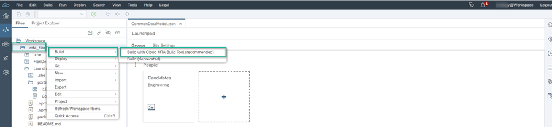

    An `mta_FioriDemo_0.0.1.mtar` file is generated. The file is located under the `mta_archives` folder in your Workspace.

      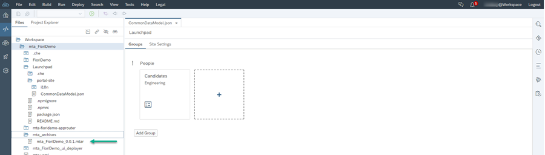

  2. Right click your `mta_FioriDemo_0.0.1.mtar` file and click **Deploy to SAP Cloud Platform**.

      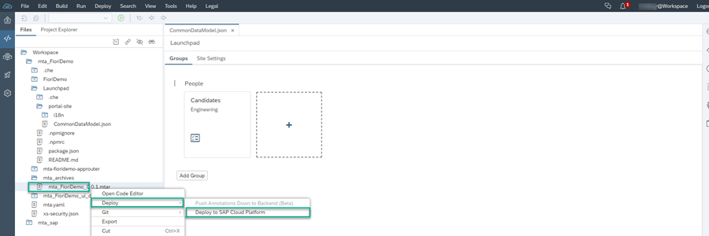

  3. The values for the **Endpoint**, **Organization**, and **Space** are automatically populated.  Click **Deploy**.

  4. Once you get a confirmation message that your project has been deployed, copy the App Router URL from the console.  

      It looks like this:
      `<id>trial-trial-dev-mta-fioridemo-approuter.cfapps.eu10.hana.ondemand.com`
      where `<id>` is your ID number.

[DONE]
[ACCORDION-END]

[ACCORDION-BEGIN [Step 4: ](Access the runtime launchpad module)]

Now let's see how the app is displayed in the runtime launchpad module.

1.  Enter the URL that you copied from the console to a new browser tab.

    Your launchpad module displays the `Candidates` app that you created in the `People` group.

    

2.  Click the `Candidates` app to launch it.

    

Now you are ready to add your app to the **Launchpad** page in your Portal site.

[DONE]
[ACCORDION-END]
