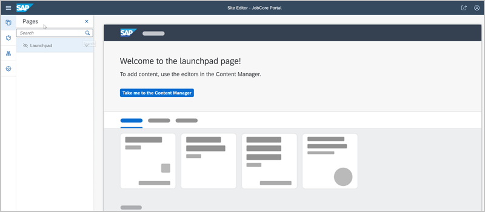
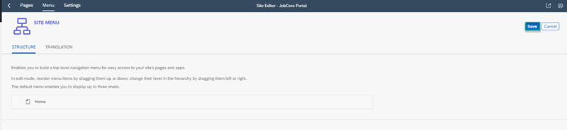

## Prerequisites
You have subscribed to the Portal service.

### You will learn
  - How to create a Portal site
  - How to add a page to your site and make it the home page
  - How to create a site menu

In this group of tutorials our goal is to create an attractive Portal site for a recruiting company we'll call `JobCore Recruiting`. The site will include apps and web content as well as two pages: a launchpad page and another page. Both pages will be displayed in the site menu.

Let's get started!

[ACCORDION-BEGIN [Step 1: ](Create a site)]

When you access the Portal service, the Site Directory is in focus. From here you will create your new Portal site.

1. In the Site Directory, click **Create New Site**.

    

2. Enter `JobCore Portal` as the site name and click **Create**.

    The Site Editor opens in a new tab.

    >When you create a new site, by default, there is already a **Launchpad** page available for you. You can see the default **Launchpad** page in focus.

    

Once you've created your site, you can go back to the Site Directory to see that your new site is now represented by a tile. In future, each time you want to edit your site, you can click the pencil icon from this tile. You can also delete the site from here and you can also preview it to see how it looks at runtime.

[VALIDATE_6]

[ACCORDION-END]

[ACCORDION-BEGIN [Step 2: ](Add a page to the site)]

1. Click **+** at the bottom of the  **Pages** panel of the Site Manager.

    

2. Select the **Anchor Navigation** page template.

3. Enter `JobCore` as the **Page Name**.

4. Click **Add**.

    

Now we have a page called `JobCore` and we have the default `Launchpad` page. Let's add them both to the site menu.   

[DONE]

[ACCORDION-END]

[ACCORDION-BEGIN [Step 3: ](Design the site menu)]

1. Click the **Menu** icon in the side panel.

    

2. The **Menu Editor** opens. Click  **Click here to add an item** to open the **Add Menu Item** screen.

    

3. Set the following values:

    |  Field Name     | Value
    |  :------------- | :-------------
    |  **Display Name**           | **`Home`**
    |  **Item Type**           | **`Page`**
    |  **Select Page**    | **`JobCore`**

4. Click **Add**.  This takes you back to the **Menu Editor**. You will see that the page you called `Home` has been added to the site's menu.

    

5. Click **Save**.

    

6. Now add the `Launchpad` page to the site menu. Hover over the `Home` menu item.

    

7. Click the + icon on the right and then click **Add Item** to open the **Add Menu Item** screen.

    

8. Enter the following values:

    |  Field Name     | Value
    |  :------------- | :-------------
    |  **Display Name**           | **`My Apps`**
    |  **Item Type**           | **`Page`**
    |  **Select Page**    | **`Launchpad`**

9. Click **Add**.

    

8. Click **Save** in the editor.

    

>Note that both the `Launchpad` and `Home` pages appear in the site menu.

[VALIDATE_7]

[ACCORDION-END]

[ACCORDION-BEGIN [Step 4: ](Set the site's home page)]

1. Click the **Pages** icon to go back to the **Pages** panel.

    

2. Click the downward facing arrow next to the `JobCore` page, and then click **Set as home page**.

    

    Now you have a Portal site called the `JobCore Portal` with 2 pages. Both pages are part of the site menu and the `JobCore` page (your `Home` page) is set as the first page that opens when a user logs on to your site.

    In the next tutorial you're going to add web content to the `Home` page.

[DONE]
[ACCORDION-END]
