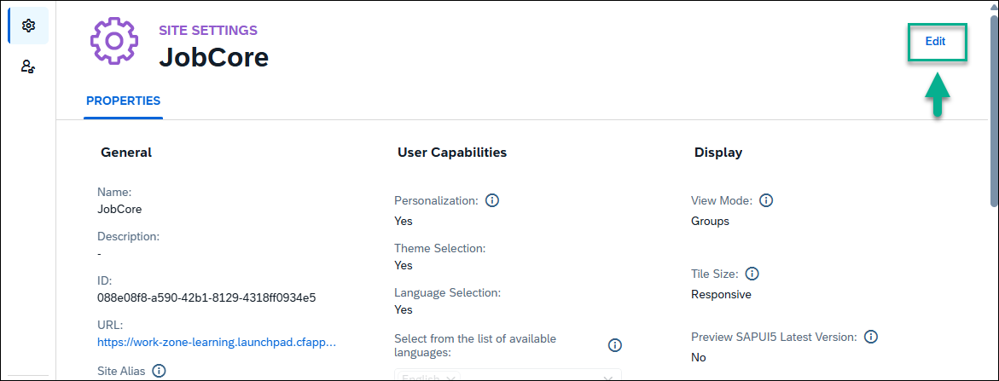
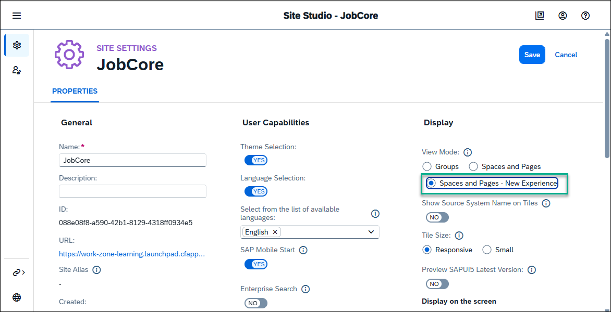
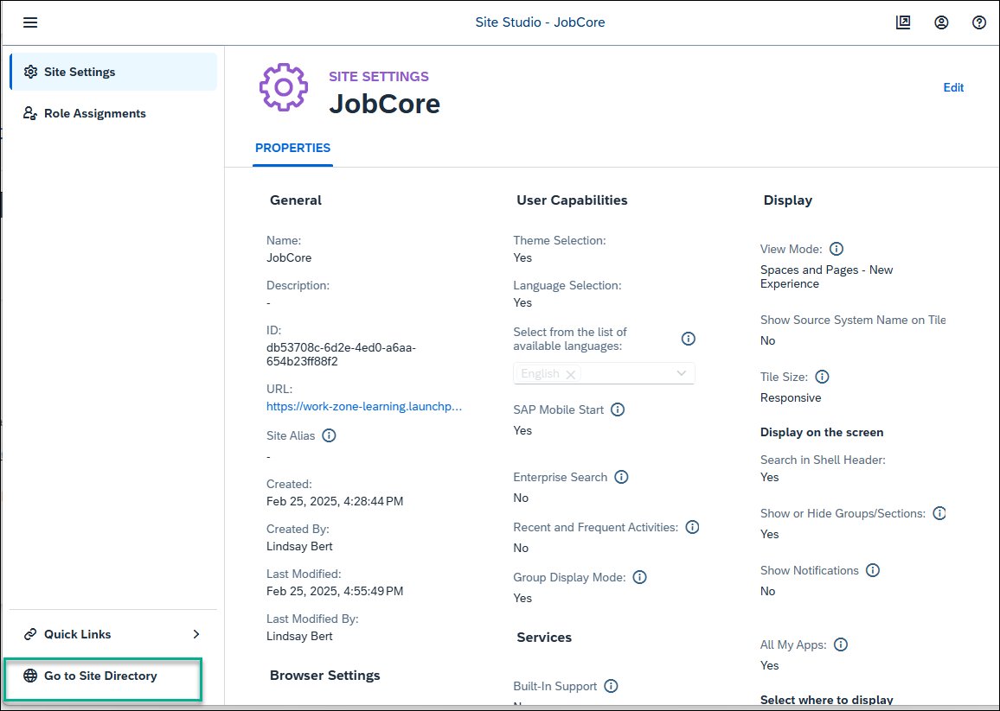

# Create a Site Using SAP Build Work Zone, standard edition
<!-- description --> Create a site to which you can later add business apps.

## Prerequisites
 - You have subscribed to SAP Build Work Zone, standard edition and assigned yourself to the `Launchpad_Admin` role
 

## You will learn
  - How to create a site using SAP Build Work Zone, standard edition

## Intro
In this tutorial we'll create a site for a company called `JobCore`. We'll then add business apps to this site.

### Create a site

When you access the SAP Build Work Zone, standard edition, the Site Directory is in focus. From here you'll create your new site.

> In the side panel, you'll see four tools. The **Site Directory** where you're going to create a new site. All sites that you create will be displayed here. The **Content Manager** where you'll manage cross-site content such as business apps. The **Channel Manager** where you manage different channels that expose business content that you can integrate into your sites. The fourth icon opens **Settings** where you can configure various settings related to your subaccount.

1. Click **Create Site**.

    

2. Enter `JobCore` as the site name and click **Create**.

    

You've just created a site called `JobCore`.

### Select the Spaces and Pages - New Experience view mode

When you create a site, you are directed to the **Site Settings** screen. In this screen, you'll select the new experience view mode. This is also where you will assign roles to your site.

> By enabling **Spaces and Pages – New Experience** view mode, you'll be able to create spaces and pages locally in dedicated editors. You will be able to design your pages by adding sections with UI integration cards and app tiles. If you integrate spaces and pages from remote content providers, they will be displayed side by side with spaces you create.   

  1. Click **Edit** in the top right corner of the screen.

      

  2. Under **Display**, select **Spaces and Pages - New Experience**.

      

  3. Click **Save**.

### Navigate back to the Site Directory to view the site tile.

  

  Your site is empty for now. In the next tutorials, you're going to add business apps to your site.
