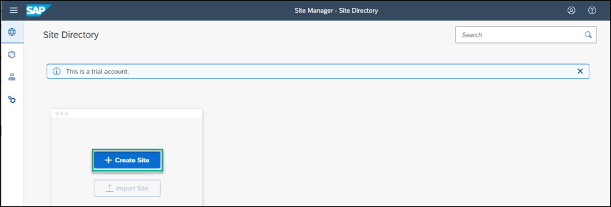

## Prerequisites
You have subscribed to the Portal service.

### You will learn
  - How to create a Portal site

In this group of tutorials our goal is to create a Portal site for a recruiting company called `JobCore Recruiting`. We will then add business apps to this site.

Let's get started!

[ACCORDION-BEGIN [Step 1: ](Create a site)]

When you access the Portal service, the Site Directory is in focus. From here you will create your new Portal site.

> Note: in the side panel you'll see three icons. The first opens the Site Directory where you are going to create a new site. All sites that you create will be displayed here. The second icon opens the Content Manager where you manage the business content items for your subaccount: apps, catalogs, groups, and roles. The third icon opens the Provider Manager where you can view the list of content providers to which you are subscribed. These content providers expose business content that you can integrate into your Portal site.

1. In the Site Directory, click **Create New Site**.

    

2. Enter `JobCore Portal` as the site name and click **Create**.

    

You have created a Portal site called `JobCore Portal`.

[VALIDATE_7]

[ACCORDION-END]

[ACCORDION-BEGIN [Step 2: ](Navigate to the Site Directory)]

When you create a site, you are directed to the Site Editor. The Site Editor is a tool that you use to create or edit your site. It includes 3 tabs - **Pages** where you create a or edit a site page, **Menu** where you create or edit a site menu, and the **Site Settings** tab where you can edit the site settings and assign a site to a specific user role.

Navigate back to the Site Directory to view the site tile.

  

[DONE]
[ACCORDION-END]

[ACCORDION-BEGIN [Step 3: ](View the site)]

From the site tile, click the **Go to site** icon to see your site at runtime.

  

  Your site is empty for now. In the next tutorials, you're going to add business apps to your Portal site.

[DONE]
[ACCORDION-END]
