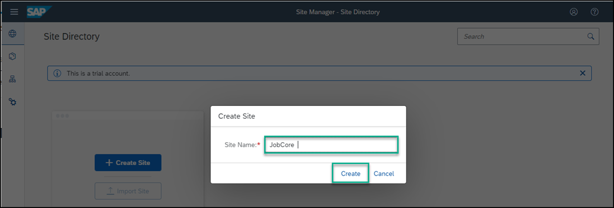

## Prerequisites
You have subscribed to the Launchpad service.

### You will learn
  - How to create a launchpad site using the **Launchpad** service

In this tutorial we'll create a launchpad site for a recruiting company called `JobCore`. We will then add business apps to this site.

[ACCORDION-BEGIN [Step 1: ](Create a site)]

When you access the **Launchpad** service, the Site Directory is in focus. From here you will create your new launchpad site.

> Note: in the side panel you'll see three icons. The first opens the **Site Directory** where you are going to create a new site. All sites that you create will be displayed here. The second icon opens the **Content Manager** where you configure your content or explore and add predefined content from available content providers. The third icon opens the **Provider Manager** where you manage content providers. These content providers expose business content that you can integrate into your launchpad sites.

1. In the Site Directory, click **Create New Site**.

    

2. Enter `JobCore` as the site name and click **Create**.

    

You have created a Launchpad site called `JobCore`.

[VALIDATE_7]

[ACCORDION-END]

[ACCORDION-BEGIN [Step 2: ](Navigate to the Site Directory)]

When you create a site, you are directed to the **Site Settings** screen where you can edit the site settings and assign a site to a specific user role.

Navigate back to the **Site Directory** to view the site tile.

  

[DONE]
[ACCORDION-END]

[ACCORDION-BEGIN [Step 3: ](View the site)]

From the site tile, click the **Go to site** icon to see your site at runtime.

  

  Your site is empty for now. In the next tutorials, you're going to add business apps to your launchpad site.

[DONE]
[ACCORDION-END]
