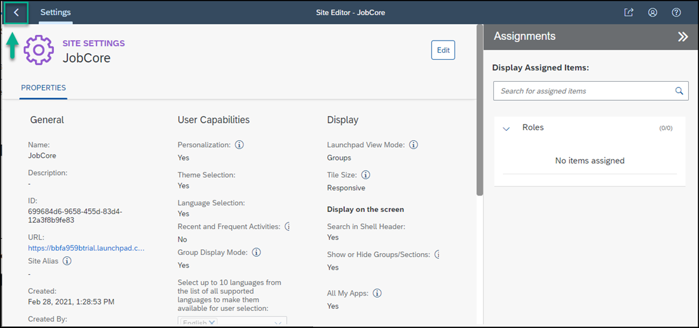

## Prerequisites
You have subscribed to the SAP Launchpad service and assigned yourself to the `Launchpad_Admin` role.

### You will learn
  - How to create a launchpad site using the SAP Launchpad service.

In this tutorial we'll create a launchpad site for a recruiting company called `JobCore`. We'll then add business apps to this site.

[ACCORDION-BEGIN [Step 1: ](Create a site)]

When you access the SAP Launchpad service, the Site Directory is in focus. From here you'll create your new site.

> Note: in the side panel of the SAP Launchpad service, you'll see four tools. The **Site Directory** where you're going to create a new site. All sites that you create will be displayed here. The **Content Manager** where you'll manage cross-site content such as business apps. The **Provider Manager** where you manage content providers. Content providers expose business content that you can integrate into your launchpad sites. The fourth icon opens **Settings** where you can configure various settings related to the SAP Launchpad service.

1. Click **Create Site**.

    

2. Enter `JobCore` as the site name and click **Create**.

    

You've just created a site called `JobCore`.

[VALIDATE_7]

[ACCORDION-END]

[ACCORDION-BEGIN [Step 2: ](Navigate to the Site Directory)]

When you create a site, you are directed to the **Site Settings** screen where you can edit the site settings and assign a site to a specific user role.

Navigate back to the **Site Directory** to view the site tile.

  

  Your site is empty for now. In the next tutorials, you're going to add business apps to your launchpad site.

[DONE]
[ACCORDION-END]
