## Prerequisites
 - You've connected SAP Cloud Platform to the SAP Gateway System. You did this in Tutorial 2 of this group: `Connect SAP Cloud Platform to Your SAP Gateway Demo System Account`.
 - The SAPUI5 app that you're going to integrate into your Portal site, has been created.

## Details
### You will learn

  - How to import an SAPUI5 app into SAP Web IDE so that you can configure it and get it ready for use in a Portal site.
  - How to deploy the app to your SAP Cloud Platform subaccount.
  - How to configure the app in order to integrate it into your Portal site.

In this tutorial, we are going to show you how to import and then deploy the `Products` SAPUI5 app to your subaccount. We will then add this app to the Launchpad page of your Portal site.

[ACCORDION-BEGIN [Step 1: ](Download the SAPUI5 app from GitHub)]

The SAP Cloud Platform Portal tutorial GitHub repository contains various SAPUI5 applications, Portal widgets, and Shell plugins used in Portal tutorials. Once deployed to your SAP Cloud Platform subaccount, they are available to add to your Portal site.

1. Go to [SAP Cloud Platform Portal Tutorial Samples](https://github.com/SAP/cloud-portal-tutorial-samples)

2. Click the **Clone or download** button and select **Download ZIP**.

    A `cloud-portal-tutorial-samples-master.zip` file is downloaded to your computer.

3. Right-click the `cloud-portal-tutorial-samples-master.zip` and extract the repository ZIP file into a folder.

    A new cloud-portal-tutorial-samples-master folder is created.

4. Open the `cloud-portal-tutorial-samples-master\TECHED2018 folder`.

    For this tutorial we will be using the `productslist` app from the Portal samples repository:
    `cloud-portal-tutorial-samples-master\TECHED2018\productslist`.

    You are now going to create a ZIP file from the application

5. Open the `cloud-portal-tutorial-samples-master\TECHED2018\productslist\ folder`.

6. Create a ZIP file from all of the underlying files:

    -	Select all of the included files (Ctrl^A).

    -	Right-click and select **Add to productlist.zip**.

    A new ZIP file named `productlist.zip` is created inside the folder.

[DONE]
[ACCORDION-END]

[ACCORDION-BEGIN [Step 1: ](Import the SAPUI5 app to SAP Web IDE)]

In this step you will import the SAPUI5 app that was created for you into SAP Web IDE so that you can configure it and get it ready for use in your Portal site.

1. From your trial subaccount welcome page, click **Launch SAP Web IDE**.

    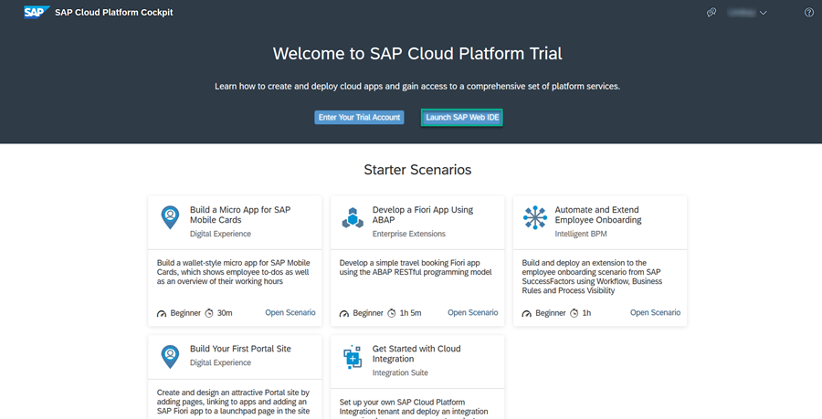

2. Click **File** -> **Import** -> **File or Project**.

    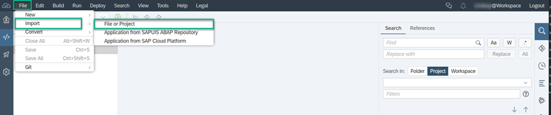

3. Browse for the app and click **OK**.

Once the import is complete, you will see the `mta_sap` project folder in the left panel of your Workspace. The project folder contains a launchpad module called `flp` and a UI module called `sap`.

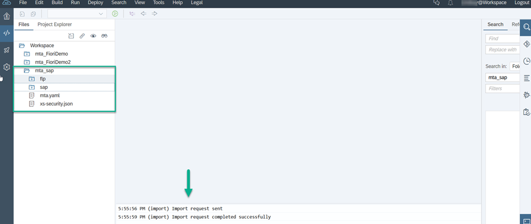

[DONE]
[ACCORDION-END]

[ACCORDION-BEGIN [Step 2: ](Build and deploy the app to your subaccount)]

1. Right click the `mta_sap` folder and click **Build**.

    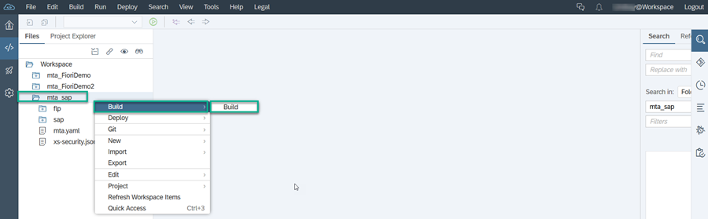

    An `mta_sap_0.0.1.mtar` file is generated.

2. Right click your `mta_sap_0.0.1.mtar` file (located under the `mta_archives` folder), and click **Deploy to SAP Cloud Platform**.  

    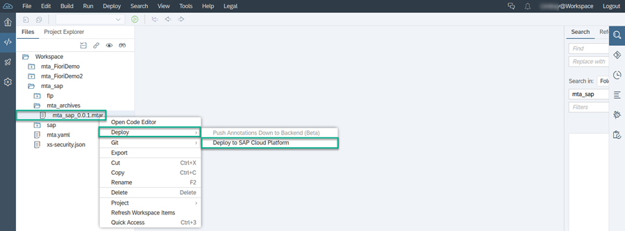

3. Log on to Cloud Foundry. The endpoint is populated automatically. Enter your email and password that you used to create your trial account. When you have logged on, the  **Organization**, and **Space** is also populated.

4. Click **Deploy**.

    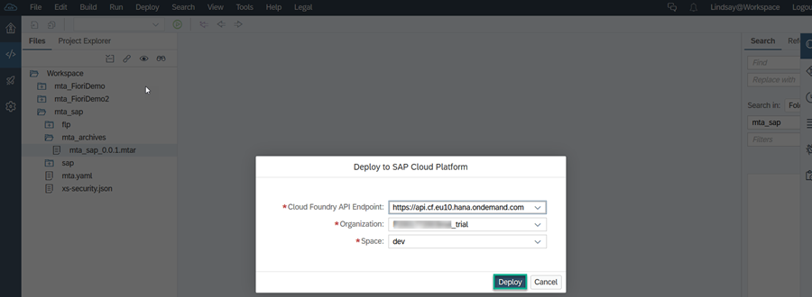

You will get a confirmation message once your project is deployed.

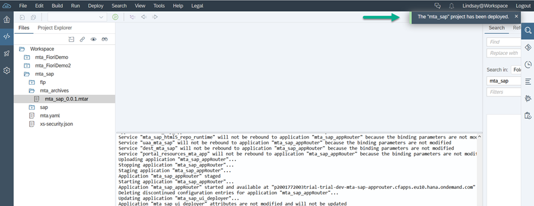

[DONE]
[ACCORDION-END]

[ACCORDION-BEGIN [Step 3: ](Find the appRouter URL of the deployed app)]

In this step, you will get the appRouter URL of the deployed app, which you will later use to connect to the app.

1. Go back to the welcome page of your trial subaccount and click **Enter Your Trial Account**.

2. Click **Spaces** in the side panel.

    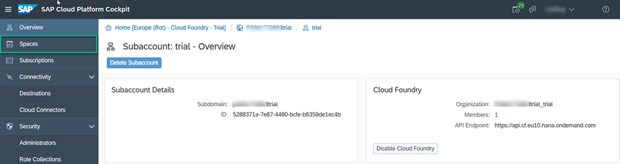

3. Click the `dev` space.

      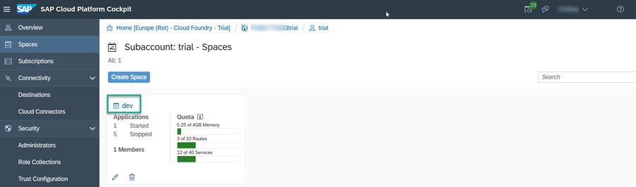

4. Click the `mta_sap_appRouter` app.

    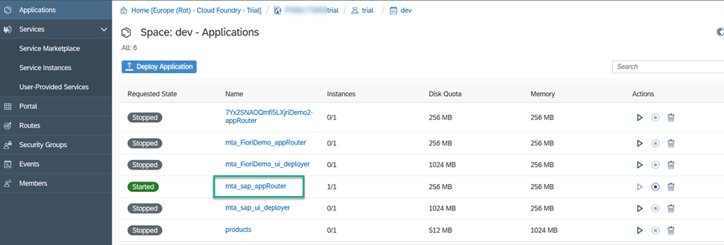

5. Copy the appRouter URL.

    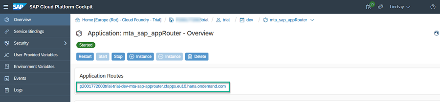

[DONE]
[ACCORDION-END]

[ACCORDION-BEGIN [Step 4: ](Create a destination to the SAPUI5 app)]

Now you need to create a destination to the SAPUI5 `Products` app using the appRouter URL from the previous step.

1. In the side navigation panel, click **Connectivity -> Destinations**. Then click **New Destination**.

    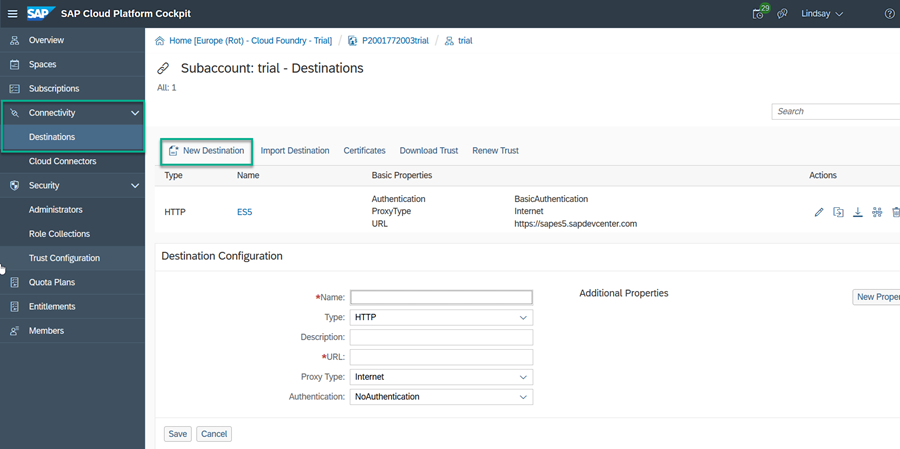

2. Enter the following properties:

    |  Property     | Value
    |  :------------- | :-------------
    |  Name           | **`ProductsApp`**
    |  Type           | **`HTTP`**
    |  URL          | **`https://p2001772003trial-trial-dev-mta-sap-approuter.cfapps.eu10.hana.ondemand.com`**
    |  Proxy Type   | **`Internet`**
    |  Authentication | **`NoAuthentication`**

3. Click **New Property** and add the following additional property:

    |  Property     | Value
    |  :------------- | :-------------
    |  sap-platform           | **`CF`**

4. Click **Save**.

    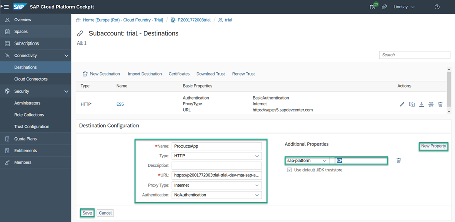

[DONE]
[ACCORDION-END]

[ACCORDION-BEGIN [Step 5: ](Add the SAPUI5 app to your Portal site)]

In this step you'll first open the Content Manager of the Portal site. Then you'll configure the app so that it can be launched from your Portal site.

1. In the side navigation panel of your trial subaccount (or other subaccount), click **Subscriptions** and enter `Portal` in the search bar. Then from the Portal tile, click **Go to Application**. The Site Manager opens with the Site Directory in focus.

    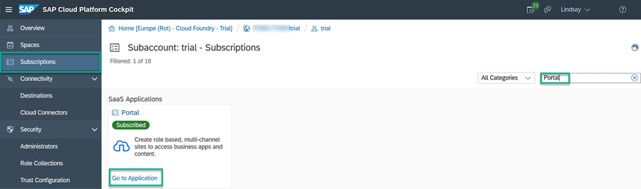

2. Click the icon in the side panel of the Site Manager to open the Content Manager.

    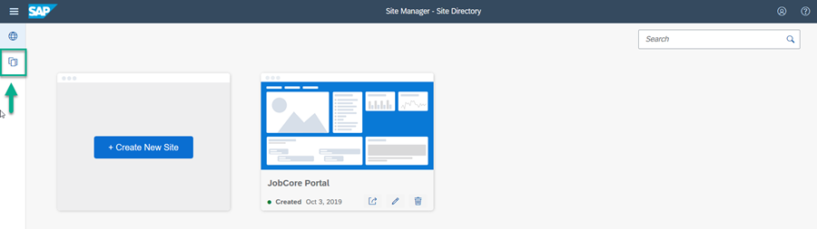

3. Click **+ New App**.

    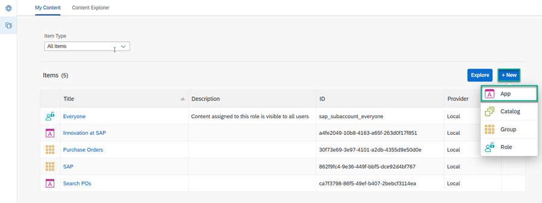

4. In the **PROPERTIES** tab enter the following values:

    |  Property     | Value
    |  :------------- | :-------------
    |  Title           | **`Products`**
    | System           | **`ProductsApp`** (this is the name of the system that your app is running on - same name as the destination name). Note that it may take several minutes until the destination that you created in step 5 appears in the **System** list.
    |  App UI Technology          | **`SAPUI5`**
    |  SAPUI5 Component Name  | **`app.sap`** - this is the registered name of the SAPUI5 component. To get this name, ask your developer to open the `component.js` file in SAP Web IDE - it is defined in the `component.js` file without the .component suffix as shown here: 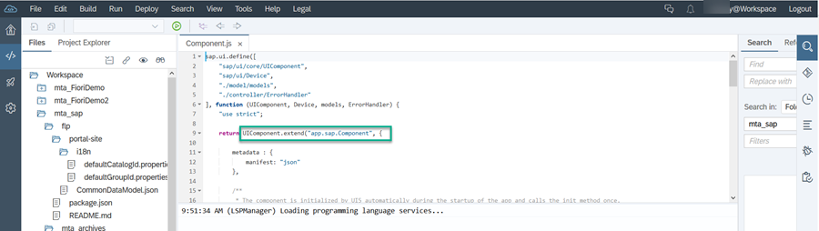

    Your screen will look like this:

    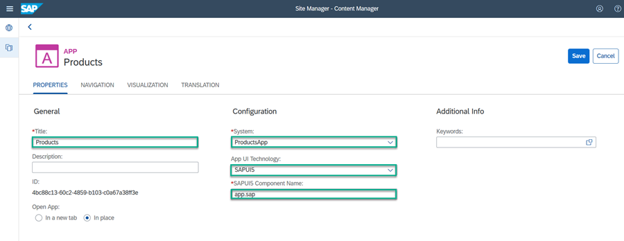

5. Click the **NAVIGATION** tab and enter the following intent:

    - **Semantic Object**: `products`

    -	**Object**: `display`

      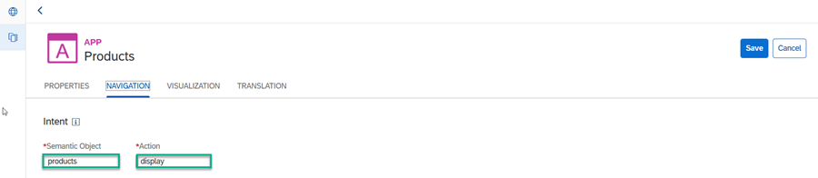

6. Click the **VISUALIZATION** tab and enter the following properties:
    - **Title**: Leave as is

    -	**Subtitle**: `Product Lists`

    -	**Information**: `More about our products`

    -	**Icon**: `add-product` (paste this icon code into the **Select Icon** screen)

    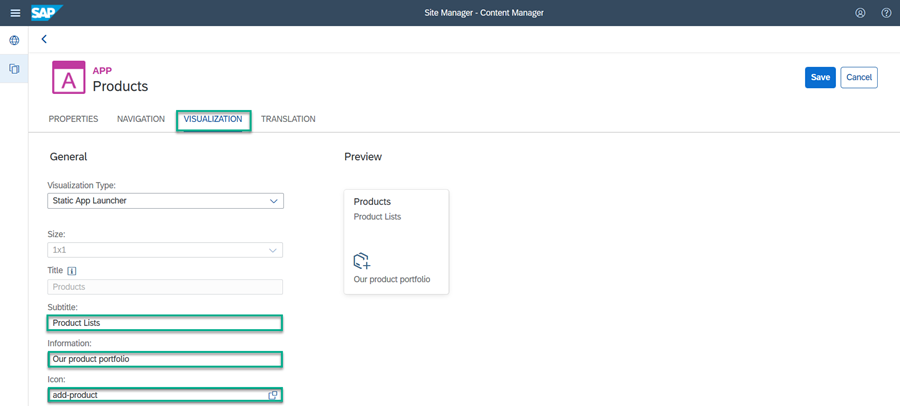

7. Click **Save** in the top right hand corner of the screen.

8. Click the back arrow to go back to the Content Manager.

    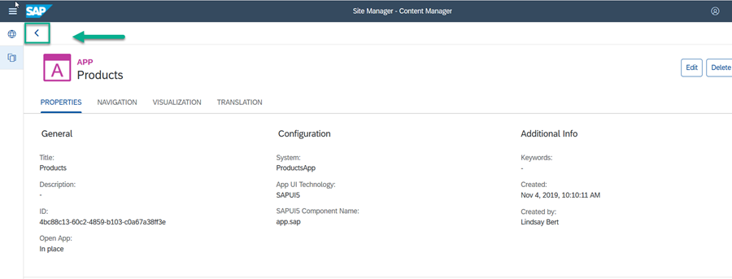

9. You can see that your new app is in the content items list.

    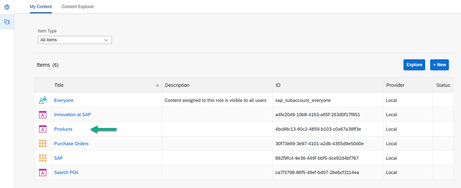

You can now add the `Products` app to the Launchpad page of your Portal site (or to a page that you've designed yourself).

To make the app visible in the Launchpad page, you need to assign it to a group. You also need to assign the app to a role so that the user can launch it. This is exactly what you're going to do in the next two steps.

[DONE]
[ACCORDION-END]

[ACCORDION-BEGIN [Step 6: ](Assign your app to a group)]

In this step you're going to create a new group and you'll assign the `Products` app to it.

1. Click **+ New** in the Content Manager and click **Group** to open the Group editor.

    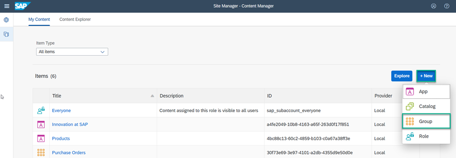

2. Enter `Product Information` as the **Title**.

3. In the **Assignments** panel on the right, type `pr` to search for your `Products` app and then click the **+** to assign your app to this group.

    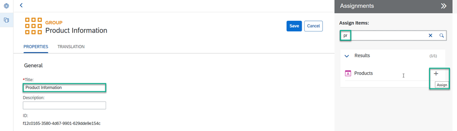

4. Click **Save**.

The `Products` app is now assigned to the `Product Information` group.

[DONE]
[ACCORDION-END]

[ACCORDION-BEGIN [Step 7: ](Assign your app to the Everyone role)]

In this step, you'll  assign the `Products` app to the `Everyone` role. This is a default role - content assigned to the `Everyone` role enables all users of the Portal to launch it.

1. Click the back arrow to go back to the Content Manager.

2. Click the `Everyone` role to open the Role editor.

    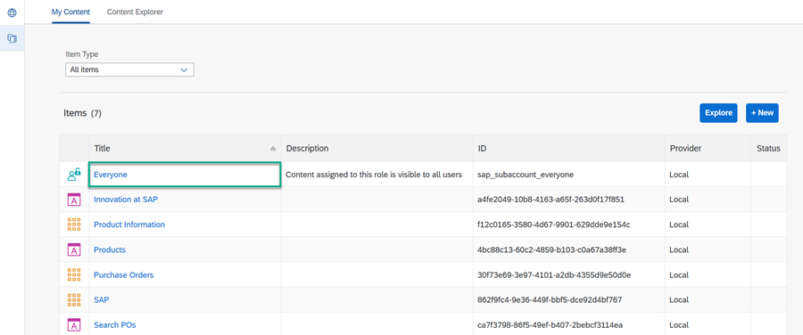

3. Click **Edit** in the top right corner.

4. Search for your app. Type `pr` in the search field to find the `Products` app and then click the **+** to assign the `Everyone` role to it. Then click **Save**.

    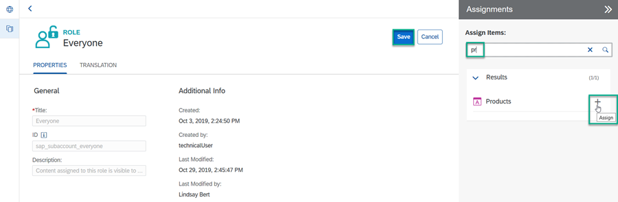

[VALIDATE_7]
[ACCORDION-END]

[ACCORDION-BEGIN [Step 8: ](View your app in the Portal site)]

1. Use the back arrow to go back to the Content Manager.

2. Click the icon to open the Site Directory.

    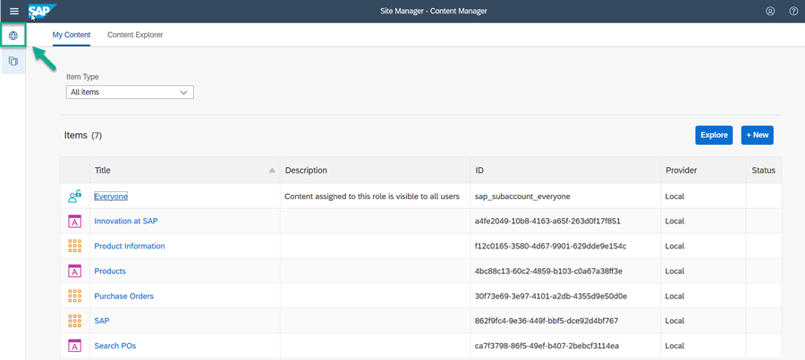

3. Click **Go to site** on the site tile.

    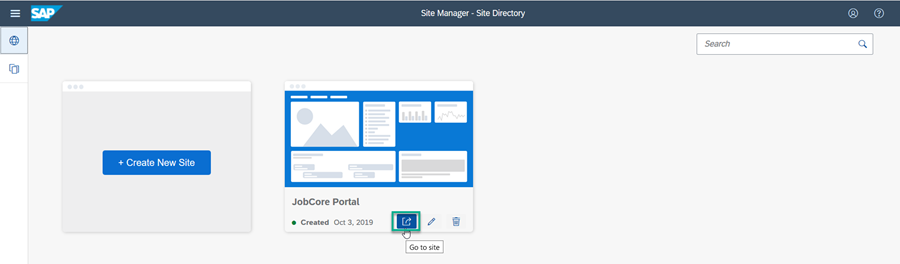

4. Open the **My Apps** tab.

    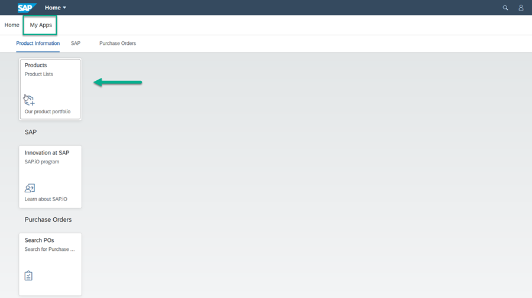

    You'll see the new `Product Information` group with the `Products` app.

5. Launch the app by clicking it. This is what you'll see:

    

[DONE]
[ACCORDION-END]

---
