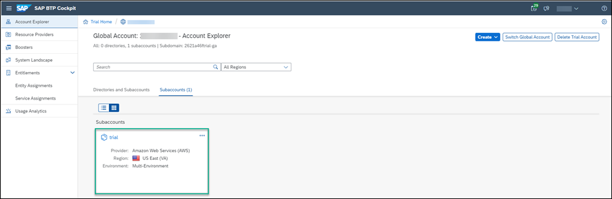
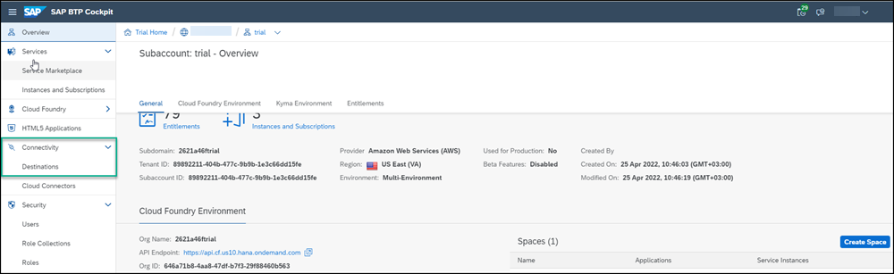
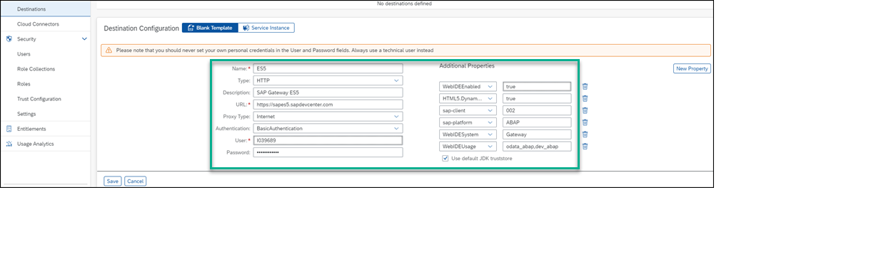

## Prerequisites
- You have completed the tutorials from [Group 1: Create Your First Portal Site](https://developers.sap.com/group.portal-cf-create-site.html).
 Please note that you can do this group of tutorials as a standalone exercise using your own Portal site that you have created.
- You have created an account on the Gateway Demo System: [Create an Account on the Gateway Demo System](https://developers.sap.com/tutorials/gateway-demo-signup.html). Note that when you create your account, make a note of the User Name and Password that you entered - you'll be needing it in this tutorial.

## Details
### You will learn
  - How to create a destination between SAP Cloud Platform and the SAP Gateway Demo System account.

In this group of tutorials, you will add a Web Dynpro ABAP app and a SAP Fiori app to your Portal site. Before you can do this, you need to create a connection between SAP Cloud Platform and the backend system using the SAP Gateway Demo System.  

[ACCORDION-BEGIN [Step 1: ](Open your subaccount)]

In this tutorial we are using the trial subaccount but you can also open your own subaccount.

1. Log on to SAP Cloud Platform and click **Enter Your Trial Account**.

    

2. Click on the **trial** tile to navigate to your trial subaccount in the SAP Cloud Platform cockpit. If you are using your own subaccount, you can select it instead..

    

[DONE]
[ACCORDION-END]

[ACCORDION-BEGIN [Step 2: ](Create a destination to the SAP Gateway Demo System)]

1.  In the left navigation panel, click **Destinations** under **Connectivity**.

      

2. Click **New Destination**.

    

3.  Add the following destination properties:

    |  Field     | Value
    |  :------------- | :-------------
    |  Name           | `ES5`
    |  Type          | `HTTP`
    |  Description    | `SAP Gateway ES5`
    |  URL           | `https://sapes5.sapdevcenter.com`
    |  Proxy Type          | `Internet`
    |  Authentication    | `BasicAuthentication`
    |  User Name          | Your ES5 Gateway user
    |  Password    | Your ES5 Gateway Password

4. Make sure that the **Use default JDK truststore** checkbox is checked.

5. Enter the following **Additional Properties**. Click the **New Property** button each time to add a new property.

    |  Field     | Value
    |  :------------- | :-------------
    | `WebIDEEnabled`          | `true`
    | `sap-client`          | `002`
    | `WebIDESystem`    | `Gateway`
    | `WebIDEUsage`           | `odata_gen, odata_abap, bsp_execute_abap`
    | `sap-platform`          | `ABAP`

6. Click **Save**.

    

[VALIDATE_6]

[ACCORDION-END]
