## Prerequisites
  - You've created a SAP Cloud Platform trial account in the Cloud Foundry environment on an AWS Data Center. You can create a trial account using this link: [Create a trial account](https://cockpit.hanatrial.ondemand.com).
  - You can also use a subaccount in your SAP Cloud Platform global account. If you don't have a subaccount in the Cloud Foundry environment, refer to this topic: [Onboarding](https://help.sap.com/viewer/ad4b9f0b14b0458cad9bd27bf435637d/Cloud/en-US/fd79b232967545569d1ae4d8f691016b.html).

## Details
### You will learn
  - How to subscribe to the Portal Service
  - How to assign users to the `Super_Admin` role so that they can design Portal sites
  - How to access the Portal service

In this group of tutorials our goal is to create an attractive Portal site using the SAP Cloud Platform Portal service. But before we can do this, there are some preparation steps that you need to do.

[ACCORDION-BEGIN [Step 1: ](Subscribe to the Portal service)]

Before you can access the Portal service, you need to first subscribe to it.

1. [Log onto SAP Cloud Platform](https://cockpit.hanatrial.ondemand.com) and click **Enter Your Trial Account**.

    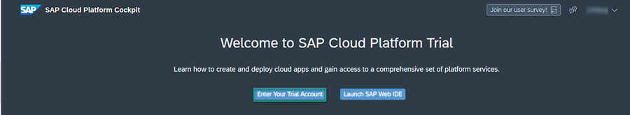

2. Click on the **trial** tile to navigate to your trial subaccount in the SAP Cloud Platform cockpit. If you are using your own subaccount, you can click on it instead.

      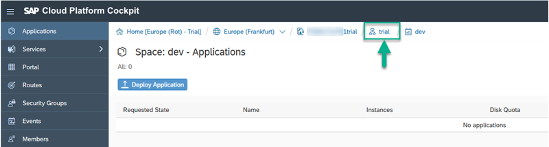

3. Click **Subscriptions** from the side menu.

    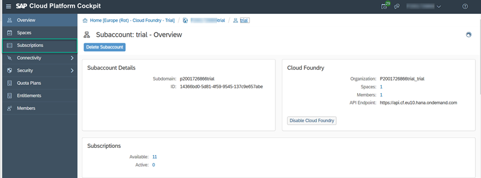

4. Enter `Portal` in the search box and click the **Portal** service tile.

    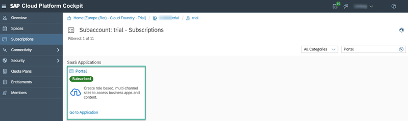

5. Click **Subscribe** and wait for the status to change to **Subscribed**.

    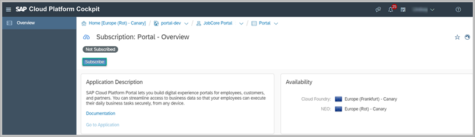

[DONE]
[ACCORDION-END]

[ACCORDION-BEGIN [Step 2: ](Add yourself to the Super_Admin role)]

To be able to do administrative tasks in the Portal you must be assigned to the `Super_Admin` role. In this step, you will first create a role collection and then you'll assign yourself to the `Super_Admin` role.

1. Click on your subaccount again using the breadcrumbs at the top.

    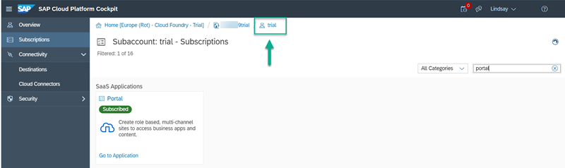

2. Click **Security > Role Collections** from the side menu.

    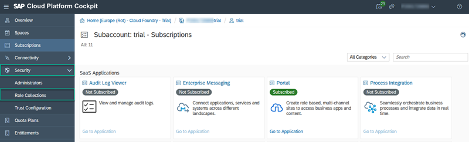

3.  Click **New Role Collection** and then name your role collection `Administrator`. Then click **Save**.

    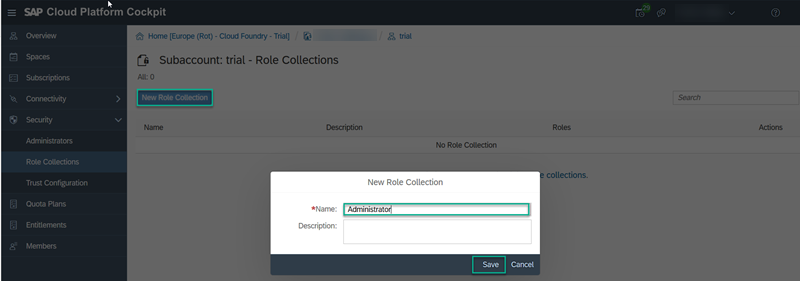

4. Click your role collection to open the **Roles** screen and then click **Add Role**.

    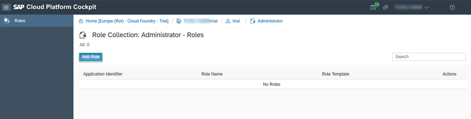

5. Select the following values:

    |  Property     | Value
    |  :------------- | :-------------
    |  Application Identifier           | **`portal-cf-service!<id>`** 
&nbsp;
 In the screen capture below, the **Application Identifier** has an ID at the end.  This ID is different on your system -- just make sure that you choose the value with this format: **portal-cf-service!`<id>`**
    |  Role Template           | **`Super_Admin`**
    |  Role    | **`Super_Admin`**

    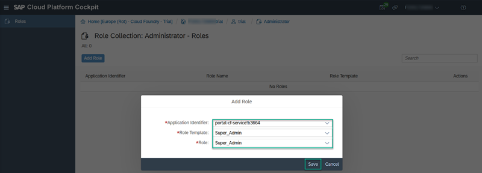

6. Click **Save**.

7. Go back to your subaccount (you can use the breadcrumbs at the top of your screen).

8. Click **Security > Trust Configuration** from the side menu.

    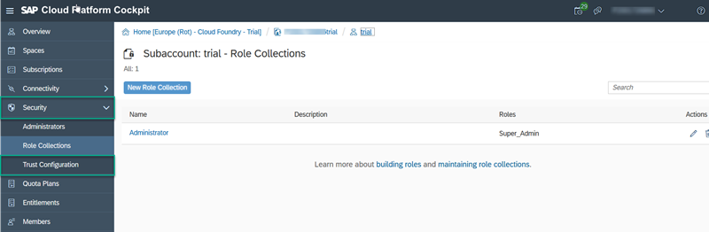

9. Click the `SAP ID Service`.

10. Enter your email address and then click **Show Assignments**.

    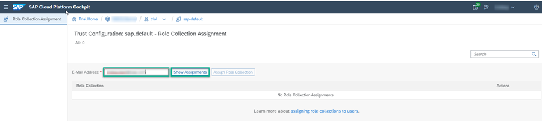

11. If your user is not part of the SAP ID Service you will get the following popup. Click **Add User**.

      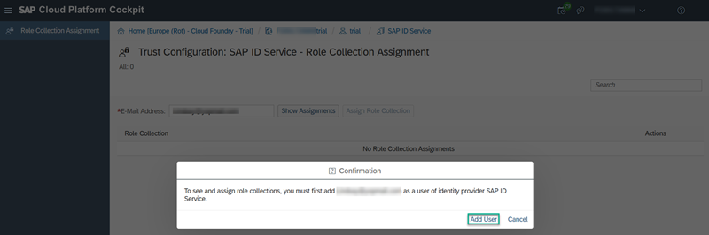

12. Click **Assign Role Collection**.  In the dialog box that opens, select the `Administrator` role collection that you defined above and then click **Assign Role Collection**.

    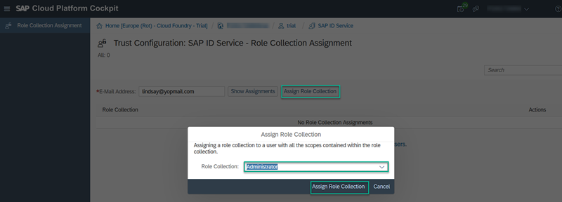

You have now been assigned to the `Super_Admin` role and you can access the Portal service and carry out all your admin tasks.

[DONE]
[ACCORDION-END]

[ACCORDION-BEGIN [Step 3: ](Access the Portal service)]

You are now ready to access the Portal service.  

1. Click on your subaccount.

2. Click **Subscriptions** from the side panel.

    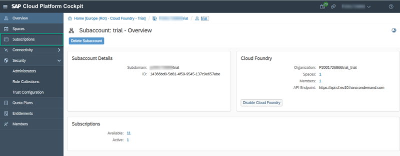

    You'll see that you are now subscribed to the Portal service.

3. Click **Go to Application** on the **Portal** tile.

    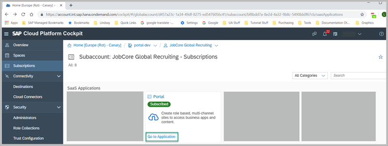

4. Add your credentials if you are prompted to do so.

   The Portal service opens with the Site Directory in focus. This is where you create and manage the sites that you create for this subaccount.

  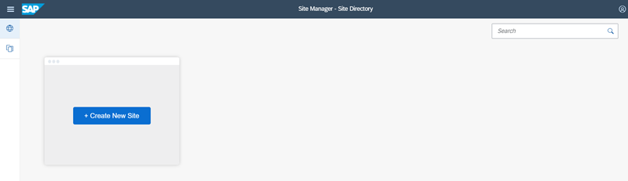

[VALIDATE_6]

[ACCORDION-END]
