## Prerequisites
  - If you want to use a trial environment, you need to first register it. You can register to a trial account using this link: [Create a trial account](https://www.sap.com/cmp/td/sap-cloud-platform-trial.html).
  - If you're using a production environment, you should have a subaccount configured. If you don't have a configured subaccount, refer to this topic: [Initial Setup](https://help.sap.com/viewer/ad4b9f0b14b0458cad9bd27bf435637d/Cloud/en-US/fd79b232967545569d1ae4d8f691016b.html).

## Details
### You will learn
  - How to subscribe to the **Launchpad** service
  - How to assign yourself to the `Launchpad_Admin` role so that you can create and manage launchpad sites
  - How to access the **Launchpad** service

In this group of tutorials our goal is to create a launchpad site using the SAP Cloud Platform Launchpad service. But before we can do this, there are some steps you need to do in the SAP Cloud Platform cockpit.

[ACCORDION-BEGIN [Step 1: ](Subscribe to the Launchpad service)]

Before you can access the **Launchpad** service, you first need to subscribe to it.

1. [Log onto SAP Cloud Platform](https://cockpit.hanatrial.ondemand.com) and click **Enter Your Trial Account**.

    

    >If this is your first time accessing your trial account, you'll have to configure your account by choosing a region (select the region closest to you). Your user profile will be set up for you automatically.

    >Wait till your account is set up and ready to go. Your global account, your subaccount, your organization, and your space are launched. This may take a couple of minutes.  

2. Click **Continue**.

    

3. Click the **trial** tile to navigate to your trial subaccount in the SAP Cloud Platform cockpit. If you are using your own subaccount, you can select it instead.

      

4. Click the hamburger icon at the top of the left navigation panel to expand it.

    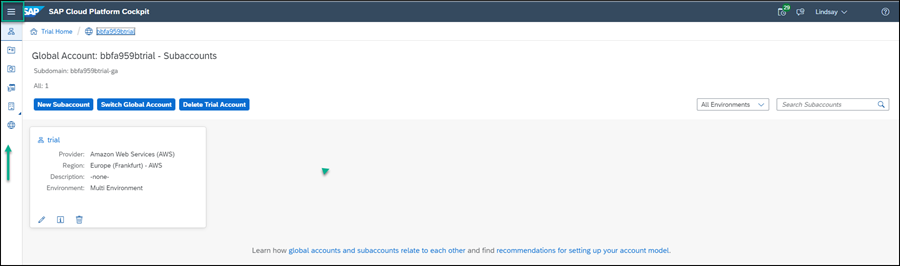

5. Click **Subscriptions** from the side menu.

    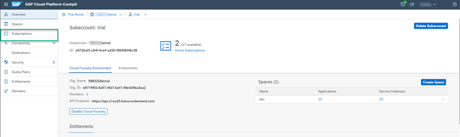

6. Enter `Launchpad` in the search box and click the **Launchpad** service tile.

    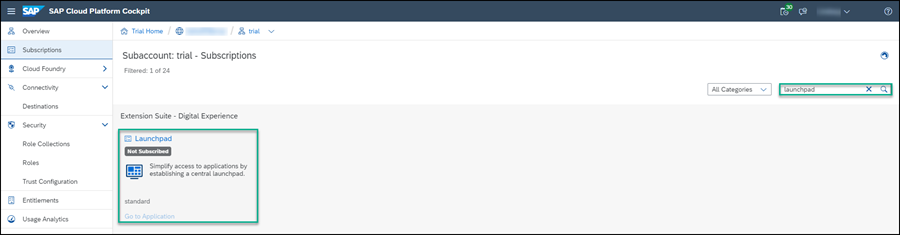

7. Click **Subscribe** and wait for the status to change to **Subscribed**.

    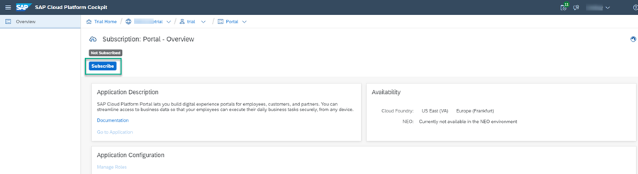

[DONE]
[ACCORDION-END]

[ACCORDION-BEGIN [Step 2: ](Add yourself to the Launchpad_Admin role)]

To be able to access the **Launchpad** service, users must be assigned to the `Launchpad_Admin` role. In this step, you'll assign yourself to the `Launchpad_Admin` role so that you can later create launchpad sites.

1. Click on your trial account (or your own subaccount) using the breadcrumbs at the top.

    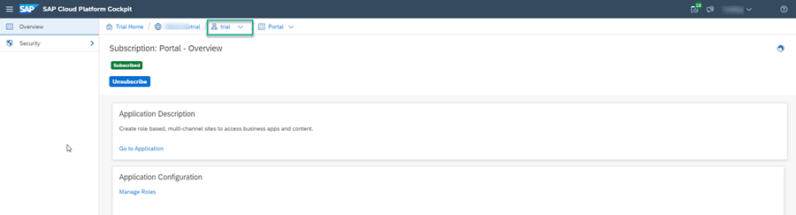

2. Click **Security > Trust Configuration** from the side menu.

    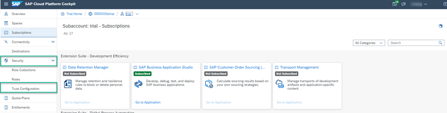

3. Click `sap.default` to select the SAP ID Service.

    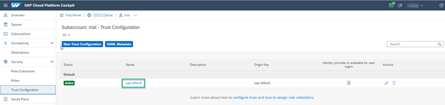

4. Enter your email address and then click **Show Assignments**.

    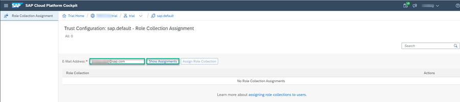

5. Click **Assign Role Collection**.

    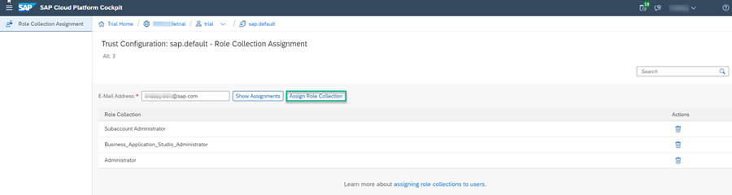

6. Select the `Launchpad_Admin` role and click **Assign Role Collection**.

    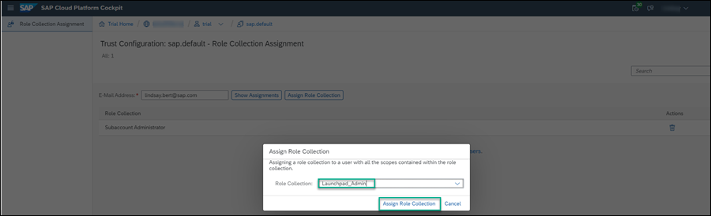

You have now been assigned to the `Launchpad_Admin` role and you can access the **Launchpad** service and carry out all your admin tasks.

[DONE]
[ACCORDION-END]

[ACCORDION-BEGIN [Step 3: ](Access the Launchpad service)]

You are now ready to access the **Launchpad** service.  

1. Use the breadcrumbs to open your trial account.

    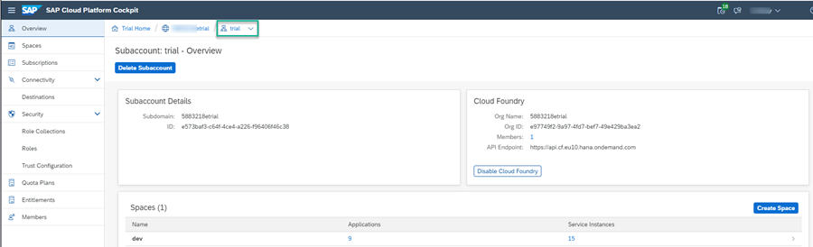

2. Click **Subscriptions** from the side panel.

    

3. Search for the **Launchpad** tile. You'll see that you are now subscribed to the **Launchpad** service.

4. Click **Go to Application** on the **Launchpad** tile.

    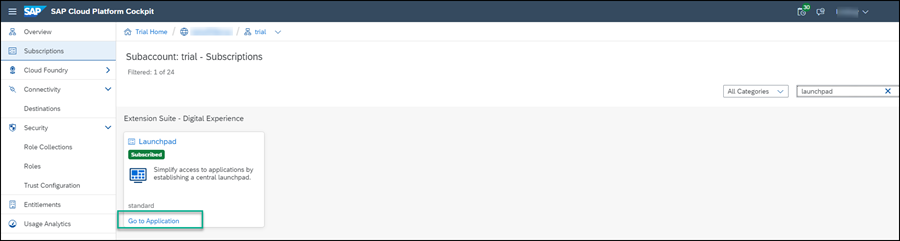

4. Add your credentials if you are prompted to do so.

   The **Launchpad** service opens with the Site Directory in focus. This is where you'll create and manage your launchpad sites.

  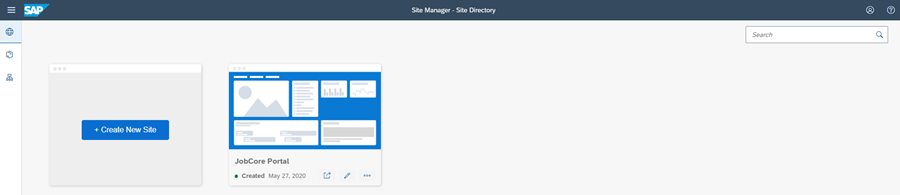

[VALIDATE_6]

[ACCORDION-END]
