# Set Up SAP Build Work Zone, standard edition Using a Trial Account
<!-- description --> To get started with building a site in SAP Build Work Zone, standard edition, you must perform the required onboarding steps.

## Prerequisites
  - If you want to use a trial environment, you need to first register it. You can register to a trial account using this link: [Create a trial account](https://account.hanatrial.ondemand.com/trial/#/home/trial). Scroll down and click **Get trial now**.
  - If you're using a production environment, you should have a subaccount configured. If you don't have a configured subaccount, refer to this topic: [Initial Setup](https://help.sap.com/viewer/8c8e1958338140699bd4811b37b82ece/Cloud/en-US/fd79b232967545569d1ae4d8f691016b.html).
  - If you have an existing trial account, some of these configurations may already be there. 
  

## You will learn
  - How to create an SAP Cloud Identity services tenant, and create a trust with SAP Business Technology Platform 
  - How to subscribe to SAP Build Work Zone, standard edition
  - How to map the user you created in SAP Cloud Identity services to the Identity Authenticaton group you created
  - How to access SAP Build Work Zone, standard edition

## Intro
    
>You can also do this tutorial using a SAP BTP free plan option. To do this, please follow this tutorial: [Set Up SAP Build Work Zone, standard edition Using the Free Tier Model for SAP BTP](cp-portal-cloud-foundry-setup-freetier).

In this group of tutorials our goal is to create a site using SAP Build Work Zone, standard edition. But before we can do this, there are some steps you'll need to do in the SAP BTP cockpit and in SAP Cloud Identity services.

### Access your trial account

1. [Log onto SAP BTP](https://cockpit.hanatrial.ondemand.com) and click **Go To Your Trial Account**.
    
    

    >If this is your first time accessing your trial account, you'll have to configure your account by choosing a region (select the region closest to you). Your user profile will be set up for you automatically.

    >Wait until your account is set up and ready to go. Your global account, your subaccount, your organization, and your space are launched. This may take a couple of minutes.  

2. Click **Continue** if you get this popup.

    

    
3. Click the **trial** tile to navigate to your trial subaccount in the SAP BTP cockpit. If you're using your own subaccount, you can select it instead.
    
    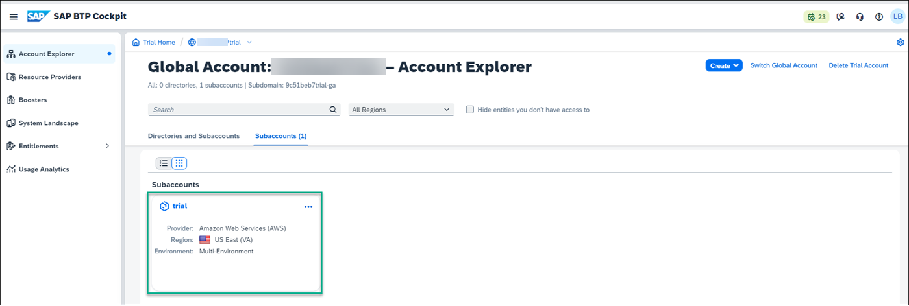

### Get an SAP Cloud Identity services tenant 

To access SAP Build Work Zone, standard edition you need to first create a SAP Cloud Identity tenant for managing user access and authentication. To get an SAP Cloud Identity Services tenant, you need to create one manually as follows:

1. Click **Service Marketplace** in the left navigation panel.

    > The Service Marketplace provides you access to all services and applications that you can access from the SAP BTP cockpit.
    
    

2. In the **Service Marketplace**, search for the **Cloud Identity Services** tile.

    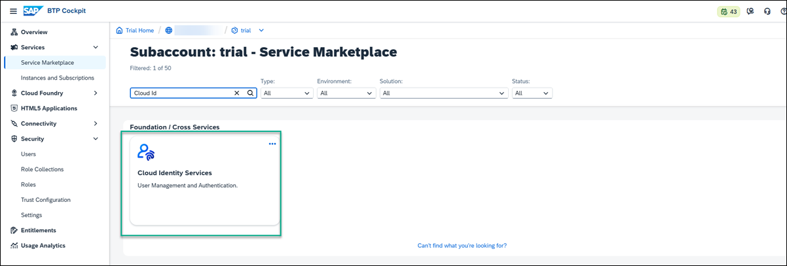

3. Click the tile and then click **Create**.
    
    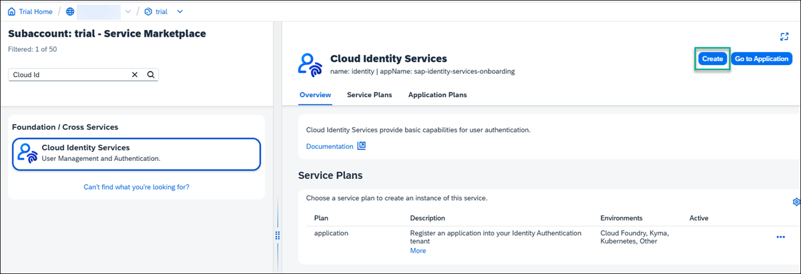

4. In the **New Instance or Subscription** screen, under **Subscriptions**, select the `default` plan and click **Next**.
    
    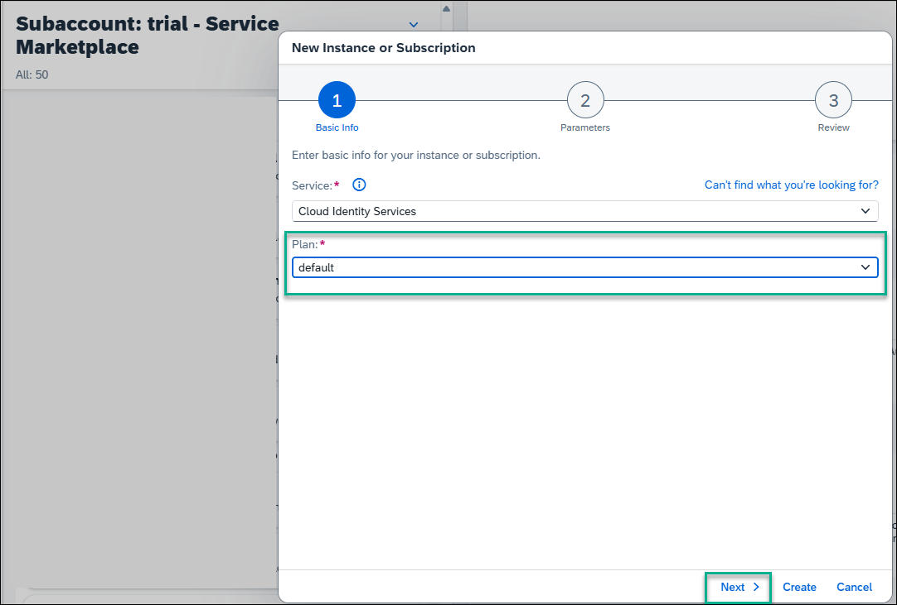

5. Navigate to the next steps and then click **Create**.

6. You will receive an email to activate your account. Once you’ve activated your account and press **Continue**, the Cloud Identity Services Administration Console opens.

    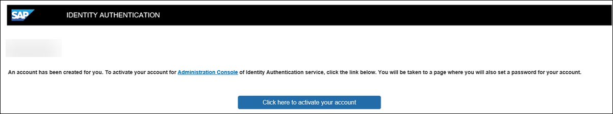

7. In the Administration Console, under the **Users & Authorizations** tab, select **Groups**.

    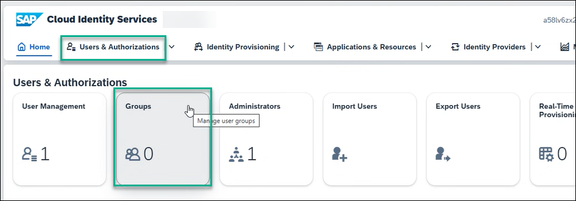

8. Click **Create Group**

    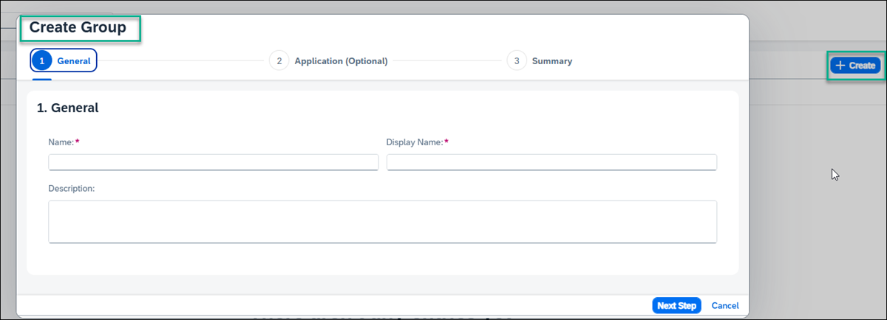

9. Name the group whatever you prefer.  For this tutorial, let’s name it `Admin` and under Display Name, re-enter `Admin`.

    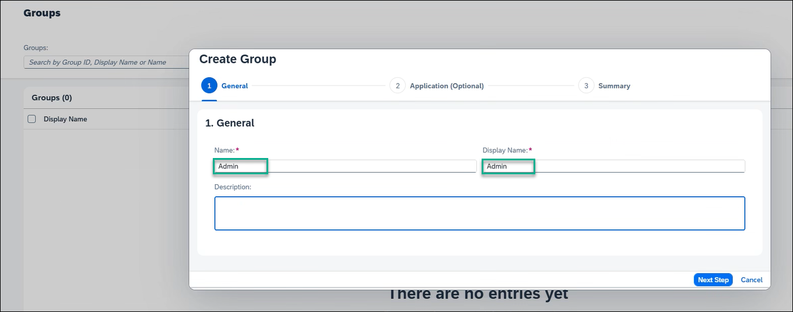

10. Click **Next Step**, and then **Next Step** again, and then **Finish**.

11. Still under the **Users & Authentications** tab, select **User Management** and add your user by clicking **+ Add**.

    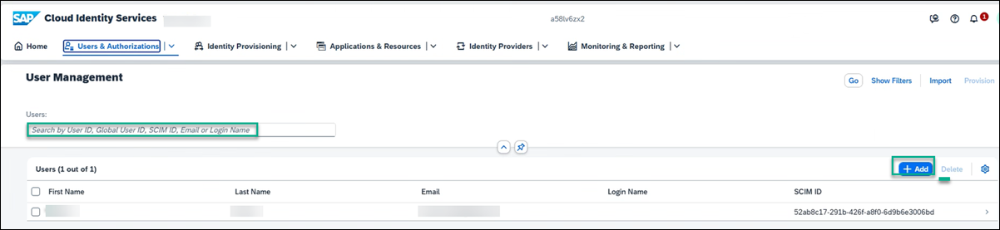

12. Whether you add a new user or use an existing one, you must assign the group to this user. Click your user details, select **Groups**, and assign your user to the `Admin` group.

    

You now have a SAP Cloud Identity tenant. 

### Create a trust between SAP BTP and the tenant you created in SAP Cloud Identity services

1. In the SAP BTP cockpit, go to **Security** -> **Trust Configuration** and click **Establish Trust**.
    
    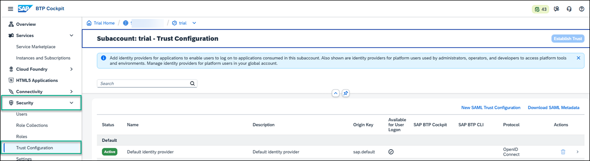

2. In the **Configure Tenant** screen, select your SAP Cloud Identity tenant that you created and click through the wizard until you get to **Finish**.

    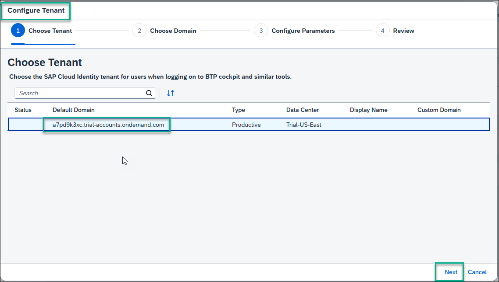

    You now have a trust between your SAP Cloud Identity services tenant and SAP BTP. You will see the following message:

    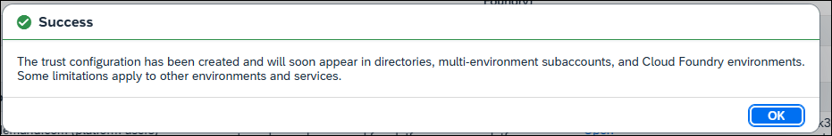

### Subscribe to SAP Build Work Zone, standard edition

Before you can access SAP Build Work Zone, standard edition, you first need to subscribe to it and expose the required `Launchpad_Admin` role.

>SAP Build Work Zone, standard edition offers 2 types of standard plans. The **Applications Plan** which is used to access your applications from a site. In this case, you need to create a subscription to SAP Build Work Zone, standard edition, which you will do in this step. The 2nd plan is the **Service Plan** which is used to integrate with other services. This plan is not required for the scope of this tutorial.

1. From your trial subaccount, go to the **Service Marketplace** from the side panel and search for `SAP Build Work Zone, standard`.

    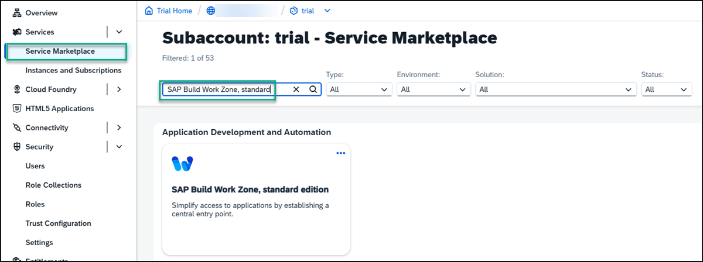

    > If you aren't able to find the **SAP Build Work Zone, standard edition** tile, or if you can't access it, you may be using an older trial account. You can easily add it to your account via the **Entitlements** area. Click **Edit** and then **Add Service Plans**. Search for `SAP Build Work Zone`, check the standard (applications) plan, and click **Add 1 Service Plan**. Don't forget to save in the next screen.

2. Click the tile. The SAP Build Work Zone, standard edition **Overview** tab is in focus.

3.  Under the **Applications Plans** tab, click the Actions icon (...), and select **Create** to create a new subscription.
    
    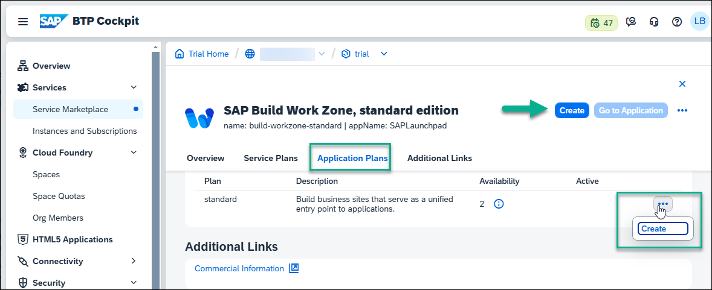

    >You can also use the **Create** button at the top right of the screen.

4. In the **New Instance or Subscription** dialog box that opens, leave the basic information that appears there and click **Create**.

    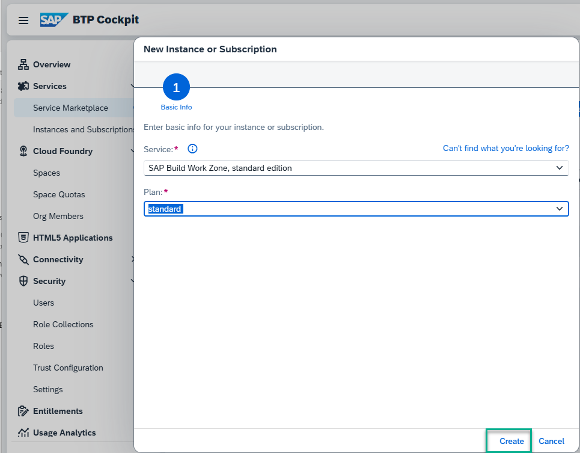

    > Note that to work in SAP Build Work Zone, standard edition, to integrate content from the backend, you need to create a subscription. If you also want to integrate custom developed apps or plugins, you need to also create an instance.

5. You'll get confirmation that your subscription is being created. Click **View Subscription** to see the progress.

    >This step will redirect you to the **Services** -> **Instances and Subscriptions** screen. This screen provides you with an overview of all services and applications that are currently active.

6. From the **Instances and Subscriptions** screen, you'll see that you are subscribed to **SAP Build Work Zone, standard edition**.
    
    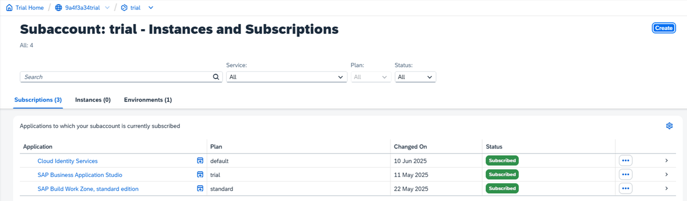

Now that you have a subscription, all the SAP Build Work Zone, standard edition role collections are exposed in the cockpit. You can now proceed to the mapping between the role collection and the group that you created in SAP Cloud Identity services.

### Map the Launchpad_Admin role in SAP BTP with the Identity Services group

1. From the side panel of the cockpit go back to **Security** -> **Trust Configuration**.

2. Click the tenant that you created in SAP Cloud Identity services.

    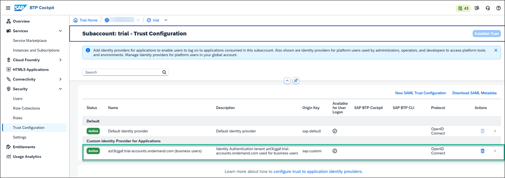

3. On the right, in the screen that opens, click on the **Attribute Mappings** tab, and click **Edit**.

    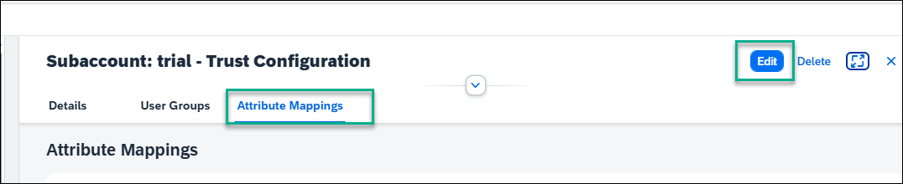

4. Under the **Role Collection** column, search for the `Launchpad_Admin` role from the dropdown list. 

    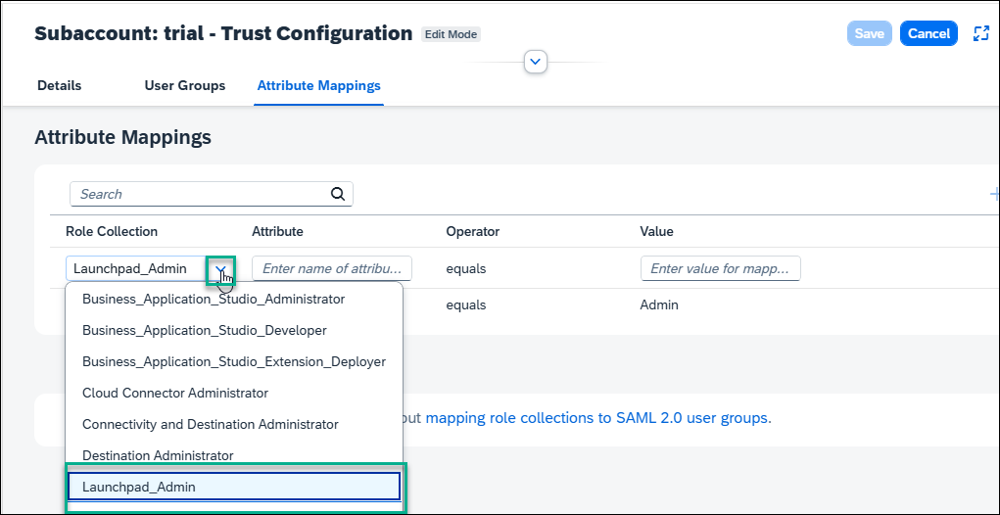

5. Enter the Attribute as `Groups` and enter the Value as `Admin`. Now click the **+** to add the attributes and **Save**.

The mapping is complete. You can now go ahead and access SAP Build Work Zone, standard edition.

### Access SAP Build Work Zone, standard edition

1. From the side panel, click **Instances and Subscriptions**.
    
    

2. Under the **Subscriptions** tab, click  **SAP Build Work Zone, standard edition**.  Click **Go to Application** on the right.

    

The **Site Directory** opens. From here you'll create and manage your sites.
    

