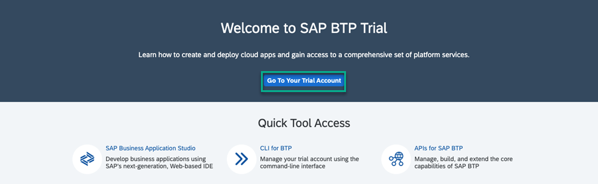
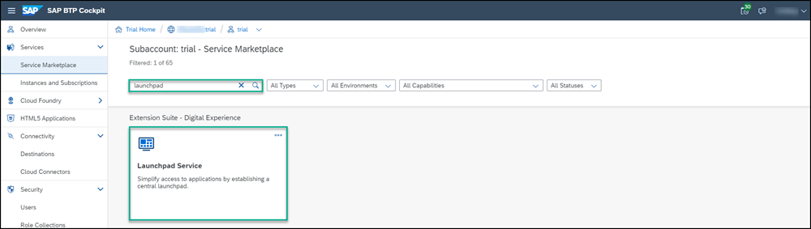
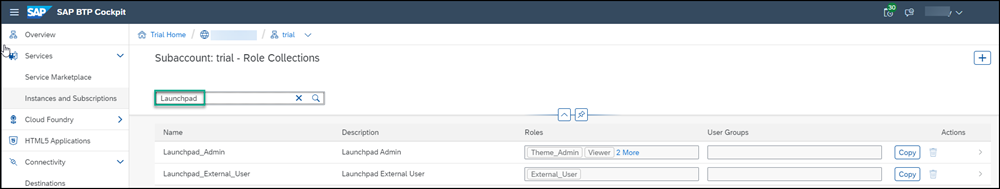
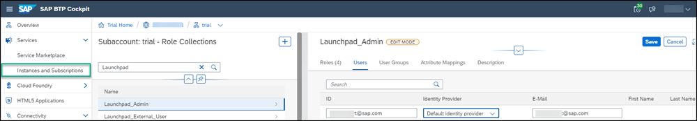

# Set Up SAP Build Work Zone, standard edition Using a Trial Account
<!-- description --> To get started with building a site in SAP Build Work Zone, standard edition, you must perform the required onboarding steps.

## Prerequisites
  - If you want to use a trial environment, you need to first register it. You can register to a trial account using this link: [Create a trial account](https://www.sap.com/israel/products/business-technology-platform/trial.html). Scroll down and click **Get trial now**.
  - If you're using a production environment, you should have a subaccount configured. If you don't have a configured subaccount, refer to this topic: [Initial Setup](https://help.sap.com/viewer/8c8e1958338140699bd4811b37b82ece/Cloud/en-US/fd79b232967545569d1ae4d8f691016b.html).

## You will learn
  - How to subscribe to SAP Build Work Zone, standard edition
  - How to assign yourself to the `Launchpad_Admin` role so that you can create and manage sites in SAP Build Work Zone, standard edition
  - How to access SAP Build Work Zone, standard edition

## Intro
    
>You can also do this tutorial using a SAP BTP free plan option. To do this, please follow this tutorial: [Set Up SAP Build Work Zone, standard edition Using the Free Tier Model for SAP BTP](cp-portal-cloud-foundry-setup-freetier).

In this group of tutorials our goal is to create a site using SAP Build Work Zone, standard edition. But before we can do this, there are some steps you'll need to do in the SAP BTP cockpit.

>SAP Build Work Zone, standard edition offers two types of standard plans. The **Applications Plan** which is used to access your applications from a site. In this case, you need to create a subscription to SAP Build Work Zone, standard edition, which you will do in Step 1. The 2nd plan is the **Service Plan** which is used to integrate with other services. This plan is not required for the scope of this tutorial.

### Subscribe to the SAP Build Work Zone, standard edition

Before you can access the SAP Build Work Zone, standard edition, you first need to subscribe to it.

1. [Log onto SAP BTP](https://cockpit.hanatrial.ondemand.com) and click **Go To Your Trial Account**.

    

    >If this is your first time accessing your trial account, you'll have to configure your account by choosing a region (select the region closest to you). Your user profile will be set up for you automatically.

    >Wait until your account is set up and ready to go. Your global account, your subaccount, your organization, and your space are launched. This may take a couple of minutes.  

2. Click **Continue** if you get this popup.

    

3. Click the **trial** tile to navigate to your trial subaccount in the SAP BTP cockpit. If you're using your own subaccount, you can select it instead.

      

4. Click **Service Marketplace** in the left navigation panel.

    > The Service Marketplace provides you access to all services and applications that you can access from the SAP BTP cockpit.

    

5. Enter `SAP Build` in the search box and click the **SAP Build Work Zone, standard edition** tile.

    

    >If you aren't able to find the **SAP Build Work Zone, standard edition** tile, or if you can't access it, you may be using an older trial account. You can easily add it to your account via the **Entitlements** area. Click **Configure Entitlements** and then **Add Service Plans**. Then search for `SAP Build Work Zone`, check the standard (applications) plan, and click **Add 1 Service Plan**. Don't forget to save in the next screen.

    The **SAP Build Work Zone, standard edition** Overview page opens.

6.  Under the **Applications Plans** tab, click the Actions icon (...) and select **Create** to create a new subscription.

    

    >You can also use the **Create** button at the top right of the screen.

7. In the **New Instance or Subscription** dialog box that opens, leave the basic information that appears there and click **Create**.

    

8. You'll get confirmation that your subscription is being created. Click **View Subscription**.

    

    >This step will redirect you to the **Services** -> **Instances and Subscriptions** screen. This screen provides you with an overview of all services and applications that are currently active.

9. From the **Instances and Subscriptions** screen, you'll see that you are subscribed to **SAP Build Work Zone, standard edition**.

    

### Add yourself to the Launchpad_Admin role

To be able to access **SAP Build Work Zone, standard edition**, users must be assigned to the `Launchpad_Admin` role. In this step, you'll assign yourself to this role so that you can access the service and create a site.

1. Under **"Security** click **Role Collections** from the side menu.

      <!-- border -->

2. In the Search field start typing `Launchpad` to find the `Launchpad_Admin` role collection.

    <!-- border -->

3. In the row with the `Launchpad_Admin` role collection, click the arrow at the far right of the row.

    <!-- border -->

    You can see all the details of the `Launchpad_Admin` role collection.

4. Click **Edit**

    <!-- border -->

5. Under the **Users** tab, enter your email in both the **ID** and the **E-Mail** fields. Then click **Save**.

    <!-- border -->

You've now been assigned to the `Launchpad_Admin` role collection and you can access **SAP Build Work Zone, standard edition** and carry out all your admin tasks.

> It may take a few minutes for the admin role assignment to take effect.  Until it does, you may get an **Access Denied** error when you click the tile or **Go to Application**.

### Access SAP Build Work Zone, standard edition

You are now ready to access **SAP Build Work Zone, standard edition**. 

1. From the side panel, click **Instances and Subscriptions**.

    

2. Under the **Subscriptions** tab, click  **SAP Build Work Zone, standard edition**.  You can also click **Go to Application** on the right.

    

   The **Site Directory** opens. This is where you'll create and manage your sites.

  
