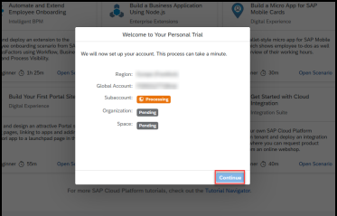
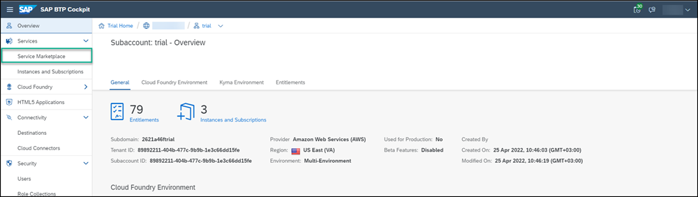
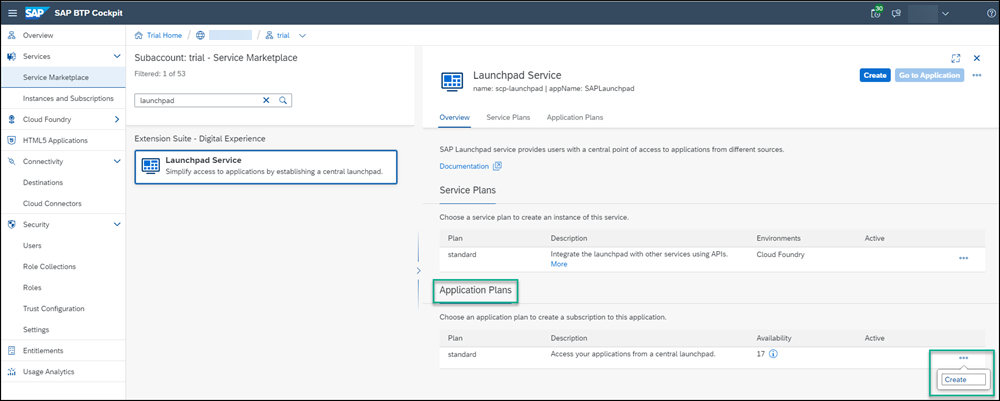
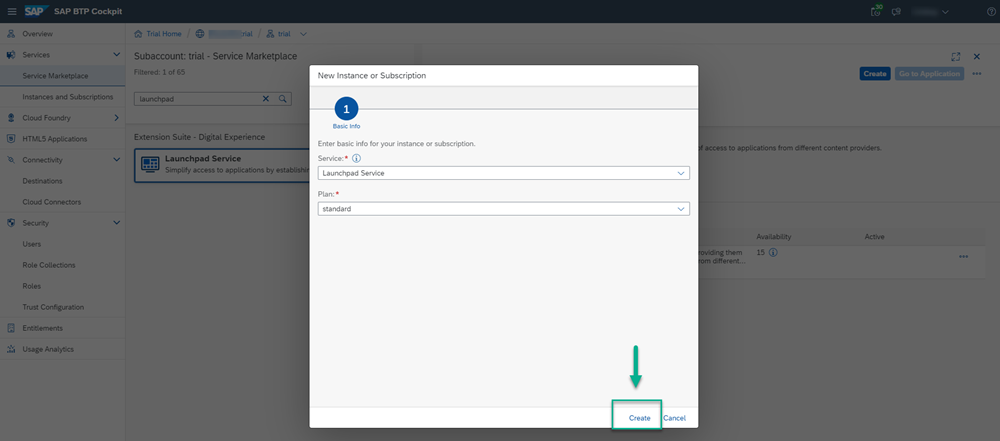
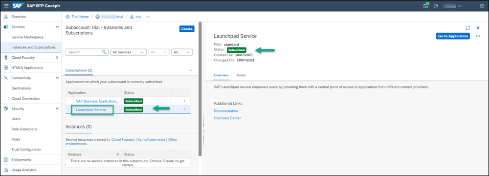
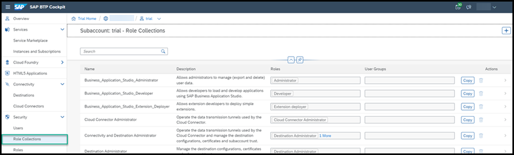
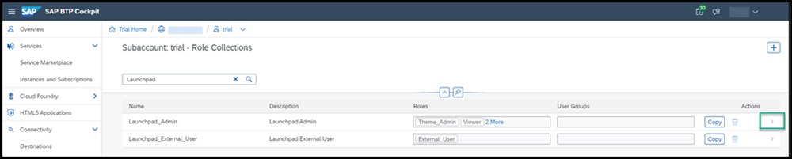
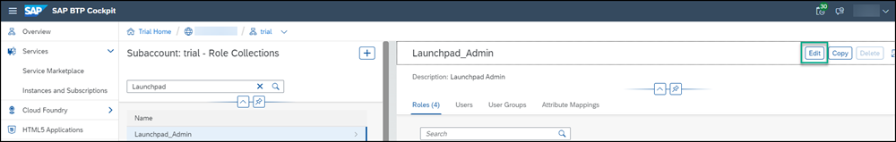
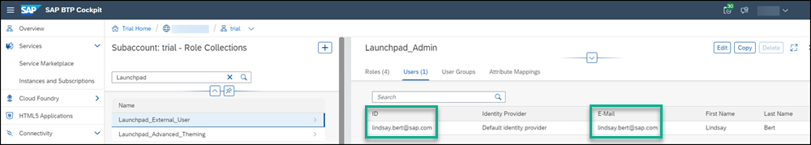
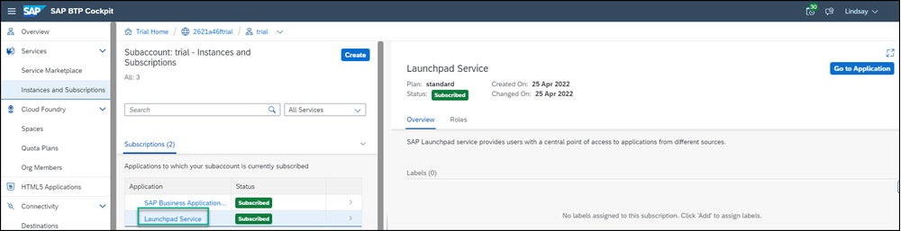

## Prerequisites
  - If you want to use a trial environment, you need to first register it. You can register to a trial account using this link: [Create a trial account](https://account.hanatrial.ondemand.com/trial/#/home/trial). For a more detailed explanation, see this tutorial: [Get a Free Account on SAP BTP Trial](hcp-create-trial-account)
  - If you're using a production environment, you should have a subaccount configured. If you don't have a configured subaccount, refer to this topic: [Initial Setup](https://help.sap.com/viewer/8c8e1958338140699bd4811b37b82ece/Cloud/en-US/fd79b232967545569d1ae4d8f691016b.html).

Note that you can also do this tutorial using a SAP BTP free plan option. To do this, please follow this tutorial: [Set Up SAP Launchpad Service Using the Free Tier Model for SAP BTP](cp-portal-cloud-foundry-setup-freetier).

## Details
### You will learn
  - How to subscribe to the SAP Launchpad service
  - How to assign yourself to the `Launchpad_Admin` role so that you can create and manage sites in the SAP Launchpad service
  - How to access the SAP Launchpad service

In this group of tutorials our goal is to create a launchpad site using the SAP Launchpad service. But before we can do this, there are some steps you'll need to do in the SAP BTP cockpit.

>Note that the SAP Launchpad service offers two types of standard plans. The **Applications Plan** which is used to access your applications from the launchpad. In this case, you need to create a subscription to the SAP Launchpad service, which you will do in Step 1. The 2nd plan is the **Service Plan** which is used to integrate with other services. This plan is not required for the scope of this tutorial.

[ACCORDION-BEGIN [Step 1: ](Subscribe to the SAP Launchpad service)]

Before you can access the SAP Launchpad service, you first need to subscribe to it.

1. [Log onto SAP BTP](https://cockpit.hanatrial.ondemand.com) and click **Go To Your Trial Account**.

    

    >If this is your first time accessing your trial account, you'll have to configure your account by choosing a region (select the region closest to you). Your user profile will be set up for you automatically.

    >Wait until your account is set up and ready to go. Your global account, your subaccount, your organization, and your space are launched. This may take a couple of minutes.  

2. Click **Continue** if you get this popup.

    

3. Click the **trial** tile to navigate to your trial subaccount in the SAP BTP cockpit. If you're using your own subaccount, you can select it instead.

      

4. Click **Service Marketplace** in the left navigation panel.

    > The Service Marketplace provides you access to all services and applications that you can access from the SAP BTP cockpit.

    

5. Enter `launchpad` in the search box and click the **Launchpad Service** tile.

    

    >If you aren't able to find the **Launchpad Service** tile, or if you can't access it, you may be using an older trial account. You can easily add it to your account via the **Entitlements** area. Click **Configure Entitlements** and then **Add Service Plans**. Then search for `launchpad`, check the standard (applications) plan, and click **Add 1 Service Plan**. Don't forget to save in the next screen.

    The Launchpad Service page opens with the **Overview** tab in focus as well as the **Applications Plans** tab.

6.  Under the **Applications Plans** tab, click the Actions icon (...) and select **Create** to create a new subscription.

    

    >You can also use the **Create** button at the top right of the screen.

7. In the **New Instance or Subscription** dialog box that opens, leave the basic information that appears there and click **Create**.

    

8. You'll get confirmation that your subscription is being created. Click **View Subscription**.

    

    >This step will redirect you to the **Services** -> **Instances and Subscriptions** screen. This screen provides you with an overview of all services and applications that are currently active.

9. From the **Instances and Subscriptions** screen, under the **Subscriptions** tab, or on the right under the service name, you'll see that you are subscribed to the **Launchpad Service**.

    

[DONE]
[ACCORDION-END]

[ACCORDION-BEGIN [Step 2: ](Add yourself to the Launchpad_Admin role)]

To be able to access the SAP Launchpad service, users must be assigned to the `Launchpad_Admin` role. In this step, you'll assign yourself to this role so that you can access the service and create a launchpad site.

1. Click **Role Collections** from the side menu.

      !

2. In the Search field start typing Launchpad to find the `Launchpad_Admin` role collection.

    !

3. In the row with the `Launchpad_Admin` role collection, click the arrow at the far right of the row.

    !

    You can see all the details of the `Launchpad_Admin` role collection.

4. Click **Edit**

    !

5. Under the **Users** tab, enter your email in both the **ID** and the **E-Mail** fields. Then click **Save**.

    !

You've now been assigned to the `Launchpad_Admin` role collection and you can access the SAP Launchpad service and carry out all your admin tasks.

> It may take a few minutes for the admin role assignment to take effect.  Until it does, you may get an **Access Denied** error when you click the launchpad tile or **Go to Application**.

[DONE]
[ACCORDION-END]

[ACCORDION-BEGIN [Step 3: ](Access the SAP Launchpad service)]

You are now ready to access the SAP Launchpad service.  

1. From the side panel, click **Instances and Subscriptions**.

    

2. Under the **Subscriptions** tab, click the **Launchpad Service**.  You can also click **Go to Application** on the right.

    

   The SAP Launchpad service opens with the Site Directory in focus. This is where you'll create and manage your launchpad sites.

  

[VALIDATE_6]

[ACCORDION-END]
