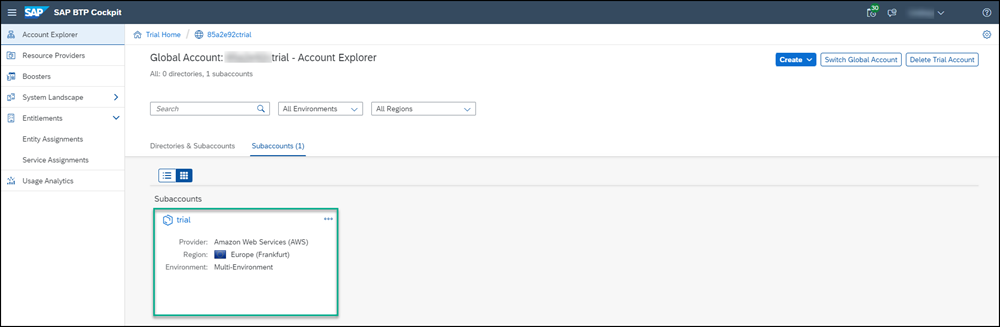
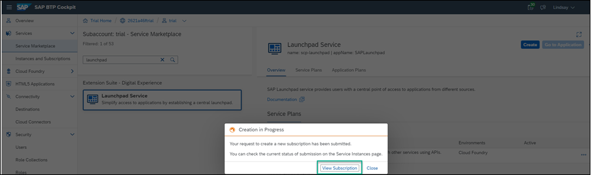
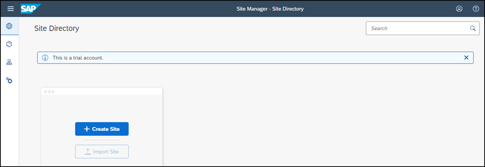

## Prerequisites
  - If you want to use a trial environment, you need to first register it. You can register to a trial account using this link: [Create a trial account](https://www.sap.com/cmp/td/sap-cloud-platform-trial.html).
  - If you're using a production environment, you should have a subaccount configured. If you don't have a configured subaccount, refer to this topic: [Initial Setup](https://help.sap.com/viewer/8c8e1958338140699bd4811b37b82ece/Cloud/en-US/fd79b232967545569d1ae4d8f691016b.html).

## Details
### You will learn
  - How to subscribe to the SAP Launchpad service
  - How to assign yourself to the `Launchpad_Admin` role so that you can create and manage sites in the SAP Launchpad service
  - How to access the SAP Launchpad service

In this group of tutorials our goal is to create a launchpad site using the SAP Launchpad service. But before we can do this, there are some steps you'll need to do in the SAP BTP cockpit.

[ACCORDION-BEGIN [Step 1: ](Subscribe to the SAP Launchpad service)]

Before you can access the SAP Launchpad service, you first need to subscribe to it.

1. [Log onto SAP BTP](https://cockpit.hanatrial.ondemand.com) and click **Enter Your Trial Account**.

    

    >If this is your first time accessing your trial account, you'll have to configure your account by choosing a region (select the region closest to you). Your user profile will be set up for you automatically.

    >Wait until your account is set up and ready to go. Your global account, your subaccount, your organization, and your space are launched. This may take a couple of minutes.  

2. Click **Continue**.

    

3. Click the **trial** tile to navigate to your trial subaccount in the SAP BTP cockpit. If you're using your own subaccount, you can select it instead.

      

4. Click **Go to Marketplace**. Alternatively, you can navigate to the service marketplace by clicking on the  **Services** menu item and selecting **Service Marketplace**.

    > The Service Marketplace provides you access to all services and applications that you can access from the SAP BTP cockpit.

    

5. Enter `launchpad` in the search box and click the **Launchpad Service** tile.

    

    >If you aren't able to find the **Launchpad Service** tile, or if you can't access it, you may be using an older trial account. You can easily add it to your account via the **Entitlements** area. Click **Configure Entitlements** and then **Add Service Plans**. Then search for `launchpad`, check the standard plan, and click **Add 1 Service Plan**. Don't forget to save in the next screen.

6. From the **Overview** tab on the right, click the Actions icon (...) and select **Create** in the opened menu to create a new subscription.

    

    >You can also use the **Create** button at the top right of the screen.

7. In the **New Instance or Subscription** dialog box that opens, leave the basic information that appears there and click **Create**.

    

8. You'll get confirmation that your subscription is being created. Click **View Subscription**.

    

    >This step will redirect you to the **Services** -> **Instances and Subscriptions** screen. This screen provides you with an overview of all services and applications that are currently active.

9. From the **Instances and Subscriptions** screen, you'll see that you are subscribed to the SAP Launchpad service.

    

[DONE]
[ACCORDION-END]

[ACCORDION-BEGIN [Step 2: ](Add yourself to the Launchpad_Admin role)]

To be able to access the **SAP Launchpad** service, users must be assigned to the `Launchpad_Admin` role. In this step, you'll assign yourself to this role so that you can access the service and create a launchpad site.

1. Click **Security > Trust Configuration** from the side menu.

    

2. Click `Default identity provider` to select the SAP ID Service.

    

3. Enter your email address and then click **Show Assignments**.

    

4. Click **Assign Role Collection**.

    

5. Select the `Launchpad_Admin` role and then click **Assign Role Collection**.

    

You have now been assigned to the `Launchpad_Admin` role and you can access the SAP Launchpad service and carry out all your admin tasks.

[DONE]
[ACCORDION-END]

[ACCORDION-BEGIN [Step 3: ](Access the SAP Launchpad service)]

You are now ready to access the SAP Launchpad service.  

1. Use the breadcrumbs to open your trial account.

    

2. Click **Instances and Subscriptions** from the side panel, click the **Subscriptions** tab, click the Actions icon (...) on the right, and select **Go to Application**.

    

   The SAP Launchpad service opens with the Site Directory in focus. This is where you'll create and manage your launchpad sites.

  

[VALIDATE_6]

[ACCORDION-END]
