# Integrate Your UI Integration Card from the Content Package Into Your Site
<!-- description --> Integrate a card from your content package into your SAP Build Work Zone, standard edition site.  

## Prerequisites
 - You've created a content pakage that includes a UI integration card with its associated role
 - You've successfully deployed the card into a ZIP file and downloaded it on to your computer
 - You have a subscription to SAP Build Work Zone, standard edition
 
## You will learn
- How to integrate the UI integration card that you created

## Intro 
In this tutorial, you'll learn how to integrate the card and role from the content package that you created in SAP Business Application Studio.  

### Open your SAP Build Work Zone, standard edition site

From the SAP BTP cockpit, go to **Instances and Subscriptions** and click `SAP Build Work Zone, standard edition` to open the service.

<!-- border -->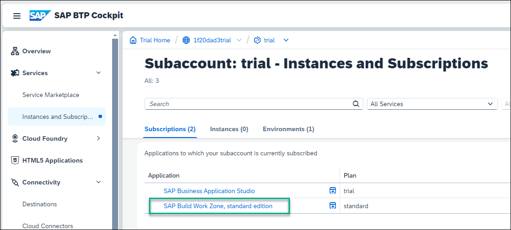

The **Site Directory** opens.

<!-- border -->

### Upload your content package

1. Click the **Channel Manager** icon in the side navigation panel to open it.

    <!-- border -->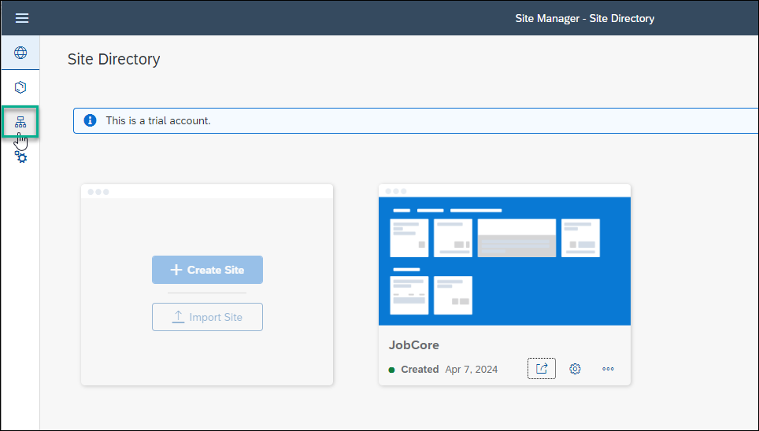

2. Click **+ New** and select **Content Package**.

    <!-- border -->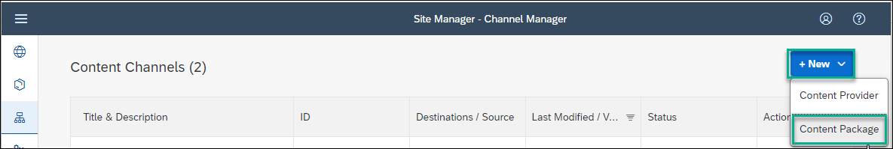

3. In the **New Content Package** dialog box, browse for and select the ZIP file that you downloaded in the previous tutorial. You'll find the ZIP file in your **Downloads** folder on your computer. 

    <!-- border -->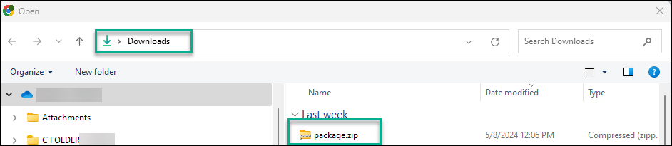

4. In the **Runtime Destination** field, select `ES5`, and leave the default values in the other fields. Click **Save**.

    <!-- border -->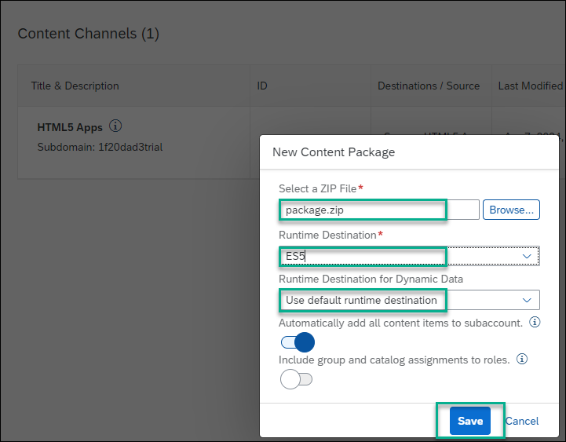

    Once you've saved the content package properties, the ZIP file is created in the **Channel Manager**.  
    
5. Click **Report** to check the content of the package. It should look like this showing that your content package includes a role and an app:

    <!-- border -->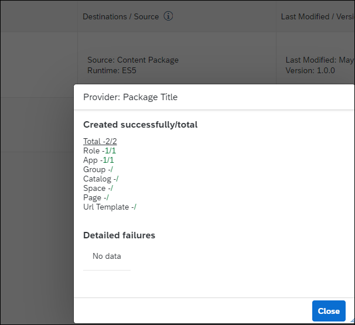

### Assign yourself to the ContentPackageRole

The `ContentPackageRole` is part of the content in the content package ZIP file.

1. Go back to the SAP BTP Cockpit using the **Instances and Subscriptions** tab in your browser.

    <!-- border -->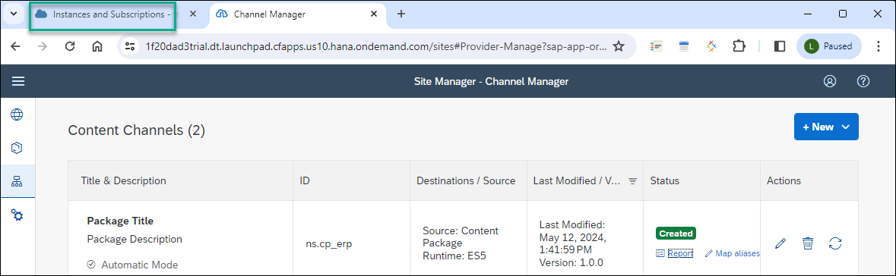

2. From the side menu, go to **Security** --> **Role Collections** and search for the `ContentPackageRole`.

    <!-- border -->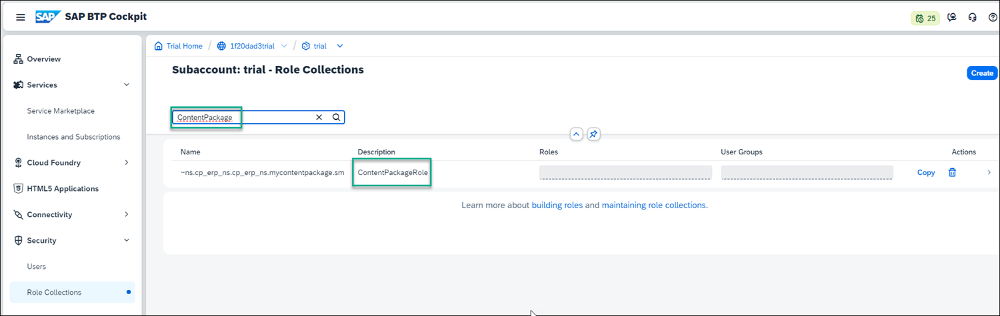

3. Click the arrow at the far right of the row displaying the `ContentPackageRole`.

    <!-- border -->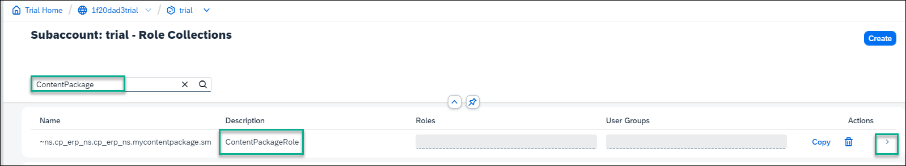

4. In the screen that opens, click **Edit**.
  
    <!-- border -->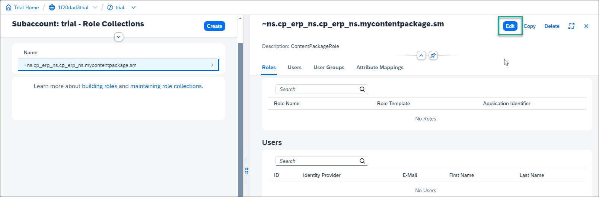

4. In the **Users** section of the screen, add your ID (your email), and then your email again and add it to the list of users by clicking the **+** button. Save your changes.

    <!-- border -->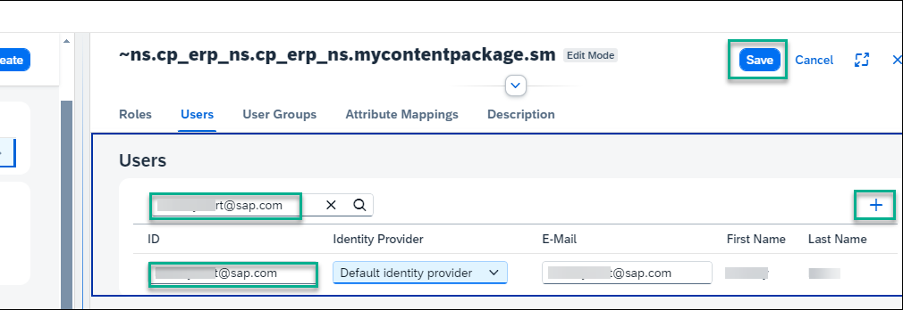

### Ensure that the app is assigned to the ContentPackageRole

To do this, go to the Content Manager in SAP Build Work Zone, standard edition.

1. Click  **Services** --> **Instances and Subscriptions** in the side panel of the SAP BTP cockpit, select the **SAP Build Work Zone, standard edition** service and then **Go to Application**..

    <!-- border -->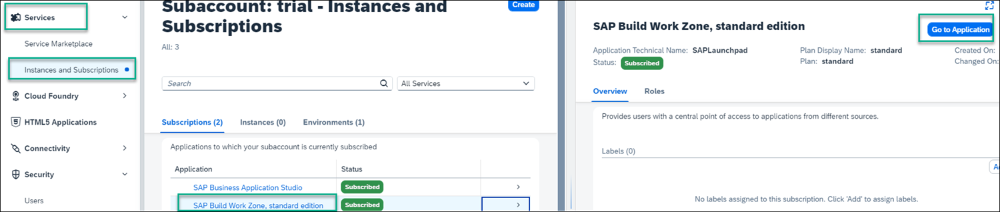

2. From the side panel, open the **Content Manager**.

    <!-- border -->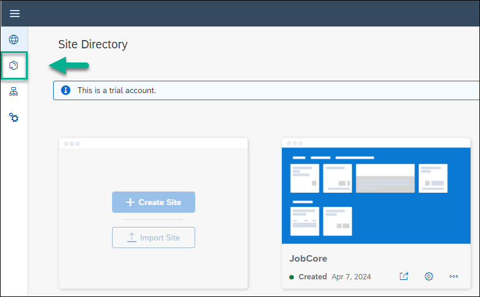 

3. Click the `ContentPackageRole` to open the role editor.

    <!-- border -->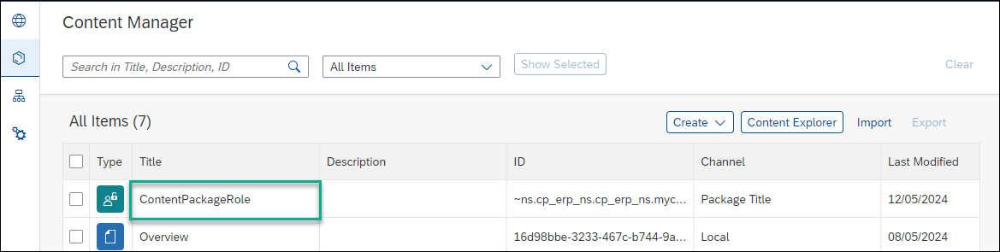

4. Under the **Apps** tab, you should see the `Products by Category Card`. This means that the card is assigned to this role. 

    <!-- border -->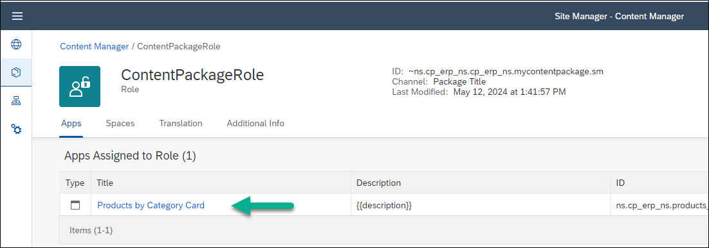

### Assign the ContentPackageRole to the site

1. Open the **Site Directory**.

    <!-- border -->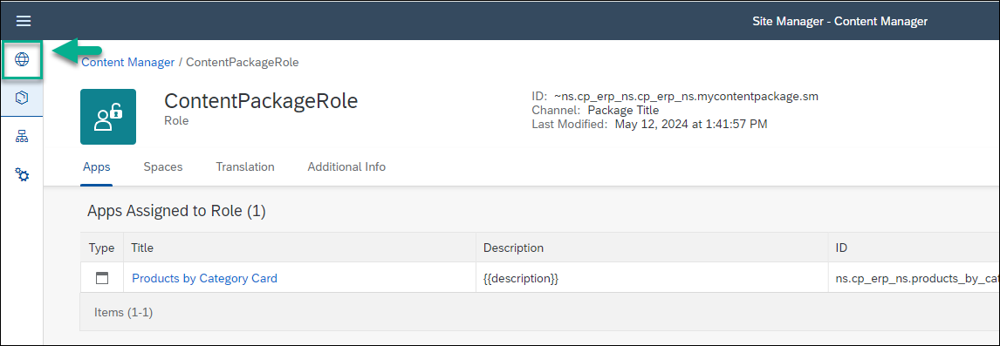

2. Open the **Site Settings** screen.

    <!-- border -->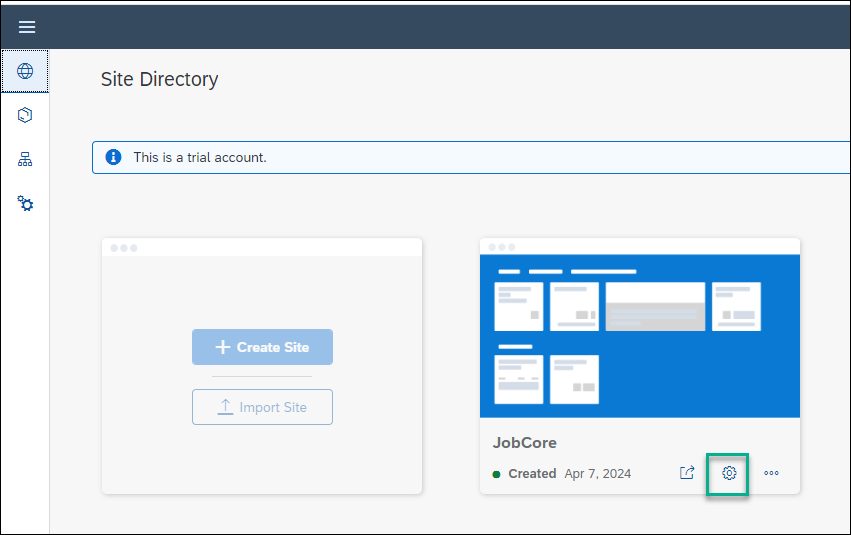

3. In the **Assignments** panel, click inside the search box to open a list of available roles. You'll see the `ContentPackageRole`. Assign it to the site by clicking the **+** next to the role name and then click **Save**.

    <!-- border -->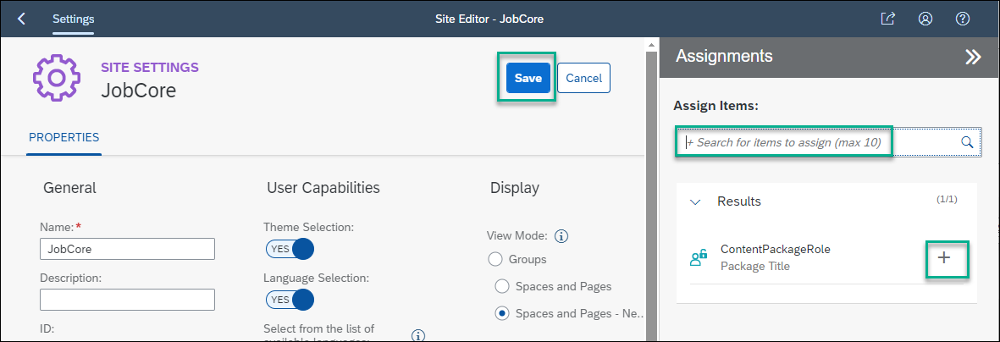    

### Add a header in your page

1. Go back to the Site Manager using the back arrow.

    <!-- border -->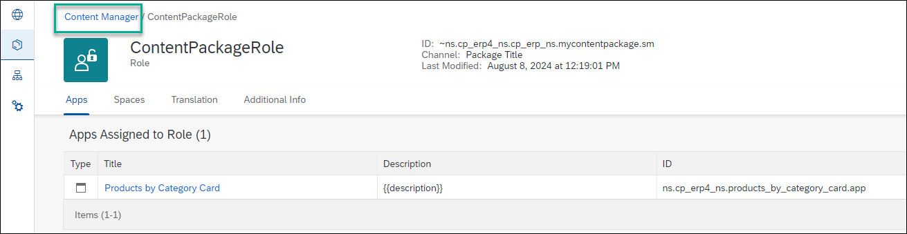

2. Open the Content Manager.

     <!-- border -->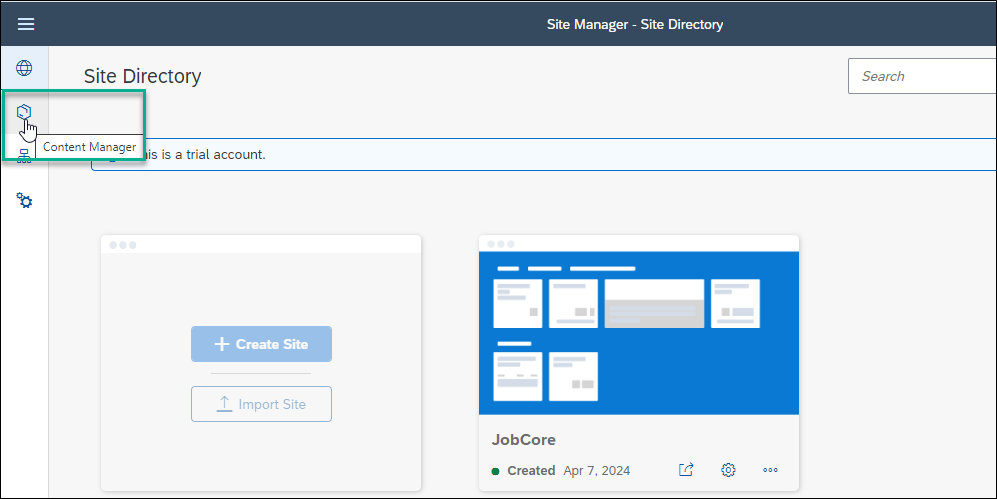

3. Click the `Overview` page to open the page editor.

    <!-- border -->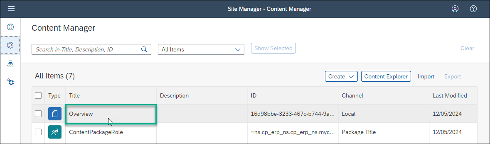

4. Click **Edit**.

5. In the section where you've added the card, enter `My Card` as the **Section Title** and click **Save**.

    <!-- border -->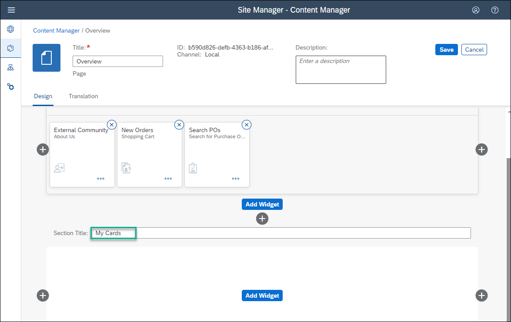

### View the card in your runtime site

1. Click the **Site Directory** icon.

    <!-- border -->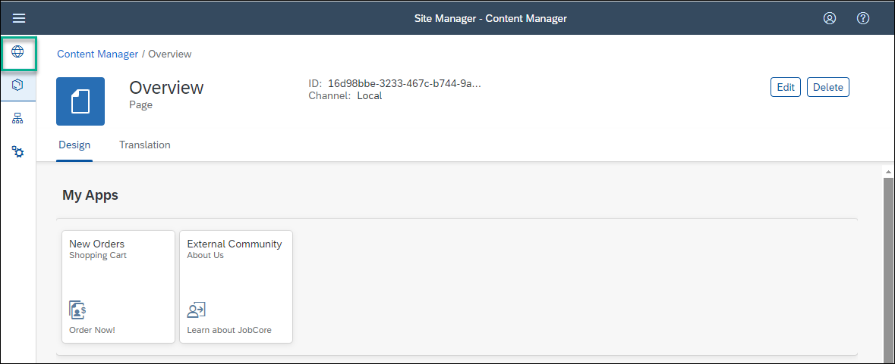   

2. Click on the **Go to site** icon.

     <!-- border -->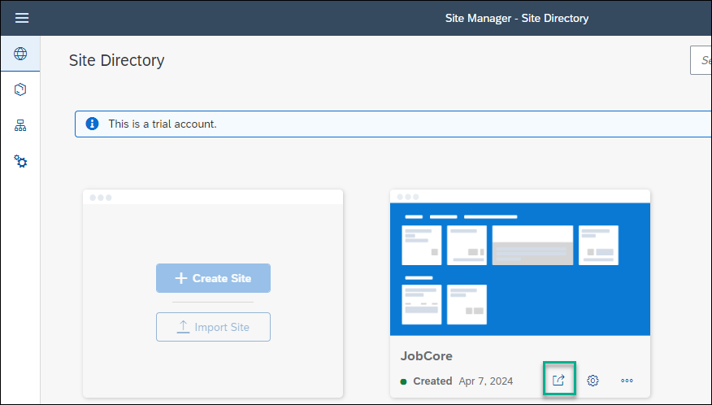 

3. This is what you'll see:

    <!-- border -->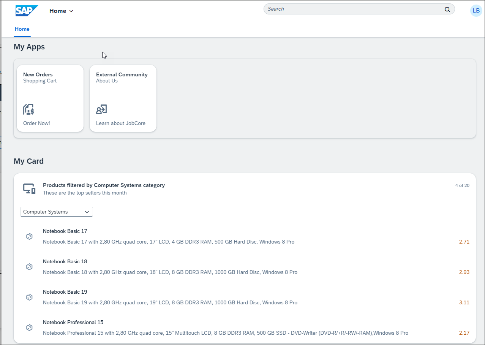 