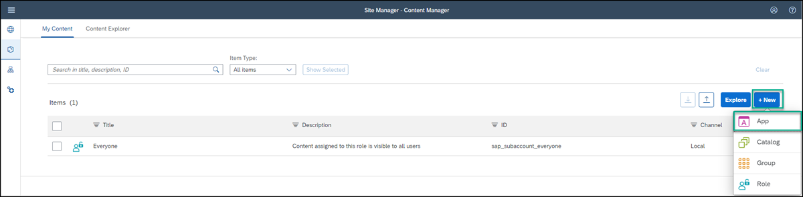
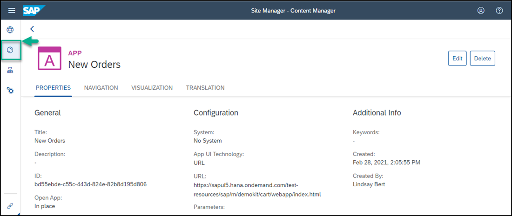

# Integrate an SAPUI5 App to SAP Build Work Zone
<!-- description --> Add an existing SAPUI5 app to a site in the SAP Build Work Zone, standard edition.

## Prerequisites
 - You've already created the `JobCore` site

## You will learn
  - How to add an existing SAPUI5 app to your site

## Intro
In this tutorial, you'll use the **Content Manager** to add apps to SAP Build Work Zone.

### Open Content Manager

 Click the Content Manager icon in the side panel to open the **Content Manager**.

> When you open the **Content Manager** you'll see a list of content items that have been added to your subaccount. From here you can manually configure new content items and view any other available content items. You can also access the **Content Explorer** where you can explore exposed content from available channels, select the content, and add it to your own content.

  <!-- border -->

### Create and configure new app

1.  Click **Create** and select **App** from the list.  

    <!-- border -->

2. In the header area of the app editor, enter a title `New Orders`.  

    <!-- border -->

3. Under the **Configuration** tab, enter the following values (some will already be there by default):

    * **Open App**: In place

    * **System**: No System

    * **App UI Technology**: URL

    * **URL**:  `https://sapui5.hana.ondemand.com/test-resources/sap/m/demokit/cart/webapp/index.html`

    <!-- border -->

    > When working in your own environment, it's better to integrate SAPUI5 apps by configuring a destination to the relevant system and setting the app properties to use this destination. In this case in the  **App UI Technology** dropdown list, you would select `SAPUI5`. This configuration allows you to better manage your content in the Dev-QA-Prod lifecycle.

4. Click the **Navigation** tab to specify the intent of your app.

    > The unique combination of a semantic object and an action is called an intent. It is used to define navigation to an application.

5. Enter the following values:

    * **Semantic Object**: `Order`

    * **Action**: `Display`

    <!-- border -->

6. Click the **Visualization** tab.

    In this tab, you specify how the app will be displayed in the site.

7. Enter the following values:

      * **Subtitle**: `Shopping Cart `

      * **Information**:  `Order Now!`

      * **Icon**: Click the browse icon, type `my-sales-order`, and click on the displayed icon to add it to your tile.

8. On the right, you can see a preview of the tile with all the properties you entered. Click **Save**.

    <!-- border -->

### View the app that you created

Go back to the Content Manager by clicking on the breadcrumbs.

  <!-- border -->

You can see your app in the list of content items:

  <!-- border -->

For end users to access the app in runtime, you must assign the app to a role. 

### Assign the app to the Everyone role

> Content assigned to the `Everyone` role is visible to all users.

1. Click the **Everyone** role.

    <!-- border -->

2. Click **Edit**.

    <!-- border -->

3. Under the **Apps** tab, you'll see that your `New Orders` app has an **X** in the **Assignment Status** column. Click the toggle to assign the app to the `Everyone` role.

    <!-- border -->

    
    > If you have many apps, you can type some letters of your app name in the search bar, (for example, `Or`) to search for the app.

4. Click **Save**.

You've successfully created an SAPUI5 app. In the next tutorial, you'll create another app (URL app) and then you'll add both apps to a page.

