## Prerequisites
 - You've already created the `JobCore` site.  

## Details
### You will learn
  - How to add an existing SAPUI5 app to your launchpad site

In this tutorial, you'll use the **Content Manager** to add an SAPUI5 app to your launchpad site.

[ACCORDION-BEGIN [Step 1: ](Open Content Manager)]

 Click the Content Manager icon in the side panel to open the **Content Manager**.

>The **Content Manager** has two tabs: **My Content** where you can manually configure content items and view any other available content items, and the **Content Explorer** where you can explore exposed content from available content providers, select the content, and add it to your own content.

  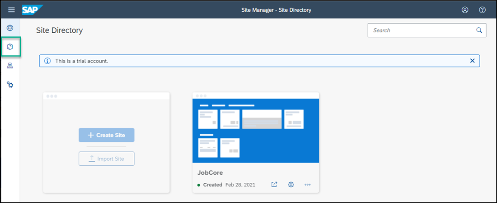

[DONE]
[ACCORDION-END]

[ACCORDION-BEGIN [Step 2: ](Create and configure new app)]

1.  Click **+ New** and select **App** from the list.  

    

    The app editor opens with the **PROPERTIES** tab in focus.

2. Enter the following values:

    * **Title**: `New Orders`

    * **Open App**: In place

    * **URL**:  `https://sapui5.hana.ondemand.com/test-resources/sap/m/demokit/cart/webapp/index.html`

    !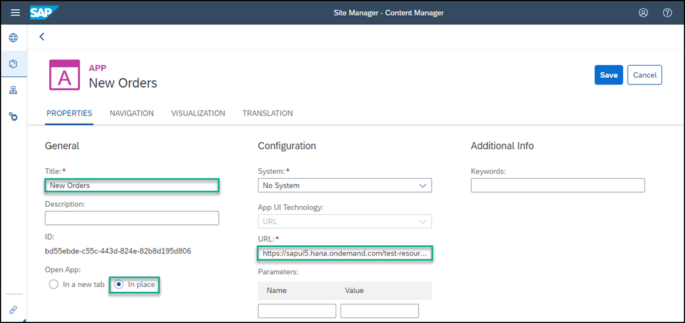

    >When working in your own environment, it is better to integrate SAPUI5 apps by configuring a destination to the relevant system and setting the app properties to use this destination. In this case in the  **App UI Technology** dropdown list, you would select `SAPUI5`. This configuration allows you to better manage your content in the Dev-QA-Prod lifecycle.

3. Click the **NAVIGATION** tab to specify the intent of your app.

    > The unique combination of a semantic object and an action is called an intent. It is used to define navigation to an application.

4. Enter the following values:

    * **Semantic Object**: `Order`

    * **Action**: `Display`

    !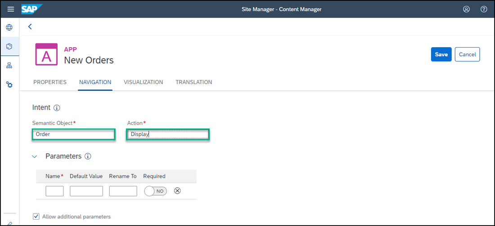

5. Click the **VISUALIZATION** tab.

    In this tab, you specify how the app will be displayed in the launchpad site.

6. Enter the following values:

      * **Subtitle**: `Shopping Cart `

      * **Information**:  `Order Now!`

      * **Icon**: Click the browse icon, type `my-sales-order`, click on the displayed icon, and click **OK**.

      On the right, you can see a preview of the tile with all the properties you entered.
      Click **Save**.

    !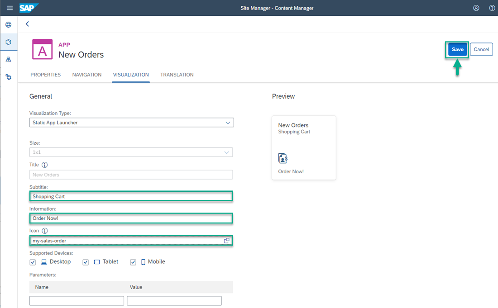

[DONE]
[ACCORDION-END]

[ACCORDION-BEGIN [Step 3: ](View the app that you created)]

Click the Content Manager icon in the left side panel to navigate back to the **Content Manager**.

  !

You can see your app in the list of content items:

!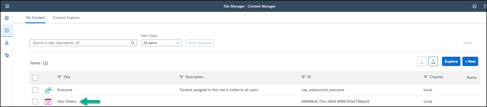

For end users to access the app in runtime, you must assign the app to a role. You also need to assign the app to a group so that it's visible in the site.

This is described in the following steps.

[DONE]
[ACCORDION-END]

[ACCORDION-BEGIN [Step 4: ](Assign the app to the Everyone role)]

>Content assigned to the `Everyone` role is visible to all users.

1. Select the **Everyone** role.

    !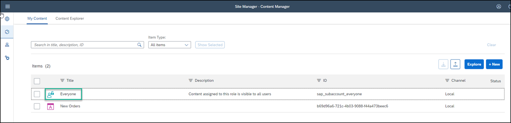

2. Click **Edit**.

    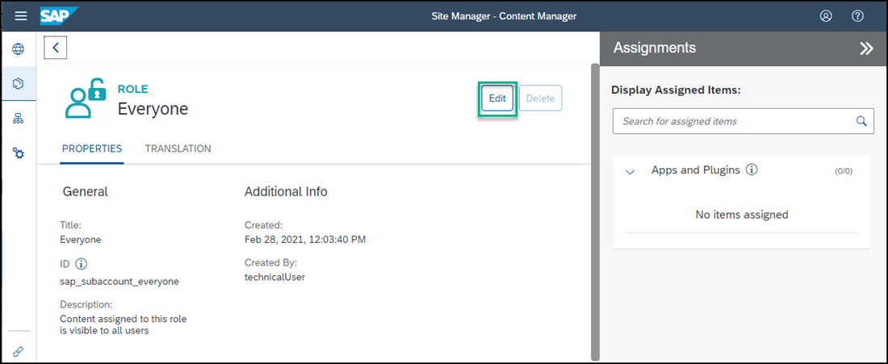

3. Click the search box in the **Assignments** panel on the right. Any available apps are shown in the list below.

    >If you have many apps, you can type some letters of your app name in the search bar, (for example, `Or`) to search for the app.

4. In the **Results** list, click the **+** icon next to the `New Orders` app to assign this role to your app.

    !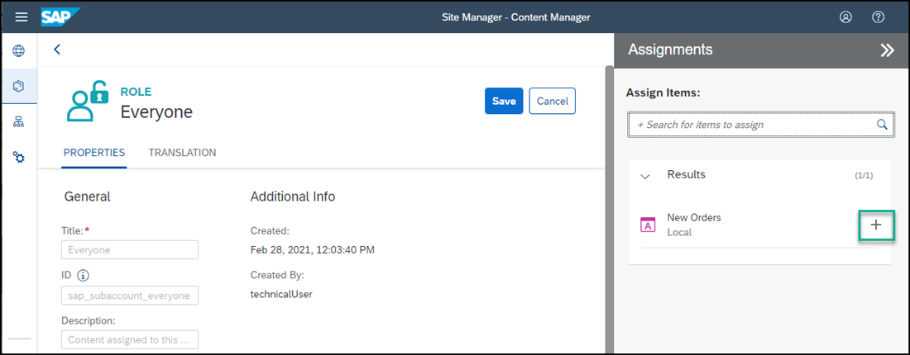

    You'll see that the icon changes.

5. Click **Save**.

[DONE]
[ACCORDION-END]

[ACCORDION-BEGIN [Step 5: ](Create a group and assign the app to it)]

>A group is a set of one or more apps displayed together in a launchpad site.
 Assigning apps to groups, makes them visible to the user.

1. Click the Content Manager icon to navigate back to the **Content Manager**.

2. Click **+ New** and select **Group** to create a group.

    !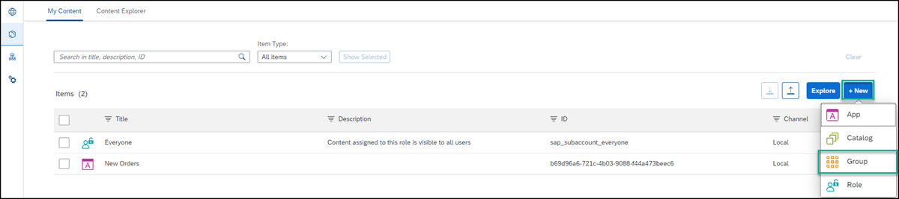

2. Enter `Purchasing` as the **Title** and in the **Assignments** panel, click inside the search box on the right of the screen, to show all available apps. You should see `New Orders`.

3. In the **Results** list, click **+** to assign the `New Orders` app to your group.

    !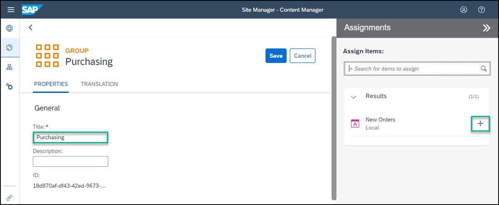

4. Click **Save**.

    

[DONE]
[ACCORDION-END]

[ACCORDION-BEGIN [Step 6: ](Review the site)]

1. Click the Site Directory icon in the left panel to open the **Site Directory**.

    !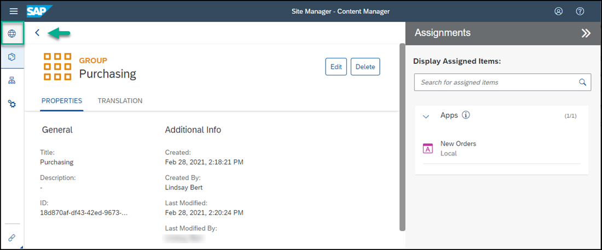

2. On the `JobCore` tile, click the **Go to site** icon.

    !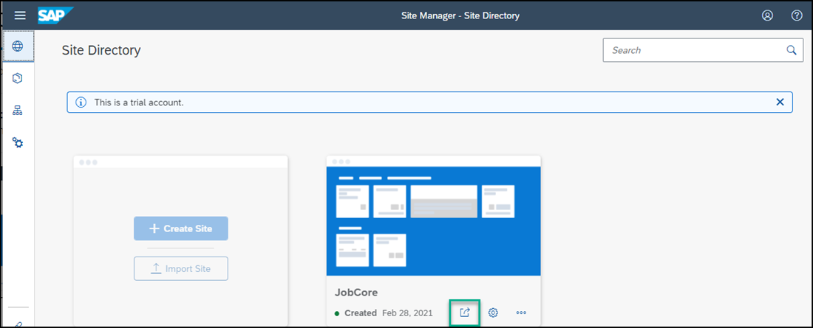

3. This is what you'll see:

    !

    Your `New Orders` app is displayed in the `Purchasing` group.

4. Click the `New Orders` tile to launch the app. You can click on the different items in the opened app on the left to view their details.

You've successfully added an app to your launchpad site. In the next tutorial, you'll add another app.

[VALIDATE_6]
[ACCORDION-END]
