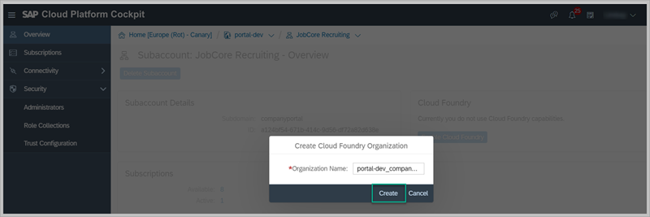
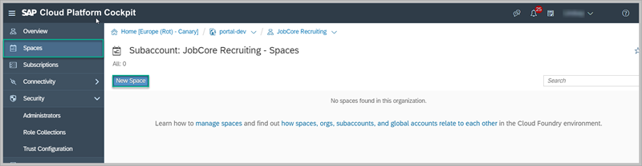
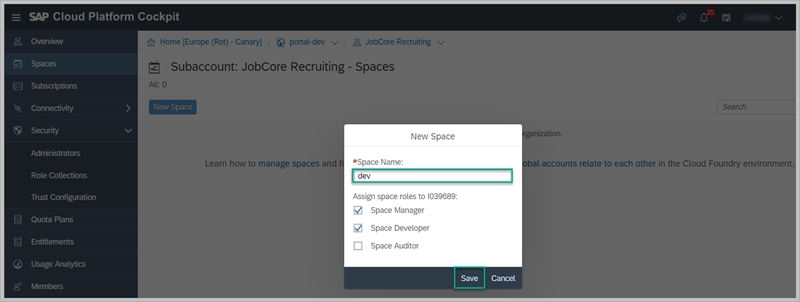
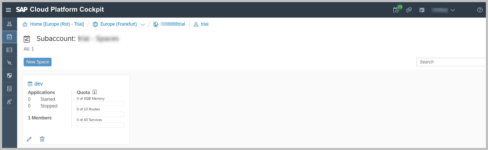

## Details
### You will learn
  - How to prepare the Cloud Foundry subaccount for development in a non-trial account.

By default, your subaccount is configured to subscribe to content. If you intend to add your own developed content, you need to configure the subaccount.

Our overall goal in this group of tutorials is to create apps in SAP Web IDE and make them available for use in a Portal site. Since you'll be developing and deploying apps in the Cloud Foundry environment, you  will need a space. The space provides you with all the services you need to develop your app.

[ACCORDION-BEGIN [Step 1: ](Set up your own subaccount for development )]

1. In your SAP Cloud Platform global account, click your subaccount and then click **Enable Cloud Foundry**.

    

2. In the popup that opens, enter the **Organization Name** as `portal-dev_companyportal` and click **Create**.

    > An organization is a development account.

    

    Once you've created the Organization, a **Spaces** menu is added to the side navigation panel.

3. Click **Spaces** and then click **New Space**.

    

4. Enter `dev` as the **Space Name** and click **Save**.

    

Before you can continue developing, you should make sure you have enough resources available such as memory. For example, in the image below, you can see that our Space currently has a free memory of 4GB. If you do not have available memory or run into issues, contact your SAP Cloud Platform administrator and ask them to provide the relevant entitlements and quotas.

Your subaccount should have the following entitlements:

-	Application Runtime

-	Portal

- HTML5 Applications

[DONE]
[ACCORDION-END]

[ACCORDION-BEGIN [Step 2: ](Test yourself)]

[VALIDATE_7]
[ACCORDION-END]
