## Prerequisites
 You've created a SAP HTML5 module in SAP Web IDE and deployed it to your SAP Cloud Platform subaccount.
 For more information about how to create the app, see the tutorial: [Develop Your First SAP Fiori App for Use in a Portal Site on SAP Cloud Platform on Cloud Foundry](https://developers.sap.com/tutorials/cp-portal-cloud-foundry-create-app.html).

### You will learn

  - How to consume your own developed apps in a Portal site
  - How to add the app to the `Launchpad` page in your Portal site.

The `Launchpad` page in your `JobCore Portal` site already contains a URL app. In this tutorial, you're going to add the SAP Fiori app that you created in SAP Web IDE to a different group in the launchpad of your Portal site.  

To consume apps that you created in the Portal, you first need to configure a destination to your developed content.

The entry point for your developed content is the App Router URL of the MTA file that you developed. So first you'll find the URL of the App Router of your deployed MTA file and then you'll add a destination to this App Router.

[ACCORDION-BEGIN [Step 1: ](Find App Router URL of deployed MTA file)]

1. Open your subaccount and click **Spaces** in the left navigation panel.

    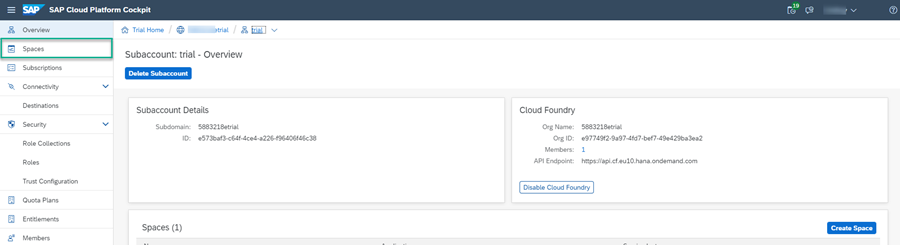

2. Click the `dev` space.

    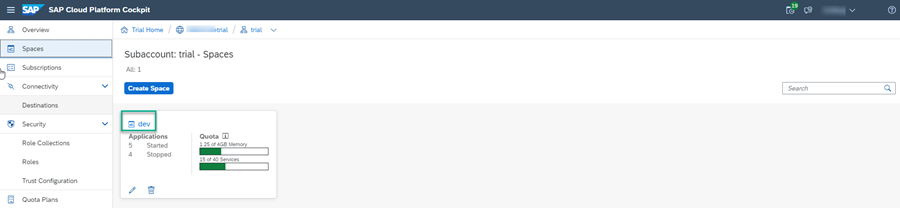

3. Click the `mta_FioriDemo_appRouter` app.

    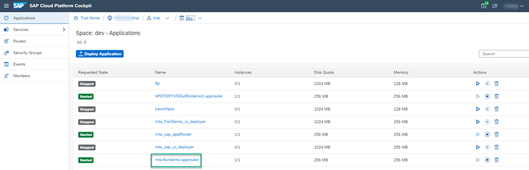

4. Under **Application Routes**, copy the App Router URL and save it. You will need it when you create a destination in the next step of this tutorial.

    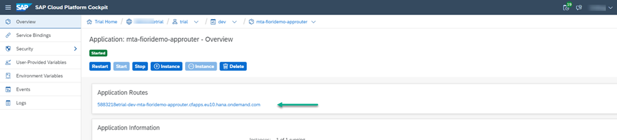

Now you are ready to create a destination to your SAP HTML5 app in SAP Cloud Platform.

[DONE]
[ACCORDION-END]

[ACCORDION-BEGIN [Step 2: ](Create destination to SAPUI5 app)]

1. Open your trial or other subaccount, and in the side navigation panel, click **Connectivity > Destinations**. Then click **New Destination**.

    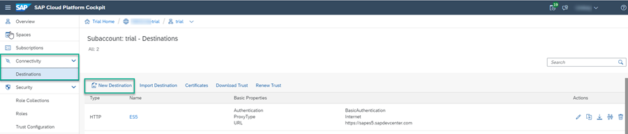

2. Enter the following properties:

    |  Property     | Value
    |  :------------- | :-------------
    |  Name           | **`JobCoreApps`**
    |  Type           | **`HTTP`**
    |  URL          | **`https://<id>trial-trial-dev-mta-fioridemo-approuter.cfapps.eu10.hana.ondemand.com/`** where `<id>` is your ID number
    |  Proxy Type   | **`Internet`**
    |  Authentication | **`NoAuthentication`**

      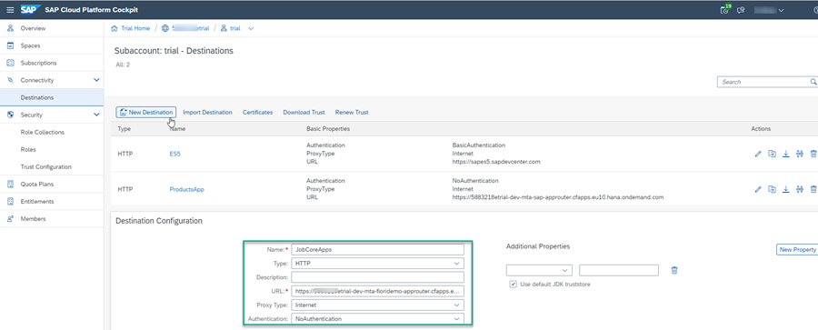

    >Note that the URL is the App Router URL that you saved in step 1.

3. Click **New Property**

    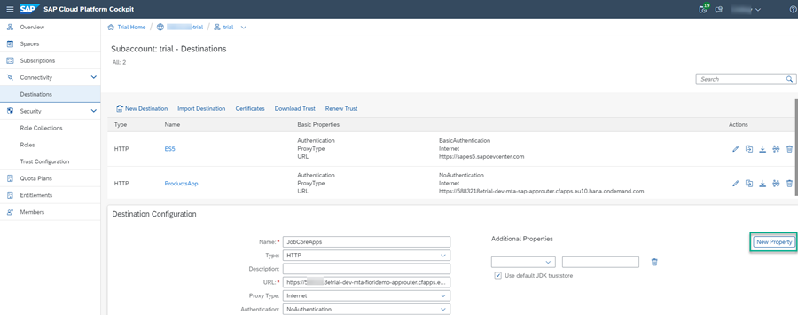

4. Add the following additional property: sap-platform = **`CF`**

    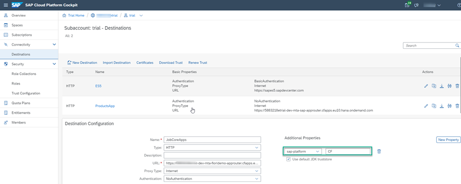

5. Click **Save**.

[DONE]
[ACCORDION-END]

[ACCORDION-BEGIN [Step 3: ](Open the Content Manager of your Portal site)]

1. In the side navigation panel of your trial account or subaccount, click **Subscriptions** and enter `Portal` in the search bar. Then click the **Portal** tile and **Go to Application**. The Site Manager opens with the Site Directory in focus.

    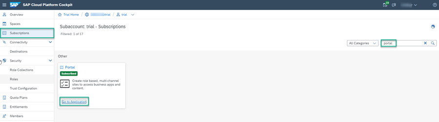

2. Click the icon in the side panel of the Site Manager to open the **Content Manager**.

    

[DONE]
[ACCORDION-END]

[ACCORDION-BEGIN [Step 4: ](Add your app to the site)]

1. In the Content Manager, click **+ New** > **App**.

    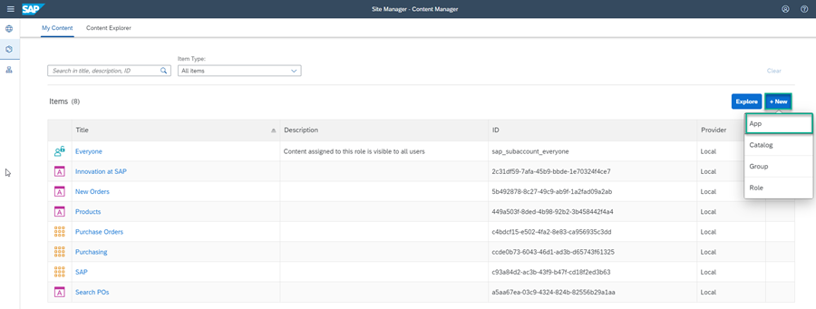

2. In the **PROPERTIES** tab enter the following values:

    |  Field Name     | Value
    |  :------------- | :-------------
    |  Title           | `Candidates`
    |  System           | `JobCoreApps` (this is the name of the system that your app is running on - same name as the destination name).   Note that it may take several minutes until the destination that you created in step 2 appears in the **System** list.
    |  App UI Technology    | `SAPUI5` (this is the type of app that you are adding).
    |  SAPUI5 Component Name          | `mynamespace.FioriDemo`  - this is the registered name of the SAPUI5 component. To get this name,  ask your developer to open the `component.js` file in SAP Web IDE - it is defined in the `component.js` file without the `.component` suffix as shown here: 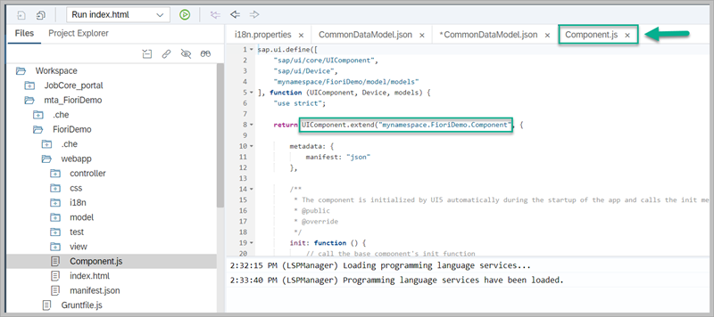

    Your screen will look like this:

    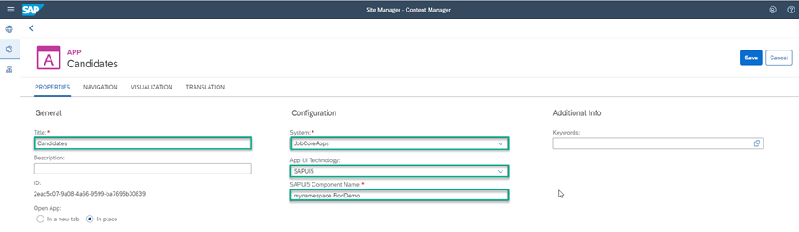

3. Click the **Navigation** tab and enter the following intent:

    -	Semantic Object: `candidates`

    -	Object: `display`

    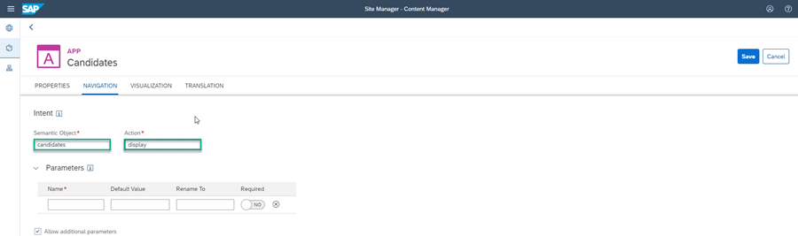

4. Click the **Visualization** tab.

5. Leave the **Title** as is and then enter the other properties as follows:

    -	Subtitle: `Developers`

    -	Information: `Current recruits`

    -	Icon: Click the browse icon, type `idea-wall`, select the displayed icon, and click **OK**.

    Then click **Save**

      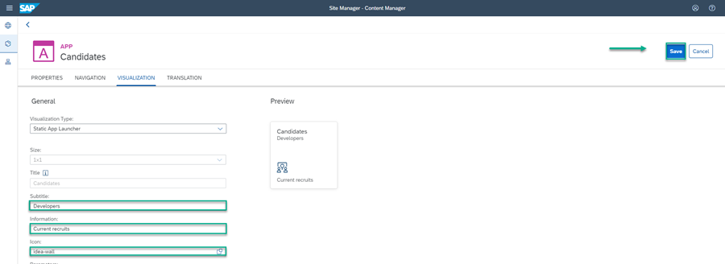

7. Go back to the Content Manager.

    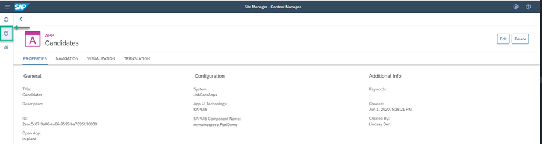

    You can see that your new app is in the content items list.

    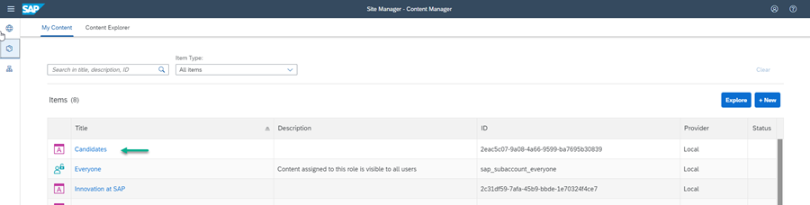

You can now integrate this app with your Portal site and add it to the `Launchpad`.

To make the app visible in the `Launchpad`, you need to assign it to a group. You also need to assign the app to a role.
This is exactly what you're going to do in the next two steps.

[DONE]
[ACCORDION-END]

[ACCORDION-BEGIN [Step 5: ](Assign your app to a group)]

In this step you're going to create a new group and you'll assign the `Candidates` app to it.

1. Click **+ New** in the Content Manager and click **Group** to open the Group editor.

    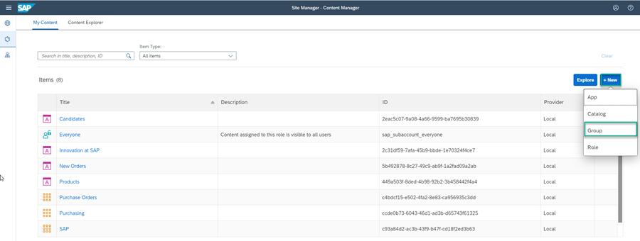

2. Enter `Work in Progress` as the **Title**.

3. In the **Assignments** panel on the right, type `ca` to search for your `Candidates` app and the click the **+** to assign your app to this group.

4. Click **Save**.

    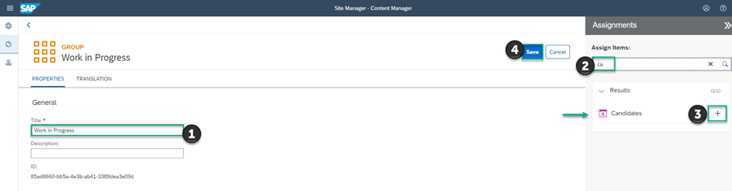

[DONE]
[ACCORDION-END]

[ACCORDION-BEGIN [Step 6: ](Assign your app to the Everyone role)]

 In this step, you'll assign the `Candidates` app to the `Everyone` role. This is a default role - content assigned to the `Everyone` role is visible to all users.

1. Go back to the Content Manager.

2. Click the `Everyone` role to open the Role editor.

    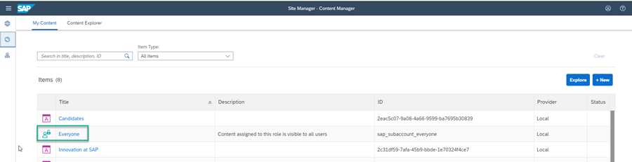

3. Click **Edit**.

4. Search for your app. Type `ca` in the search field to find the `Candidates` app and then click **+** to assign the `Everyone` role to it. And then click **Save**.

  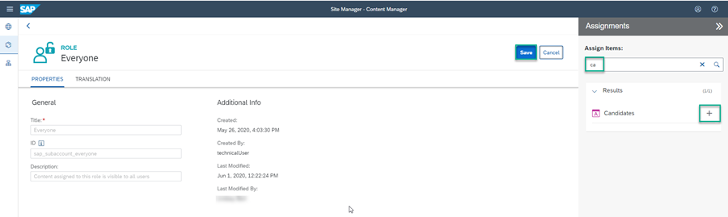

[DONE]
[ACCORDION-END]

[ACCORDION-BEGIN [Step 7: ](Review your site)]

1. Click the **Sites** icon to open the Site Directory.

    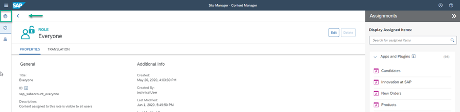

2. Click **Go to site** on the site tile.

    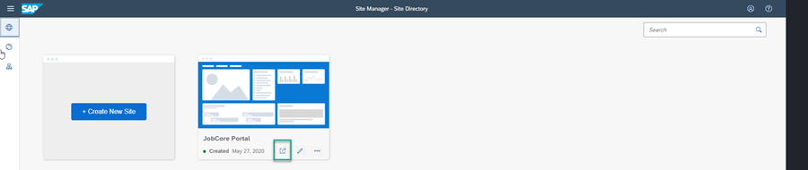

You'll see the `Work in Progress` group with the `Candidates` app.

  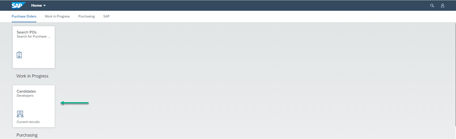

Congratulations!

You have successfully created a great looking Portal site with apps that you can access from the Portal launchpad.

This is just the start -- you can continue to add more apps to your Portal site.

[VALIDATE_7]
[ACCORDION-END]
