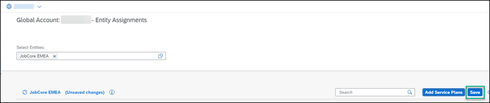
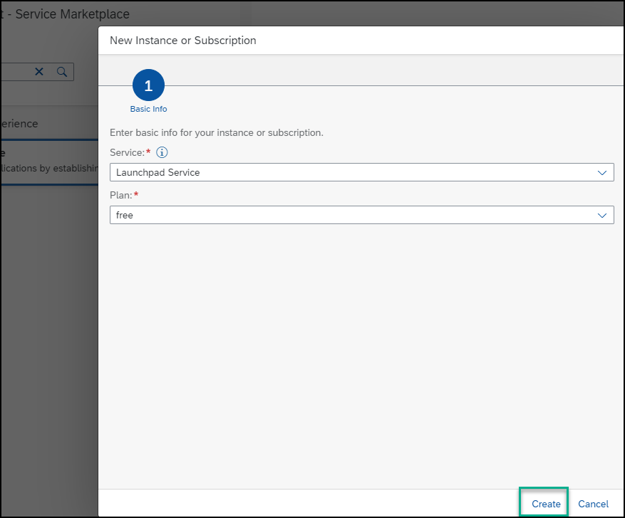

# Set Up SAP Build Work Zone, standard edition Using the Free Tier Model for SAP BTP
<!-- description --> Get started with building a site in SAP Build Work Zone, standard edition using the free tier option.

## Prerequisite
 Before you can follow this tutorial, you need to first get a SAP BTP subaccount with a Free Tier Service plan. To obtain it, please follow: [Get an Account on SAP BTP to Try Out Free Tier Service Plans](btp-free-tier-account).

 When following the above tutorial, please use these values:

 - Step 8 - Create a subaccount: Choose `Europe (Frankfurt)` as the region and enter `JobCore EMEA` as the subaccount display name.
 - Step 9.5 - Assign entitlements for the Cloud Foundry environment: Select `SAP Build Work Zone, standard edition`as the service and select the `Free` plan.
 - Step 11 - Create a space: Enter `dev`as the name of your space.

## You will learn
  - How to manage entitlements in SAP Build Work Zone, standard edition
  - How to subscribe to SAP Build Work Zone, standard edition
  - How to assign the `Launchpad_Admin` role to your user
  - How to access SAP Build Work Zone, standard edition

## Intro
  > If you're using a production environment, you should have a subaccount configured. If you don't have a configured subaccount, refer to this topic: [Initial Setup](https://help.sap.com/viewer/8c8e1958338140699bd4811b37b82ece/Cloud/en-US/fd79b232967545569d1ae4d8f691016b.html).

 The free tier service plan enables you to easily upgrade to paid service plans without losing prior work.

---

### Manage entitlements 

 **Entitlements** are your right to provision and consume a resource. They refer to what you're entitled to use (e.g., which services and service plans). To use the free tier plan for SAP BTP, you must first entitle your subaccount for the free plan.

1. In your global account, navigate to **Entitlements** > **Entity Assignments**.

    <!-- border -->

2. In the **Select Subaccount and Directories** dropdown list, choose the `JobCore EMEA` subaccount that you want to assign entitlements to, and click **Select**.

    <!-- border -->

    You'll see a table for the subaccount with all the entitlements it already has.

3. Click **Edit**.

    <!-- border -->

4. Click **Add Service Plans**.

    <!-- border -->

5. Search for **SAP Build Work Zone, standard edition**, check the **free (Application)** plan that you want to entitle and then click **Add 1 Service Plan**.

    <!-- border -->

6. Click **Save**.

    <!-- border -->

### Subscribe to SAP Build Work Zone, standard edition

Now that you've entitled your subaccount for the free plan, you will subscribe to SAP Build Work Zone, standard edition.

1. From the Account Explorer, search for and open your `JobCore EMEA` subaccount.

    <!-- border -->

2. Select **Services** > **Service Marketplace**.

    <!-- border -->

3. Enter `SAP Build` in the search field to search for the **SAP Build Work Zone, standard edition** tile.

    <!-- border -->

4. Click the tile to get information about the service and then click **Create** in the top right corner to subscribe to the service.

    <!-- border -->

5. From the popup you'll see that your plan is **free**. Click **Create**.

    <!-- border -->

6. You are informed that your request for a new subscription is in process. Click **View Subscription** to view the **Subscribed** status on the **Services and Instances** page.

      <!-- border -->

### Assign the Launchpad_Admin role to your user

To be able to access SAP Build Work Zone, standard edition, users must be assigned to the `Launchpad_Admin` role. In this step, you'll assign yourself to this role so that you can access the service and create a site.

1. Click **Role Collections** from the side menu.

      <!-- border -->

2. In the search field start typing `Launchpad` to find the `Launchpad_Admin` role collection.

    <!-- border -->

3. Click the `Launchpad_Admin` role collection to see all its details.

    <!-- border -->

4. Click **Edit**

    <!-- border -->

5. Under the **Users** tab, enter your email in both the **ID** and the **E-Mail** fields. Then click **Save**.

    <!-- border -->

    You've now been assigned to the `Launchpad_Admin` role collection and you can access SAP Build Work Zone, standard edition and carry out all your admin tasks.

    > Note that it may take a few minutes for the admin role assignment to take effect. Until it does, you may get an "Access Denied" error when you click **Go to Application** in the next step.

### Access SAP Build Work Zone, standard edition

1. From the side panel, click **Instances and Subscriptions**.

    

2. Under the **Subscriptions** tab, click **SAP Build Work Zone, standard edition** or you can click **Go to Application** on the right.

    

   The Site Directory opens where you'll create and manage your sites.

  

---
