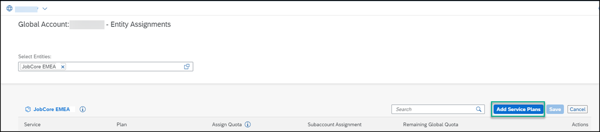
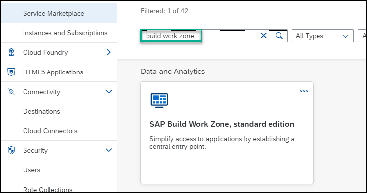
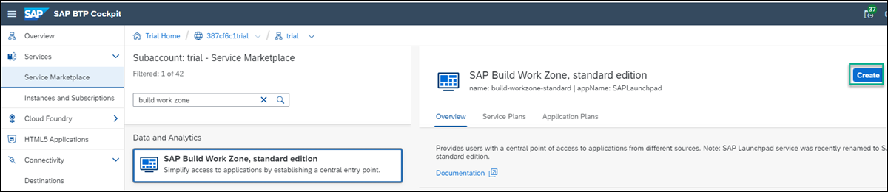
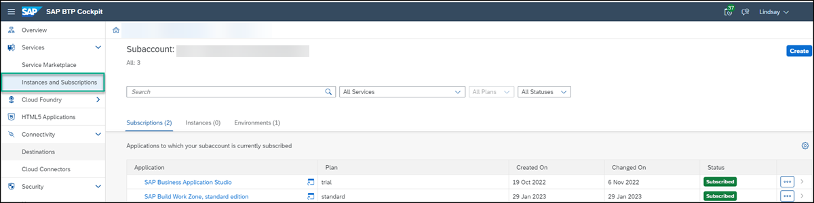
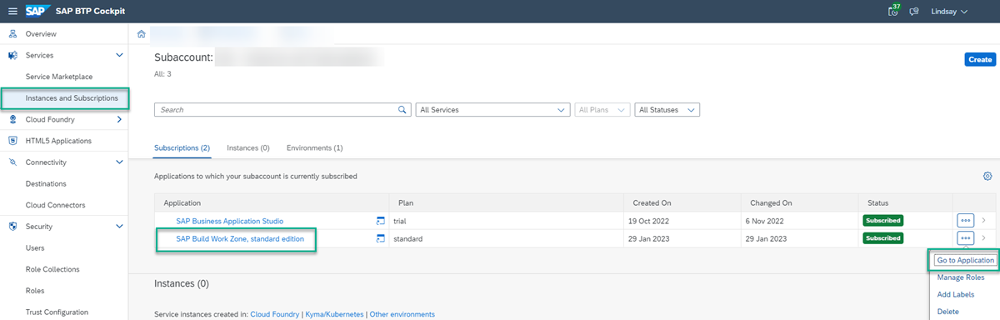

## Prerequisite
 Before you can follow this tutorial, you need to first get a SAP BTP subaccount with a Free Tier Service plan. To obtain it, please follow: [Get an Account on SAP BTP to Try Out Free Tier Service Plans](btp-free-tier-account).

 When following the above tutorial, please use these values:

 - Step 8 - Create a subaccount: Choose `Europe (Frankfurt)` as the region and enter `JobCore EMEA` as the subaccount display name.
 - Step 9.5 - Assign entitlements for Cloud Foundry environment: Select `Launchpad Service`as the service and select the `Free` plan.
 - Step 11 - Create a space: Enter `dev`as the name of your space.

>If you're using a production environment, you should have a subaccount configured. If you don't have a configured subaccount, refer to this topic: [Initial Setup](https://help.sap.com/viewer/8c8e1958338140699bd4811b37b82ece/Cloud/en-US/fd79b232967545569d1ae4d8f691016b.html).

## Details
### You will learn
  - How to manage entitlements for the Launchpad service
  - How to subscribe to the launchpad service
  - How to assign the `Launchpad_Admin` role to your user
  - How to access the Launchpad service

 The free tier service plan enables you to easily upgrade to paid service plans without losing prior work.

---

[ACCORDION-BEGIN [Step 1: ](Manage entitlements for the Launchpad service)]

 **Entitlements** are your right to provision and consume a resource. They refer to what you're entitled to use (e.g., which services and service plans). To use the free tier plan for SAP BTP, you must first entitle your subaccount for the free plan.

1. In your global account, navigate to **Entitlements** > **Entity Assignments**.

    !

2. In the **Select Entities** dropdown list, choose the `JobCore EMEA` subaccount that you want to assign entitlements to, and click **Select**.

    !

    You'll see a table for the subaccount with all the entitlements it already has.

3. Click **Configure Entitlements**.

    !

4. Click **Add Service Plans**.

    !

5. Search for the **Launchpad Service** and then check the **free (Application)** plan that you want to entitle.

6. Click **Add Service Plan** to exit the popup screen.

    !

7. Click **Save**.

    !

[DONE]
[ACCORDION-END]

[ACCORDION-BEGIN [Step 2: ](Subscribe to the launchpad service)]

Now that you've entitled your subaccount for the free plan, you will subscribe to the SAP Launchpad service.

1. Open your `JobCore EMEA` subaccount and select **Services** > **Service Marketplace**.

    !

2. Enter `Launchpad` in the search field to search for the **Launchpad Service** tile.

    !

3. Click the tile to get information about the service and then click **Create** in the top right corner to subscribe to the service.

    !

      You'll get a popup with basic information about the subscription, showing that your plan is `free`.  Click **Create**.

      !

  4. You are informed that your request for a new subscription is in process. Click **View Subscription** to view the **Subscribed** status on the **Services and Instances** page.

      !

[DONE]
[ACCORDION-END]

[ACCORDION-BEGIN [Step 3: ](Assign the Launchpad_Admin role to your user)]

To be able to access the SAP Launchpad service, users must be assigned to the `Launchpad_Admin` role. In this step, you'll assign yourself to this role so that you can access the service and create a launchpad site.

1. Click **Role Collections** from the side menu.

      !

2. In the search field start typing `Launchpad` to find the `Launchpad_Admin` role collection.

    !

3. Click the `Launchpad_Admin` role collection to see all its details.

    !

4. Click **Edit**

    !

5. Under the **Users** tab, enter your email in both the **ID** and the **E-Mail** fields. Then click **Save**.

    !

    You've now been assigned to the `Launchpad_Admin` role collection and you can access the SAP Launchpad service and carry out all your admin tasks.

    > Note that it may take a few minutes for the admin role assignment to take effect. Until it does, you may get an "Access Denied" error when you click **Go to Application** in the next step.

[DONE]
[ACCORDION-END]

[ACCORDION-BEGIN [Step 4: ](Access the Launchpad service)]

You are now ready to access the SAP Launchpad service.  

1. From the side panel, click **Instances and Subscriptions**.

    

2. Under the **Subscriptions** tab, click the **Launchpad Service** or you can click **Go to Application** on the right.

    

   The SAP Launchpad service opens with the Site Directory in focus. This is where you'll create and manage your launchpad sites.

  

[VALIDATE_6]

[ACCORDION-END]

---
