 

# Design Your Site With the New SAP Build Work Zone Experience
<!-- description --> Create a page, assign it to a space, and then add apps to your page.

## Prerequisites
- Make sure you've selected **Spaces and Pages - New Experience** view mode for your site in the Site Settings screen. 

## You will learn
  - How to create a page
  - How to add apps to a page 
  - How to create a space and assign pages to it                    

## Intro  
If you select the **Spaces and Pages - New Experience** view mode, you can create custom Spaces and Pages. These are referred to as local spaces and pages. You can create your pages and then assign these pages either to an existing space or a new space that you create. Last you would need to assign the space to a role so that users with this role can access the spaces and the pages assigned to them.

### Create a page

1. Open the Content Manager. 

    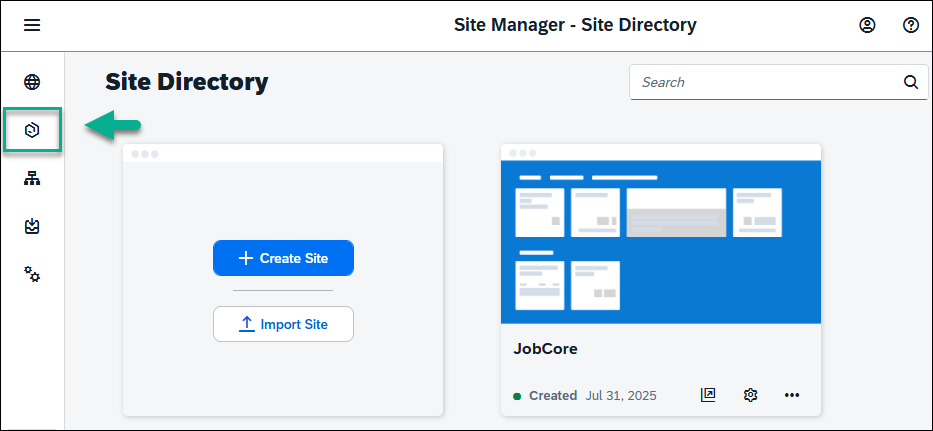

2. Click **Create** and from the dropdown list, select **Page**.

    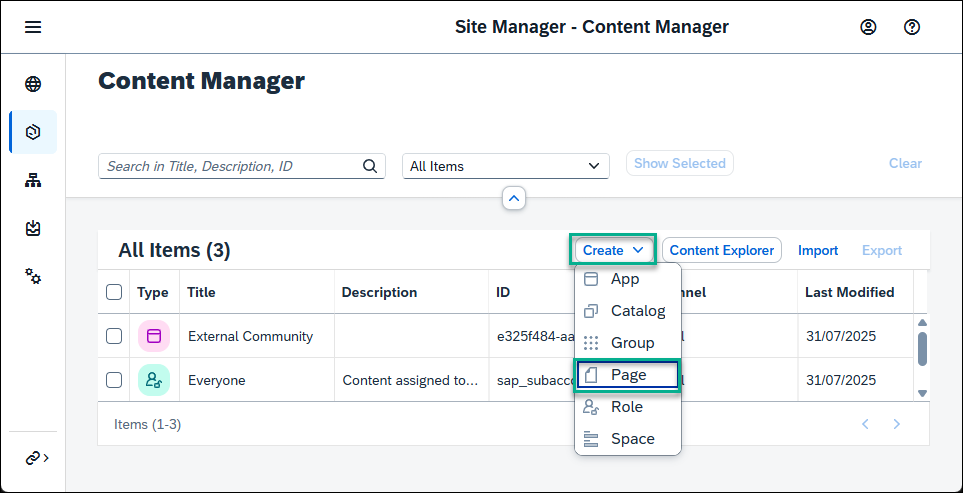

3. Enter a title for the page: `Overview`.

    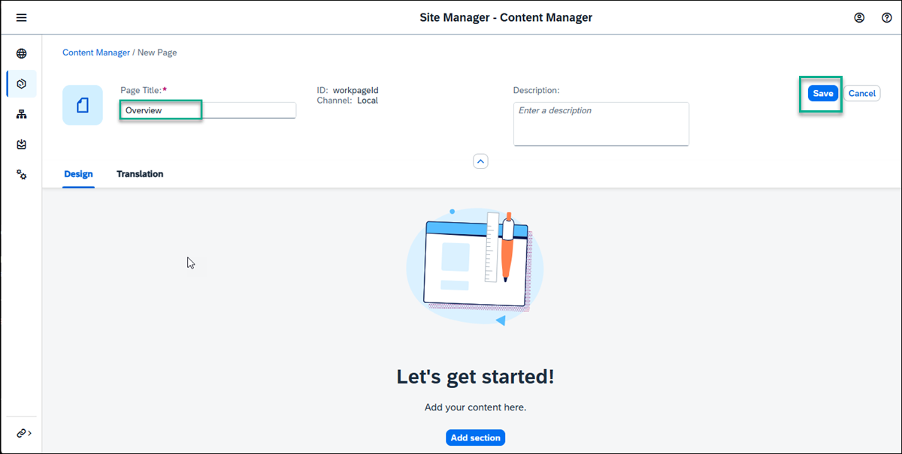
    

### Add apps to the page    

1. Click **Add Section**

    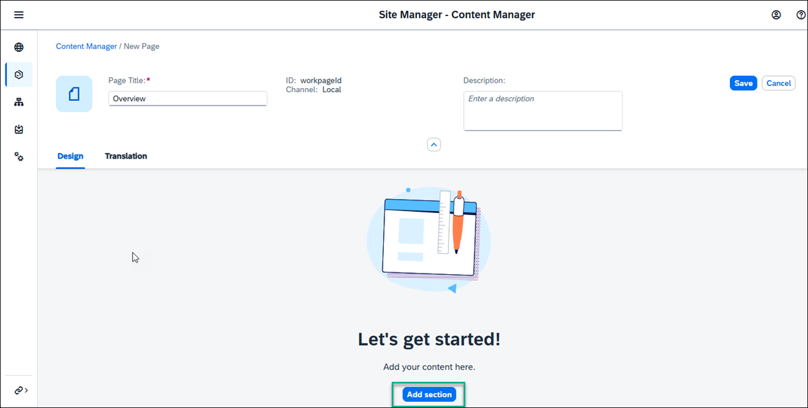

2. For the header enter `My Apps`, and click **Add Widget**.

    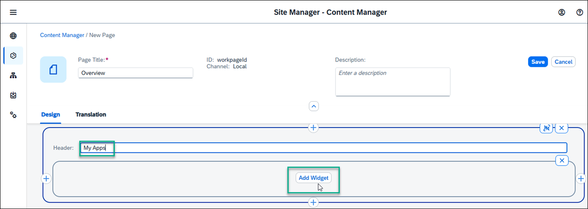

3. In the **Add Apps** screen, select the `New Orders` and `External Community` apps that you created and click **Add**.

    > In this screen you'll see all the apps that you can access from your subaccount - so far we only have 2 apps in our subaccount. 

    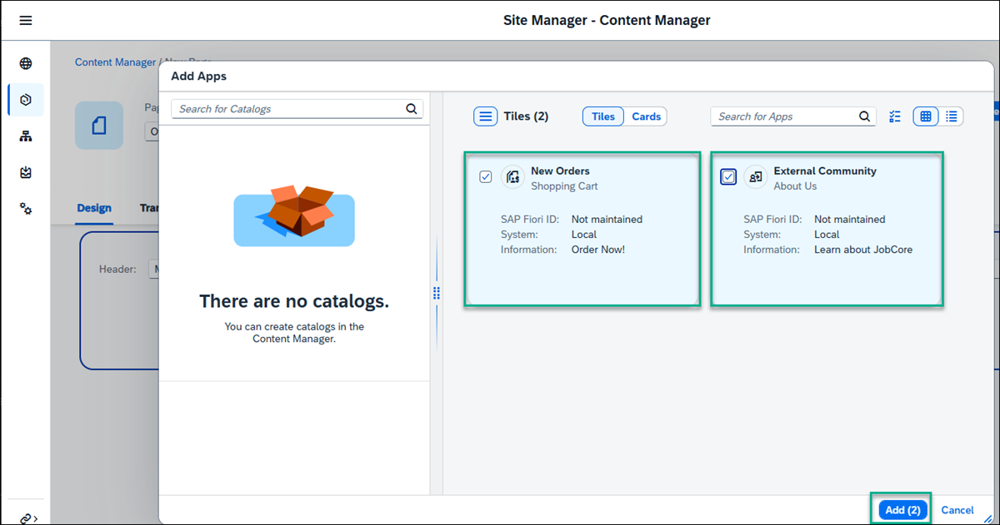

    > You can add more apps to your page - they will display side by side in a section.

4. Click **Save**. This is how your page looks:

    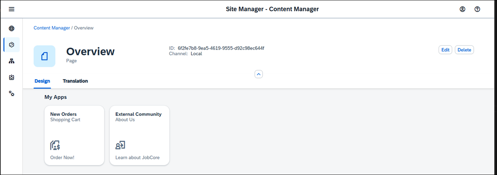

5. Go back to your Content Manager using the breadcrumbs at the top.

    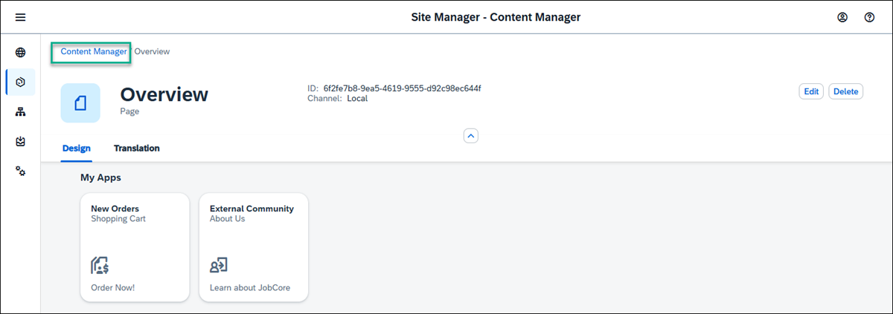

6. See that the page you created is in the list of content items.

    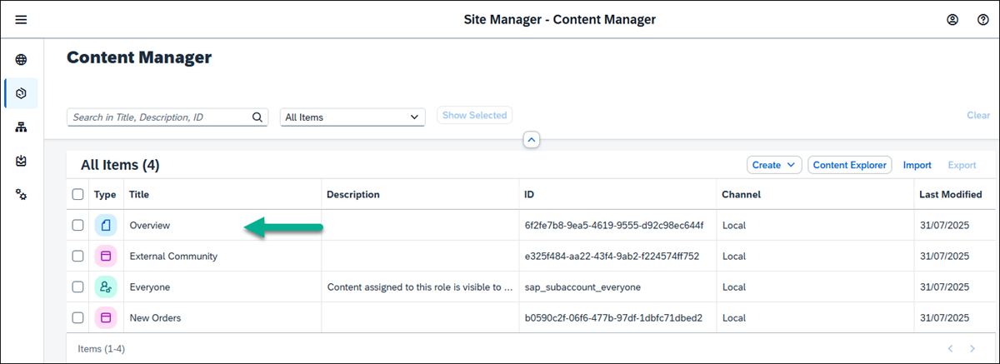

### Create a space

1. In the Content Manager click **Create** and then select **Space**.

    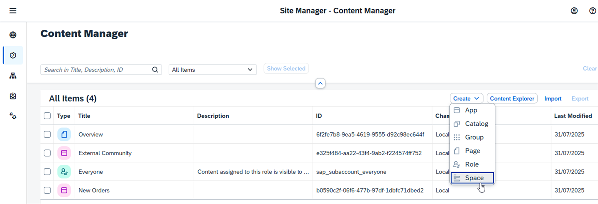

2. Enter a title for the space: `Home`.

    

3.  In the **Pages** tab, you'll see a list of pages and from here you can assign as many pages as you want to the space. We only have 1 page - the `Overview` page. In the **Assignment Status** column, you'll see the toggle is red meaning that the page is not yet assigned to the space. Click the toggle to assign the `Overview` page to the `Home` space and click **Save**.

    

4. Go back to the Content Manager using the breadcrumbs at the top. You'll see that the space you created is added to the list of content items.

### Assign the space to a role

In this step, you'll assign the space to the `Everyone` role. 

>Spaces are assigned to a role and users assigned to a specific role are able to access the space and see the relevant pages assigned to it.  Content assigned to the `Everyone` role is visible to all users.

1. From the Content Manager, click the `Everyone` role.

    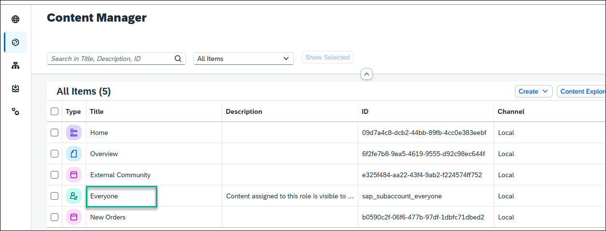

2. Click **Edit**.

    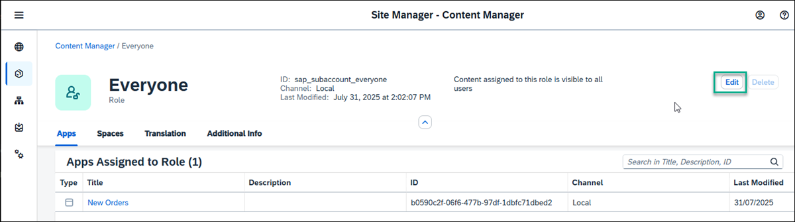

3. Under the **Spaces** tab, you'll see the `Home` space you just created. Click the toggle to assign the `Home` space to the `Everyone` role. 

    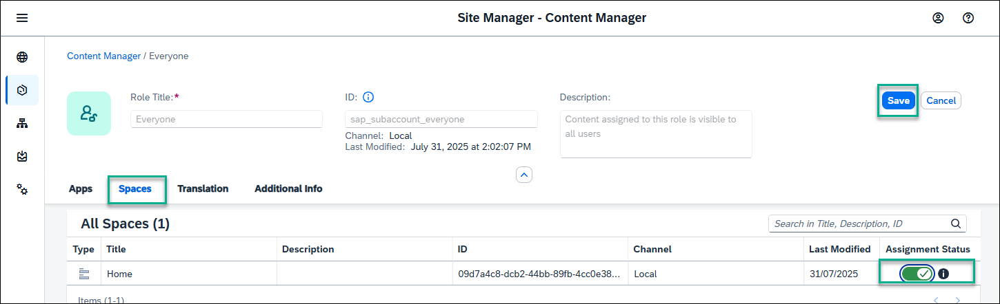

4. Click **Save**.

    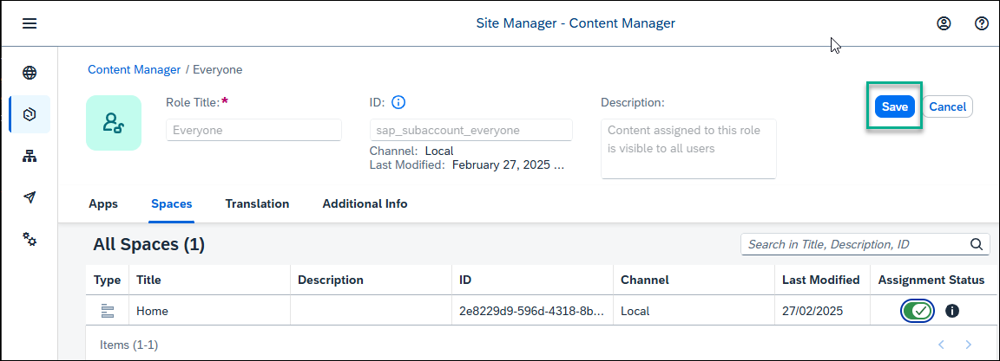

### View the runtime site

1. Open the Site Directory.

    

2. On the `JobCore` tile, click the Go to Site icon.

    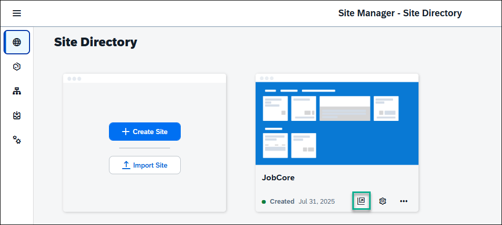

3. This is what you'll see - under the `Home` space, you have the `Overview` page. In the `My Apps` section, you have the 2 apps `External Community` and  `New Orders` that you added.

    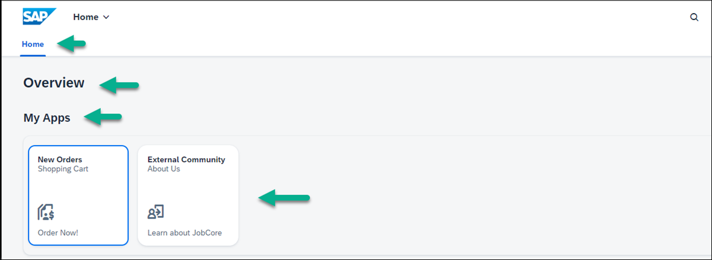
