## Details
### You will learn
  - How to create a URL app and add it to your site

You create business content such as apps, groups, catalogs, and roles, using the Portal service Site Manager on the subaccount level (and not for a specific site). Apps are consumed from specific sites according to their role assignment.

[ACCORDION-BEGIN [Step 1: ](Go to the Content Manager)]

To go to the **Content Manager**, do the following:

1. Use the back arrow to get to the Site Manager.

    

2. Click the **Content Manager** icon in the left panel.

    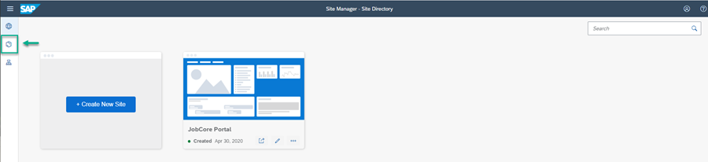

[DONE]
[ACCORDION-END]

[ACCORDION-BEGIN [Step 2: ](Create a new app)]

>Note that by default, the `Everyone` role is provided and is visible in the Content manager.

Click **New** and select **App** from the list.

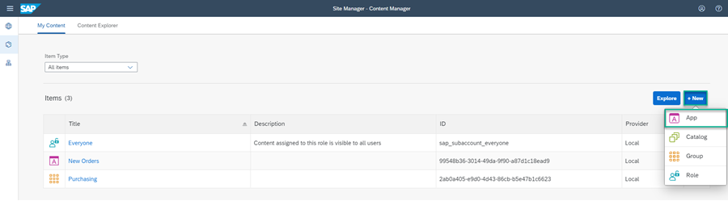

The App editor opens and now you can configure your new app.

[DONE]
[ACCORDION-END]

[ACCORDION-BEGIN [Step 3: ](Configure the URL app)]

The App editor opens on the **PROPERTIES** tab.

1. Enter the following values:

    * **Title**: `Innovation at SAP`

    * **Open App**: In place

    * **URL**:  `https://sap.io`

    

2. Click the **NAVIGATION** tab to specify the intent of your app.

3. Enter the following values:

    * **Semantic Object**: `Innovation`

    * **Action**:  `Display`

    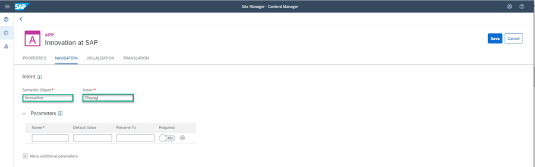

4. Click the **VISUALIZATION** tab.

    In this tab, you specify how the app will be displayed in the launchpad.

5.  Enter the following values:

    * **Subtitle**: `SAP.iO program `

    * **Information**:  `Learn about SAP.iO`

    * **Icon**: Click the browse icon, type `Visits` and click **OK**.

      You see a preview of the tile with all the properties you entered.

      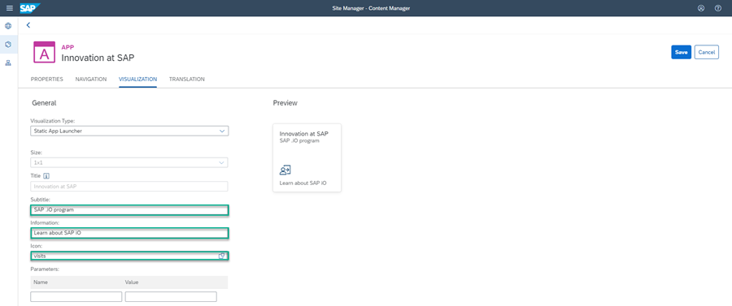

6.  Click **Save**.

You can then use the back arrow to get back to the Content Manager to see your app in the list of content items.

[DONE]
[ACCORDION-END]

[ACCORDION-BEGIN [Step 4: ](Go back to Content Manager)]
Click the arrow in the top left corner of the app editor to go back to the Content Manager.

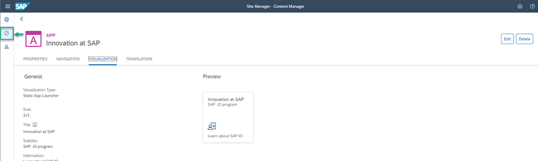

In the Content Manager, you see your app in the list:

> If you want to open your app for editing, simply click it and click **Edit** in the App editor.

>

You have now created a URL app.

For end users to view the app in runtime, you must assign a role to the app. Any end user who needs to view this app, should be a member of the role that you have assigned to the app. In this tutorial, we use the `Everyone` role.  You also need to assign the app to a group so that it's visible in the Launchpad page.

This is described in the following steps.

[DONE]
[ACCORDION-END]

[ACCORDION-BEGIN [Step 5: ](Assign group to app)]

In this step, you will create a group and assign it to your app.

>You are assigning your app to a group so that your site user can see it in the `Launchpad` page. A group is a set of one or more apps displayed together in the launchpad.

1. In the Content Manager, click **+ New** and select **Group** to open the Group editor.

    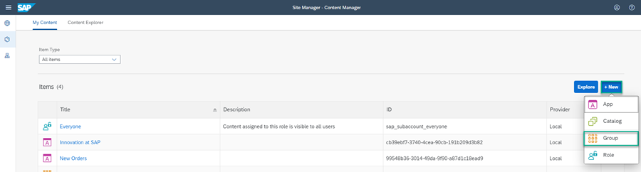

2. Enter the **Title** `SAP` and in the **Assignments** panel on the upper right of the screen, type `In` to search for your app. You should see **Innovation at SAP**.

3. In the **Results** list, click + to assign this group to your app.

    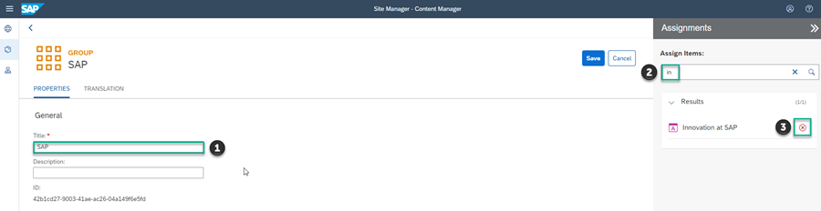

4. Click **Save**.

[DONE]
[ACCORDION-END]

[ACCORDION-BEGIN [Step 6: ](Assign the Everyone role)]

In this step you'll assign the **Everyone** role to your app.

>Content assigned to the **Everyone** role is visible to all users.

1. In the Content Manager, click the **Everyone** role.

    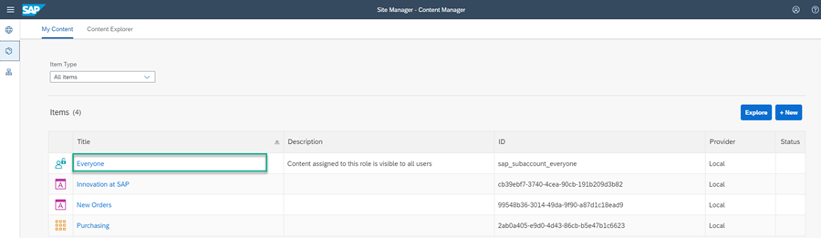

2. Click **Edit**.

3. In the Role editor, in the **Assignments** panel, type `In` to search for your app.

4. In the **Results** list, click + to assign this role to your app:

    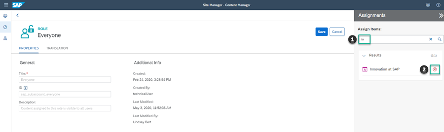

5. Click **Save**.

[DONE]
[ACCORDION-END]

[ACCORDION-BEGIN [Step 7: ](Review the site)]

1. Click the Site Directory icon in the left panel.

    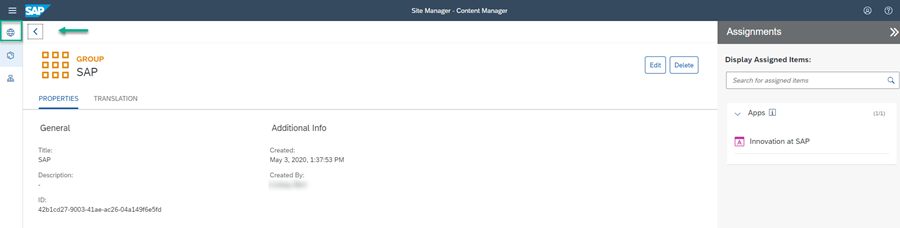

2. On the `JobCore Portal` tile in the Site Directory, click the  **Go to site** icon:

    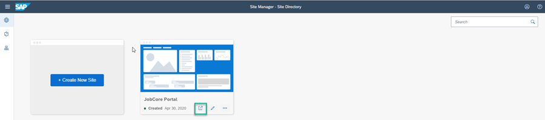

The **Home** page opens. Navigate to the **Launchpad** page by clicking `My Apps`. This is what you'll see:

You can now launch your application by clicking the **Innovation at SAP** tile.

You've created and added your first app to the `Launchpad` page in your Portal site!

[VALIDATE_7]
[ACCORDION-END]

---
