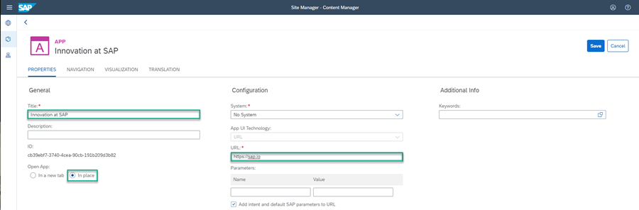

## Prerequisites
 - Locate the URL of the app you want to add to the site.
 - The `JobCore` Portal site is open.

## Details
### You will learn
  - How to create a URL app and add it to your site

[ACCORDION-BEGIN [Step 1: ](Go to Content Manager)]

In this tutorial you are going to add a URL app to the `Launchpad` page.

When you open the `JobCore Portal` site, you see that the **Pages** editor is in focus.

Click the **Content** icon in the left panel.

[DONE]
[ACCORDION-END]

[ACCORDION-BEGIN [Step 2: ](Create a new app)]
By default, the content item of a site only contains the **Everyone** role.

Click **New** and select **App** from the list:

[DONE]
[ACCORDION-END]

[ACCORDION-BEGIN [Step 3: ](Specify app general properties)]
The App editor opens on the **PROPERTIES** tab.

Enter the following values:

* **Title**: `Careers at SAP`

* **Open App**: In a new tab

* **URL**:  `https://www.sap.com/about/careers.html`

[DONE]
[ACCORDION-END]

[ACCORDION-BEGIN [Step 4: ](Specify app navigation properties)]

Click the **NAVIGATION** tab.

Here you need to specify the intent of your app, which includes a semantic object and the action you want to perform on this object.

Enter the following values:

* **Semantic Object**: `Careers`

* **Action**:  `Display`

[DONE]
[ACCORDION-END]

[ACCORDION-BEGIN [Step 5: ](Specify app visualization properties)]

Click the **VISUALIZATION** tab.

In this tab, you specify how the app will be displayed in the launchpad.

Enter the following values:

* **Subtitle**: `Open Positions`

* **Information**:  `Search for a job`

* **Icon**: Click the browse icon, type `Search` and click **OK**.

You see a preview of the tile with all the properties you entered.

The result should look like this:

Click **Save**.

[DONE]
[ACCORDION-END]

[ACCORDION-BEGIN [Step 6: ](Go back to Content Manager)]
Click the arrow in the top left corner of the app editor to go back to the Content Manager.

In the Content Manager, you see your app in the list:

> If you want to open your app for editing, simply click it and click **Edit** in the App editor:

You have now created a URL app for your site.

Before you can see the app in the launchpad you need to:

* Add a group and assign your app to it

* Assign a role to the app that is assigned to you. We will use the **Everyone** role.

This is described in the following steps.

[DONE]
[ACCORDION-END]

[ACCORDION-BEGIN [Step 7: ](Assign group to app)]

In this step, you will create a group and assign it to your app.

>A group is a set of one or more apps displayed together in the launchpad.

1. In the Content Manager, click **+ New** and select **Group** to open the Group editor.

2. Enter the **Title** `SAP` and in the **Assignments** panel on the upper right of the screen, type `Ca` to search for your app. You should see **Careers**.

3. In the **Results** list, click + to assign this group to your app.

    

4. Click **Save**.

[DONE]
[ACCORDION-END]

[ACCORDION-BEGIN [Step 8: ](Assign the Everyone role)]

In this step you'll assign the **Everyone** role to your app.

>Content assigned to the **Everyone** role is visible to all users.

1. In the Content Manager, click the **Everyone** role.

2. Click **Edit**.

3. In the Role editor, in the **Assignments** panel, type `Ca` to search for your app.

4. In the **Results** list, click + to assign this role to your app:

    

5. Click **Save**.

[DONE]
[ACCORDION-END]

[ACCORDION-BEGIN [Step 9: ](Review the site)]

At the top right of your screen, click the **Go to site** icon:

The **Home** page opens. Navigate to the **Launchpad** page by clicking `My Apps`. This is what you'll see: 

You can now launch your application by clicking the **Careers at SAP** tile.

Congratulations! You've created and added your first app to the `Launchpad` page in your Portal site!

[VALIDATE_7]
[ACCORDION-END]

---
