# Add a URL App to Your Site
<!-- description --> Create a URL app and add it to your site.

## You will learn
  - How to create a URL app and add it to your site

## Intro
Use the **Content Manager** to add a URL app to your site.

### Open the Content Manager

Click the Content Manager icon in the left panel to open the **Content Manager**.

<!-- border -->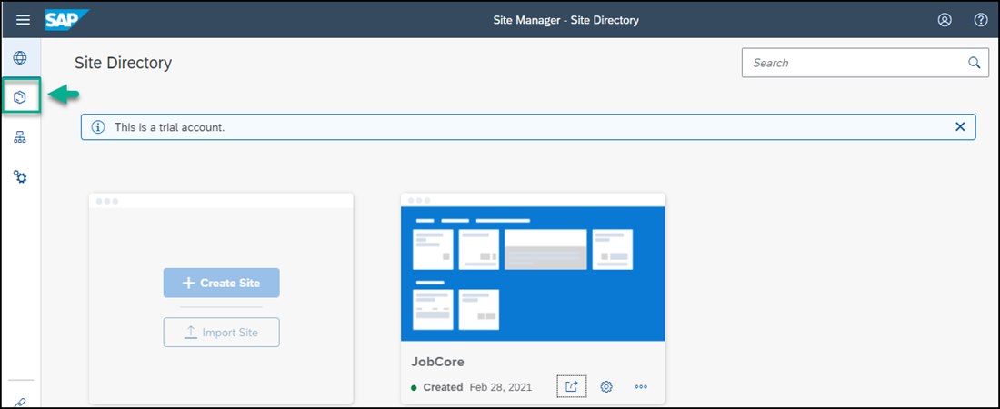

### Create and configure new app

1. Click **+ New** and select **App** from the list.

    <!-- border -->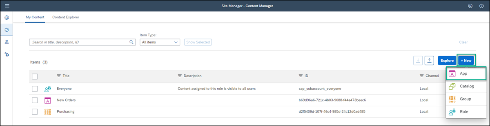

    The app editor opens on the  **PROPERTIES** tab.

2. Enter the following values:

    * **Title**: `Innovation at SAP`  

    * **Open App**: In place

    * **URL**:  `https://sap.io`

    <!-- border -->

3. Click the **NAVIGATION** tab and enter the intent of your app.

    > The unique combination of a semantic object and an action is called an intent. It is used to define navigation to an application.

4. Enter the following values:

     * **Semantic Object**: `Innovation`

     * **Action**:  `Display`

    <!-- border -->

5. Click the **VISUALIZATION** tab.

    In this tab, you specify how the app will be displayed in your launchpad site.

6.  Enter the following values:

    * **Subtitle**: `SAP.iO program `

    * **Information**:  `Learn about SAP.iO`

    * **Icon**: Click the browse icon, type `visits`, select the displayed icon, and click **OK**.

      You see a preview of the tile with all the properties you entered.

      <!-- border -->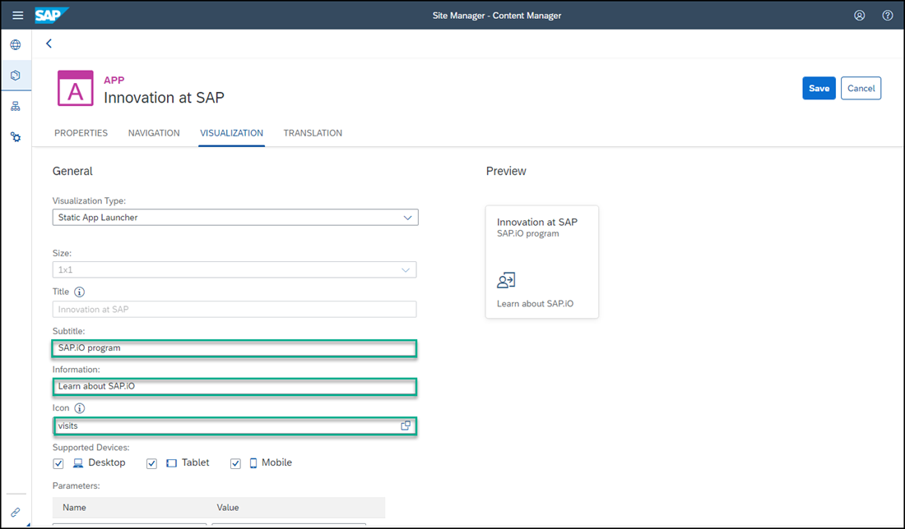

7.  Click **Save**.

You have configured the URL app and in the next step you'll go back to the **Content Manager** to see it in the list of content items.

### View the app that you created

Click the Content Manager icon in the left side panel to open the **Content Manager**.

<!-- border -->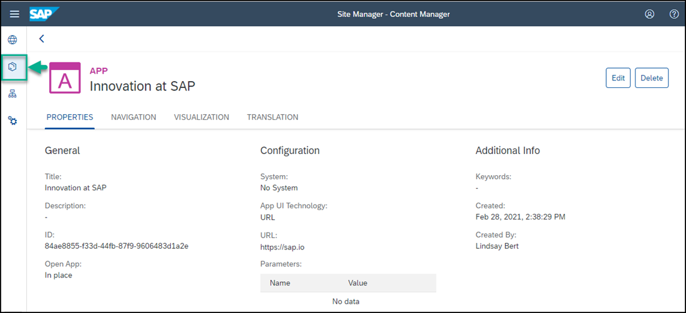

In the **Content Manager**, you can see your app in the list.

<!-- border -->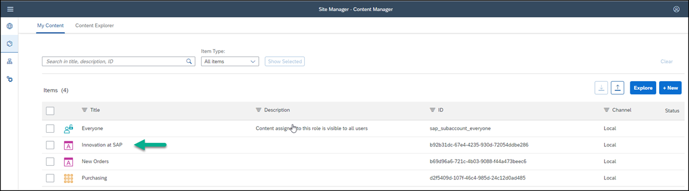

To view the app in runtime, you must assign the app to a role. You also need to assign the app to a group so that it'll be visible in your site.

This is described in the following steps.

### Assign the app to the Everyone role

>Content assigned to the `Everyone` role is visible to all users.

1. In the **Content Manager**, click the **Everyone** role.

    <!-- border -->

2. Click **Edit**.

    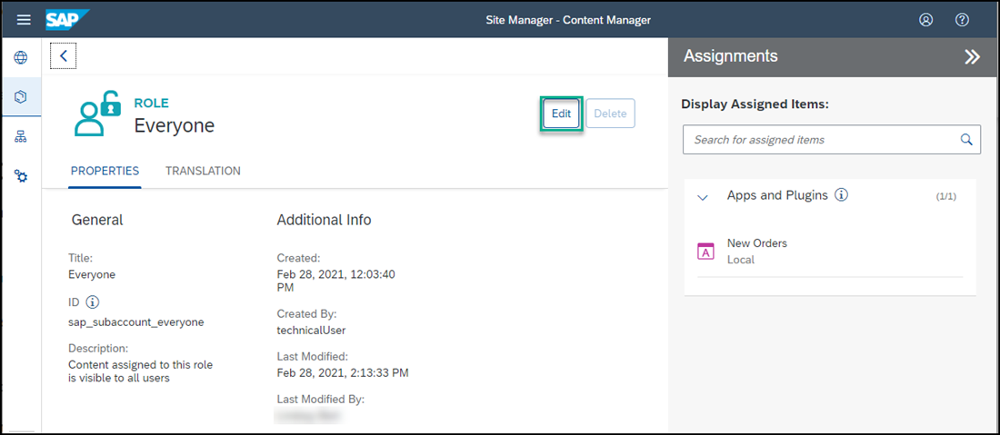

3. Click the search box in the **Assignments** panel on the right, any available apps are shown in the list below.

4. Click **+** to assign the `Innovation at SAP` app to this role.

    <!-- border -->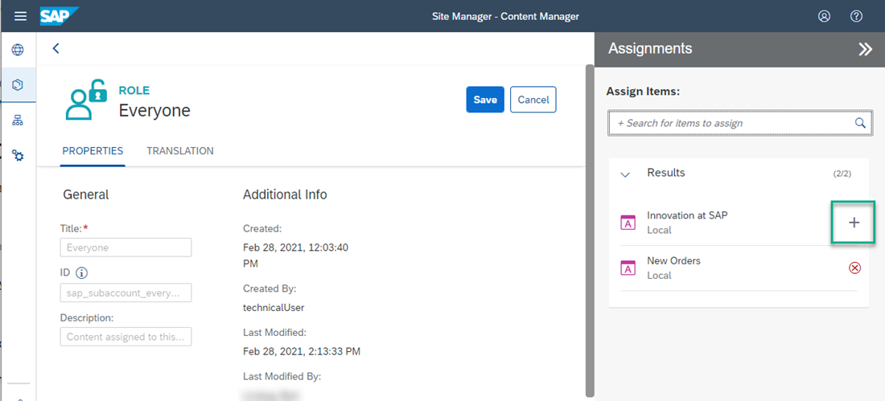

5. Click **Save**.

### Create a group and assign the app to it

>A group is a set of one or more apps displayed together in a site. Assigning apps to groups, makes them visible to users.

1. Open the **Content Manager** and click **+ New** and select **Group** from the list.

    <!-- border -->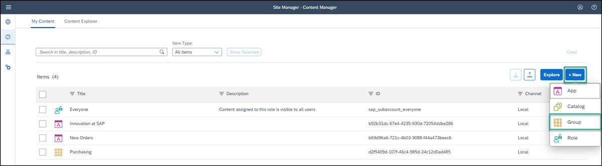

2. Enter the **Title** `SAP` and in the **Assignments** panel on the right of the screen, click the search box to see any available apps in the list below.

3. Click **+** to assign the `Innovation at SAP` app to this group.

    <!-- border -->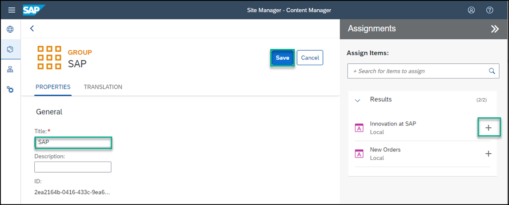

4. Click **Save**.

### Review the site

1. Click the Site Directory icon in the left panel to open the **Site Directory**.  

    <!-- border -->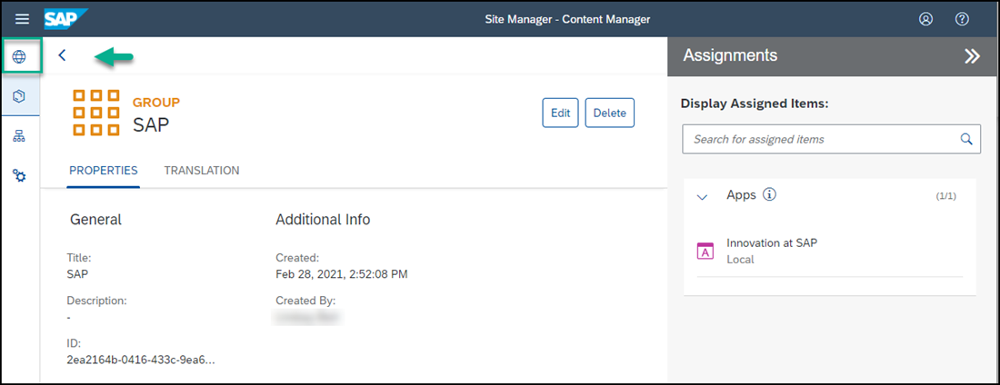

2. On the `JobCore` tile, click the **Go to site** icon:

    <!-- border -->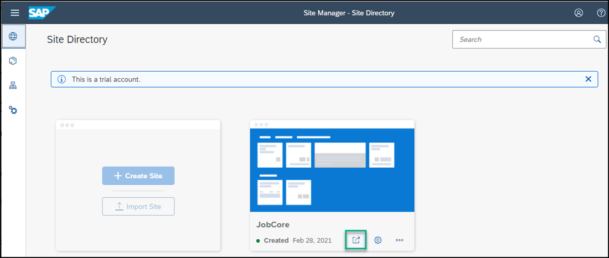

You'll see that your new app is displayed in the `SAP` group.

<!-- border -->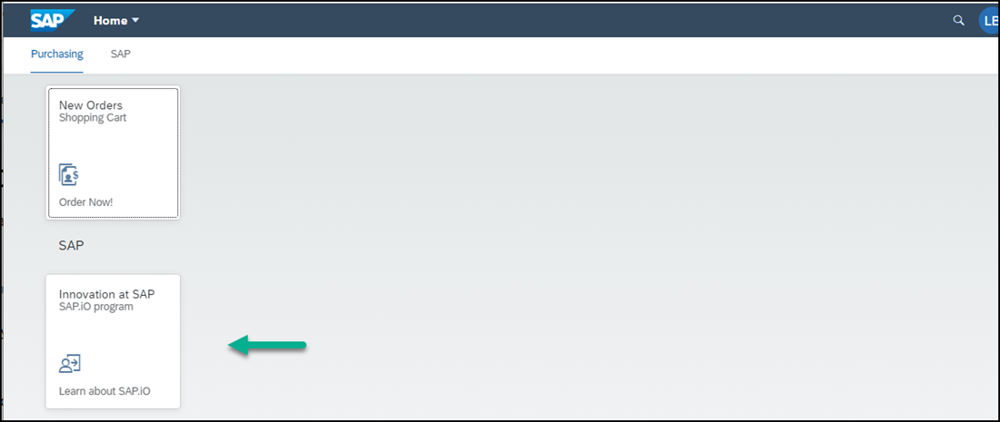

You can now launch your application by clicking the **Innovation at SAP** tile.

Congratulations you've created a site with two apps!

---
