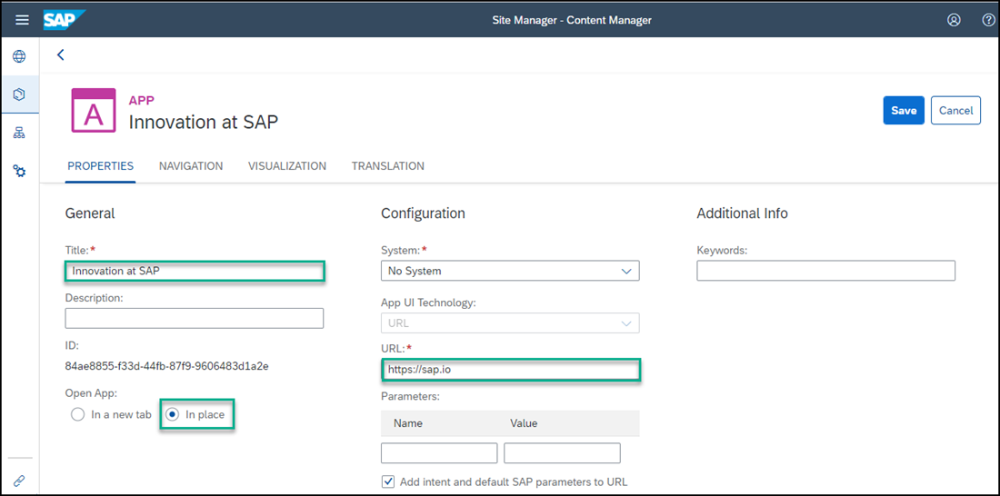
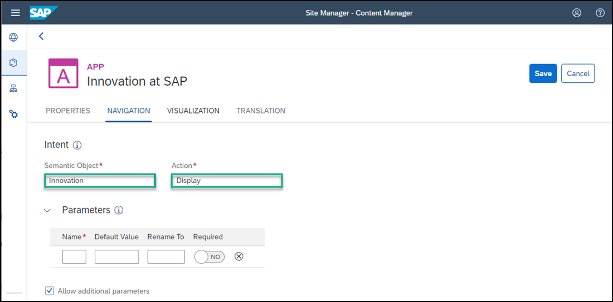
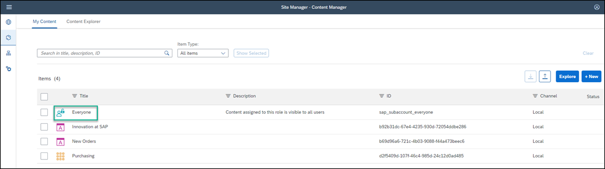

# Integrate a URL App to SAP Build Work Zone
<!-- description --> Create a URL app and add it to your site.

## You will learn
  - How to create a URL app and add it to your site

## Intro
Use the **Content Manager** to add apps to SAP Build Work Zone.

### Open the Content Manager

Click the Content Manager icon in the left panel to open the **Content Manager**.

<!-- border -->

### Create and configure new app

1. Click **Create** and select **App** from the list.

    <!-- border -->

2. In the header of the app editor, enter a title `External Community`.

    <!-- border -->

3. Under the **Configuration** tab, enter the following values (some of them are already there by default):

    * **Open App**: In a new tab

        >It's preferable to open apps in place, but this time, we'll open the app in a new tab.

    * **System**: No System

    * **App UI Technology**: URL

    * **URL**:  `https://community.sap.com/topics/work-zone`

    <!-- border -->

4. Click the **Navigation** tab and enter the intent of your app.

    > The unique combination of a semantic object and an action is called an intent. It is used to define navigation to an application.

5. Enter the following values:

     * **Semantic Object**: `Home`

     * **Action**:  `Display`

    <!-- border -->

6. Click the **Visualization** tab.

    In this tab, specify how the app will be displayed in your site.

7.  Enter the following values:

    * **Subtitle**: `About Us `

    * **Information**:  `Learn about JobCore`

    * **Icon**: Click the browse icon, type `visits`, and click on the displayed icon to add it to your tile.

      You see a preview of the tile with all the properties you entered.

      <!-- border -->

8.  Click **Save**.

You have configured the URL app and in the next step you'll go back to the **Content Manager** to see it in the list of content items.

### View the app that you created

1. Go back to the Content Manager using the breadcrumbs.

    <!-- border -->

2. In the **Content Manager**, you can see your app in the list.

    <!-- border -->

To view the app in runtime, you must assign the app to a role. 

### Assign the app to the Everyone role.

>Spaces must be assigned to a role so that users assigned to a specific role are able to access the space and see the relevant pages assigned to it. Content assigned to the `Everyone` role is visible to all users. 

1. In the **Content Manager**, click the **Everyone** role.

    <!-- border -->

2. Click **Edit**.

    <!-- border -->

3. All available apps are shown in the editor. In the **Assignment Status** column you can see that the `External Community` app is not assigned. Click the toggle to assign the app to the `Everyone` role.

    <!-- border -->

4. Click **Save**.

Congratulations you've created a site with two apps.

In the next tutorial, you're going to add these apps to a page.

---
