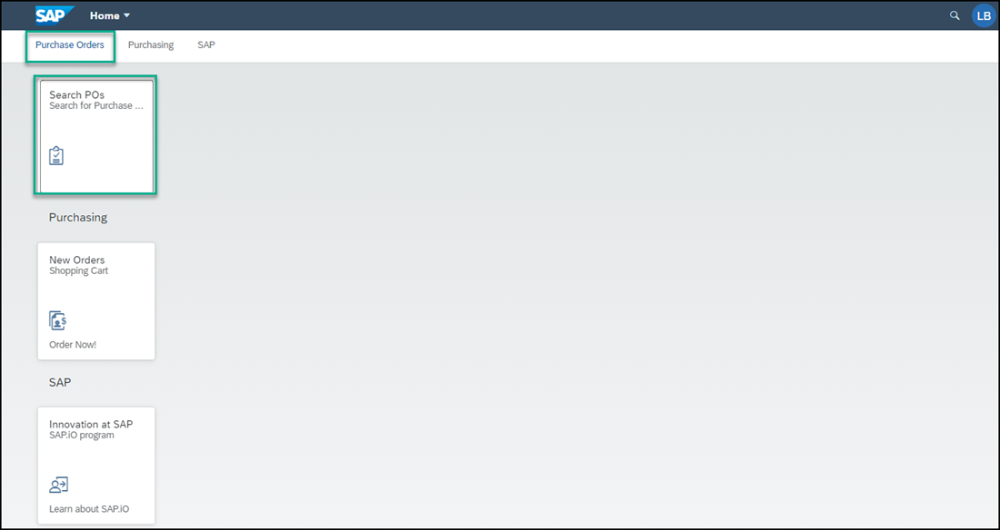

## Prerequisites
- You have created a destination in SAP Cloud Platform cockpit to the SAP Gateway Demo System.
- You have subscribed to the SAP Cloud Platform Launchpad service and created a launchpad site.

## Details
### You will learn
  - How to expose a Web Dynpro ABAP backend application to your SAP Cloud Platform Launchpad site

---
In this tutorial, you'll use the **Content Manager** of the SAP Cloud Platform Launchpad service to add a Web Dynpro ABAP app to your launchpad site.

[ACCORDION-BEGIN [Step 1: ](Open the Content Manager)]

1. To get to the **Content Manager**, first Click **Subscriptions** in the left navigation panel of your trial account and in the search box, enter `launchpad` to search for the **Launchpad** tile. Then click **Go to application**.

    

2. In the side panel, click the Content Manager icon to open the **Content Manager**.

    

[DONE]
[ACCORDION-END]

[ACCORDION-BEGIN [Step 2: ](Configure the Web Dynpro ABAP app)]

1.  In the **Content Manager**, click **+ New** and then select **App** from the list.

    !

2. In the **PROPERTIES** tab, enter these values:

    |  Field     | Value
    |  :------------- | :-------------
    |  Title           | `Search POs`
    |  System          | Select the value `ES5`
    |  App UI Technology    | Select `Web Dynpro ABAP`
    |  Application ID           | `S_EPM_FPM_PO`

    !

3. In the **NAVIGATION** tab, enter these values:

    |  Field     | Value
    |  :------------- | :-------------
    |  Semantic Object           | `S_EPM_FPM_PO`
    |  Action          | `Display`

    !

4. In the **VISUALIZATION** tab, enter these value:

    |  Field     | Value
    |  :------------- | :-------------
    |  Subtitle           | `Search for Purchase Orders`
    |  Icon          | Select the `activity-2` icon. Just type the icon name in the search bar.

    Click **Save**.

    

[DONE]
[ACCORDION-END]

[ACCORDION-BEGIN [Step 3: ](View the app that you created)]

Click the Content Manager icon in the left side panel to open the **Content Manager**.

 

You can see your Web Dynpro ABAP app in the list:

  

To view the app in runtime, you must assign the app to a role. You also need to assign the app to a group so that it'll be visible in the launchpad.

This is described in the following steps.

[DONE]
[ACCORDION-END]

[ACCORDION-BEGIN [Step 4: ](Assign the app to the Everyone role)]

>Content assigned to the `Everyone` role is visible to all users.

1. In the **Content Manager**, click the `Everyone` role.

    !

2. Click **Edit**.

    

3. Click the search box in the **Assignments** panel on the right, any available apps are shown in the list below.
>If you have many apps, you can type some letters of your app name in the search bar, (for example, `se`) to search for the app.

3. Click the **+** icon next to the `Search POs` app to assign the app to the `Everyone` role.

    

    You'll see that the icon changes.

4. Click **Save**.

[DONE]
[ACCORDION-END]

[ACCORDION-BEGIN [Step 5: ](Assign the app to a group)]

A group is a set of one or more apps displayed together in the launchpad. Assigning apps to groups allows users to view them in the launchpad page.

1. Click the Content Manager icon to open the **Content Manager**.

2. Click **+ New** and select **Group** from the list to create a group.

    !

3. Name the group `Purchase Orders`.

4. In the **Assignments** panel, click inside the search box on the right of the screen, to show all available apps. You should see the  `Search POs` app.  

5. In the list, click **+** to assign the `Search POs` app to your group.

    

    You'll see that the icon changes.

6. Click **Save**.

[DONE]
[ACCORDION-END]

[ACCORDION-BEGIN [Step 6: ](Launch the app)]

1. From the side panel, click the Site Directory icon to open the **Site Directory**.

    

2. On the `JobCore` tile , click the **Go to site** icon.

    

3. Enter your logon details if prompted to do so.

4. In the `Purchase Orders` group, click the Web Dynpro ABAP app called `Search POs` to launch it.

    

And this is what you'll see:

  !

[VALIDATE_7]

[ACCORDION-END]
