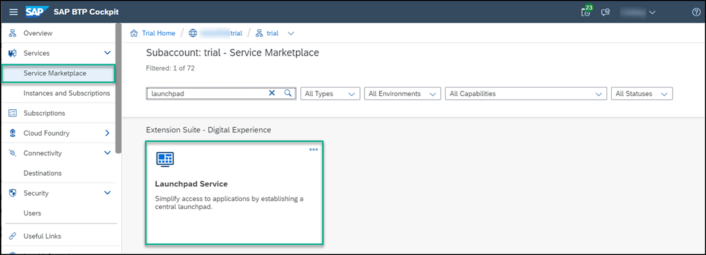
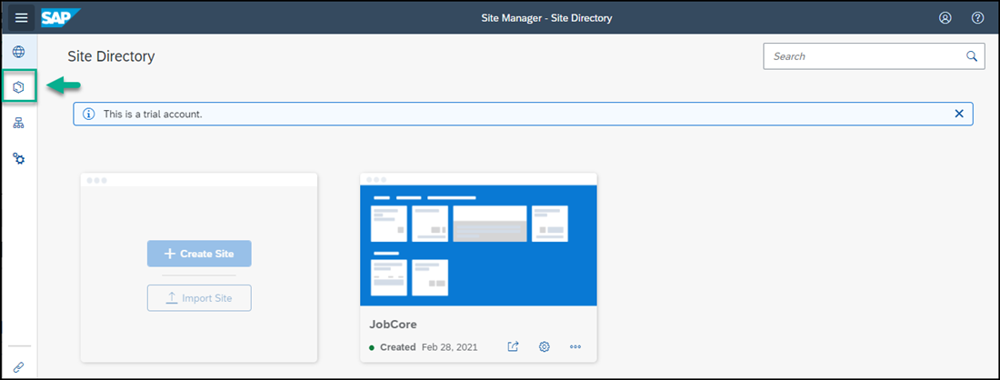
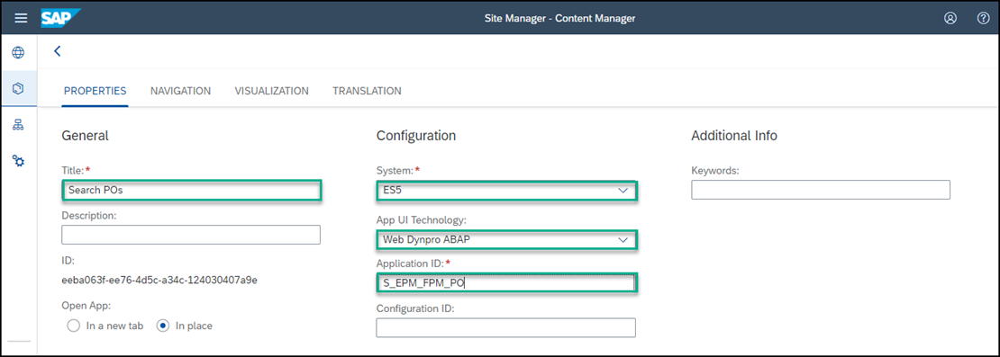
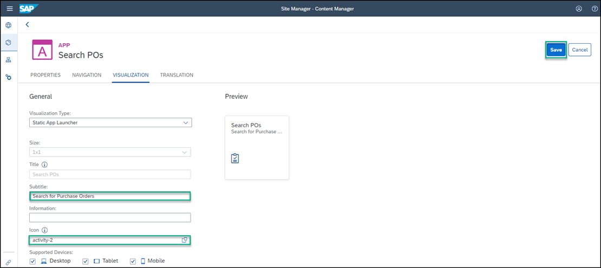
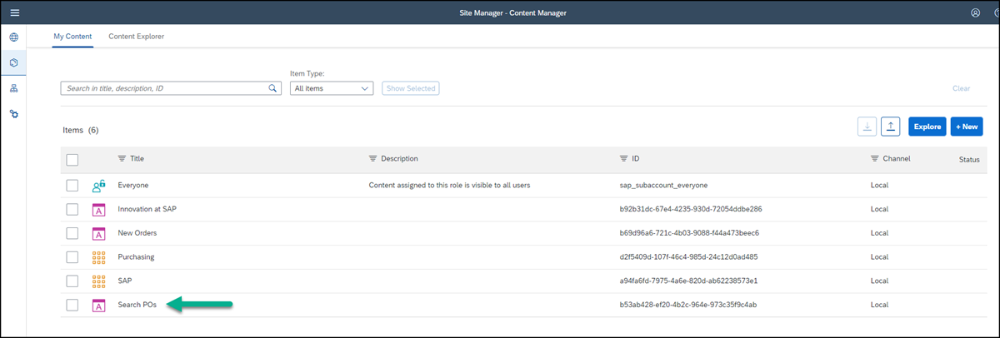
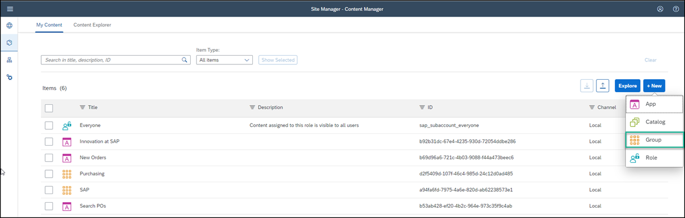
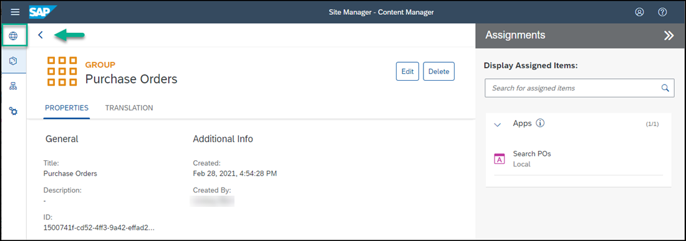

# Add a Web Dynpro ABAP App to Your SAP Build Work Zone, standard edition Site
<!-- description --> Add a classic SAP UI app (like those typically run by SAP customers on the data center backends), to your site.

## Prerequisites
- You have created a destination in SAP BTP cockpit to the SAP Gateway Demo system
- You have subscribed to the SAP Build Work Zone, standard edition and created a site
- If you're working with Spaces and Pages, you've created a space and a page and assigned the space to a role as described in this tutorial: [Create a Space and a Page and Add Apps](https://developers.sap.com/tutorials/cp-portal-cloud-foundry-spaces-pages.html)

## You will learn
  - How to expose a Web Dynpro ABAP backend application to your site

---
In this tutorial, you'll use the **Content Manager** in SAP Build Work Zone, standard edition to add a Web Dynpro ABAP app to your site.

### Open the Content Manager

1. To get to the Content Manager, click **Service Marketplace** in the left navigation panel of your subaccount and in the search box, enter `SAP Build` to find the **SAP Build Work Zone, standard edition** tile. Then click the tile.
    

2. Under the **Application Plans** tab on the right, click the Actions icon (...) and click **Go to Application**.

    

3. In the side panel, click the Content Manager icon to open the **Content Manager**.

    

### Configure the Web Dynpro ABAP app

1.  In the **Content Manager**, click **+ New** and then select **App** from the list.

    <!-- border -->

2. Enter a title for the app `Search POs`.

    <!-- border -->

3. In the **Configuration** tab, enter these values:

    |  Field     | Value
    |  :------------- | :-------------
    |  Open App           | `In place`
    |  System          | Select the value `ES5` - if you're taking part in a workshop, please use your unique destination: `<unique_id>_ES5`.
    |  App UI Technology    | Select `Web Dynpro ABAP`
    |  Application ID           | `S_EPM_FPM_PO`

    <!-- border -->

3. In the **Navigation** tab, enter these values:

    |  Field     | Value
    |  :------------- | :-------------
    |  Semantic Object           | `S_EPM_FPM_PO`
    |  Action          | `Display`

    <!-- border -->

4. In the **Visualization** tab, enter these values:

    |  Field     | Value
    |  :------------- | :-------------
    |  Subtitle           | `Search for Purchase Orders`
    |  Icon          | Click the browse icon, type `activity-2`. You'll see two icons. Click the first one to add it to your tile.

    Click **Save**.

    

### View the app that you created

Use the breadcrumbs at the top to go back to the **Content Manager**.

 

You can see your Web Dynpro ABAP app in the list:

  

In the next steps, we'll make the app visible for users. To do this, we need to assign the app to a role (the same role that the user is assigned to). Depending on which view mode has been set in the **Site Settings** screen, we also need to add the app to a page if you're working in **Spaces and Pages - New Experience** mode. If you're working in **Groups** mode or in **Spaces and Pages** mode, then you'll assign your app to a group. 

Here's a view of the **Site Settings** screen with the different view modes.  In this tutorial we'll be working in the **Spaces and Pages - New Experience** mode.

If you're not sure what view mode is selected, go to the **Site Settings** screen as follows: 

 1. Open the Site Directory from the left panel and on the site tile, click the cog icon.
    
     
    
 2. On the right side of the screen, under **View Mode**, you can see which mode you're working in. To change it, click **Edit** and then **Save** your changes.

 3. Once you're done, go back to the Site Manager by clicking **Go to Site Directory**.

    

### Assign the app to the Everyone role

> To view the app in runtime, you must assign the app to a role. Content assigned to the `Everyone` role is visible to all users.

1. In the **Content Manager**, click the `Everyone` role.

    <!-- border -->

2. Click **Edit**.

    

3. Under the **Apps** tab, you'll see that your `Search POs` app has an **X** in the **Assignment Status** column. Click the toggle to assign the app to the `Everyone` role and click **Save**.

    

>If you have many apps, you can type some letters of your app name in the search bar, (for example, `se`) to search for the app.

### Add the App to Your Page

>**Do this step only if you're working with Spaces and Pages.** 

In a previous tutorial, you've already created a Space called `Home` and a Page called `Overview`. Now let's add the Web Dynpro app to the page.

1. Open the Content Manager. 

    

2. Select the `Overview` page. 

    

    You'll see the apps that you've already added.

3. Click **Edit**. 

    

4. Hover in the section containing the other apps, and click the **+** icon on the right.

    

5. Select the `Search POs` app that you've just configured and click **Add**.

    

6. Click **Save**. Your Web Dynpro is added to the `Overview` page to the same section as your other apps.  

    

### Assign the app to a group 

> **This step is only for those working in **Groups** view mode (defined in the **Site Settings** screen). If you're working with the new site experience and selected **Spaces and Pages - New Experience** mode, please skip this step**.

A group is a set of one or more apps displayed together in your site. Assigning apps to groups, makes them visible to users of the site.
 
 1. Go back to the **Content Manager** using the breadcrumbs at the top of the screen.

    

2. Click **Create** and select **Group** from the list to create a group.

    <!-- border -->

3. Name the group `Purchase Orders`.

4. Under the **Apps** tab, you'll see that your `Search POs` app has an **X** in the **Assignment Status** column. Click the toggle to assign the app to the `Purchase Orders` group and click **Save**.  If you're taking part in a workshop, please use your unique app: `<unique_id>_Search POs`

    

### Launch the app

1. From the side panel, click the Site Directory icon to open the **Site Directory**.

    

2. On the `JobCore` tile , click the **Go to site** icon.

    

3.  If you're working in spaces and pages mode, you'll see that the `Search POs` app is added to the `Overview` page in the `My Apps`section.

    

4. If you're working in groups mode, you'll see the `Purchase Orders` group that includes the Web Dynpro ABAP app called `Search POs`.

    

5. Click the app to launch it. This is what you'll see:

  <!-- border -->
