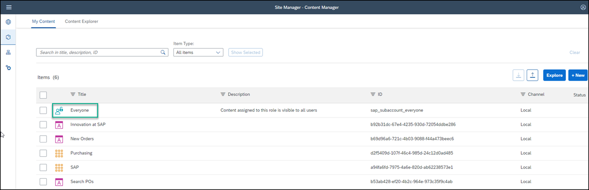
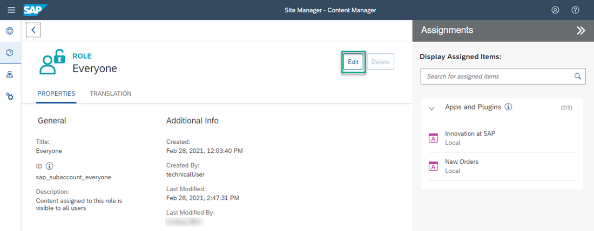
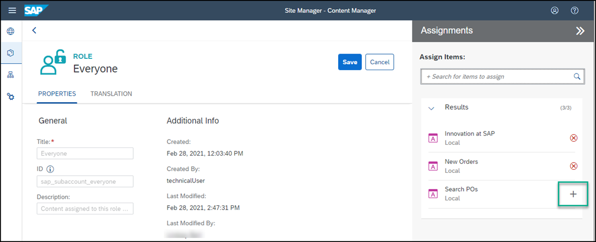
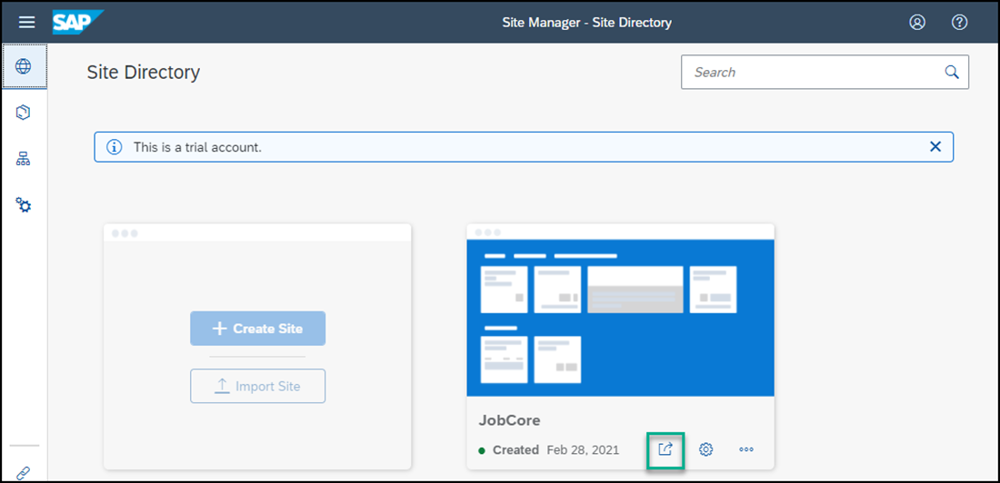
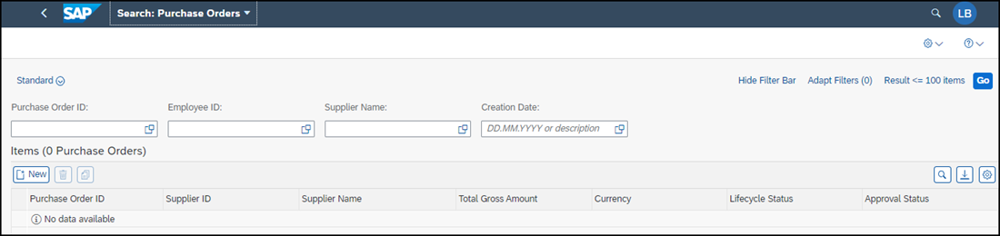

# Add a Web Dynpro ABAP App to Your SAP Build Work Zone, standard edition Site
<!-- description --> Add a classic SAP UI app (like those typically run by SAP customers on the data center backends), to your site.

## Prerequisites
- You have created a destination in SAP BTP cockpit to the SAP Gateway Demo system 
- You have subscribed to the SAP Build Work Zone, standard edition and created a site

## You will learn
  - How to expose a Web Dynpro ABAP backend application to your site

---
In this tutorial, you'll use the **Content Manager** in SAP Build Work Zone, standard edition to add a Web Dynpro ABAP app to your site.

### Open the Content Manager

1. To get to the Content Manager, click **Service Marketplace** in the left navigation panel of your subaccount and in the search box, enter `SAP Build` to find the **SAP Build Work Zone, standard edition** tile. Then click the tile.
    

2. Under the **Application Plans** tab on the right, click the Actions icon (...) and click **Go to Application**.

    

3. In the side panel, click the Content Manager icon to open the **Content Manager**.

    

### Configure the Web Dynpro ABAP app

1.  In the **Content Manager**, click **+ New** and then select **App** from the list.

    <!-- border -->

2. In the **PROPERTIES** tab, enter these values:

    |  Field     | Value
    |  :------------- | :-------------
    |  Title           | `Search POs`
    |  System          | Select the value `ES5` - if you're taking part in a workshop, please use your unique destination: `<unique_id>_ES5`.
    |  App UI Technology    | Select `Web Dynpro ABAP`
    |  Application ID           | `S_EPM_FPM_PO`

    <!-- border -->

3. In the **NAVIGATION** tab, enter these values:

    |  Field     | Value
    |  :------------- | :-------------
    |  Semantic Object           | `S_EPM_FPM_PO`
    |  Action          | `Display`

    <!-- border -->

4. In the **VISUALIZATION** tab, enter these values:

    |  Field     | Value
    |  :------------- | :-------------
    |  Subtitle           | `Search for Purchase Orders`
    |  Icon          | Click the browse icon, type `activity-2`. You'll see two icons. Click the first one and then click **OK**.

    Click **Save**.

    

### View the app that you created

Click the Content Manager icon in the left side panel to open the **Content Manager**.

 

You can see your Web Dynpro ABAP app in the list:

  

To view the app in runtime, you must assign the app to a role. You also need to assign the app to a group so that it'll be visible in your site.

This is described in the following steps.

### Assign the app to the Everyone role

>Content assigned to the `Everyone` role is visible to all users.

1. In the **Content Manager**, click the `Everyone` role.

    <!-- border -->

2. Click **Edit**.

    

3. Click the search box in the **Assignments** panel on the right, any available apps are shown in the list below.
>If you have many apps, you can type some letters of your app name in the search bar, (for example, `se`) to search for the app.

4. Click the **+** icon next to the `Search POs` app to assign the app to the `Everyone` role. If you're taking part in a workshop, please use your unique app: `<unique_id>_Search POs`

    

    You'll see that the icon changes.

5. Click **Save**.

### Assign the app to a group

A group is a set of one or more apps displayed together in your site. Assigning apps to groups, makes them visible to users of the site.

1. Click the Content Manager icon to open the **Content Manager**.

2. Click **+ New** and select **Group** from the list to create a group.

    <!-- border -->

3. Name the group `Purchase Orders`.

4. In the **Assignments** panel, click inside the search box on the right of the screen, to show all available apps. You should see the  `Search POs` app.  If you're taking part in a workshop, please use your unique app: `<unique_id>_Search POs`

5. In the list, click **+** to assign the `Search POs` app to your group. If you're taking part in a workshop, please use your unique app: `<unique_id>_Search POs`

    

    You'll see that the icon changes.

6. Click **Save**.

### Launch the app

1. From the side panel, click the Site Directory icon to open the **Site Directory**.

    

2. On the `JobCore` tile , click the **Go to site** icon.

    

3. In the `Purchase Orders` group, click the Web Dynpro ABAP app called `Search POs` to launch it.

    

4.  Enter your logon details if prompted to do so.

And this is what you'll see:

  <!-- border -->
