## Prerequisites  
  - You've opened SAP Cloud Platform Portal and from the Site Directory, you've clicked on the tile of the `Supplier Portal` site that you created. For more information, see [Create a Portal freestyle site](cp-portal-freestyle-site-create-site).
  - You have deployed the `Product List` SAPUI5 app to your SAP Cloud Platform subaccount.

## Details
### You will learn  
 - How to configure the SAP Fiori (SAPUI5) app that you deployed to your SAP Cloud Platform subaccount and add it to your launchpad page.

[ACCORDION-BEGIN [Step 1: ](Add your app to the Portal site)]

1. From the side navigation panel in your `Supplier Portal` site, click **Content Management** and select **Apps** to open the **Manage App Configuration** editor.

    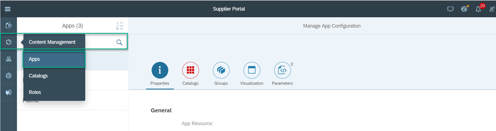

2. Click + at the bottom of the **Apps** panel to add a new app. The **Properties** tab is now in focus.

    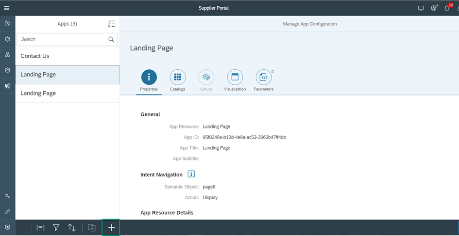

3. Go to the **App Resource** field and click the browse icon.

    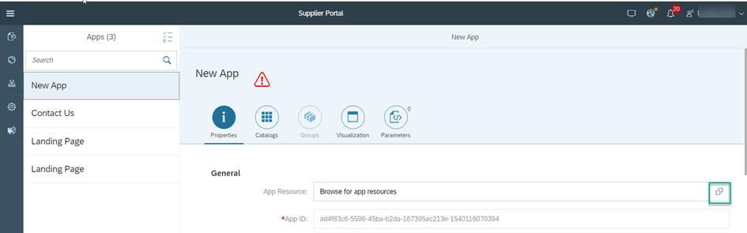

4. In the **Select App Resource** screen, select the `Product List` app and click **OK**.

    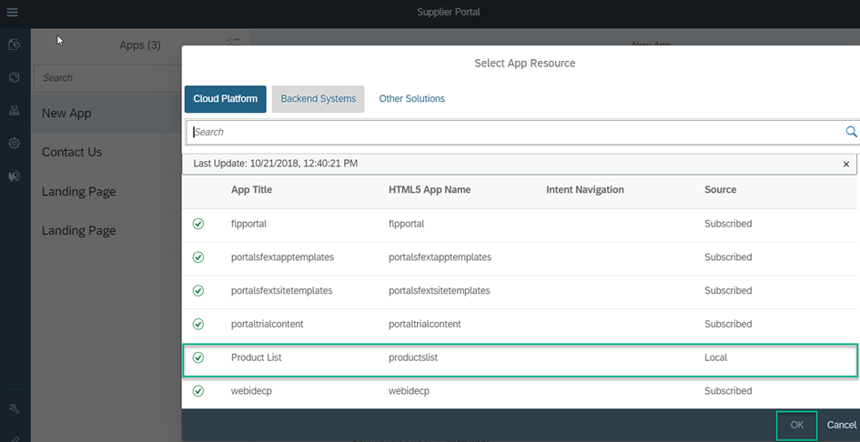

5. In the **App Title** field, leave the name as `Product List`.

6. The next step is to define the **Intent Navigation** where you need to give a unique combination of a semantic object and an action. Enter the **Semantic Object** as `productslist` and **Action** as `Display`.

    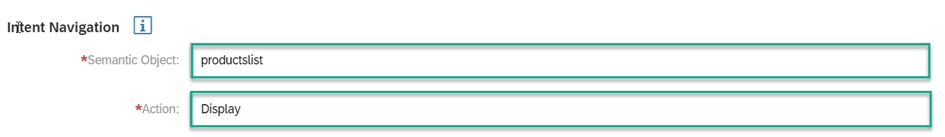

7. Click **Save**.

>You've configured the basic properties of the `Product List` app. You will see that the **Catalogs** tab is red – this is because you still need to assign this app to a catalog.   

[DONE]
[ACCORDION-END]

[ACCORDION-BEGIN [Step 2: ](Assign your app to a catalog)]

1.	Click the **Catalogs** tab.

    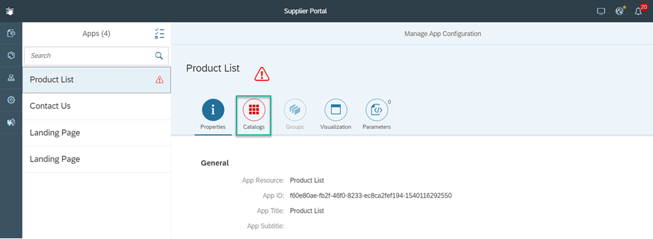

2.	Click **Edit** at the bottom right of the screen.

    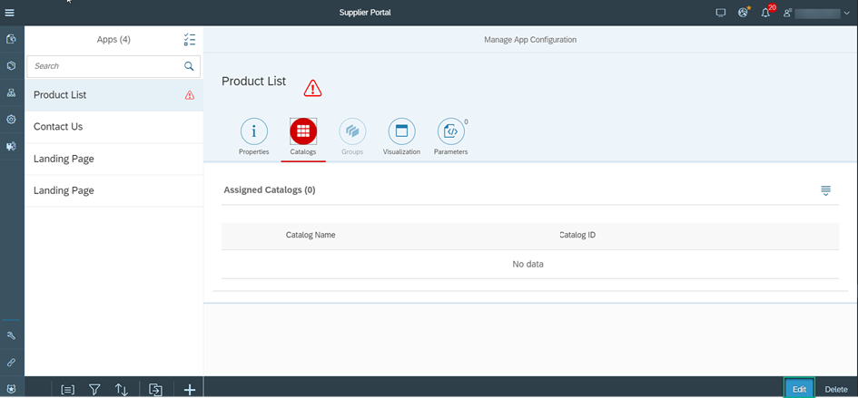

3.	Click + in the **Assigned Catalogs** table.

    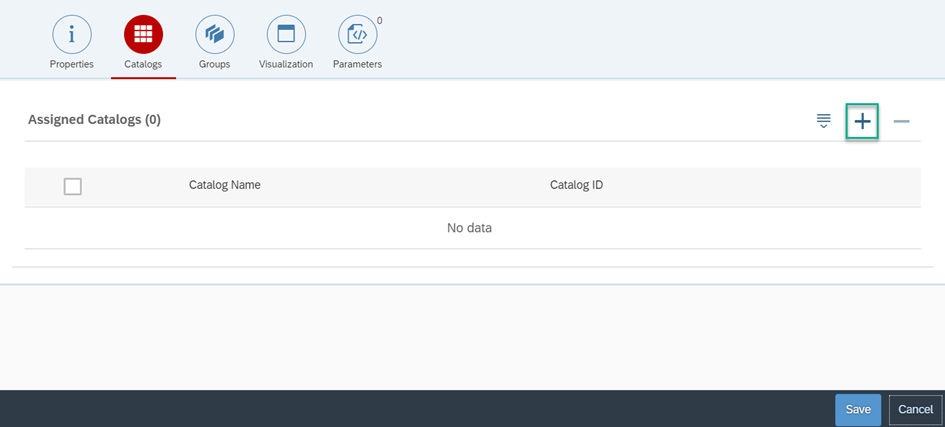

4.	In the **Select Catalogs** screen, select the `Everyone` catalog and click **OK**.

    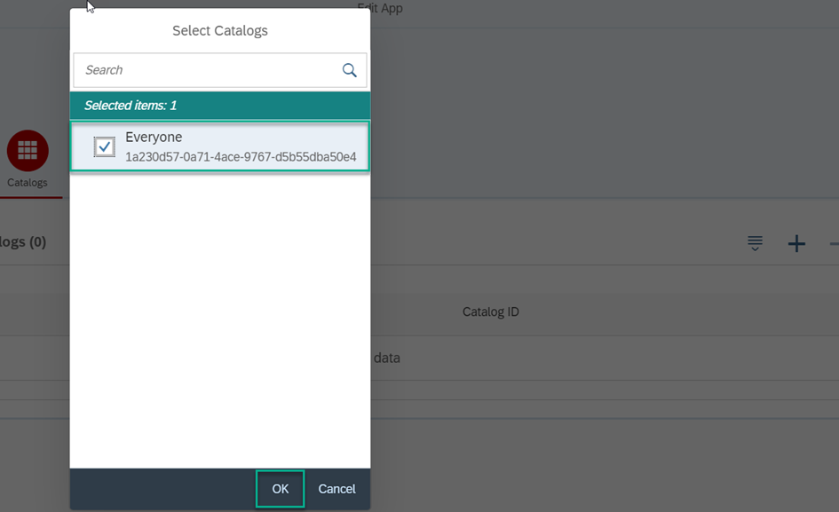

5.	Click **Save**.

>You have assigned the `Product List` app to the `Everyone` catalog allowing all users who are authenticated to access this app.

[DONE]
[ACCORDION-END]

[ACCORDION-BEGIN [Step 3: ](Define a tile for the app)]

You now want to create an app tile for your app so that users can click the app and open it.

1. Go to the **Visualization** tab.

2. Click **Edit** at the bottom right of the screen.

    

3. Select **Static App Launcher** as the **Tile Type**.

4. Leave the **Title** as `Product List`.

5. Add a **Subtitle** – call it `My Product List`.

6. Select an icon. Look for `sap-icon://Fiori2/F0401`.

    

7. See the preview of your tile.

    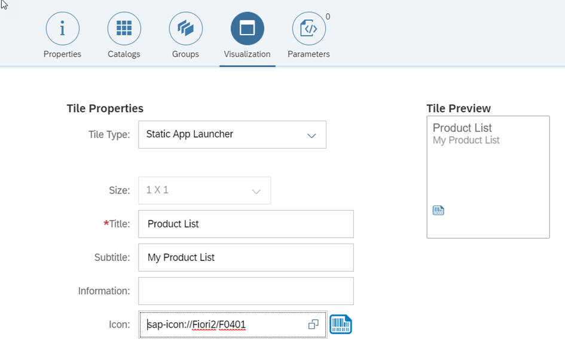

8. Click **Save**.

[DONE]
[ACCORDION-END]

[ACCORDION-BEGIN [Step 4: ](Add the app to a group)]

Now that you've created a tile for your `Product List` app you can add it to the group you created in the previous tutorial.

1. Go to the **Groups** tab and click **Edit**.

    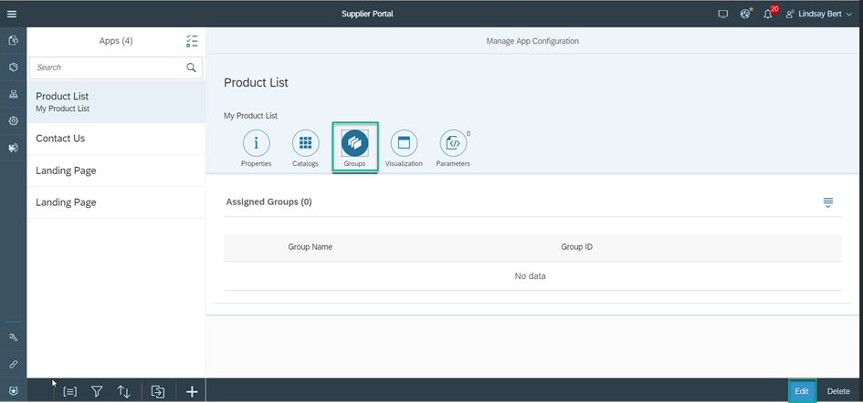

2. Click the + icon in the **Assigned Groups** table.

    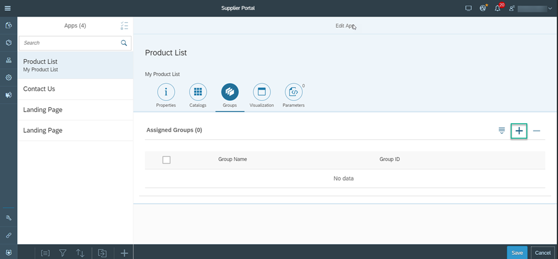

4. In the **Select Groups** screen, select the `Company Products` group that you created previously for your launchpad page and click **OK**.

    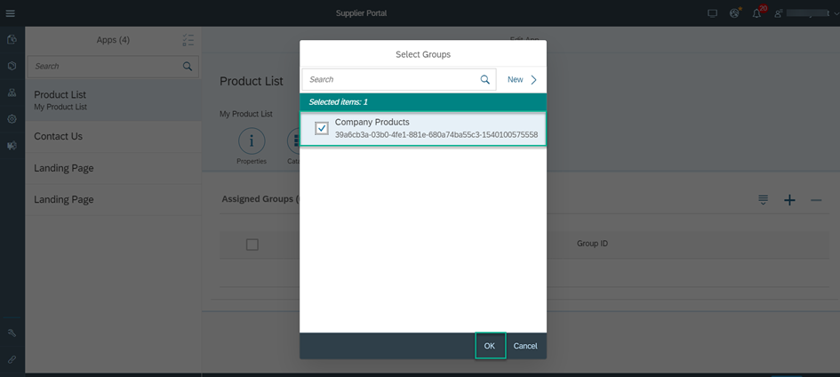

6. Click **Save**.

    

>Your app has been added to the `Company Products` group which is part of your launchpad page.

[DONE]
[ACCORDION-END]

[ACCORDION-BEGIN [Step 5: ](Preview your app on the launchpad page)]

To see the Product List app in the Company Products group on your launchpad page, do the following.

1. Click **Publish** at the top right side of your screen.

    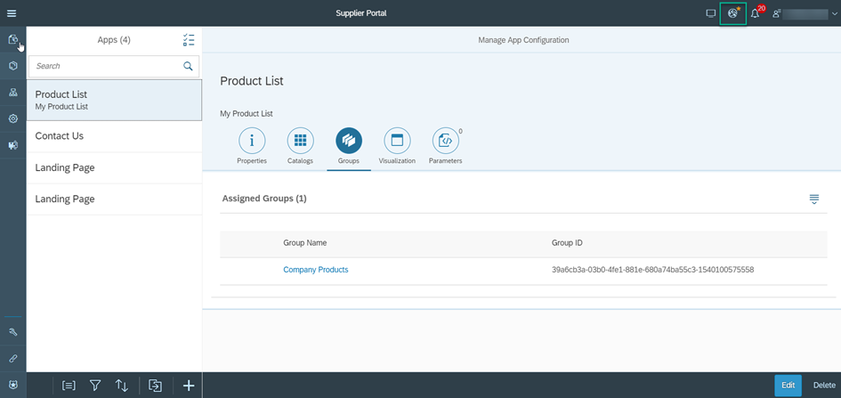

2. In the **Publish Site** screen, select **Publish and Open**.

    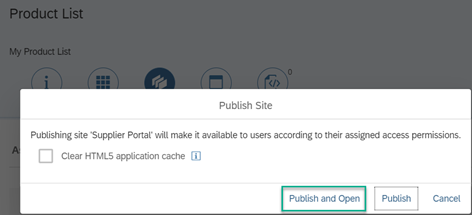

This is what you'll see:

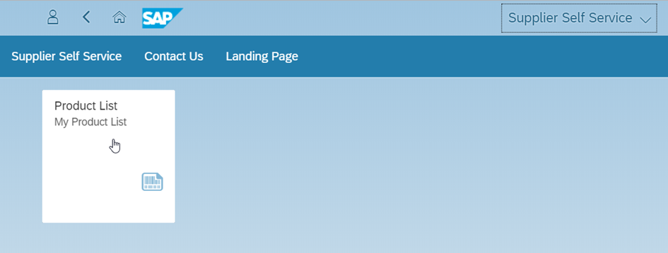

>You have added a SAP Fiori (SAPUI5) app to a new group on your `Supplier Self Service` launchpad page. In the next tutorial you are going to add a SAP WEB DYNPRO ABAP app to another group on this launchpad page.

[VALIDATE_1]
[ACCORDION-END]

---
