## Details
### You will learn  
 - How to add a SAP Fiori launchpad page to your freestyle site.

[ACCORDION-BEGIN [Step 1: ](Add a SAP Fiori launchpad page)]

In this tutorial you're going to create a launchpad page in your Portal freestyle site and then later you'll add apps to it.

>The page you are adding is just like any other page in your freestyle site. The only difference is that you can add apps to it and arrange them in groups just like you would do on any SAP Fiori launchpad site.

1. From the Portal Admin Space, open the **Supplier Portal** for editing in the Site Designer.

    

2. In the side panel, click **Page Management** -> **Pages**.

    

3.	Click + in the **Pages** panel.

    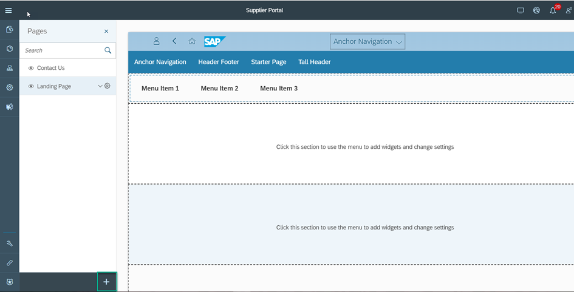

4. In the **Create Page** wizard, enter the following:

      - **Page Name**: `Supplier Self Service`
      - **Template Source**: Leave as is
      - Page template to select: `SAP Fiori Launchpad`

5. Click **Finish**.

    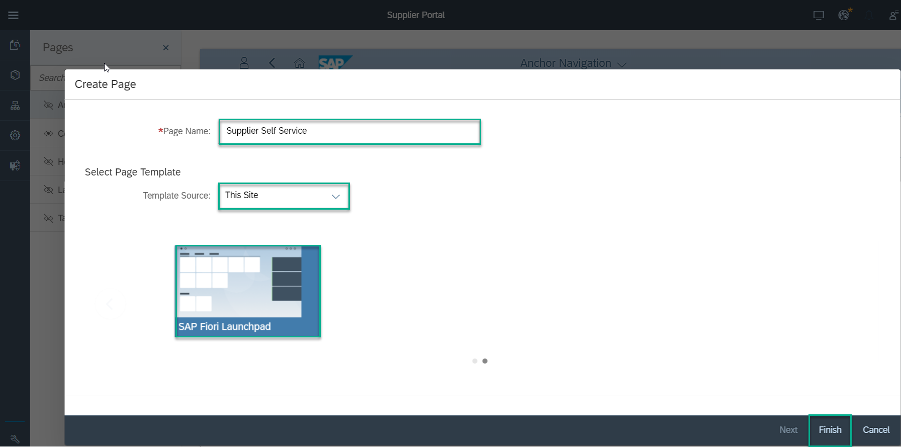

The `Supplier Self Service` page is added to the list of pages.

[DONE]
[ACCORDION-END]

[ACCORDION-BEGIN [Step 2: ](Create new group for launchpad tiles)]

In this step you will create a new tile group. Tile groups logically aggregate tiles in the SAP Fiori launchpad page.

1. From the list of pages in the left side panel, select the new **Supplier Self Service** page. This opens the **Manage Groups** editor.

2. Click the **+** icon at the footer of the (empty) list of Groups.

    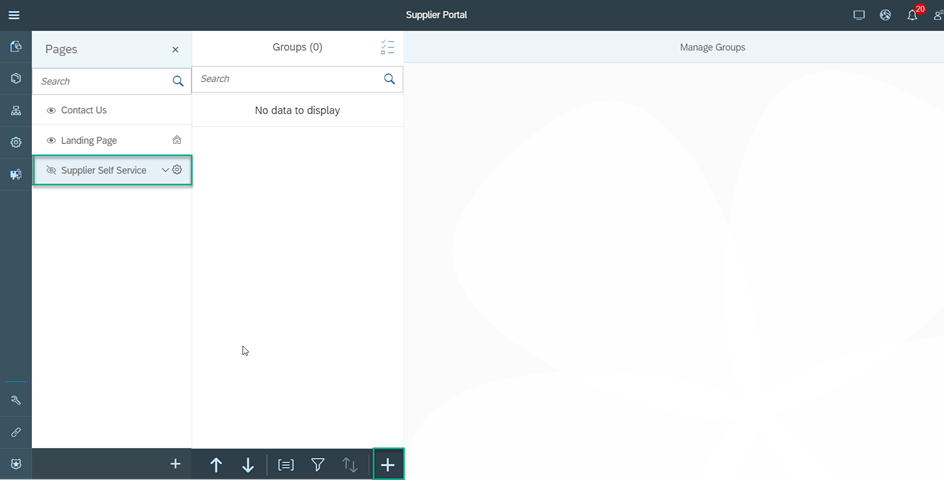

3. In the **New Group** wizard enter the **Group Name**: `Company Products`.

    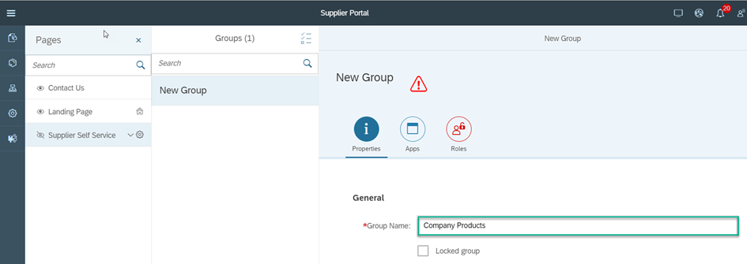

4. Click the **Roles** tab to assign roles to the tile group.

    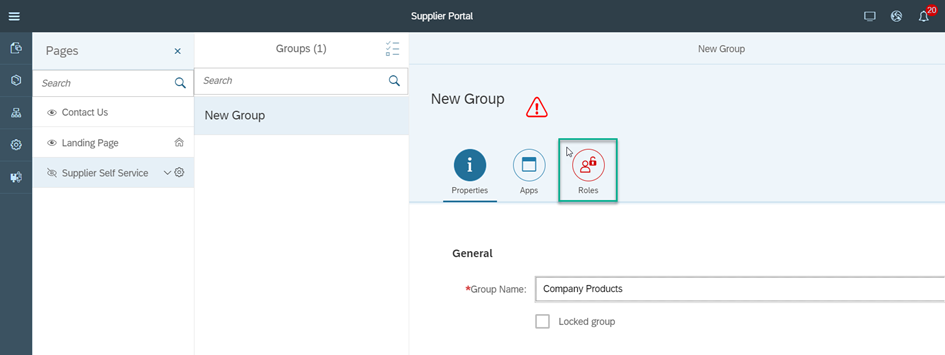

5. Click the **+** icon in the empty **Assigned Roles** table.

    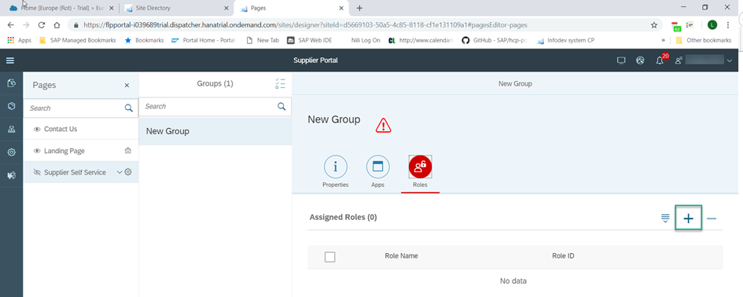

6. In the dialog box, select the **Everyone** role and click **OK**.

    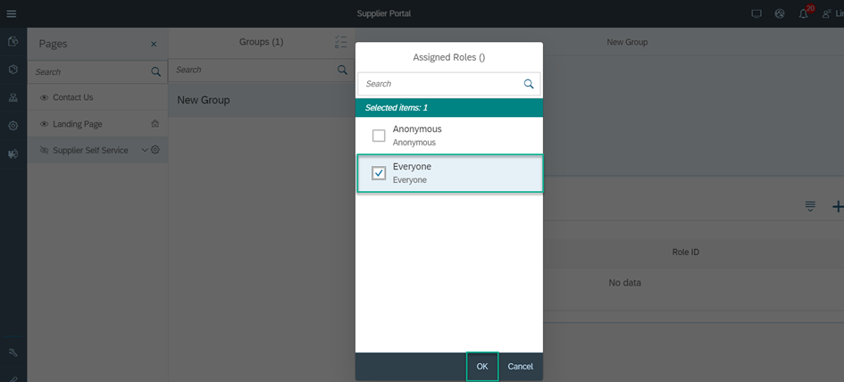

7. Click **Save** to create the new group.

    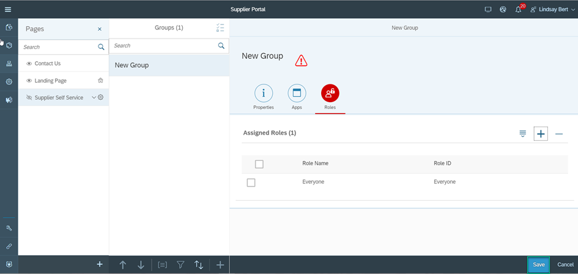

[DONE]
[ACCORDION-END]

[ACCORDION-BEGIN [Step 3: ](Add your page to the Portal site menu)]

In this step you will add the SAP Fiori launchpad page (named **Supplier Self Service**) to the Portal's navigation menu.

1. From the list of pages in the left side panel, select the  **Supplier Self Service** page.

2. Click the bottom-facing-arrow icon to open the page action menu and select **Add to Menu**.

    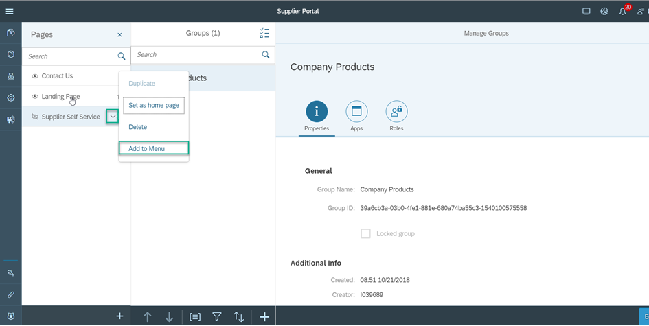

3. Click **Save**.

    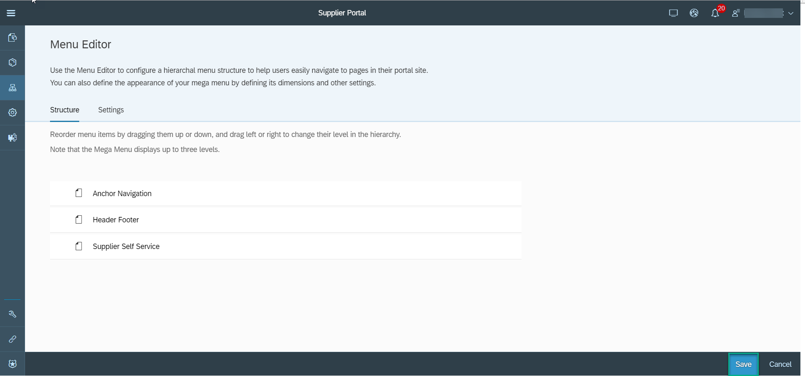

    > The **Menu Editor** is opened with a new menu entry named **Supplier Self Service** added at the bottom of the menu list. The new entry points to the newly created page.

[DONE]
[ACCORDION-END]

[ACCORDION-BEGIN [Step 4: ](Publish your site)]

In this step we will publish the site so that you can see how the new launchpad page is displayed in the Portal site menu.

1. Click the **Publish** icon.

    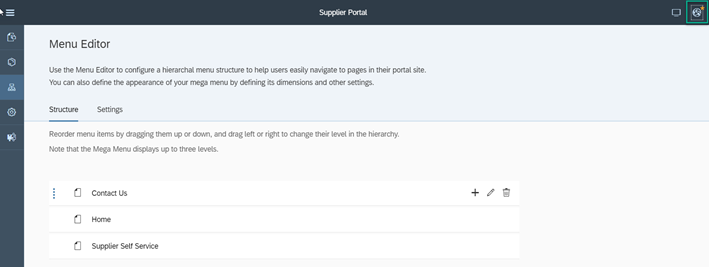

2. Click **Publish and Open**.

    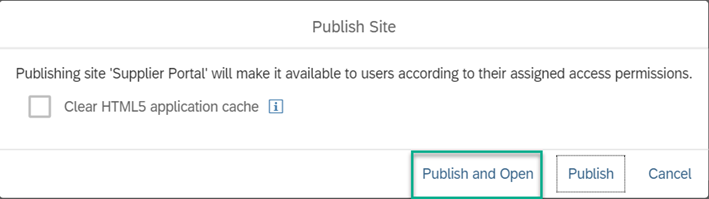

3. See the `Supplier Self Service` launchpad page displayed in the Portal site menu.

    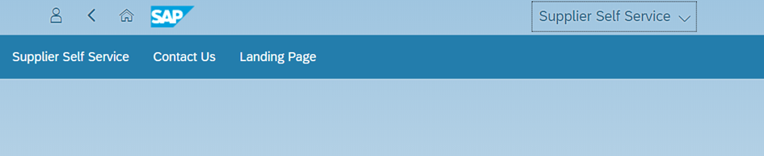

[VALIDATE_1]
[ACCORDION-END]

---
