## Details
### You will learn  
  - How to create a theme
  - How to customize the theme
  - How to publish the theme

A default theme, provided by SAP, is assigned to each Portal site. You can create a custom theme in the UI Theme Designer, and then use the Theme Manager to import it so that you can assign this theme to the site, or make it available for user selection.

---

[ACCORDION-BEGIN [Step 1: ](Save the site URL)]

>You will be needing the site URL later on and so we'll start off by finding it and saving it.

1. Navigate to the Site Directory and find the Supplier Portal tile.

2. Hover over the tile.

    

3. Right-click the URL and select **Copy link address**.

    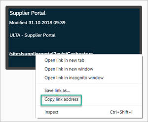

4. Save this link - you'll be needing it later.

[DONE]

[ACCORDION-END]

[ACCORDION-BEGIN [Step 2: ](Access the UI theme designer tool)]

1. From the side panel of your Supplier Portal site, select **Services and Tools**.

2. Open the UI Theme Designer tool by hovering over the tile and clicking **Configure**.

    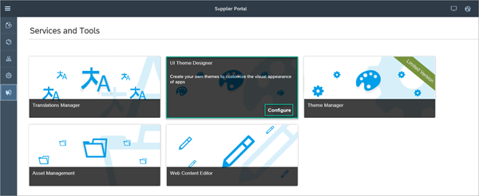

[DONE]

[ACCORDION-END]

[ACCORDION-BEGIN [Step 3: ](Create a theme)]

1. Click **Create a New Theme**.

    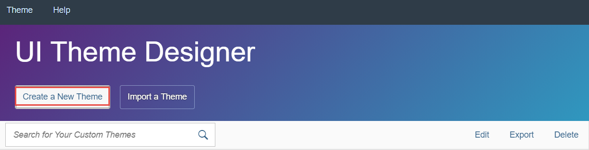

2. Select SAP Belize as the **Base Theme** and click **Step 2** to proceed.
    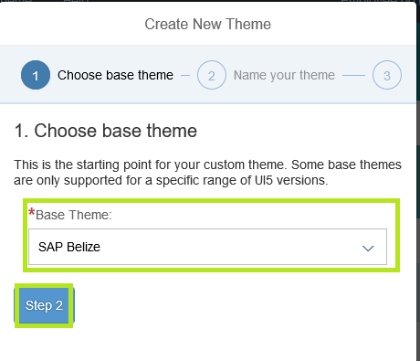

3. Enter the following values:

    |Field |Value |
    |----|-----|
    |**Theme ID** |**`velotics`** |
    |**Title** |**`velotics`** |

4. Click **Create Theme**.

    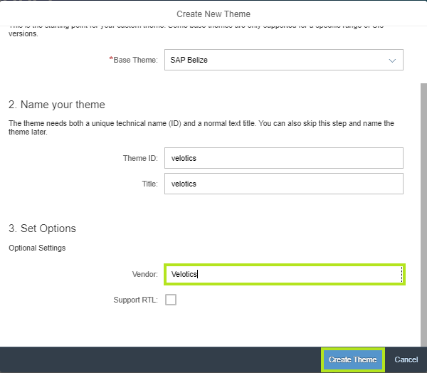

>A new theme named **`velotics`** is created as a copy of the SAP Belize theme with the custom properties that you entered.

[DONE]

[ACCORDION-END]

[ACCORDION-BEGIN [Step 4: ](Customize the theme)]
To design and modify the theme, you need to first define a Target Page that will serve as a canvas upon which you can perform these changes. You will then use the quick theming mode to easily change color scheme, background image, or logo.

1. Enter the **Link to Application**. This is the runtime URL of your site that you copied previously in Step 1.

2. Click **Add** to create the target page.

    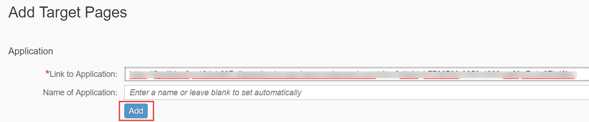

3. From the panel on the far right, select the paint brush icon to switch to quick theming.

    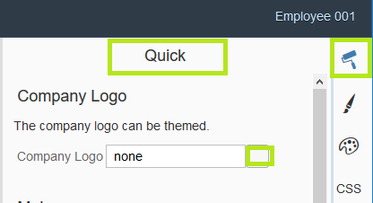

4.	Change the company logo by clicking on the right of the **Company Logo** field.

    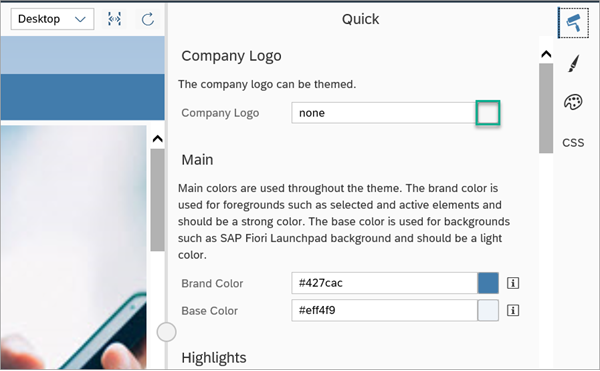

5.	In the **Assign Image** dialog, open the file system browser.

6.	Select the `logo-velotics.png` image file from our resources. Notice that that image has been added to the list of available images.

    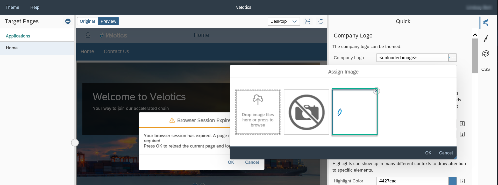

7.	Click the image to select it.

8.	Click **OK** to apply your changes. Notice that the change has been applied and the icon has changed.

    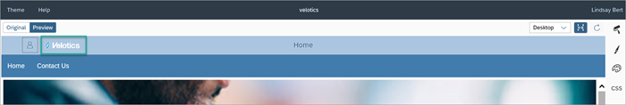

>To apply the new theme to your Portal site, you will need to publish it from the UI Theme Designer and then apply it to your site from the Portal Theme Manager.

[DONE]

[ACCORDION-END]

[ACCORDION-BEGIN [Step 5: ](Publish the theme)]

1. In the UI Theme Designer top level menu select **Theme** and then **Save & Publish**.

    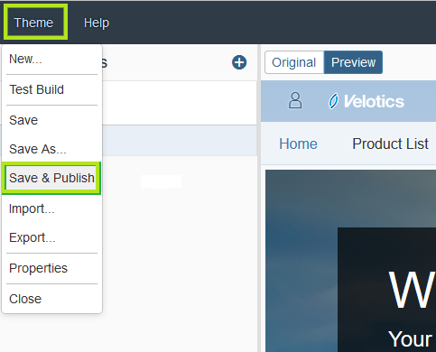

2. From the **Save & Publish** dialog, verify the theme parameters.

3. Click **Save & Publish** to publish the **`Velotics`** theme.

    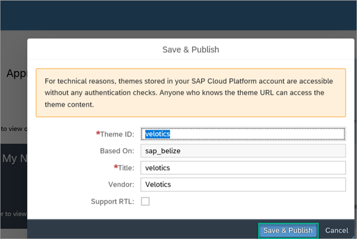

>Publishing the theme might take several moments.

[DONE]

  [ACCORDION-END]

  [ACCORDION-BEGIN [Step 6: ](Apply the theme to your site)]

1. Go back to the Site Designer of your site.

2. From **Services and Tools** launch the **Theme Manager**.

    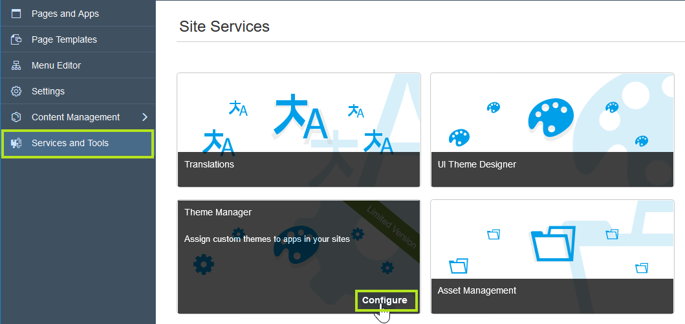

3. Click **OK** on the message.

4. Notice that the **`velotics`** theme that you created and published is available in the site's **Theme Manager**.

    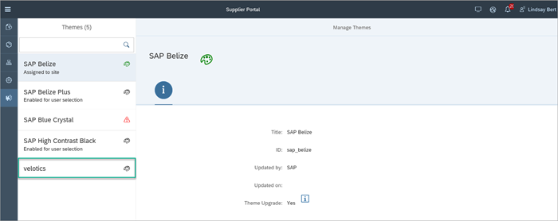

5. Select the **`velotics`** theme.

6. Click **Assign to Site**.

    

7. Click **Publish** to publish the latest changes.

    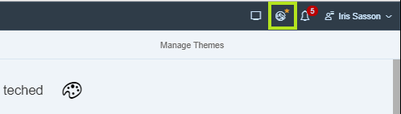

8. Click **Publish** to only apply the changes. Select **Publish and Open** to publish your site and review the latest changes you have made to your site.

    

9. View your branded Site

    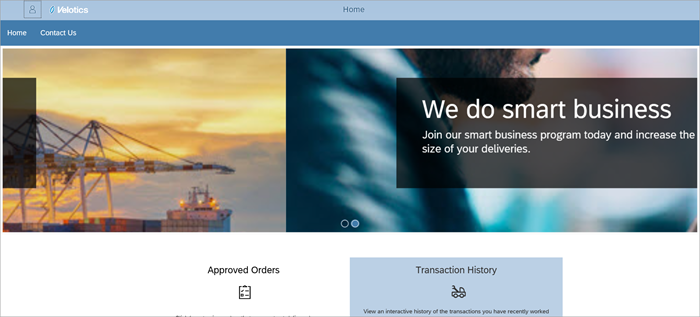

[VALIDATE_1]

  [ACCORDION-END]
