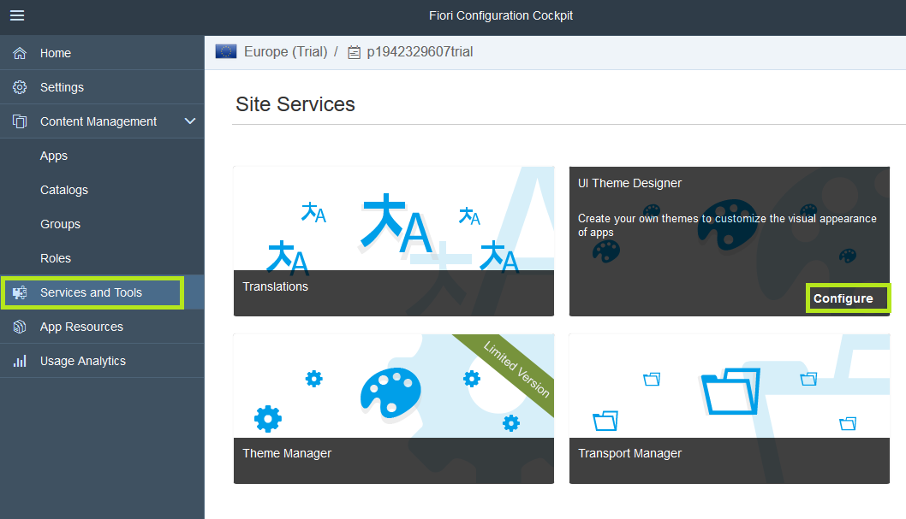

## Prerequisites  
 - **Proficiency:** Beginner

## Details
### You will learn  
  - How to create a theme
  - How to customize the theme
  - How to publish the theme

A default theme, provided by SAP, is assigned to each Portal site. You can create a custom theme in the UI Theme Designer, and then use the Theme Manager to import it so that you can assign this theme to the site, or make it available for user selection.

### Time to Complete
**15 Min**

[ACCORDION-BEGIN [Step 1: ](Save the site URL)]
  1. Navigate to the Site Directory in your SAP Cloud Platform Portal Admin Space.
  2. In the Supplier Portal site, navigate to **Services and Tools** and select the UI Theme Designer tool.

[ACCORDION-END]

[ACCORDION-BEGIN [Step 2: ](Create a theme)]

  1. Launch the UI Theme Designer as follows:
    <ol type="a"><li>Click on **Services and Tools** in the left side panel.
    </li><li>Hover over the **UI Theme Designer** tile and click  **Configure** to open the designer in a new browser tab.
    If a message appears, you can click **OK** and ignore it.

</li></ol>

  2. Create a new theme as follows:
    <ol type="a"><li>Click **Create a New Theme**.
    
    </li><li>For **Base Theme** select SAP Belize and click **Step 2** to proceed.
    
    </li><li>Enter the following values:

    |Field |Value |
    |----|-----|
    |**Theme ID** |**`velotics`** |
    |**Title** |**`velotics`** |
    </li></ol>
  3. Click **Create Theme**.

A new theme named **`velotics`** is created as a copy of the SAP Belize theme with the custom properties that you entered.

[ACCORDION-END]

[ACCORDION-BEGIN [Step 3: ](Customize the theme)]
To design and modify the theme, you need to first define a Target Page that will serve as a canvas upon which you can perform these changes. You will then use the quick theming mode to easily change color scheme, background image, or logo.

  1. Enter the **Link to Application**. This is the runtime URL of your site that you copied previously.
  2. Click **Add** to create the target page.
  
  3. From the panel on the far right, select the paint brush icon to switch to quick theming.
  
  4.	Change the company logo by clicking on the right of the **Company Logo** field.
  5.	In the **Assign Image** dialog, click on the left to open the file system browser.
  
  6.	Select the `logo-velotics.png` image file from our resources. Notice that that image has been added to the list of available images.
  8.	Click the image to select it.
  9.	Click **OK** to apply your changes. Notice that the change has been applied and the icon has changed.
>To apply the new theme to your Portal site, you will need to publish it from the UI Theme Designer and then apply it from the Portal Theme Manager.

[ACCORDION-END]

[ACCORDION-BEGIN [Step 4: ](Publish the theme)]

  1. In the Theme Designer top level menu click on **Theme** and then **Save & Publish**.
  
  2. From the **Save & Publish** dialog, verify the theme parameters.
  3. Click **Save & Publish** to publish the **`Velotics`** theme.
>Publishing the theme might take several moments.

  [ACCORDION-END]

  [ACCORDION-BEGIN [Step 5: ](Apply the theme to your site)]

  1. Open the Site Designer of your site.
  2. From **Services and Tools** launch the **Theme Manager**.
  
  3. Click **OK** on the message.
  4. Notice that the **`velotics`** theme that you created and published is available in the site's **Theme Manager**.
  5. Select the **`velotics`** theme.
  6. Click **Assign to Site**.
  7. Click **Publish** to publish the latest changes.
  
  8. Click **Publish** to only apply the changes. Select **Publish and Open** to publish your site and review the latest changes you have made to your site.
  

  [ACCORDION-END]
