## Details
### You will learn  
  - How to create a site
  - How to add apps and pages to the site
  - How to set the page layout
  - How to add content to your site
  - How to publish the site

You can build an intuitive and user-friendly portal freestyle sites by adding pages and apps to and determining the site's layout and look and feel. Edit the default content with your own and when all is in place, publish the site so that all the content is available for your end users.

---

[ACCORDION-BEGIN [Step 1: ](Access the Portal Admin Space)]

1. From SAP Cloud Platform, click **Services** from the left panel to open the services available for your subaccount.

2. From the **Categories** dropdown list, select **User Experience** to see UX-related services.

3. Click the **Portal** tile to open the service overview page.

4. In the **Portal – Overview** page, click **Go to Service** to open the Portal.

    The Portal Admin Space opens in a new browser and you are ready to start creating your freestyle site.

5. In the left panel, select **Site Directory**.

    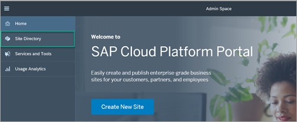

6. Click the tile with the plus icon to open the **Create Site** wizard.

    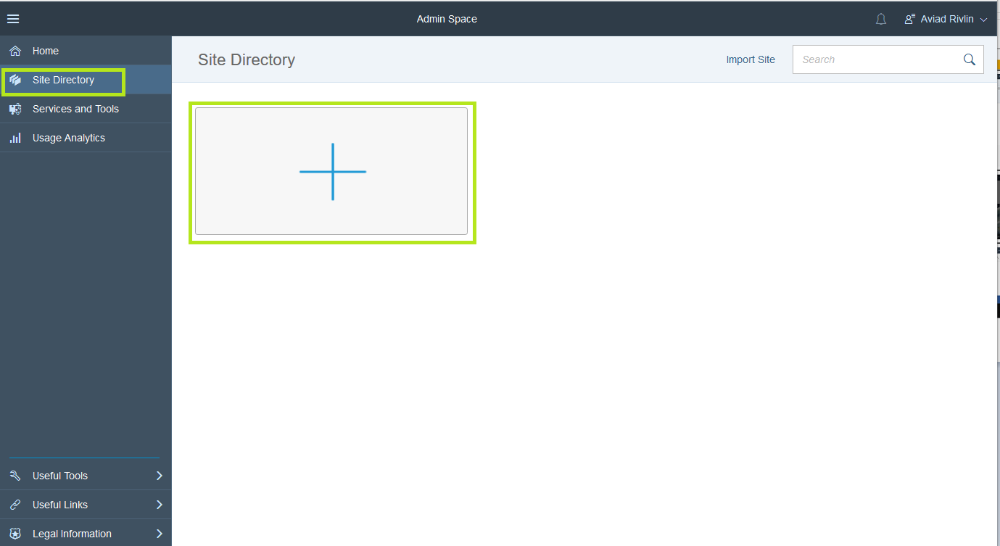

7. Name the site **`Supplier Portal`**, select the **Basic Layout Set** as your site template, and confirm with the **Create** button.

    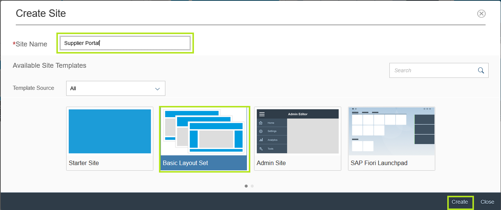

    The new site instance opens in the Site Designer in a new browser tab.

[DONE]

[ACCORDION-END]

[ACCORDION-BEGIN [Step 2: ](Design your first Portal page)]
The site you have created is based on the **Basic Layout Set** site template. This template contains four pages that are based on the **Anchor Navigation**, **Header Footer**, **Starter Page**, and **Tall Header** page templates. In this step you will design the **Header Footer** page and add content to it.

1. Select the **Header Footer** page.

    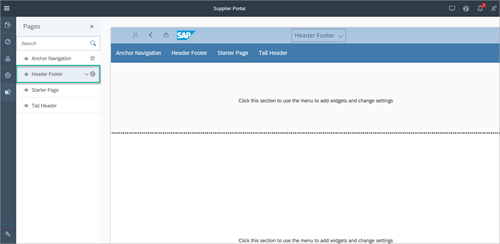

2. Select the upper **Header** section of the page and click on the + sign to open the widget gallery.

    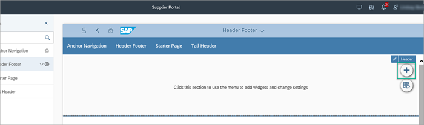

3. Scroll to the **Web Content Widgets: Carousel** section and select the **Headline Carousel** widget.

    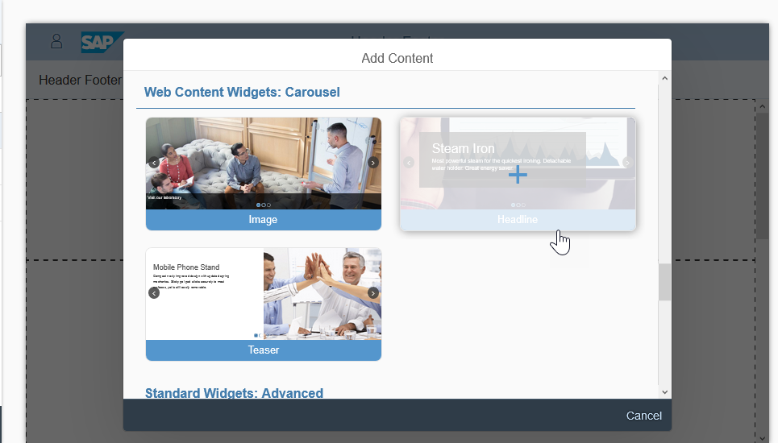

4. Click the widget to expose the widget menu and click the pencil icon to edit the widget content.

    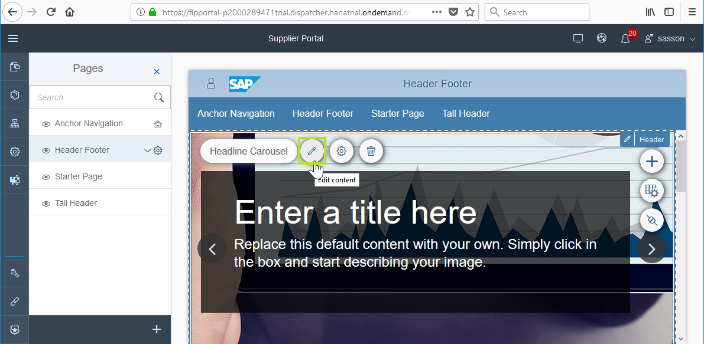

5. Select one of the Carousel content items and click on the minus icon at the bottom to remove it.

    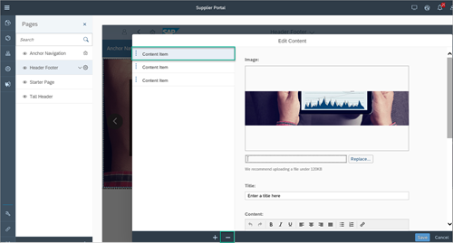

      You now have 2 remaining content items.

6. Click the first content item and do the following:

    | Field | Value |
    |-------|----------|
    | Image | Click **Replace** to remove the default picture and select `SupplierPortaHeader1.jpg` (available in our resources). |
    | Title |**Welcome to Velotics** |
    | Content | **Your way to join our accelerated supply chain**

    

7. Select the second content item and do the following:

    | Field | Value |
    |-------|------ |
    | **Image** | Click **Replace** to remove the default picture and select `SupplierPortaHeader2.jpg` (available in our resources) |
    | **Title** | We do smart business |
    | **Content** | Join our smart business program today and increase the size of your deliveries. |

8. **Save** your changes.

    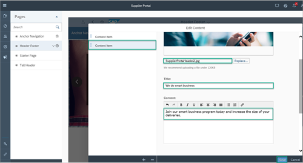

9. Now select the middle section of the page and click the **+** icon to add a widget.

10. Add the following widgets to the middle section:

    - From the **Web Content Widgets: Cards** area: Select the **Joined Card** widget.
    - From the **Web Content Widgets: Basic** area: Select the **Video** widget.
    - From the **Web Content Widgets: Basic** area: Select the **Header with Text** widget.
    - From the **Web Content Widgets: List** area: Select the **Design List** widget.

11. Select the **Joined Card** widget and click the pencil icon.

    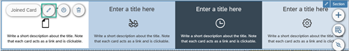

12. Edit it as follows:

    First content item:

    | Field | Value |
    |------ | ----- |
    | **Title** | Approved Orders |
    | **Icon**  | `sap-icon://Fiori2/F0003` |
    | **Text**  | Click here to view orders that were not yet delivered |

    Second content item:

    | Field | Value |
    | ----- | ----- |
    | **Title** | Transaction History
    | **Text**  | View an interactive history of the transactions you have recently worked with |

    Third content item:

    | Field | Value |
    | ----- | ----- |
    | **Title** | My Next Payments |
    | **Icon**  | `sap-icon://Fiori2/F0028` |
    | **Text**  | Click here to view your next expected payments |

    Fourth content item:

    | Field | Value |
    | ----- | ----- |
    | **Title** | Apply for a Bid |
    | **Icon**  | `sap-icon://Fiori7/F0840`
    | **Text**  | View current list of Request For Proposals and write your bid |

13. **Save** your changes. This is how your Joined Card widget looks:

    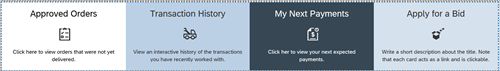

[DONE]

[ACCORDION-END]

[ACCORDION-BEGIN [Step 3: ](Define the page layout)]

1. Select the middle section again, and click on the **Edit section settings** icon.

    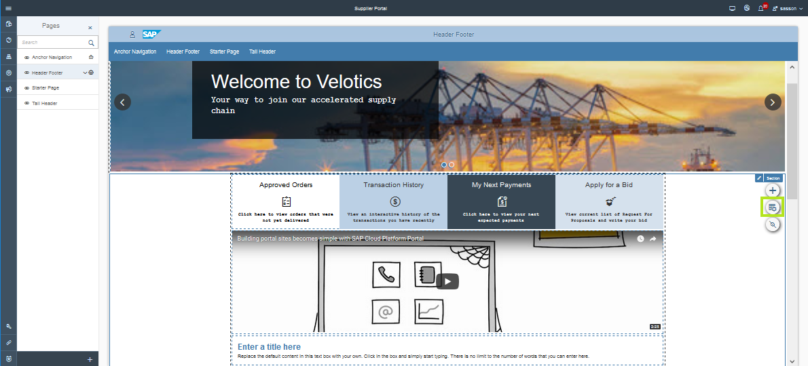

2. In the **Layout** tab, select the **Custom** layout.

3. Scroll down to see all the widgets in this section. In the desktop and tablet view:

    - Select **All** to allow the **Joined Cards** widget to span across the page section.
    - Display the **Video** widget across half the screen.
    - Display the **Header with Text** widget across half the screen.
    - Lastly set the **Design List** widget to **All**.

4. In the Mobile view, the value is **All** for all widgets.

5. If the order of the widgets does not appear as described, drag and drop them in the required order.

    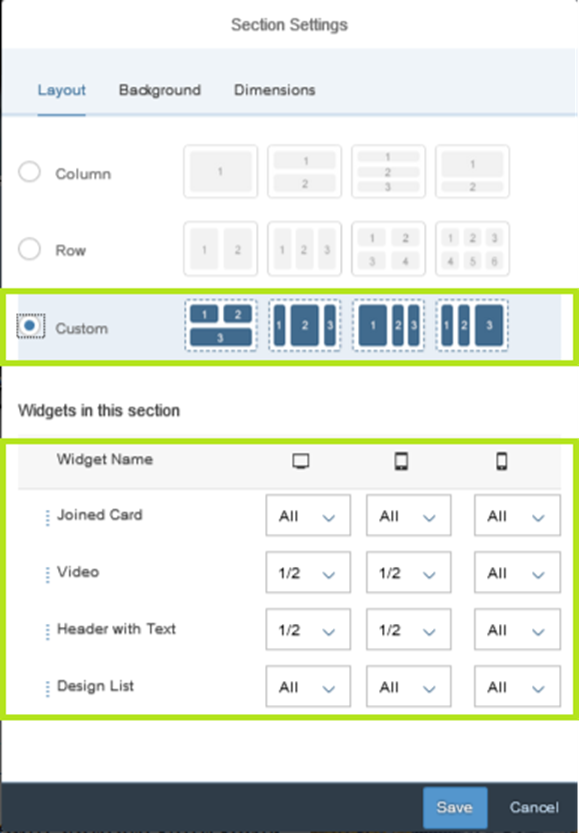

6. Click the **Dimensions** tab and enter the following values:

    | Field | Value |
    | ----- | ----- |
    | **Margins** | `50 pixel` |
    | **Content Width** | `1024 pixel` |

7. **Save** your settings.

8. Click on the arrow next to the **Header and Footer page and select **Set as home page**.

    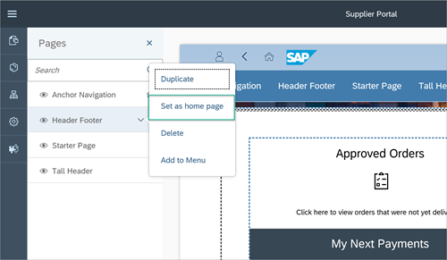

The page structure is now ready. Verify that it looks like this:

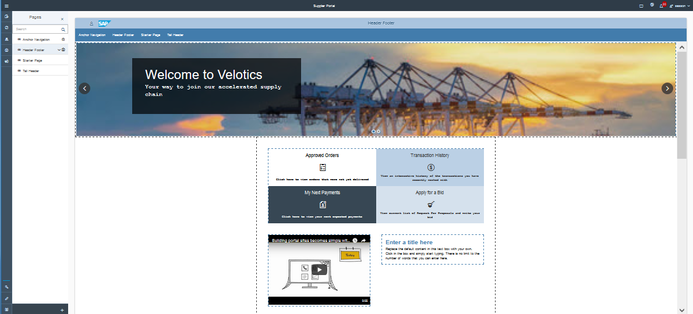

[DONE]

[ACCORDION-END]

[ACCORDION-BEGIN [Step 4: ](Add another new page with content)]

1. At the bottom of the **Pages** panel on the left, click the + sign to add a new page.

    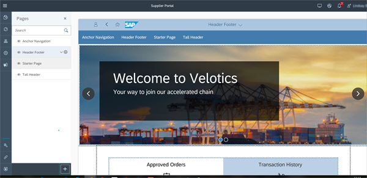

2.	In the **Create Page** wizard, enter **`Contact Us`** as the page name.

3.	Select the **Starter Page** template and then click **Finish**.

    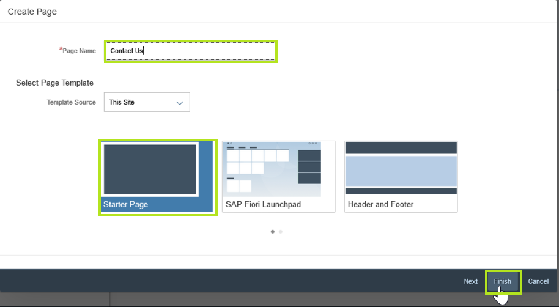

4.	On the **`Contact Us`** page, click on the page section, and click the + sign to open the widget gallery.

    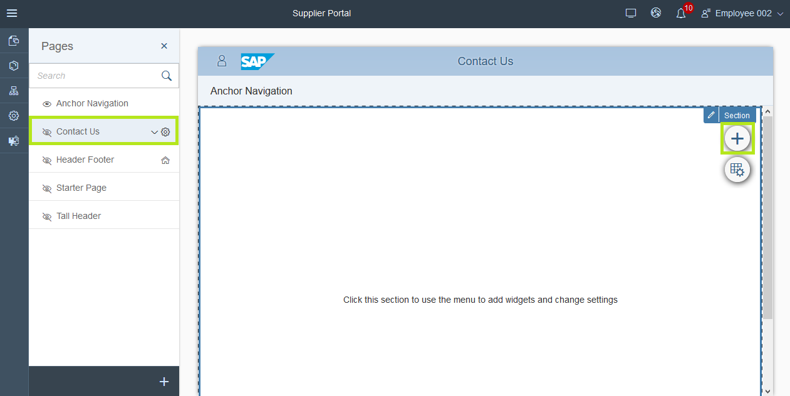

5. From the **Web Content Widgets: Basic** area: 	Select the **Medium Header** widget.

6.	Click the page section again, and click the + sign to open the widget gallery again.

7.	From the **Web Content Widgets: Cards** area: Select the **Circular Story Card** widget.

8.	Now select the **Medium Header** widget that you just added, and click the pencil icon to edit the widget content.

9.	Paste the following text in the **Title** area: **`Below you can find contact details of key position holders at Velotics. We will be happy to assist with any issue.`**

10.	**Save** your changes.

11.	Click the **Circular Story Card** widget and select the pencil icon to edit its content.

12.	Enter the following content:

    | Field | Value|
    |--------|-------|
    | **Title** | John Doe |
    | **Text** | Suppliers Partner Manager |
    | **Link: Display Text** | Contact Me |

13.	Click the second card Content item and enter the following content in each of the Content Items:

    | Field | Value|
    |--------|-------|
    | **Title** | Sam Lynn |
    | **Text** | VP Partnership |
    | **Link: Display Text** | Contact Me |

14.	In the same manner, select the third Card Content Item and paste the following content:

    | Field | Value|
    |--------|-------|
    | **Title** | Carly Nelson |
    | **Text** | VP Partnership |
    | **Link: Display Text** | Contact Me |

15.	**Save** your settings.

[DONE]

[ACCORDION-END]

[ACCORDION-BEGIN [Step 5: ](Edit the site menu)]

1.	In the **Pages** panel select the arrow next to the **Header Footer** page and select **Add to Menu**.

    

    The Menu Editor opens with the **Structure** tab in focus.

2.	Hover over the **Anchor Navigation** row, and click the **Delete** icon to remove it from the menu. Confirm the popup and delete the entry.

    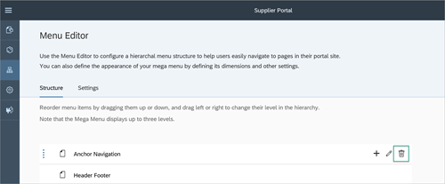

3.	In the same way, remove all other pages from the site menu except for the **Header Footer** page.

4. Hover over the **Header Footer** row and rename it to **Home** by clicking the edit icon in the **Header Footer** row and changing the **Display Name**.

    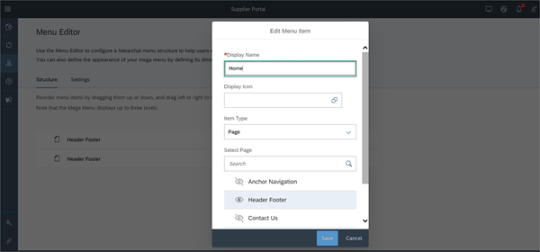

5.  Hover over the **Home** menu entry and click on the + icon and select **Add Item**.

    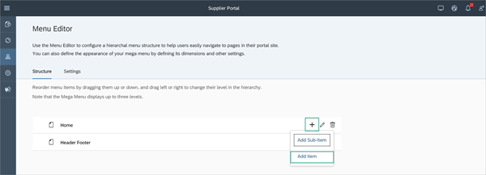

6.  Type **Contact Us** as the **Display Name** and select the **Contact Us** page from the list of displayed pages.

7.  Click **Add**.

    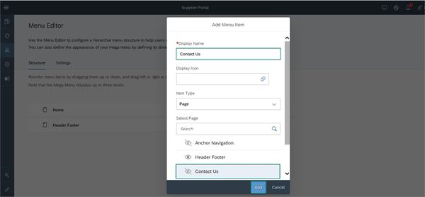

8.	**Save** the changes to the menu.

[DONE]

[ACCORDION-END]

[ACCORDION-BEGIN [Step 6: ](Preview and publish the site)]

1.	Click on site preview icon to open the page preview in a new tab.

    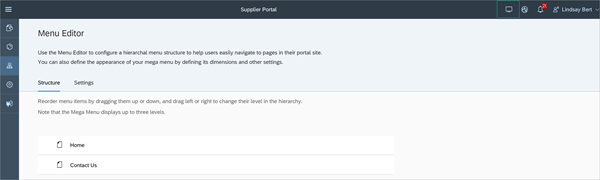

2.	Review your site.

3.	Close the preview.

4.	Click the publish icon to publish the latest version of the site so that its available for your end users.

    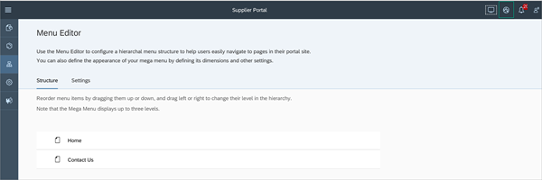

5. Click **Publish and Open**. This is what you'll see:

    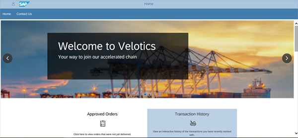

[VALIDATE_1]

[ACCORDION-END]

Congratulations! You have created a Portal freestyle site.

In the next tutorial, you'll edit the web content of this site in a tool called the Web Content Editor.

---
