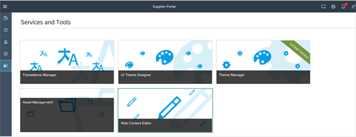
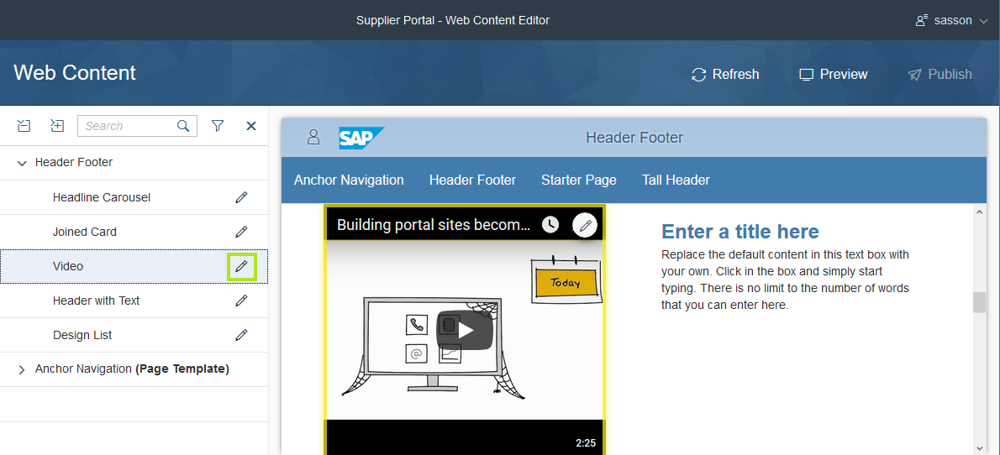
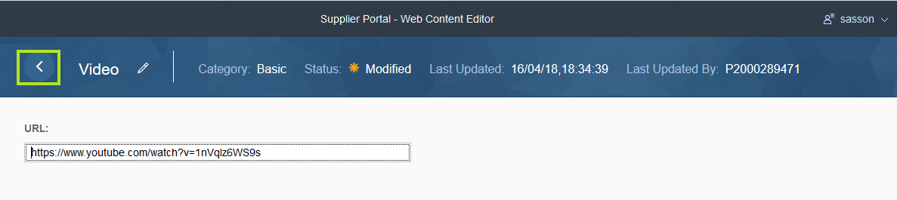
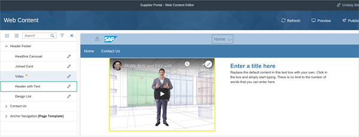
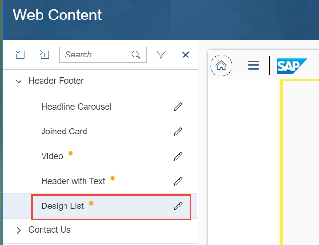
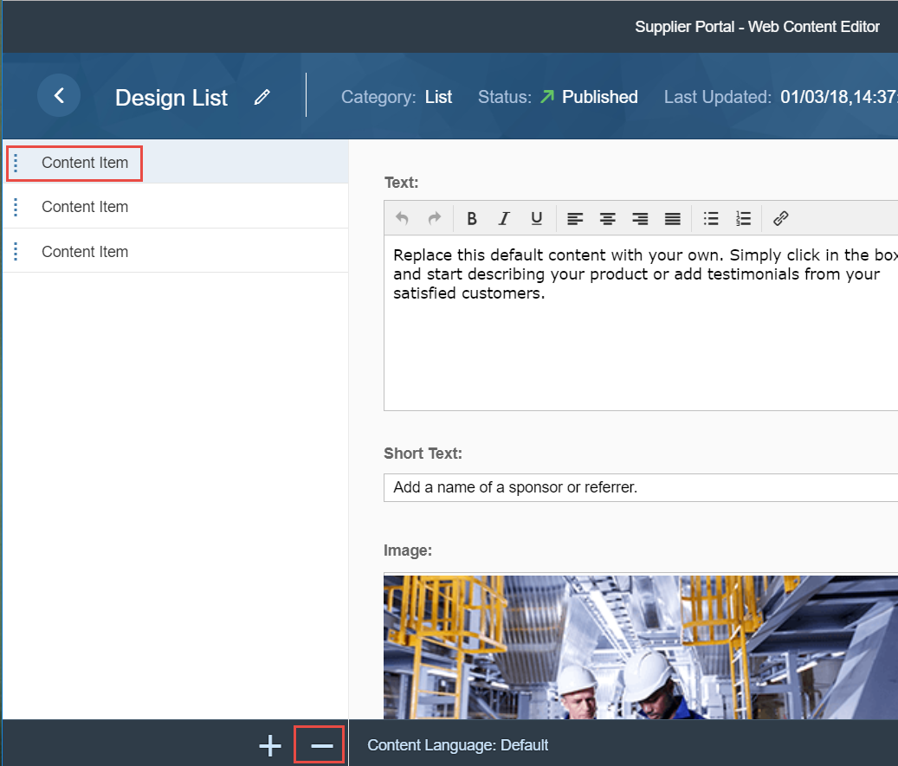
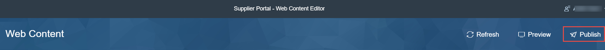

## Prerequisites  
 - **Proficiency:** Beginner

## Details
Portal freestyle sites consist of web content that is maintained and edited in a dedicated tool called the Web Content Editor. The web content is edited by the administrator or by a person who has been assigned the role of web content editor.

### You will learn  
  - How to access the Web Content Editor tool
  - How to edit the web content
  - How to publish the changes you made to the web content

### Time to Complete
**15 Min**

[ACCORDION-BEGIN [Step 1: ](Access the Web Content Editor tool)]
In the Supplier Portal site, navigate to **Services and Tools** and select the Web Content Editor tool.

>Note that Administrators can also send you the URL to access the Web Content Editor tool.

[DONE]

[ACCORDION-END]

[ACCORDION-BEGIN [Step 2: ](Edit the web content)]

1. In the left panel, under the **Header Footer** page, select the **Video** web content entry.

2. Click the pencil icon next to it.

    

3. Enter the following video URL: <https://www.youtube.com/watch?v=1nVqIz6WS9s>

4. Click **Save**.

5. Click the back button.

    

6. Click the pencil icon next to the **Header with Text** web content entry.

    

7. Enter the following texts in the relevant fields:

    | Field | Value |
    |-------|----------|
    | **Title** | Supplier Updates |
    | **Text** | Important update to all suppliers: As of 9.9.17, the  payment policy will be updated. Please read the note below carefully to learn more about the change.    All payments will be issued electronically, via Automated Clearing House (ACH) CTX format in the United States and the SWIFT Network outside the United States. There is generally one business day from when we issue a payment until it's received in the supplier's bank account.    The payment will be issued directly to the supplier's bank. Suppliers can request an email remittance from us that includes invoice details and payment information. Additional information, including email remittance and Electronic Payment Enrollment Forms can be accessed through the transaction history item in the updated Supplier Portal. |

 8. Click **Save**.

 9. Click the back button again.

 10. Click the pencil icon next to the **Design List** web content entry.

    

 11. Select the first content item and click on the minus icon to delete the first item.

    

 12. Select the next content item and enter the following text:

    | Field | Value |
    | ----- | ----- |
    | **Text**  | Statement of Work (SOW) parameters. A SOW helps ensure that expectations are understood and agreed upon by all parties up front.
    | **Image** | Click **Replace** to replace the image and select `Testimonial1.jpg` (available in our resources).

   13. **Save** your settings.

   14. In the same way, select the last content item and enter the following text:

    | Field | Value |
    | ----- | ----- |
    | **Text**  | Because Velotics is committed to promoting a positive work environment, we expect our suppliers and their employees, agents, and subcontractors to adhere to the same standards of conduct and behavior that we expect from our own employees while they are on The Company property or doing business with The Company. Suppliers and their employees, agents, and subcontractors (collectively referred to as "Suppliers") must adhere to this Supplier Code of Conduct while conducting business with or on behalf of The Company.
    | **Image** | Click **Replace** to replace the image and select `Testimonial2.jpg` (available in our resources).

   15.	Click **Save** and use the back button again.

[DONE]

[ACCORDION-END]

[ACCORDION-BEGIN [Step 3: ](Publish the changes to your web content)]

1. In the page view of the Web Content Editor, click **Publish** on the right side of the menu bar.

    

2. Select the option to **Publish all modified web content in this site** and **Publish**.

    

    >To publish only the content of a specific widget, simply select it and click **Publish**.

3. Click **Publish**.

[VALIDATE_1]

[ACCORDION-END]

In the next tutorial, you will create your own theme in the UI Theme Designer, and then use the Theme Manager to assign it to your site.

---
