## Prerequisites  
 - You have signed up to the SAP Gateway system. For more information, see [Create an account on the Gateway Demo system] (https://developers.sap.com/tutorials/gateway-demo-signup.html#_blank)

## Details   
### You will learn  
 - How to connect to the SAP Gateway demo system OData service
 - How to get your apps from the GitHub repository
 - How to access SAP Web IDE
 - How to import a SAPUI5 app into Web IDE
 - How to deploy the app to your SAP Cloud Platform subaccount

> Any SAPUI5 app that is deployed to an SAP Cloud Platform subaccount, can be added to a portal site. In this tutorial we are going to show you how to deploy the `ProductsList` SAPUI5 app to your subaccount. We will then add this app to a launchpad page in your freestyle site.

[ACCORDION-BEGIN [Step 1: ](Create destination to Gateway demo system)]
First set up a destination and its parameters for making a connection to the SAP Gateway demo system OData service from your SAP Cloud Platform  subaccount.

  1. From your SAP Cloud Platform Cockpit, click **Connectivity** > **Destinations** and click **New Destination**.

    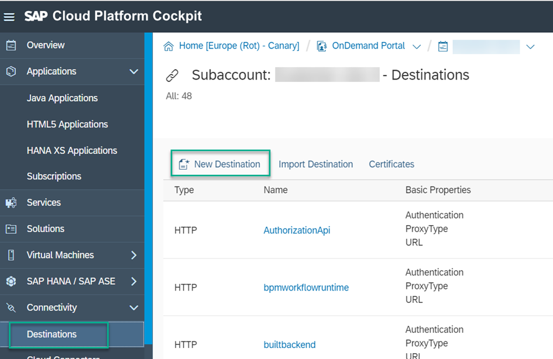

  2. Define the following properties:

    | Field | Value  
    | :-----| :--------|
    | `Name` | **`ES5`**   
    | `Type` | **`HTTP`**
    | `URL`  | **`https://sapes5.sapdevcenter.com`**
    | `Proxy Type`  | **`Internet`**
    | `Authentication` | **`BasicAuthentication`**
    | `User`  | **`Your ES5 user name`**
    | `Password` | **`Your ES5 password`**  
    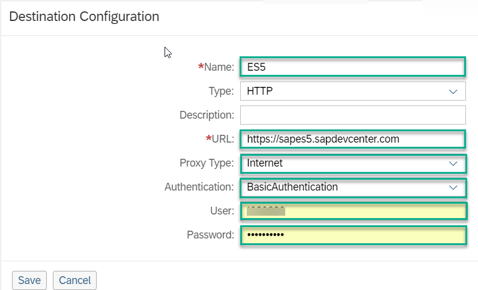

3. Click **New Property** and define the following properties:

    | Field | Value      |
    |-------|--------|
    | `sap-client`  | **`002`**   |
    | `Usage` | **`Backend`**
    | `WebIDEEnabled`  | **`True`**
    | `WebIDESystem`   | **`ES5`**
    | `WebIDEUsage` | **`odata_gen, odata_abap, bsp_execute_abap`**

    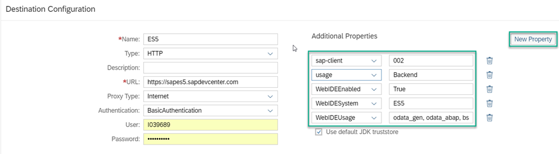  

    > The **Usage** property is not in the list of properties. In order to consume SAP backend apps, (SAP GUI for HTML and Web Dynpro ABAP) in SAP Cloud Platform Portal sites, you must add it manually with value **Backend**.

4. Click **Save**.

5. Click **Check Connection**.

    Verify that you get the following message:

    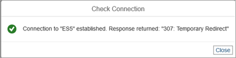  

[DONE]
[ACCORDION-END]

[ACCORDION-BEGIN [Step 2: ](Download the Portal tutorials repository)]
The SAP Cloud Platform Portal tutorial GitHub repository contains various SAPUI5 applications, Portal widgets, and Shell plugins used in Portal tutorials. Once deployed to your SAP Cloud Platform subaccount, they are available to add to your Portal site.

1. Go to [SAP Cloud Platform Portal Tutorial Samples](https://github.com/SAP/cloud-portal-tutorial-samples).

2. Click the  **Clone or download** button and select **Download ZIP**.

    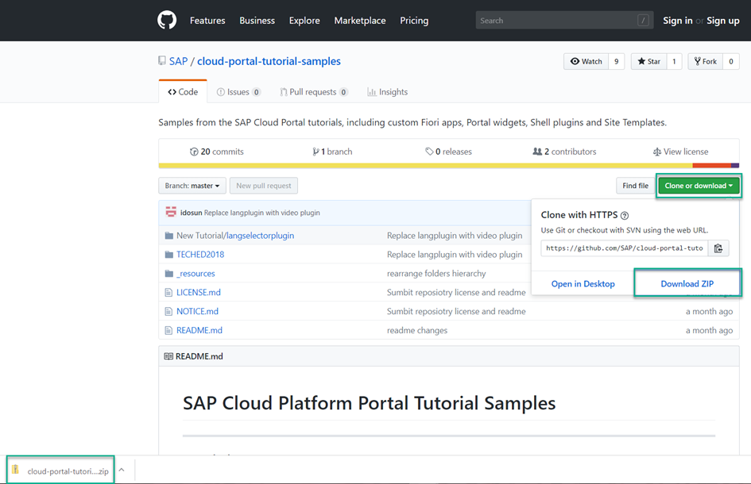

    > A cloud-portal-tutorial-samples-master.zip file is downloaded to your computer.

3. Right-click the **cloud-portal-tutorial-samples-master.zip** and extract the repository ZIP file into a folder.

    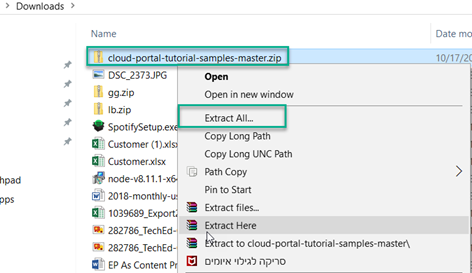

    > A new cloud-portal-tutorial-samples-master folder is created

4. Open the `cloud-portal-tutorial-samples-master\TECHED2018` folder.

    For this tutorial we will be using the `productslist` app from the Portal samples repository:

    `cloud-portal-tutorial-samples-master\TECHED2018\productslist`.

[DONE]
[ACCORDION-END]

[ACCORDION-BEGIN [Step 3: ](Create a ZIP file from the application)]

1. Open the `cloud-portal-tutorial-samples-master\TECHED2018\productslist\` folder.

2. Create a ZIP file from **all** of the underlying files:

    <ol type="a"></li><li>Select all of the included files (Ctrl^A).
    </li><li>Right-click and select **Add to `productlist.zip`**.</li></ol> 

      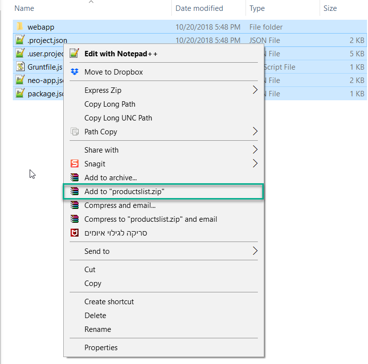

3. A new ZIP file named `productlist.zip` is created inside the folder.

    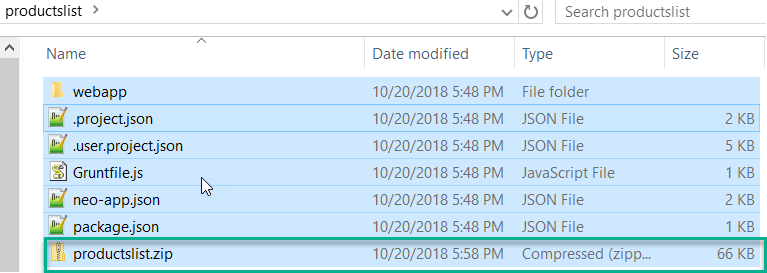.    

[DONE]
[ACCORDION-END]

[ACCORDION-BEGIN [Step 4: ](Open SAP Web IDE)]

1. In the SAP Cloud Platform cockpit, click **Services** in the left panel and open the **SAP Web IDE Full-Stack** tile.

2. From the **SAP Web IDE Full-Stack- Overview** page, click **Go to Service** to open the development environment.

3. Click the **Development** perspective:

    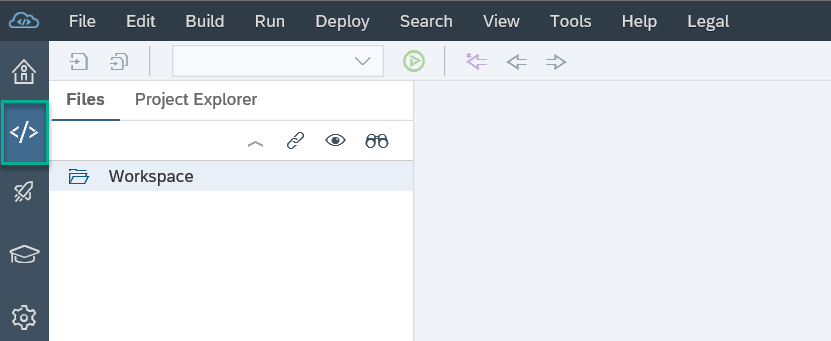

>You've opened your development environment, now let's import our `ProductsList` SAPUI5 app into it.

[DONE]
[ACCORDION-END]

[ACCORDION-BEGIN [Step 5: ](Import the SAPUI5 App to SAP Web IDE)]

1. In the development workspace, select the `Workspace` root folder.

2. Right-click and select **Import** ->  **File or Project**.

    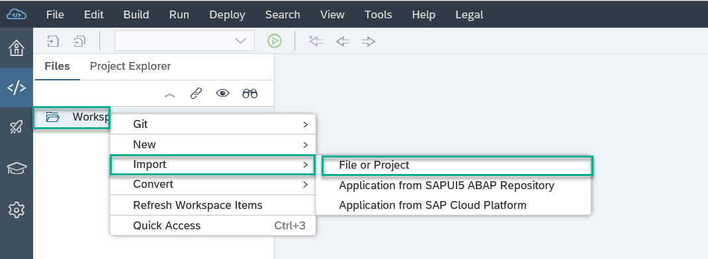

3. From the **Import** dialog box, select the `productslist.zip` file located in the `cloud-portal-tutorial-samples-master\TECHED2018\productslist\`folder.

    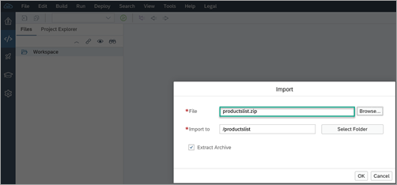

4. Check **Extract Archive** and make sure that **Import to** is `/productslist`.

    

5. Click **OK** to start the import.

>You have imported the `ProductsList` app and now you need to deploy it into your subaccount.

[DONE]
[ACCORDION-END]

[ACCORDION-BEGIN [Step 6: ](Deploy the app to your subaccount)]

1. Still in SAP Web IDE, right-click the `productslist` folder and select **Deploy** -> **Deploy to SAP Cloud Platform**.

    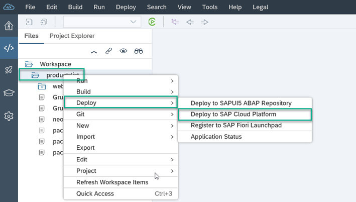

2. On the screen that opens, click **Deploy**.

      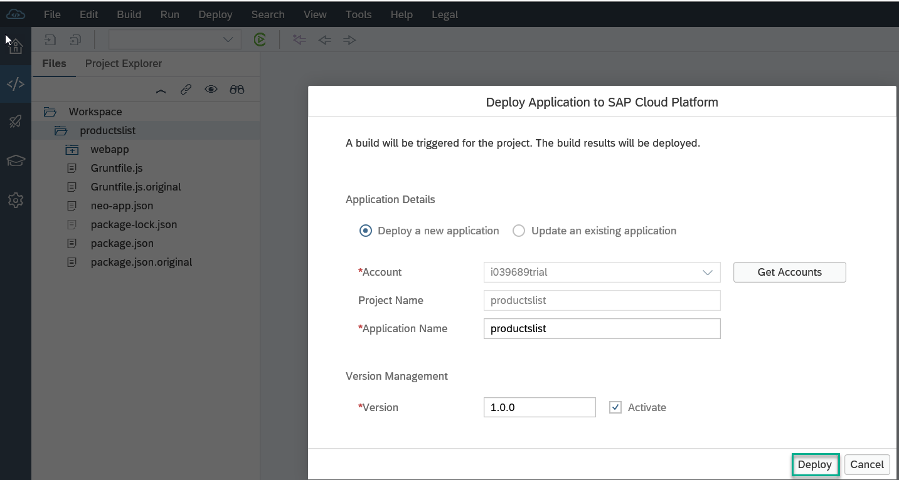

    > You will get a confirmation message when your app has been deployed.

    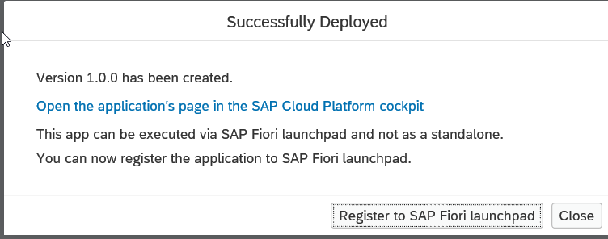

>Now that the `Products List` app exists in your SAP Cloud Platform subaccount, you will be able to add it to the launchpad page in your Portal freestyle site.

[VALIDATE_1]
[ACCORDION-END]

---
